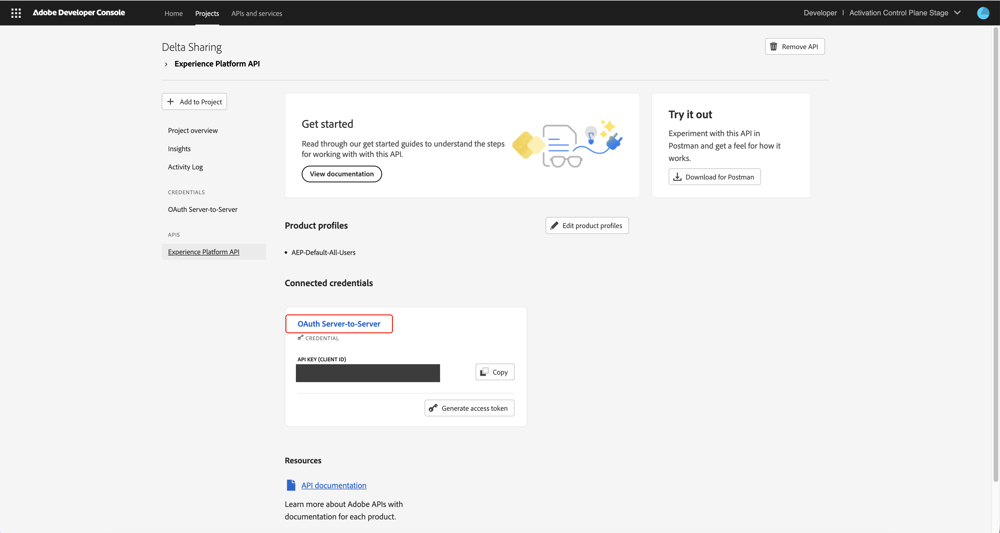
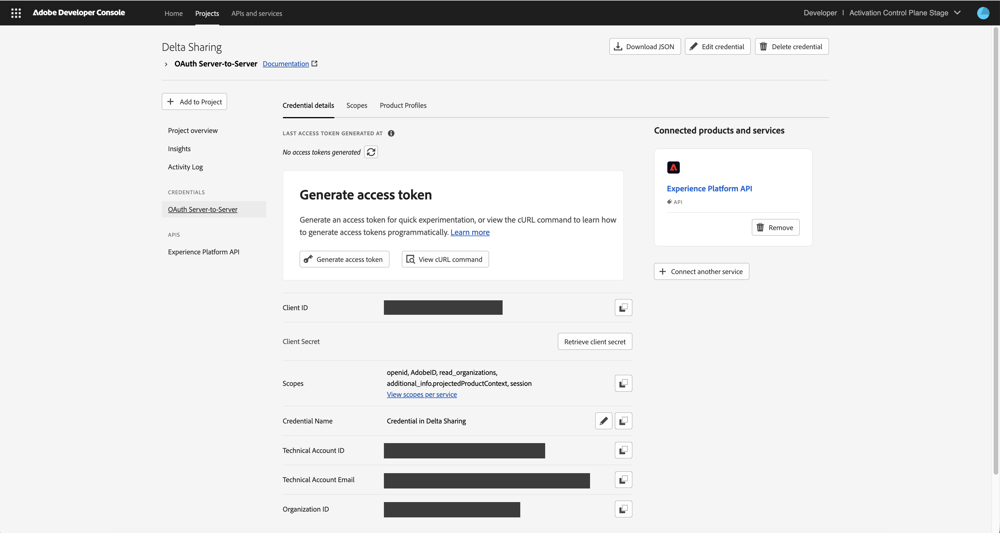
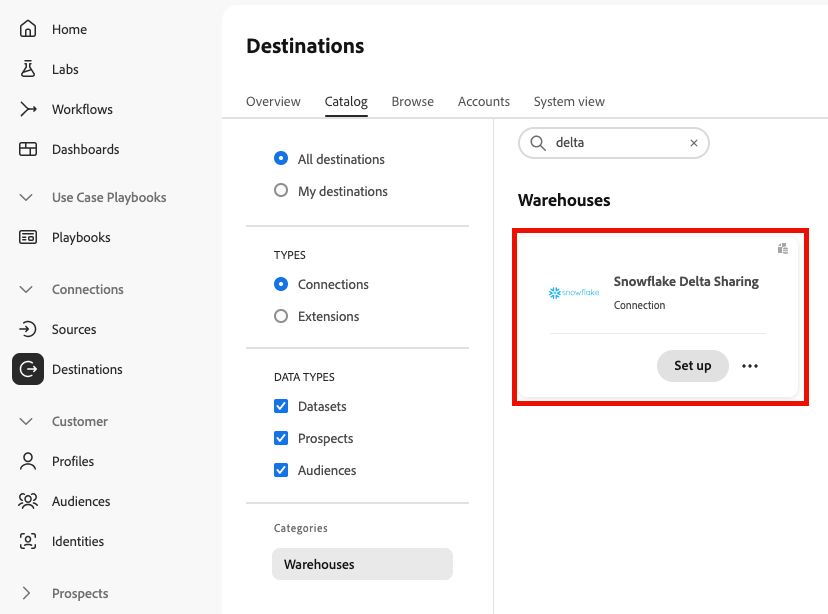
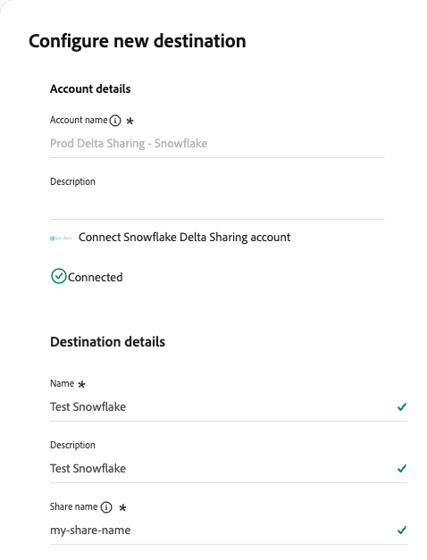
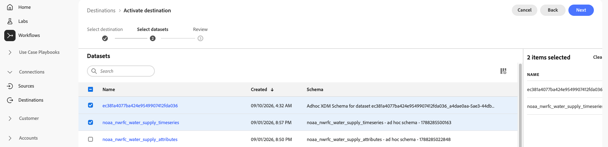
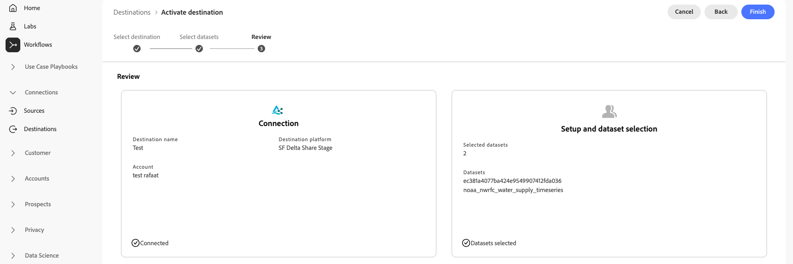
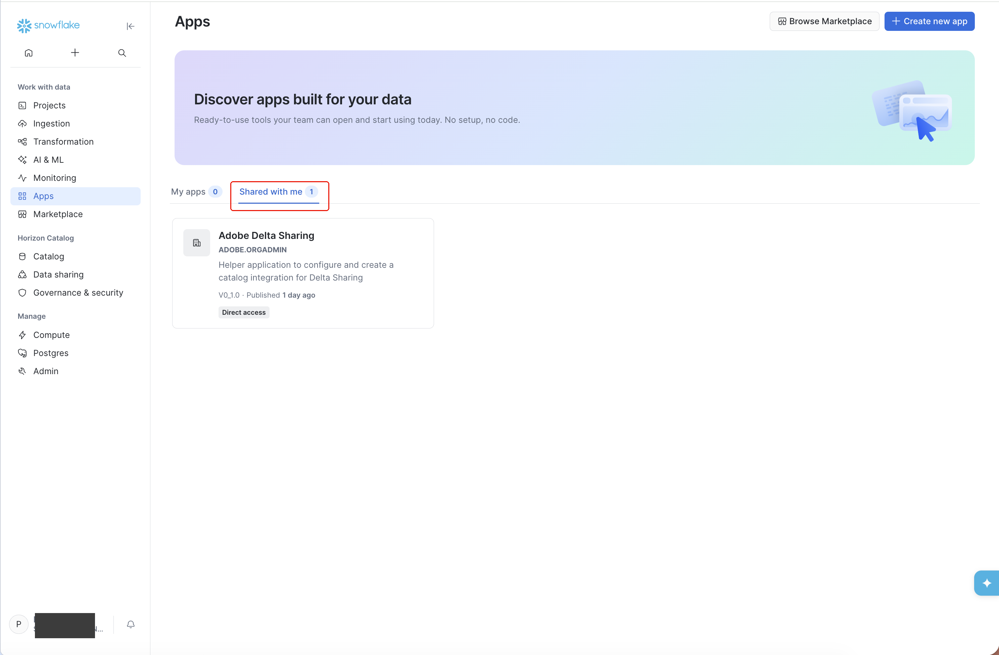
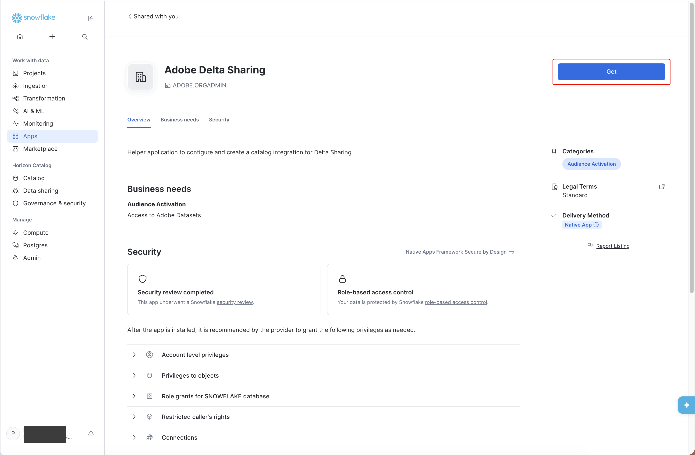
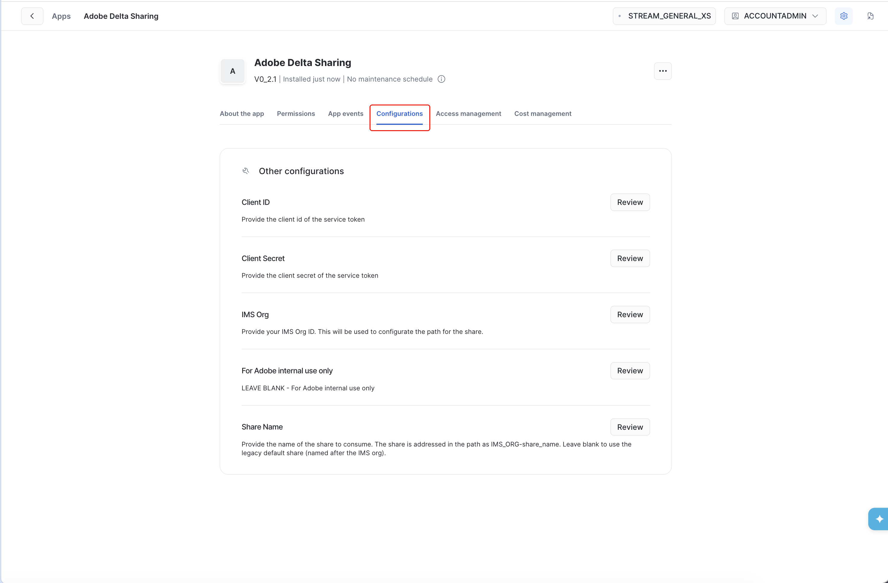
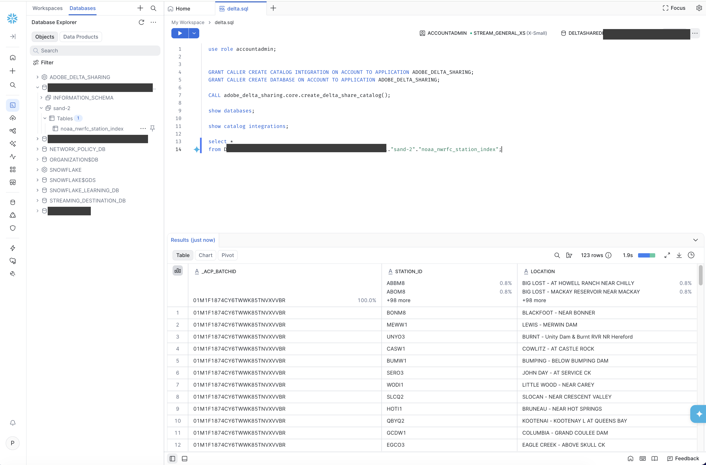

# [!DNL Snowflake Delta Sharing] connection {#snowflake-delta-sharing}

>[!AVAILABILITY]
>
>This destination connector is in Beta. The documentation and the feature are made available to enrolled Beta participants only. The functionality and documentation are subject to change.

## Overview {#overview}

Use the [!DNL Snowflake Delta Sharing] destination to share datasets from [!DNL Adobe Experience Platform] to your [!DNL Snowflake] account through the open [!DNL Delta Sharing] protocol. This is a zero-copy data sharing method. No data is copied, exported, or duplicated into your own storage. The data stays in [!DNL Adobe]-owned cloud storage, and your [!DNL Snowflake] account reads it directly.

Read the following sections to understand how zero-copy data sharing works and how to set up the connection.

### How zero-copy data sharing works {#how-it-works}

This destination is built on the open [!DNL Delta Sharing] standard. Instead of copying data to your account, [!DNL Adobe] grants your [!DNL Snowflake] account short-lived, scoped access to read the shared data directly from [!DNL Adobe]-owned cloud storage.

This approach provides the following benefits:

* **No data duplication**: Your account queries live [!DNL Adobe Experience Platform] data in place. Nothing is copied or exported.
* **Secure access**: Each request is authenticated and scoped to your organization, and access is short-lived.
* **Live data**: The shared views are refreshed as soon as the underlying dataset is updated, whether the dataset is populated through streaming or batch ingestion.

### What you can share {#what-you-can-share}

The [!DNL Snowflake Delta Sharing] destination supports sharing datasets. You can share a subset of a dataset's columns, with consistent semantics to the [Dataset Exports](/help/destinations/ui/export-datasets.md) framework.

You can set up multiple independent shares that target the same [!DNL Snowflake] account. Each share appears as its own set of tables in the recipient account.

>[!TIP]
>
>This destination shares datasets. To share audiences with [!DNL Snowflake], use the [Snowflake Batch](/help/destinations/catalog/warehouses/snowflake-batch.md) or [Snowflake Streaming](/help/destinations/catalog/warehouses/snowflake.md) connector instead.

## Use cases {#use-cases}

Zero-copy data sharing to [!DNL Snowflake] is suited to scenarios where you want to read live [!DNL Adobe Experience Platform] datasets in your own warehouse without maintaining copies or scheduled batch exports. For example:

* **Analytics and reporting**: Query [!DNL Adobe Experience Platform] datasets directly in [!DNL Snowflake] for business reporting and analysis.
* **Machine learning workloads**: Use shared datasets as training inputs for models that run in your [!DNL Snowflake] environment.

## Prerequisites {#prerequisites}

Before you set up the [!DNL Snowflake Delta Sharing] destination, make sure you meet the following prerequisites:

* You have access to a [!DNL Snowflake] account.
* You can create a project and generate credentials in the [Adobe Developer Console](https://developer.adobe.com/console), with the [!DNL Experience Platform] API added to that project. The project and its credentials authenticate the calls between your [!DNL Snowflake] account and the [!DNL Delta Sharing] server.
* You have the **[!UICONTROL View Destinations]**, **[!UICONTROL View Datasets]**, and **[!UICONTROL Manage and Activate Dataset Destinations]** [access control permissions](/help/access-control/home.md#permissions) required to share datasets. Read the [access control overview](/help/access-control/ui/overview.md) or contact your product administrator to obtain the required permissions.

<!-- TODO (per beta review): document the warehouse-side (Snowflake) account privileges customers need. Adobe-side permissions alone are insufficient. Minimum privileges to be identified during the bug bash. -->

## Supported datasets {#supported-datasets}

You can share the following types of [!DNL Adobe Experience Platform] datasets to this destination:

| Dataset type | Description |
|---------|----------|
| Record datasets | Datasets based on a [record class](../../../xdm/schema/composition.md#data-behaviors), which describes the attributes of a subject such as an organization or an individual. This includes ad hoc datasets created from sources such as CSV files. |
| Time-series datasets | Datasets based on a [time-series class](../../../xdm/schema/composition.md#data-behaviors), which describes a snapshot of the system at the time that a subject took an action. |

{style="table-layout:auto"}

>[!NOTE]
>
>System columns are excluded from shared schemas. The shared view includes a batch ID column that identifies the batch each record belongs to.

## Sharing type and frequency {#sharing-type-frequency}

This destination shares data through [!DNL Delta Sharing] rather than exporting it. No data is copied. Your [!DNL Snowflake] account reads a live, shared view of the data in place. Refer to the table below for information about the sharing type and frequency.

| Item | Type | Notes |
|---------|----------|---------|
| Sharing type | Dataset | Datasets are shared as tables that your [!DNL Snowflake] account reads directly. No data is copied to your account. |
| Frequency | Live | The shared views are refreshed as soon as the underlying [!DNL Adobe Experience Platform] dataset is updated, whether ingestion is streaming or batch. |

{style="table-layout:auto"}

## Generate client credentials {#generate-credentials}

The [!DNL Delta Sharing] server requires every request to be authenticated. Your [!DNL Snowflake] account uses the client credentials to authenticate its requests to the server. You generate these credentials in the [Adobe Developer Console](https://developer.adobe.com/console) before you set up the connection.

To generate the client credentials, follow these steps:

1. In the [Adobe Developer Console](https://developer.adobe.com/console), create a new project and give it a name. For example, you could name it **[!UICONTROL Delta Sharing]**.
1. Select **[!UICONTROL Add API]** and filter by the **[!DNL Adobe Experience Platform]** product. Choose **[!UICONTROL Experience Platform API]** and select **[!UICONTROL Next]**.
1. For the authentication type, select **[!UICONTROL Server-to-Server Authentication]**, then select **[!UICONTROL Next]**.
1. For the authentication credential, select **[!UICONTROL OAuth Server-to-Server]**. Enter a name in the **[!UICONTROL Credential name]** field, then select **[!UICONTROL Next]**.
1. Select the appropriate product profiles, then select **[!UICONTROL Save configured API]**.
1. After the API configuration is saved, the connected credentials are generated and a credential is shown.

   {zoomable="yes"}

1. Select the **[!UICONTROL OAuth Server-to-Server]** link on the credential card to view the credential details.

   {zoomable="yes"}

1. Collect the **[!UICONTROL Client ID]**, **[!UICONTROL Client Secret]** (shown when you select **[!UICONTROL Retrieve Client Secret]**), and **[!UICONTROL Token Endpoint]**. This is `https://ims-na1.adobelogin.com/ims/token/v3`.

You manage these credentials in the [Adobe Developer Console](https://developer.adobe.com/console).

>[!IMPORTANT]
>
>Any change to your credentials can affect or stop the share. If you revoke the client secret, the recipient loses access.

## Select the data to share {#select-data}

In the [!DNL Experience Platform] UI, go to the destinations catalog and search for the **[!UICONTROL Snowflake Delta Sharing]** destination. Select **[!UICONTROL Set up]** on the destination card to start the configuration workflow.

{zoomable="yes"}

Create the destination connection in [!DNL Adobe Experience Platform] and select the datasets to share. This uses the standard destination activation workflow.

>[!IMPORTANT]
>
>To connect to the destination and activate data, you need the **[!UICONTROL View Destinations]**, **[!UICONTROL View Datasets]**, and **[!UICONTROL Manage and Activate Dataset Destinations]** [access control permissions](/help/access-control/home.md#permissions). Read the [access control overview](/help/access-control/ui/overview.md) or contact your product administrator to obtain the required permissions.

### Configure the destination {#configure}

>[!CONTEXTUALHELP]
>id="platform_destinations_connect_snowflake_sharename"
>title="Enter a share name"
>abstract="The share name is the unique identifier for the read-only collection of data assets that you share through the Delta Sharing protocol. The name must contain only alphanumeric characters, dashes, or underscores. Spaces and UTF-8 characters are not supported."

To create the destination connection, follow the steps described in the [destination configuration tutorial](../../ui/connect-destination.md). In the configure destination workflow, provide the account and destination details.

{zoomable="yes"}

Under **[!UICONTROL Account details]**, provide the following, then connect your account:

* **[!UICONTROL Account name]**: A name by which you recognize this account in the future.
* **[!UICONTROL Description]**: A description that helps you identify this account in the future.

Under **[!UICONTROL Destination details]**, provide the following:

* **[!UICONTROL Name]**: A name by which you recognize this destination in the future.
* **[!UICONTROL Description]**: A description that helps you identify this destination in the future.
* **[!UICONTROL Share Name]**: The unique identifier for the read-only collection of data assets that you share through the [!DNL Delta Sharing] protocol. The name must match the regular expression `^[A-Za-z0-9_-]+$`, which means it can contain only alphanumeric characters, dashes, and underscores. Spaces and other characters are not supported. For example, `my-share_01` is accepted, but `my share 01` is rejected because it contains spaces.

### Select datasets {#select-datasets}

In the **[!UICONTROL Select datasets]** step, select the datasets that you want to share. Use the search field to find datasets by name. Select the checkbox next to each dataset to add it to the share. The selected datasets appear in the summary panel.

{zoomable="yes"}

When you are finished, select **[!UICONTROL Next]**.

### Review and finish {#review}

In the **[!UICONTROL Review]** step, confirm the connection and dataset selection. The **[!UICONTROL Connection]** card shows the destination name, destination platform, and account. The **[!UICONTROL Setup and dataset selection]** card shows the number of selected datasets and their names.

{zoomable="yes"}

To complete the workflow, select **[!UICONTROL Finish]**. Note the share name that you entered, because you use it again when you configure the Snowflake Native App.

## Install and configure the Snowflake Native App {#configure-native-app}

To view the shared data in [!DNL Snowflake], install and configure the [!DNL Adobe Delta Sharing] Snowflake Native App. The app configures an external catalog that reads from the [!DNL Adobe Delta Sharing] server.

During the beta phase, the app is available through a private listing. To request the app for your [!DNL Snowflake] account, provide your [!DNL Snowflake] organization name and account name to Adobe, in this format: `org-name.account-name`.

### Install the app {#install-app}

Use the **[!UICONTROL ACCOUNTADMIN]** role to install the app.

1. In your [!DNL Snowflake] account, go to **[!UICONTROL Apps]**, then select the **[!UICONTROL Shared with me]** tab to find the [!DNL Adobe Delta Sharing] app.

   {zoomable="yes"}

1. Select the app card, then select **[!UICONTROL Get]**.

   {zoomable="yes"}

1. Review the permissions the app uses, then select **[!UICONTROL Agree & continue]**. If prompted, complete your [!DNL Snowflake] user profile and verify your email address, then reload the page and select **[!UICONTROL Get]** again.
1. Accept the final [!DNL Snowflake Marketplace] agreement, then select **[!UICONTROL Get]** to install the app.
1. When the app is installed, select **[!UICONTROL Open]** to view the app details.

>[!NOTE]
>
>Depending on the cloud and region of your [!DNL Snowflake] account, it can take up to 10 minutes to prepare the app. You receive an email notification when the app is ready.

### Configure the app {#configure-app}

On the app page, select the **[!UICONTROL Configurations]** tab. Select **[!UICONTROL Review]** next to each configuration field to enter its value.

{zoomable="yes"}

| Field | Value |
|---------|----------|
| **[!UICONTROL Client ID]** | The client ID generated in the [Adobe Developer Console](https://developer.adobe.com/console). |
| **[!UICONTROL Client Secret]** | The client secret generated in the [Adobe Developer Console](https://developer.adobe.com/console). |
| **[!UICONTROL IMS Org]** | Your IMS organization. You can enter the full value with the `@AdobeOrg` suffix or without it. This value becomes the share name of the catalog. |
| **[!UICONTROL Share Name]** | The share name that you entered in the [!DNL Snowflake Delta Sharing] destination. |

{style="table-layout:auto"}

### Complete the post-installation steps {#post-installation}

Because of the restricted nature of [!DNL Snowflake] Native Apps, you must run a few manual steps before you use the app for the first time. These steps grant the app the required privileges and call the procedure that creates the [!DNL Delta Sharing] catalog integration and the catalog-linked database.

Follow the post-installation steps in the app's built-in README. The README is the authoritative guide for the required privileges and the procedure to run.

>[!NOTE]
>
>If you create a new share that uses a different set of datasets, drop the database and the catalog integration, update the **[!UICONTROL Share Name]** in the **[!UICONTROL Configurations]** tab, then call the app's `adobe_delta_sharing.core.create_delta_share_catalog()` stored procedure again to re-create the share.

## Query the shared data {#query-data}

After the procedure creates the catalog integration and the catalog-linked database, the shared datasets are available in [!DNL Snowflake] as tables. The app creates a database named `DELTASHAREDB_<ims_org>_<share_name>`, where `<ims_org>` is your IMS organization and `<share_name>` is the share name that you configured. Within that database, each [!DNL Adobe Experience Platform] sandbox is a schema, and each shared dataset is a table.

To find the exact names, expand the catalog-linked database in the **[!UICONTROL Databases]** explorer. To read the data, run a `SELECT` statement that fully qualifies the database, schema, and table names. Enclose the schema and table names in double quotation marks. For example:

```sql
SELECT *
FROM DELTASHAREDB_<ims_org>_<share_name>."<sandbox>"."<dataset>";
```

The query returns the dataset's columns. Each row also includes the `_ACP_BATCHID` column, which identifies the batch that the record belongs to.

{zoomable="yes"}


## Best practices {#best-practices}

* Use separate shares for each business use case, such as analytics and machine learning, rather than a single share. This lets you manage each share independently.

## Data governance {#data-governance}

Datasets with conflicting Data Usage Labeling and Enforcement (DULE) labels surface as policy violations at the end of the workflow. You must resolve the violations before you can complete the workflow.

All [!DNL Adobe Experience Platform] destinations are compliant with data usage policies when handling your data. For detailed information on how [!DNL Adobe Experience Platform] enforces data governance, read the [Data Governance overview](/help/data-governance/home.md).
