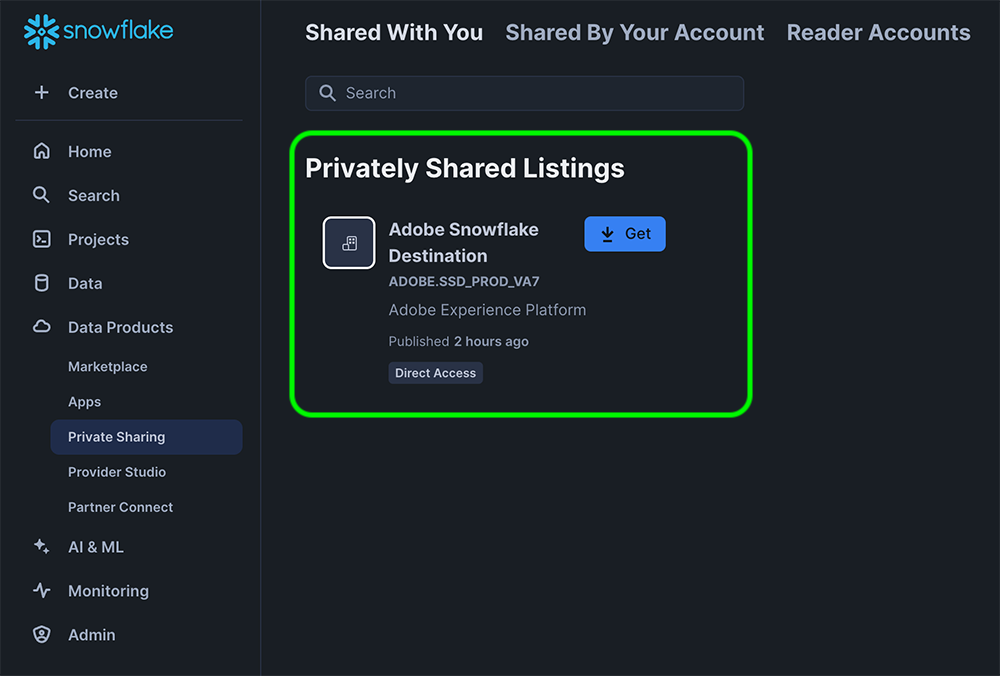

# Snowflake Streaming connection {#snowflake-destination}

>[!AVAILABILITY]
>
>This destination connector is in limited availability and only available to Real-Time CDP Ultimate customers provisioned in the [VA7 region](/help/landing/multi-cloud.md#azure-regions).

## Overview {#overview}

Use the Snowflake destination connector to export data to Adobe's Snowflake instance, which Adobe then shares with your instance through [private listings](https://other-docs.snowflake.com/en/collaboration/collaboration-listings-about).

Read the following sections to understand how the Snowflake destination works and how data is transferred between Adobe and Snowflake.

### How Snowflake data sharing works {#data-sharing}

This destination uses a [!DNL Snowflake] data share, which means that no data is physically exported or transferred to your own Snowflake instance. Instead, Adobe grants you read-only access to a live table hosted within Adobe's Snowflake environment. You can query this shared table directly from your Snowflake account, but you do not own the table and cannot modify or retain it beyond the specified retention period. Adobe fully manages the lifecycle and structure of the shared table.

The first time you share data from Adobe's Snowflake instance to yours, you are prompted to accept the private listing from Adobe.

### Data retention and Time-to-Live (TTL) {#ttl}

All data shared through this integration has a fixed Time-to-Live (TTL) of seven days. Seven days after the last export, the shared table automatically expires and becomes inaccessible, regardless of whether the dataflow is still active. If you need to retain the data for longer than seven days, you must copy the contents into a table that you own in your own Snowflake instance before the TTL expires.

### Audience update behavior {#audience-update-behavior}

If your audience is evaluated in [batch mode](../../../segmentation/methods/batch-segmentation.md), the data in the shared table is refreshed every 24 hours. This means there may be a delay of up to 24 hours between changes in audience membership and when those changes are reflected in the shared table.

### Incremental export logic {#incremental-export}

When a dataflow runs for an audience for the first time, it performs a backfill and shares all currently qualified profiles. After this initial backfill, only incremental updates are reflected in the shared table. This means profiles which are added to or removed from the audience. This approach ensures efficient updates and keeps the shared table up to date.

## Streaming versus batch data sharing {#batch-vs-streaming}

Experience Platform provides two types of Snowflake destinations: [Snowflake Streaming](snowflake.md) and [Snowflake Batch](snowflake-batch.md).

The table below will help you decide which destination to use by outlining the scenarios where each data sharing method is most appropriate.

|  | Choose [Snowflake Batch](snowflake-batch.md) when you need | Choose [Snowflake Streaming](snowflake.md) when you need |
|--------|-------------------|----------------------|
| **Update frequency** | Periodic snapshots | Continuous updates in real-time |
| **Data presentation** | Complete audience snapshot that replaces previous data | Incremental updates based on profile changes |
| **Use case focus** | Analytical/ML workloads where latency is not critical | Immediate action scenarios requiring real-time updates |
| **Data management** | Always see latest complete snapshot | Incremental updates based on audience membership changes |
| **Example scenarios** | Business reporting, data analysis, ML model training | Marketing campaign suppression, real-time personalization |

For more information about batch data sharing, see the [Snowflake Batch connection](snowflake-batch.md) documentation.

## Use cases {#use-cases}

Streaming data sharing is ideal for scenarios where you need immediate updates when a profile changes its membership or other attributes. This is crucial for use cases requiring real-time responsiveness, such as:

* **Marketing campaign suppression**: Immediately suppress marketing campaigns for users who have taken specific actions, such as signing up for a service or making a purchase
* **Real-time personalization**: Update user experiences instantly when profile attributes change, such as when a user visits a website, views a product page, or adds items to a shopping cart
* **Immediate action scenarios**: Execute quick suppression and retargeting based on real-time data to reduce delays and ensure marketing campaigns are more relevant and timely
* **Efficiency and nuance**: Enable greater efficiency and nuance in marketing efforts by allowing quick response to user behavior changes
* **Real-time customer journey optimization**: Update customer experiences immediately when segment membership or profile attributes change

Streaming data sharing provides continuous updates based on segment changes, identity map changes, or attribute changes, making it suitable for scenarios where latency is critical and immediate updates are required.

## Prerequisites {#prerequisites}

Before configuring your Snowflake connection, make sure you meet the following prerequisites:

* You have access to a [!DNL Snowflake] account.
* Your Snowflake account is subscribed to private listings. You or someone in your company who has account administrator privileges on Snowflake can configure this.

Read the [[!DNL Snowflake] documentation](https://docs.snowflake.com/en/collaboration/consumer-listings-access#access-a-private-listing) for more information on the necessary permissions.

## Supported audiences {#supported-audiences}

This section describes which types of audiences you can export to this destination. The two tables below indicate which audiences this connector supports, by _audience origin_ and _profile types included in the audience_:

| Audience origin | Supported | Description | 
|---------|----------|----------|
| [!DNL Segmentation Service] | ✓ | Audiences generated through the Experience Platform [Segmentation Service](../../../segmentation/home.md).|
| All other audience origins | ✓ | This category includes all audience origins outside of audiences generated through the [!DNL Segmentation Service]. Read about the [various audience origins](/help/segmentation/ui/audience-portal.md#customize). Some examples include: <ul><li> custom upload audiences [imported](../../../segmentation/ui/audience-portal.md#import-audience) into Experience Platform from CSV files,</li><li> look-alike audiences, </li><li> federated audiences, </li><li> audiences generated in other Experience Platform apps such as Adobe Journey Optimizer, </li><li> and more. </li></ul> |

{style="table-layout:auto"}

## Export type and frequency {#export-type-frequency}

Refer to the table below for information about the destination export type and frequency.

| Item | Type | Notes |
---------|----------|---------|
| Export type | **[!UICONTROL Audience export]** | You are exporting all members of an audience with the identifiers (name, phone number, or others) used in the [!DNL Snowflake] destination.|
| Export frequency | **[!UICONTROL Streaming]** | Streaming destinations are "always on" API-based connections. As soon as a profile is updated in Experience Platform based on audience evaluation, the connector sends the update downstream to the destination platform. Read more about [streaming destinations](/help/destinations/destination-types.md#streaming-destinations).|

{style="table-layout:auto"}

## Connect to the destination {#connect}

>[!IMPORTANT]
> 
>To connect to the destination, you need the **[!UICONTROL View Destinations]** and **[!UICONTROL Manage Destinations]** [access control permissions](/help/access-control/home.md#permissions). Read the [access control overview](/help/access-control/ui/overview.md) or contact your product administrator to obtain the required permissions.

To connect to this destination, follow the steps described in the [destination configuration tutorial](../../ui/connect-destination.md). In the configure destination workflow, fill in the fields listed in the two sections below.

### Authenticate to destination {#authenticate}

To authenticate to the destination, select **[!UICONTROL Connect to destination]**.

### Fill in destination details {#destination-details}

>[!CONTEXTUALHELP]
>id="platform_destinations_snowflake_accountID"
>title="Enter your Snowflake Account ID"
>abstract="If your account is linked to an organization use this format: `OrganizationName.AccountName`   If your account is not linked to an organization use this format:`AccountName`"

To configure details for the destination, fill in the required and optional fields below. An asterisk next to a field in the UI indicates that the field is required.

* **[!UICONTROL Name]**: A name by which you will recognize this destination in the future.
* **[!UICONTROL Description]**: A description that will help you identify this destination in the future.
* **[!UICONTROL Snowflake Account ID]**: Your Snowflake account ID. Use the following Account ID format depending on whether your account is linked to an organization:
    * If your account is linked to an organization:`OrganizationName.AccountName`.
    * If your account is not linked to an organization:`AccountName`.
* **[!UICONTROL Account acknowledgment]**: Toggle on the Snowflake Account ID acknowledgment to confirm that your Account ID is correct and it belongs to you.

>[!IMPORTANT]
>
> Special characters used in the destination name and Experience Platform sandbox name are automatically converted to underscores (`_`) in Snowflake. To avoid confusion, do not use any special characters in your destination and sandbox name.

### Enable alerts {#enable-alerts}

You can enable alerts to receive notifications on the status of the dataflow to your destination. Select an alert from the list to subscribe to receive notifications on the status of your dataflow. For more information on alerts, read the guide on [subscribing to destinations alerts using the UI](../../ui/alerts.md).

When you are finished providing details for your destination connection, select **[!UICONTROL Next]**.

## Activate audiences to this destination {#activate}

>[!IMPORTANT]
> 
>* To activate data, you need the **[!UICONTROL View Destinations]**, **[!UICONTROL Activate Destinations]**, **[!UICONTROL View Profiles]**, and **[!UICONTROL View Segments]** [access control permissions](/help/access-control/home.md#permissions). Read the [access control overview](/help/access-control/ui/overview.md) or contact your product administrator to obtain the required permissions.
>* To export *identities*, you need the **[!UICONTROL View Identity Graph]** [access control permission](/help/access-control/home.md#permissions).   {width="100" zoomable="yes"}

Read [Activate profiles and audiences to streaming audience export destinations](/help/destinations/ui/activate-segment-streaming-destinations.md) for instructions on activating audiences to this destination.

### Map attributes {#map}

The Snowflake destination supports the mapping of profile attributes to custom attributes.

The target attributes are automatically created in Snowflake using the attribute name that you provide in the **[!UICONTROL Attribute name]** field.

## Exported data / Validate data export {#exported-data}

Check your Snowflake account to verify that the data was exported correctly.

## Known limitations {#known-limitations}

### Default merge policy restriction {#default-merge-policy-restriction}

Currently, only audiences mapped to the default merge policy can be exported.

### Regional availability {#regional-availability}

The [!DNL Snowflake] streaming destination is currently only available to Real-Time CDP customers provisioned in the Experience Platform VA7 region.

## Data usage and governance {#data-usage-governance}

All [!DNL Adobe Experience Platform] destinations are compliant with data usage policies when handling your data. For detailed information on how [!DNL Adobe Experience Platform] enforces data governance, read the [Data Governance overview](/help/data-governance/home.md).
