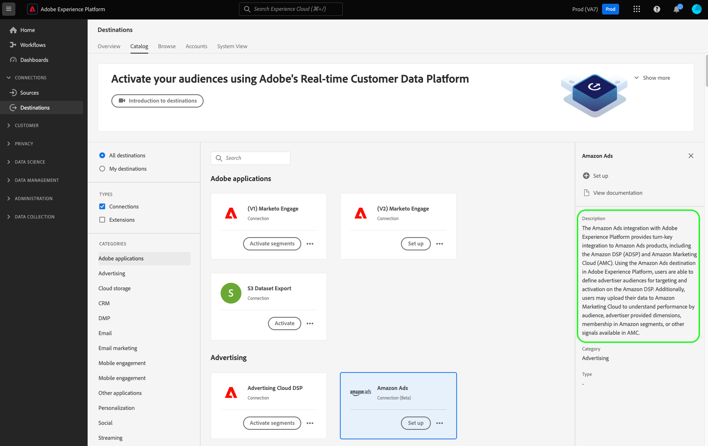
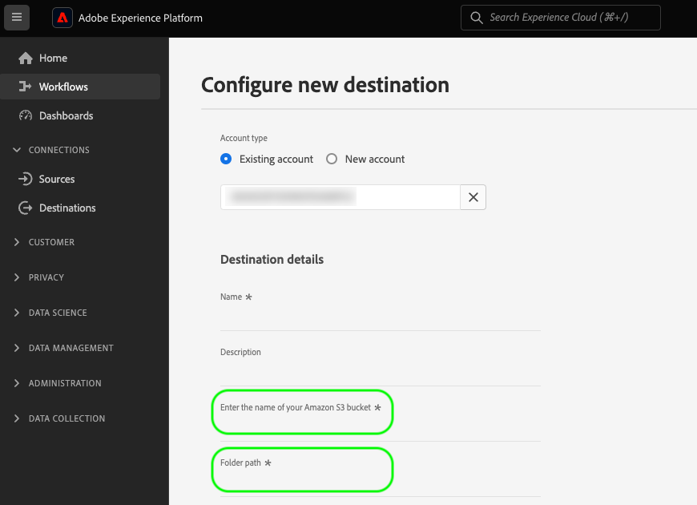
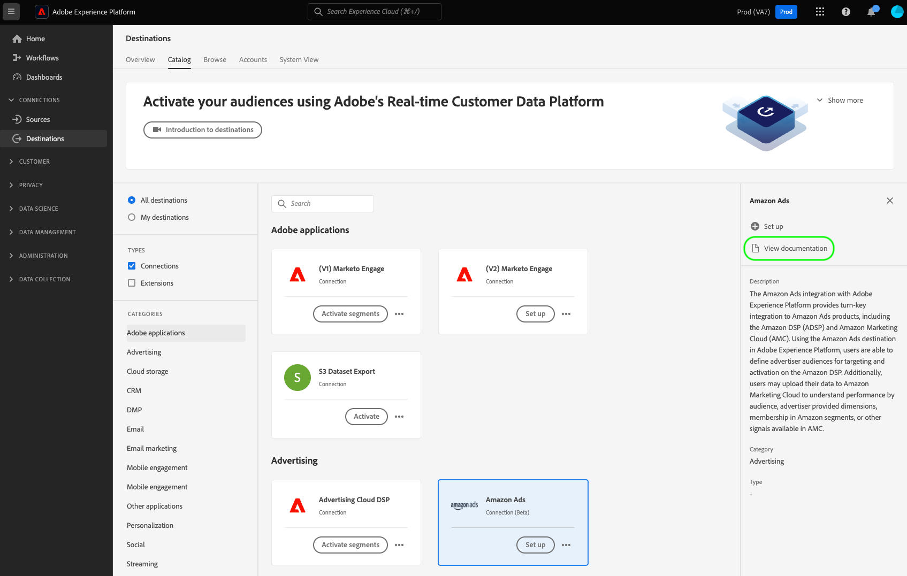

# Create a destination configuration

This page exemplifies the API request and payload that you can use to create your own destination configuration, using the `/authoring/destinations` API endpoint.

For a detailed description of the capabilities that you can configure through this endpoint, read the following articles:

* [Customer authentication configuration](../../functionality/destination-configuration/customer-authentication.md)
* [OAuth2 authorization](../../functionality/destination-configuration/oauth2-authorization.md)
* [Customer data fields](../../functionality/destination-configuration/customer-data-fields.md)
* [UI attributes](../../functionality/destination-configuration/ui-attributes.md)
* [Schema configuration](../../functionality/destination-configuration/schema-configuration.md)
* [Identity namespace configuration](../../functionality/destination-configuration/identity-namespace-configuration.md)
* [Destination delivery](../../functionality/destination-configuration/destination-delivery.md)
* [Audience metadata configuration](../../functionality/destination-configuration/audience-metadata-configuration.md)
* [Audience metadata configuration](../../functionality/destination-configuration/audience-metadata-configuration.md)
* [Aggregation policy](../../functionality/destination-configuration/aggregation-policy.md)
* [Batch configuration](../../functionality/destination-configuration/batch-configuration.md)
* [Historical profile qualifications](../../functionality/destination-configuration/historical-profile-qualifications.md)

>[!IMPORTANT]
>
>All parameter names and values supported by Destination SDK are **case sensitive**. To avoid case sensitivity errors, please use the parameters names and values exactly as shown in the documentation.

## Getting started with destination configuration API operations {#get-started}

Before continuing, please review the [getting started guide](../../getting-started.md) for important information that you need to know in order to successfully make calls to the API, including how to obtain the required destination authoring permission and required headers.

## Create a destination configuration {#create}

You can create a new destination configuration by making a POST request to the `/authoring/destinations` endpoint.

>[!TIP]
>
>**API endpoint**: `platform.adobe.io/data/core/activation/authoring/destinations`

**API format**

```http
POST /authoring/destinations
```

The following request creates a new [!DNL Amazon S3] destination configuration, configured by the parameters provided in the payload. The payload below includes all parameters for file-based destinations accepted by the `/authoring/destinations` endpoint.

Note that you do not have to add all parameters to your API call, and that the payload is customizable, according to your API requirements.

+++Request

```shell
curl -X POST https://platform.adobe.io/data/core/activation/authoring/destinations \
 -H 'Authorization: Bearer {ACCESS_TOKEN}' \
 -H 'Content-Type: application/json' \
 -H 'x-gw-ims-org-id: {ORG_ID}' \
 -H 'x-api-key: {API_KEY}' \
 -H 'x-sandbox-name: {SANDBOX_NAME}' \
 -d '
{
   "name":"Amazon S3 destination with predefined CSV formatting options",
   "description":"Amazon S3 destination with predefined CSV formatting options",
   "status":"TEST",
   "customerAuthenticationConfigurations":[
      {
         "authType":"S3"
      }
   ],
   "customerDataFields":[
      {
         "name":"bucket",
         "title":"Enter the name of your Amazon S3 bucket",
         "description":"Amazon S3 bucket name",
         "type":"string",
         "isRequired":true,
         "readOnly":false,
         "hidden":false
      },
      {
         "name":"path",
         "title":"Enter the path to your S3 bucket folder",
         "description":"Enter the path to your S3 bucket folder",
         "type":"string",
         "isRequired":true,
         "pattern":"^[A-Za-z]+$",
         "readOnly":false,
         "hidden":false
      },
      {
         "name":"compression",
         "title":"Compression format",
         "description":"Select the desired file compression format.",
         "type":"string",
         "isRequired":true,
         "readOnly":false,
         "enum":[
            "SNAPPY",
            "GZIP",
            "DEFLATE",
            "NONE"
         ]
      },
      {
         "name":"fileType",
         "title":"Select a fileType",
         "description":"Select fileType",
         "type":"string",
         "isRequired":true,
         "readOnly":false,
         "hidden":false,
         "enum":[
            "csv",
            "json",
            "parquet"
         ],
         "default":"csv"
      }
   ],
   "uiAttributes":{
      "documentationLink":"https://www.adobe.com/go/destinations-amazon-s3-en",
      "category":"cloudStorage",
      "icon":{
         "key":"amazonS3"
      },
      "connectionType":"S3",
      "frequency":"Batch"
   },
   "destinationDelivery":[
      {
         "deliveryMatchers":[
            {
               "type":"SOURCE",
               "value":[
                  "batch"
               ]
            }
         ],
         "authenticationRule":"CUSTOMER_AUTHENTICATION",
         "destinationServerId":"{{destinationServerId}}"
      }
   ],
   "schemaConfig":{
      "profileRequired":true,
      "segmentRequired":true,
      "identityRequired":true
   },
   "batchConfig":{
      "allowMandatoryFieldSelection":true,
      "allowDedupeKeyFieldSelection":true,
      "defaultExportMode":"DAILY_FULL_EXPORT",
      "allowedExportMode":[
         "DAILY_FULL_EXPORT",
         "FIRST_FULL_THEN_INCREMENTAL"
      ],
      "allowedScheduleFrequency":[
         "DAILY",
         "EVERY_3_HOURS",
         "EVERY_6_HOURS",
         "EVERY_8_HOURS",
         "EVERY_12_HOURS",
         "ONCE"
      ],
      "defaultFrequency":"DAILY",
      "defaultStartTime":"00:00",
      "filenameConfig":{
         "allowedFilenameAppendOptions":[
            "SEGMENT_NAME",
            "DESTINATION_INSTANCE_ID",
            "DESTINATION_INSTANCE_NAME",
            "ORGANIZATION_NAME",
            "SANDBOX_NAME",
            "DATETIME",
            "CUSTOM_TEXT"
         ],
         "defaultFilenameAppendOptions":[
            "DATETIME"
         ],
         "defaultFilename":"%DESTINATION%_%SEGMENT_ID%"
      },
      "backfillHistoricalProfileData":true
   }
}'
```

|Parameter | Type | Description|
|---------|----------|------|
|`name` | String | Indicates the title of your destination in the Experience Platform catalog. |
|`description` | String | Provide a description that Adobe will use in the Experience Platform destinations catalog for your destination card. Aim for no more than 4-5 sentences. {width="100" zoomable="yes"}|
|`status` | String | Indicates the lifecycle status of the destination card. Accepted values are `TEST`, `PUBLISHED`, and `DELETED`. Use `TEST` when you first configure your destination. |
|`customerAuthenticationConfigurations.authType` | String | Indicates the configuration used to authenticate Experience Platform customers to your destination server. See [customer authentication configuration](../../functionality/destination-configuration/customer-authentication.md) for detailed information about the supported authentication types.|
|`customerDataFields.name` | String | Provide a name for the custom field you are introducing. <br/><br/> See [Customer data fields](../../functionality/destination-configuration/customer-data-fields.md) for detailed information about these settings. {width="100" zoomable="yes"} |
|`customerDataFields.type` | String | Indicates what type of custom field you are introducing. Accepted values are `string`, `object`, `integer`. <br/><br/> See [Customer data fields](../../functionality/destination-configuration/customer-data-fields.md) for detailed information about these settings. |
|`customerDataFields.title` | String | Indicates the name of the field, as it is seen by customers in the Experience Platform user interface. <br/><br/> See [Customer data fields](../../functionality/destination-configuration/customer-data-fields.md) for detailed information about these settings. |
|`customerDataFields.description` | String | Provide a description for the custom field. See [Customer data fields](../../functionality/destination-configuration/customer-data-fields.md) for detailed information about these settings. |
|`customerDataFields.isRequired` | Boolean | Indicates if this field is required in the destination setup workflow. <br/><br/> See [Customer data fields](../../functionality/destination-configuration/customer-data-fields.md) for detailed information about these settings.|
|`customerDataFields.enum` | String | Renders the custom field as a dropdown menu and lists the options available to the user. <br/><br/> See [Customer data fields](../../functionality/destination-configuration/customer-data-fields.md) for detailed information about these settings. |
|`customerDataFields.default`|String|Defines the default value from an `enum` list.|
|`customerDataFields.pattern` | String | Enforces a pattern for the custom field, if needed. Use regular expressions to enforce a pattern. For example, if your customer IDs don't include numbers or underscores, enter `^[A-Za-z]+$` in this field. <br/><br/> See [Customer data fields](../../functionality/destination-configuration/customer-data-fields.md) for detailed information about these settings.|
|`uiAttributes.documentationLink` | String | Refers to the documentation page in the [Destinations Catalog](https://experienceleague.adobe.com/docs/experience-platform/destinations/catalog/overview.html#catalog) for your destination. Use `https://www.adobe.com/go/destinations-YOURDESTINATION-en`, where `YOURDESTINATION` is the name of your destination. For a destination called Moviestar, you would use `https://www.adobe.com/go/destinations-moviestar-en`. Note that this link works only after Adobe sets your destination live and the documentation is published. <br/><br/> See [UI attributes](../../functionality/destination-configuration/ui-attributes.md) for detailed information about these settings. {width="100" zoomable="yes"}|
|`uiAttributes.category` | String | Refers to the category assigned to your destination in Adobe Experience Platform. For more information, read [Destination Categories](https://experienceleague.adobe.com/docs/experience-platform/rtcdp/destinations/destination-types.html#destination-categories). Use one of the following values: `adobeSolutions, advertising, analytics, cdp, cloudStorage, crm, customerSuccess, database, dmp, ecommerce, email, emailMarketing, enrichment, livechat, marketingAutomation, mobile, personalization, protocols, social, streaming, subscriptions, surveys, tagManagers, voc, warehouses, payments`. <br/><br/> See [UI attributes](../../functionality/destination-configuration/ui-attributes.md) for detailed information about these settings. |
|`uiAttributes.connectionType` | String | The type of connection, depending on the destination. Supported values: <ul><li>`Server-to-server`</li><li>`Cloud storage`</li><li>`Azure Blob`</li><li>`Azure Data Lake Storage`</li><li>`S3`</li><li>`SFTP`</li><li>`DLZ`</li></ul> |
|`uiAttributes.frequency` | String | Refers to the type of data export supported by the destination. Set to `Streaming` for API-based integrations, or `Batch` when you export files to your destinations. |
|`identityNamespaces.externalId.acceptsAttributes` | Boolean | Indicates if customers can map standard profile attributes to the identity that you are configuring. |
|`identityNamespaces.externalId.acceptsCustomNamespaces` | Boolean |  Indicates if customers can map identities belonging to [custom namespaces](/help/identity-service/features/namespaces.md#manage-namespaces) to the identity that you are configuring. |
|`identityNamespaces.externalId.transformation` | String | _Not shown in example configuration_. Used, for example, when the [!DNL Platform] customer has plain email addresses as an attribute and your platform only accepts hashed emails. This is where you would provide the transformation that needs to be applied (for example, transform the email to lowercase, then hash).   |
|`identityNamespaces.externalId.acceptedGlobalNamespaces` | - | Indicates which [standard identity namespaces](/help/identity-service/features/namespaces.md#standard) (for example, IDFA) customers can map to the identity that you are configuring. <br> When you use `acceptedGlobalNamespaces`, you can use `"requiredTransformation":"sha256(lower($))"` to lowercase and hash email addresses or phone numbers. |
|`destinationDelivery.authenticationRule` | String | Indicates how [!DNL Platform] customers connect to your destination. Accepted values are `CUSTOMER_AUTHENTICATION`, `PLATFORM_AUTHENTICATION`, `NONE`. <br> <ul><li>Use `CUSTOMER_AUTHENTICATION` if Platform customers log into your system via a username and password, a bearer token, or another method of authentication. For example, you would select this option if you also selected `authType: OAUTH2` or `authType:BEARER` in `customerAuthenticationConfigurations`. </li><li> Use `PLATFORM_AUTHENTICATION` if there is a global authentication system between Adobe and your destination and the [!DNL Platform] customer does not need to provide any authentication credentials to connect to your destination. In this case, you must create a credentials object using the [credentials API](../../credentials-api/create-credential-configuration.md) configuration. </li><li>Use `NONE` if no authentication is required to send data to your destination platform. </li></ul> |
|`destinationDelivery.destinationServerId` | String | The `instanceId` of the [destination server template](../destination-server/create-destination-server.md) used for this destination. |
|`backfillHistoricalProfileData` | Boolean | Controls whether historical profile data is exported when audiences are activated to the destination. Always set this to `true`. |
|`segmentMappingConfig.mapUserInput` | Boolean | Controls whether the audience mapping ID in the destination activation workflow is input by user. |
|`segmentMappingConfig.mapExperiencePlatformSegmentId` | Boolean | Controls whether the audience mapping ID in the destination activation workflow is the Experience Platform audience ID. |
|`segmentMappingConfig.mapExperiencePlatformSegmentName` | Boolean | Controls whether the audience mapping ID in the destination activation workflow is the Experience Platform audience name. |
|`segmentMappingConfig.audienceTemplateId` | Boolean | The `instanceId` of the [audience metadata template](../../metadata-api/create-audience-template.md) used for this destination. |
|`schemaConfig.profileFields` | Array | When you add predefined `profileFields` as shown in the configuration above, users will have the option of mapping Experience Platform attributes to the predefined attributes on your destination's side. |
|`schemaConfig.profileRequired` | Boolean | Use `true` if users should be able to map profile attributes from Experience Platform to custom attributes on your destination's side, as shown in the example configuration above.|
|`schemaConfig.segmentRequired` | Boolean | Always use `segmentRequired:true`. |
|`schemaConfig.identityRequired` | Boolean | Use `true` if you users should be able to map identity namespaces from Experience Platform to your desired schema. |

{style="table-layout:auto"}

+++

+++Response

A successful response returns HTTP status 200 with details of your newly created destination configuration.

+++

## API error handling

Destination SDK API endpoints follow the general Experience Platform API error message principles. Refer to [API status codes](../../../../landing/troubleshooting.md#api-status-codes) and [request header errors](../../../../landing/troubleshooting.md#request-header-errors) in the Platform troubleshooting guide.

## Next steps

After reading this document, you now know how to create a new destination configuration through the Destination SDK `/authoring/destinations` API endpoint.

To learn more about what you can do with this endpoint, see the following articles:

* [Retrieve a destination configuration](retrieve-destination-configuration.md)
* [Update a destination configuration](update-destination-configuration.md)
* [Delete a destination configuration](delete-destination-configuration.md)

To understand where this endpoint fits into the destination authoring process, see the following articles:

* [Use Destination SDK to configure a streaming destination](../../guides/configure-destination-instructions.md#create-destination-configuration)
* [Use Destination SDK to configure a file-based destination](../../guides/configure-file-based-destination-instructions.md#create-destination-configuration)
