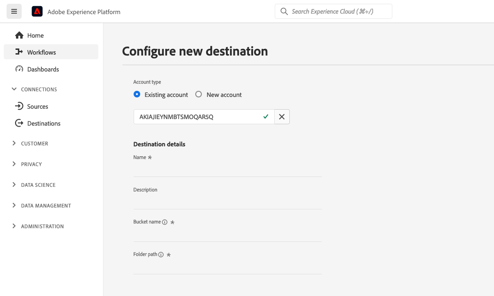

# File-based destination configuration {#destination-configuration}

## Overview {#overview}

>[!IMPORTANT]
>
>File-based destination support in Adobe Experience Platform Destination SDK is currently in Beta. The documentation and functionality are subject to change.

This configuration allows you to indicate essential information like your destination name, category, description, and more. The settings in this configuration also determine how Experience Platform users authenticate to your destination, how it appears in the Experience Platform user interface and the identities that can be exported to your destination.

This configuration also connects the other configurations required for your destination to work - destination server and audience metadata - to this one. Read how you can reference the two configurations in a [section further below](./destination-configuration.md#connecting-all-configurations).

You can configure the functionality described in this document by using the `/authoring/destinations` API endpoint. Read [Destinations API endpoint operations](./destination-configuration-api.md) for a complete list of operations you can perform on the endpoint.

## Amazon S3 destination configuration example {#batch-example-configuration}

```json
{
    "name": "Amazon S3 destination",
    "description": "Amazon S3 destination is a fictional destination, used for this example.",
    "releaseNotes": "Test",
    "status": "Test",
    "maxProfileAttributes": "2000",
    "maxIdentityAttributes": "10",
    "customerAuthenticationConfigurations": [
        {
            "authType": "S3"
        }
    ],
    "customerEncryptionConfigurations": [],
    "customerDataFields": [
        {
            "name": "name",
            "title": "Name",
            "description": "Enter the name of this destination connection.",
            "type": "string",
            "isRequired": true,
            "readOnly": false,
            "hidden": false
        },
        {
            "name": "description",
            "title": "Description",
            "description": "Enter a description for this destination connection.",
            "type": "string",
            "isRequired": false,
            "readOnly": false,
            "hidden": false
        },
        {
            "name": "bucket",
            "title": "Bucket name",
            "description": "Enter the Amazon S3 Bucket name that will host the exported files.",
            "type": "string",
            "isRequired": true,
            "readOnly": false,
            "hidden": false
        },
        {
            "name": "path",
            "title": "Folder path",
            "description": "Enter Amazon S3 folder path",
            "type": "string",
            "isRequired": true,
            "pattern": "^[A-Za-z]+$",
            "readOnly": false,
            "hidden": false
        },
        {
            "name": "compression",
            "title": "Select compression type",
            "description": "Select the file compression type used by the exported files.",
            "type": "string",
            "isRequired": true,
            "readOnly": false,
            "enum": [
                "GZIP",
                "NONE",
                "bzip2",
                "lz4",
                "snappy",
                "deflate"
            ]
        },
        {
            "name": "fileType",
            "title": "Select a file format",
            "description": "Select the file format to be used by the exported files.",
            "type": "string",
            "isRequired": true,
            "readOnly": false,
            "hidden": false,
            "enum": [
                "csv",
                "json",
                "parquet"
            ],
            "default": "csv"
        },
        {
            "name": "destinationInstance",
            "title": "Select a destination instance",
            "description": "Select a destination instance.",
            "type": "string",
            "isRequired": true,
            "readOnly": false,
            "hidden": false,
            "dynamicEnum": {
                "destinationServerId": "eec25bde-4f56-4c02-a830-9aa9ec73ee9d",
                "authenticationRule": "IMS_AUTHENTICATION",
                "value": "accInstance",
                "responseFormat": "NAME_VALUE"
            },
        }
    ],
    "uiAttributes": {
        "documentationLink": "https://www.adobe.io/apis/experienceplatform.html",
        "category": "S3",
        "iconUrl": "https://dc5tqsrhldvnl.cloudfront.net/2/90048/da276e30c730ce6cd666c8ca78360df21.png",
        "connectionType": "S3",
        "flowRunsSupported": true,
        "monitoringSupported": true,
        "frequency": "Batch"
    },
    "destinationDelivery": [
        {
            "deliveryMatchers": [
                {
                    "type": "SOURCE",
                    "value": [
                        "batch"
                    ]
                }
            ],
            "authenticationRule": "CUSTOMER_AUTHENTICATION",
            "destinationServerId": "eec25bde-4f56-4c02-a830-9aa9ec73ee9d"
        }
    ],
    "schemaConfig": {
        "dynamicSchemaConfig":{
            "dynamicEnum": {
                "destinationServerId": "eec25bde-4f56-4c02-a830-9aa9ec73ee9d",
                "authenticationRule": "IMS_AUTHENTICATION",
                "value": "accSchema",
                "responseFormat": "SCHEMA"
            },
        },
        "profileRequired": true,
        "segmentRequired": true,
        "identityRequired": true
    },
    "batchConfig": {
        "allowMandatoryFieldSelection": true,
        "allowDedupeKeyFieldSelection": true,
        "defaultExportMode": "DAILY_FULL_EXPORT",
        "allowedExportMode": [
            "DAILY_FULL_EXPORT",
            "FIRST_FULL_THEN_INCREMENTAL"
        ],
        "allowedScheduleFrequency": [
            "DAILY",
            "EVERY_3_HOURS",
            "EVERY_6_HOURS",
            "EVERY_8_HOURS",
            "EVERY_12_HOURS",
            "ONCE"
        ],
        "defaultFrequency": "DAILY",
        "defaultStartTime": "00:00"
    },
    "backfillHistoricalProfileData": true
}
```

|Parameter | Type | Description|
|---------|----------|------|
|`name` | String | Indicates the title of your destination in the Experience Platform catalog. |
|`description` | String | Provide a description for your destination card in the Experience Platform destinations catalog. Aim for no more than 4-5 sentences. |
|`status` | String | Indicates the lifecycle status of the destination card. Accepted values are `TEST`, `PUBLISHED`, and `DELETED`. Use `TEST` when you first configure your destination. |
|`maxProfileAttributes`|String|Indicates the maximum number of profile attributes customers can select for the destination. Default value is `2000`.|
|`maxIdentityAttributes`|String|Indicates the maximum number of identity namespaces customers can select for the destination. Default value is `10`.|

{style="table-layout:auto"}

## Customer authentication configurations {#customer-authentication-configurations}

This section in the destinations configuration generates the [Configure new destination](/help/destinations/ui/connect-destination.md) page in the Experience Platform user interface, where users connect Experience Platform to the accounts they have with your destination.

```json
"customerAuthenticationConfigurations": [
        {
            "authType": "S3"
        }
    ],
```

Depending on which [authentication option](authentication-configuration.md##supported-authentication-types) you indicate in the `authType` field, the Experience Platform page is generated for the users as follows:

### Amazon S3 authentication

When you configure the Amazon S3 authentication type, users are required to input the S3 credentials.


### Azure Blob authentication  {#blob}

When you configure the Azure Blob authentication type, users are required to input the connection string.


### SFTP with password authentication

When you configure the SFTP with password authentication type, users are required to input the SFTP username and password, as well as the SFTP domain and port (default port is 22).


### SFTP with SSH key authentication

When you configure the SFTP with SSH key authentication type, users are required to input the SFTP username and SSH key, as well as the SFTP domain and port (default port is 22).


## Customer data fields {#customer-data-fields}

This section allows partners to introduce custom fields. In the example above, `customerDataFields` requires users to enter a name for their destination and provide an [!DNL Amazon S3] bucket name and folder path.

```json
 "customerDataFields": [
        {
            "name": "name",
            "title": "Name",
            "description": "Enter the name of this destination connection.",
            "type": "string",
            "isRequired": true,
            "readOnly": false,
            "hidden": false
        },
        {
            "name": "description",
            "title": "Description",
            "description": "Enter a description for this destination connection.",
            "type": "string",
            "isRequired": false,
            "readOnly": false,
            "hidden": false
        },
        {
            "name": "bucket",
            "title": "Bucket name",
            "description": "Enter the Amazon S3 Bucket name that will host the exported files.",
            "type": "string",
            "isRequired": true,
            "readOnly": false,
            "hidden": false
        },
        {
            "name": "path",
            "title": "Folder path",
            "description": "Enter Amazon S3 folder path",
            "type": "string",
            "isRequired": true,
            "pattern": "^[A-Za-z]+$",
            "readOnly": false,
            "hidden": false
        },
        {
            "name": "compression",
            "title": "Select compression type",
            "description": "Select the file compression type used by the exported files.",
            "type": "string",
            "isRequired": true,
            "readOnly": false,
            "enum": [
                "GZIP",
                "NONE",
                "bzip2",
                "lz4",
                "snappy",
                "deflate"
            ]
        },
        {
            "name": "fileType",
            "title": "Select a file format",
            "description": "Select the file format to be used by the exported files.",
            "type": "string",
            "isRequired": true,
            "readOnly": false,
            "hidden": false,
            "enum": [
                "csv",
                "json",
                "parquet"
            ],
            "default": "csv"
        },
        {
            "name": "destinationInstance",
            "title": "Select a destination instance",
            "description": "Select a destination instance.",
            "type": "string",
            "isRequired": true,
            "readOnly": false,
            "hidden": false,
            "dynamicEnum": {
                "destinationServerId": "eec25bde-4f56-4c02-a830-9aa9ec73ee9d",
                "authenticationRule": "IMS_AUTHENTICATION",
                "value": "accInstance",
                "responseFormat": "NAME_VALUE"
            },
        },
    ],
```

The configuration is reflected in the authentication flow as shown below:



|Parameter | Type | Description|
|---------|----------|------|
|`name` | String | Provide a name for the custom field you are introducing. |
|`title` | String | Indicates the name of the field, as it is seen by customers in the Experience Platform user interface. |
|`description` | String | Provide a description for the custom field. |
|`type` | String | Indicates what type of custom field you are introducing. Accepted values are `string`, `object`, `integer`. |
|`isRequired` | Boolean | Indicates if this field is required in the destination setup workflow. |
|`pattern` | String | Enforces a pattern for the custom field, if needed. Use regular expressions to enforce a pattern. For example, if your customer IDs don't include numbers or underscores, enter `^[A-Za-z]+$` in this field. |
|`enum` | String | Renders the custom field as a dropdown menu and lists the options available to the user.|
|`dynamicEnum` | String | Renders the custom field as a dropdown menu and lists the options available to the user. Use `dynamicEnum` when your custom fields are controlled via an API.|
|`dynamicEnum.destinationServerId` |String| The destination server ID used when creating the destination server.|
|`dynamicEnum.authenticationRule`|String||
|`dynamicEnum.value`|String|*Used when creating a destination with a partner-defined schema.* Defines the name of your custom schema.|
|`dynamicEnum.responseFormat`|String||

{style="table-layout:auto"}

## UI attributes {#ui-attributes}

```json
"uiAttributes": {
        "documentationLink": "https://www.adobe.io/apis/experienceplatform.html",
        "category": "S3",
        "iconUrl": "https://dc5tqsrhldvnl.cloudfront.net/2/90048/da276e30c730ce6cd666c8ca78360df21.png",
        "connectionType": "S3",
        "flowRunsSupported": true,
        "monitoringSupported": true,
        "frequency": "Batch"
    }
```

This section refers to the UI elements in the configuration above that Adobe should use for your destination in the Adobe Experience Platform user interface. See below:

|Parameter | Type | Description|
|---------|----------|------|
|`documentationLink` | String | Refers to the documentation page in the [Destinations Catalog](https://experienceleague.adobe.com/docs/experience-platform/destinations/catalog/overview.html?lang=en#catalog) for your destination. Use `http://www.adobe.com/go/destinations-YOURDESTINATION-en`, where `YOURDESTINATION` is the name of your destination. For a destination called Moviestar, you would use `http://www.adobe.com/go/destinations-moviestar-en` |
|`category` | String | Refers to the category assigned to your destination in Adobe Experience Platform. For more information, read [Destination Categories](https://experienceleague.adobe.com/docs/experience-platform/destinations/destination-types.html). Use one of the following values: `adobeSolutions, advertising, analytics, cdp, cloudStorage, crm, customerSuccess, database, dmp, ecommerce, email, emailMarketing, enrichment, livechat, marketingAutomation, mobile, personalization, protocols, social, streaming, subscriptions, surveys, tagManagers, voc, warehouses, payments`. |
|`iconUrl`|String|The address where you hosted the icon to be displayed in the destinations Catalog card.|
|`connectionType` | String | The type of connection, depending on the destination. Supported values: <ul><li>`S3`</li><li></li><li></li><li></li></ul> |
|`flowRunsSupported`|Boolean| Indicates whether the destination connection is included in the flow runs UI.|
|`monitoringSupported`|Boolean|Indicates whether the destination connection is included in the monitoring UI.|
|`frequency` | String | Refers to the type of data export supported by the destination. Supported values: <ul><li>`Streaming` for streaming destinations</li><li>`Batch` for file-based destinations</li></ul>|

{style="table-layout:auto"}

## Schema configuration in the mapping step {#schema-configuration}


Use the parameters in `schemaConfig` to enable the mapping step of the destination activation workflow. By using the parameters described below, you can determine if Experience Platform users can map profile attributes and/or identities to the desired schema on your destination's side.

```json
"schemaConfig": {
        "dynamicSchemaConfig":{
            "dynamicEnum": {
                "destinationServerId": "eec25bde-4f56-4c02-a830-9aa9ec73ee9d",
                "authenticationRule": "IMS_AUTHENTICATION",
                "value": "accSchema",
                "responseFormat": "SCHEMA"
            },
        },
        "profileRequired": true,
        "segmentRequired": true,
        "identityRequired": true
    },
```

|Parameter | Type | Description|
|---------|----------|------|
|`profileFields` | Array | *Not shown in example configuration above.* When you add predefined `profileFields`, Experience Platform users have the option of mapping Platform attributes to the predefined attributes on your destination's side. |
|`dynamicSchemaConfig.dynamicEnum.destinationServerId`|String|*Used when creating a destination with a partner-defined schema*. The destination server ID used when creating the destination server.|
|`dynamicSchemaConfig.dynamicEnum.authenticationRule`|String|*Used when creating a destination with a partner-defined schema.*|
|`dynamicSchemaConfig.dynamicEnum.value`|String|*Used when creating a destination with a partner-defined schema.* Defines the name of your custom schema.|
|`dynamicSchemaConfig.dynamicEnum.responseFormat`|String|*Used when creating a destination with a partner-defined schema.* Value is always `SCHEMA`.|
|`profileRequired` | Boolean | Use `true` if users should be able to map profile attributes from Experience Platform to custom attributes on your destination's side, as shown in the example configuration above. |
|`segmentRequired` | Boolean | Always use `segmentRequired:true`. |
|`identityRequired` | Boolean | Use `true` if users should be able to map identity namespaces from Experience Platform to your desired schema. |

{style="table-layout:auto"}

## Batch configuration {#batch-configuration}

```json
"batchConfig": {
        "allowMandatoryFieldSelection": true,
        "allowDedupeKeyFieldSelection": true,
        "defaultExportMode": "DAILY_FULL_EXPORT",
        "allowedExportMode": [
            "DAILY_FULL_EXPORT",
            "FIRST_FULL_THEN_INCREMENTAL"
        ],
        "allowedScheduleFrequency": [
            "DAILY",
            "EVERY_3_HOURS",
            "EVERY_6_HOURS",
            "EVERY_8_HOURS",
            "EVERY_12_HOURS",
            "ONCE"
        ],
        "defaultFrequency": "DAILY",
        "defaultStartTime": "00:00"
    },
```

For batch destinations, use the parameters in `batchConfig` to describe the configuration of the file-based destination that you are about to create.

|Parameter | Type | Description|
|---------|----------|------|
|`allowMandatoryFieldSelection`|Boolean|Set to `true` to allow customers to specify which profile attributes are mandatory. Default value is `false`. See [Mandatory attributes](../ui/activate-batch-profile-destinations.md#mandatory-attributes) for more information. |
|`allowDedupeKeyFieldSelection`|Boolean|Set to `true` to allow customers to specify deduplication keys. Default value is `false`.  See [Deduplication keys](../ui/activate-batch-profile-destinations.md#deduplication-keys) for more information. |
|`defaultExportMode`|Enum|Defines the default file export mode. Supported values:<ul><li>`DAILY_FULL_EXPORT`</li><li>`FIRST_FULL_THEN_INCREMENTAL`</li></ul><br> Default value is `DAILY_FULL_EXPORT`.|
|`allowedExportModes`|List|Defines the file export modes available to customers. Supported values:<ul><li>`DAILY_FULL_EXPORT`</li><li>`FIRST_FULL_THEN_INCREMENTAL`</li></ul>|
|`allowedScheduleFrequency`|List|Defines the file export frequency available to customers. Supported values:<ul><li>`ONCE`</li><li>`EVERY_3_HOURS`</li><li>`EVERY_6_HOURS`</li><li>`EVERY_8_HOURS`</li><li>`EVERY_12_HOURS`</li><li>`DAILY`</li></ul>|
|`defaultFrequency`|Enum|Defines the default file export frequency.Supported values:<ul><li>`ONCE`</li><li>`EVERY_3_HOURS`</li><li>`EVERY_6_HOURS`</li><li>`EVERY_8_HOURS`</li><li>`EVERY_12_HOURS`</li><li>`DAILY`</li></ul> <br> Default value is `DAILY`.|
|`defaultStartTime`|String|Defines the default start time for the file export. Uses 24-hour file format. Default value is "00:00".|

## Identities and attributes {#identities-and-attributes}

The parameters in this section determine which identities your destination accepts. This configuration also populates the target identities and attributes in the [mapping step](/help/destinations/ui/activate-segment-streaming-destinations.md#mapping) of the Experience Platform user interface, where users map identities and attributes from their XDM schemas to the schema in your destination.

You must indicate which [!DNL Platform] identities customers are able to export to your destination. Some examples are [!DNL Experience Cloud ID], hashed email, device ID ([!DNL IDFA], [!DNL GAID]). These values are [!DNL Platform] identity namespaces that customers can map to identity namespaces in your destination. You can also indicate if customers can map custom namespaces to identities supported by your destination.

Identity namespaces do not require a 1-to-1 correspondence between [!DNL Platform] and your destination.
For instance, customers could map a [!DNL Platform] [!DNL IDFA] namespace to an [!DNL IDFA] namespace from your destination, or they can map the same [!DNL Platform] [!DNL IDFA] namespace to a [!DNL Customer ID] namespace in your destination.

Read more in the [Identity Namespace overview](https://experienceleague.adobe.com/docs/experience-platform/identity/namespaces.html?lang=en).

 

|Parameter | Type | Description|
|---------|----------|------|
|`acceptsAttributes` | Boolean | Indicates if your destination accepts standard profile attributes. Usually, these attributes are highlighted in partners' documentation. |
|`acceptsCustomNamespaces` | Boolean | Indicates if customers can set up custom namespaces in your destination. |
|`allowedAttributesTransformation` | String | *Not shown in example configuration*. Used, for example, when the [!DNL Platform] customer has plain email addresses as an attribute and your platform only accepts hashed emails. In this object, you can define the transformation that needs to be applied (for example, transform the email to lowercase, then hash). For an example, see `requiredTransformation` in the [destination configuration API reference](./destination-configuration-api.md#update). |
|`acceptedGlobalNamespaces` | - | Used for cases when your platform accepts [standard identity namespaces](https://experienceleague.adobe.com/docs/experience-platform/identity/namespaces.html?lang=en#standard-namespaces) (for example, IDFA), so you can restrict Platform users to only selecting these identity namespaces. |

{style="table-layout:auto"}

## Destination delivery {#destination-delivery}

|Parameter | Type | Description|
|---------|----------|------|
|`authenticationRule` | String | Indicates how [!DNL Platform] customers connect to your destination. Accepted values are `CUSTOMER_AUTHENTICATION`, `PLATFORM_AUTHENTICATION`, `NONE`. <br> <ul><li>Use `CUSTOMER_AUTHENTICATION` if Platform customers log into your system via a username and password, a bearer token, or another method of authentication. For example, you would select this option if you also selected `authType: OAUTH2` or `authType:BEARER` in `customerAuthenticationConfigurations`. </li><li> Use `PLATFORM_AUTHENTICATION` if there is a global authentication system between Adobe and your destination and the [!DNL Platform] customer does not need to provide any authentication credentials to connect to your destination. In this case, you must create a credentials object using the [Credentials](./credentials-configuration-api.md) configuration. </li><li>Use `NONE` if no authentication is required to send data to your destination platform. </li></ul> |
|`destinationServerId` | String | The `instanceId` of the [destination server configuration](./destination-server-api.md) used for this destination. |

{style="table-layout:auto"}

## Segment mapping configuration {#segment-mapping}


This section of the destination configuration relates to how segment metadata like segment names or IDs should be shared between Experience Platform and your destination.

Through the `audienceTemplateId`, this section also ties together this configuration with the [audience metadata configuration](./audience-metadata-management.md).

The parameters shown in the configuration above are described in the [destinations endpoint API reference](./destination-configuration-api.md).

## Historical profile qualifications {#profile-backfill}

You can use the `backfillHistoricalProfileData` parameter in the destinations configuration to determine if historical profile qualifications should be exported to your destination.

|Parameter | Type | Description|
|---------|----------|------|
|`backfillHistoricalProfileData` | Boolean | Controls whether historical profile data is exported when segments are activated to the destination. <br> <ul><li> `true`: [!DNL Platform] sends the historical user profiles that qualified for the segment before the segment is activated. </li><li> `false`: [!DNL Platform] only includes user profiles that qualify for the segment after the segment is activated. </li></ul> |

## How this configuration connects all necessary information for your destination {#connecting-all-configurations}

Some of your destination settings must be configured through the [destination server](./server-and-template-configuration.md) or the [audience metadata configuration](./audience-metadata-management.md). The destination configuration described here connects all these settings by referencing the two other configurations as follows:

* Use the `destinationServerId` to reference the destination server and template configuration set up for your destination.
* Use the `audienceMetadataId` to reference the audience metadata configuration set up for your destination.