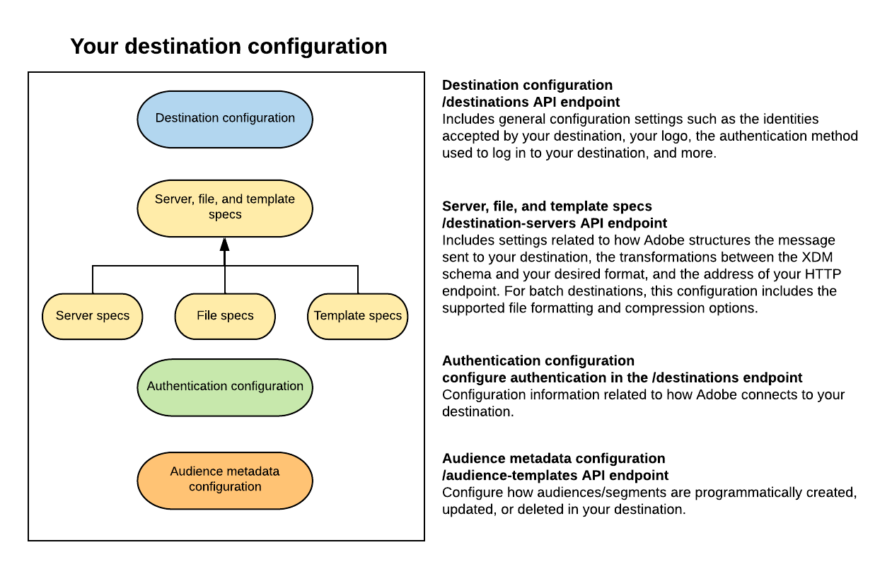

# Configuration options in Destination SDK

## Overview {#overview}

The destinations service in Adobe Experience Platform uses configuration endpoints for several components that build up the destinations functionality. Combined, these components allow Experience Platform to connect to destination platforms, send custom messages, and activate profile data across the digital ecosystem. The templates used in Adobe Experience Platform are:

* **Destination configuration**: Contains basic information about your destination. This configuration includes the identity types that your destination can support, and various UI attributes for your destination card in the Adobe Experience Platform user interface.
* **Server and template specs**: Ties together information about your server specs and the templating used by Adobe to deliver payloads to your destination.
  * **Server specs**: A template that stores your endpoint details.
  * **Template specs**: In this template, you can define how to transform profile attribute fields between XDM schema and the format that your platform supports. For in-depth information about supported templating languages, message formats, and the information required by Adobe to set up the integration with your platform, read [Message format](./message-format.md).
* **Authentication configuration**: These settings define how Adobe Experience Platform users connect to your destination.
* **Audience metadata configuration**: This configuration endpoints allows you to configure how audiences/segments are programmatically created, updated, or deleted in your destination.

## Related links {#related-links}

The pages below provide more detail about the functionality and configuration options available in Destination SDK, and the corresponding API operations that you can perform.

|Functionality description | API reference |
|--- |--- |
|[Destination configuration](./destination-configuration.md) | [Destinations API endpoint operations](./destination-configuration-api.md) |
|[Server and template specs](./server-and-template-configuration.md) |[Destination servers API endpoint operations](./destination-server-api.md) |
|[Authentication configuration](./authentication-configuration.md) | [Credentials endpoint API operations](./credentials-configuration-api.md) |
|[Audience metadata management](./audience-metadata-management.md) | [Audience metadata endpoint API operations](./audience-metadata-api.md) | 
|[OAuth 2 configuration](./oauth2-authentication.md) | Configure using the `customerAuthenticationConfigurations` parameter in the [/destinations API endpoint](./destination-configuration-api.md). |
|[Message format](./message-format.md) | - |
|[Destination testing](./test-destination.md) | [Destination testing API operations](./destination-testing-api.md) |
|[Destination publishing](./configure-destination-instructions.md#publish-destination) | [Destination publishing API operations](./destination-publish-api.md) |

{style="table-layout:auto"}
