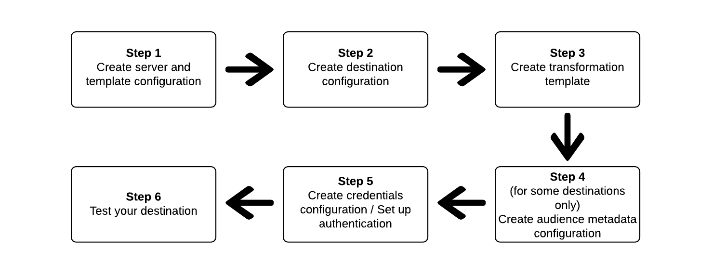

# How to use Destination SDK to configure your destination

## Overview {#overview}

This page describes how to use the reference information in [Configuration options in Destinations SDK](./configuration-options.md) to configure your destination using Destination SDK. The steps are laid out in sequential order below.

## Prerequisites {#prerequisites}

Before advancing to the steps illustrated below, please read the [Destination SDK getting started](./getting-started.md) page for information on obtaining the necessary Adobe I/O authentication credentials and other prerequisites to work with Destination SDK APIs.

## Steps to use the configuration options in Destination SDK to set up your destination {#steps}



## Step 1: Create a server and template configuration {#create-server-template-configuration}

Start by creating a server and template configuration using the /destinations-server endpoint (read [API reference](./destination-server-api.md)). For more information about the server and template configuration, refer to [Server and template specs](./configuration-options.md#server-and-template) in the reference section.

Shown below is an example configuration. Note that the message transformation template in the `requestBody.value` parameter is addressed in step 3, [Create transformation template](./configure-destination-instructions.md#create-transformation-template).

```json

POST platform.adobe.io/data/core/activation/authoring/destination-servers

{
   "name":"Moviestar destination server",
   "destinationServerType":"URL_BASED",
   "urlBasedDestination":{
      "url":{
         "templatingStrategy":"PEBBLE_V1",
         "value":"https://api.moviestar.com/data/{{endpoint.region}}/items"
      }
   },
   "httpTemplate":{
      "httpMethod":"POST",
      "requestBody":{
         "templatingStrategy":"PEBBLE_V1",
         "value":"insert after you create a template in step 3"
      },
      "contentType":"application/json"
   }
}

```

## Step 2: Create destination configuration {#create-destination-configuration}

Shown below is an example configuration for a destination template, created by using the `/destinations` API endpoint. For more information about this template, refer to [Destination configuration](./destination-configuration.md). 

```json

POST platform.adobe.io/data/core/activation/authoring/destinations
 
{
   "name":"Moviestar",
   "description":"Moviestar is a fictional destination, used for this example.",
   "status":"TEST",
   "customerAuthenticationConfigurations":[
      {
         "authType":"BEARER"
      }
   ],
   "customerDataFields":[
      {
         "name":"endpointsInstance",
         "type":"string",
         "title":"Select Endpoint",
         "description":"Moviestar manages several instances across the globe for REST endpoints that our customers are provisioned for. Select your endpoint in the dropdown list.",
         "isRequired":true,
         "enum":[
            "US",
            "EU",
            "APAC",
            "NZ"
         ]
      },
      {
         "name":"customerID",
         "type":"string",
         "title":"Moviestar Customer ID",
         "description":"Your customer ID in the Moviestar destination (e.g. abcdef).",
         "isRequired":true,
         "pattern":""
      }
   ],
   "uiAttributes":{
      "documentationLink":"http://www.adobe.com/go/destinations-moviestar-en",
      "category":"mobile",
      "connectionType":"Server-to-server",
      "frequency":"Streaming"
   },
   "identityNamespaces":{
      "external_id":{
         "acceptsAttributes":true,
         "acceptsCustomNamespaces":true
      },
      "another_id":{
         "acceptsAttributes":true,
         "acceptsCustomNamespaces":true
      }
   },
   "aggregation":{
      "aggregationType":"CONFIGURABLE_AGGREGATION",
      "configurableAggregation":{
         "aggregationPolicyId":null,
         "aggregationKey":{
            "includeSegmentId":true,
            "includeSegmentStatus":true,
            "includeIdentity":true,
            "oneIdentityPerGroup":true,
            "groups":null
         },
         "splitUserById":true,
         "maxBatchAgeInSecs":360,
         "maxNumEventsInBatch":100
      }
   },
   "destinationDelivery":[
      {
         "authenticationRule":"CUSTOMER_AUTHENTICATION",
         "destinationServerId":"9c77000a-4559-40ae-9119-a04324a3ecd4"
      }
   ],
   "inputSchemaId":"cc8621770a9243b98aba4df79898b1ed"
}

```

## Step 3: Create message transformation template - use templating language to specify the message output format {#create-transformation-template}

Based on the payloads that your destination supports, you must create a template that transforms the format of the exported data from Adobe XDM format into a format supported by your destination. See template examples in the section [Using a templating language for the identity, attributes, and segment membership transformations](./message-format.md#using-templating) and use the [template authoring tool](./create-template.md) provided by Adobe.

## Step 4: Create audience metadata configuration {#create-audience-metadata-configuration}

For some destinations, Destination SDK requires that you configure an audience metadata template to programmatically create, update, or delete audiences in your destination. Refer to [Audience metadata management](./audience-metadata-management.md) for information on when you need to set up this configuration and how to do it.

## Step 5: Create credentials configuration / Set up authentication {#set-up-authentication}

Depending on whether you specify `"authenticationRule": "CUSTOMER_AUTHENTICATION"` or `"authenticationRule": "PLATFORM_AUTHENTICATION"` in the destination configuration above, you can set up authentication for your destination by using the `/destination` or the `/credentials` endpoint. 

* **Most common case**: If you selected `"authenticationRule": "CUSTOMER_AUTHENTICATION"` and your destination supports the OAuth 2 authentication method, read [OAuth 2 authentication](./oauth2-authentication.md).
* If you selected `"authenticationRule": "PLATFORM_AUTHENTICATION"`, refer to [Credentials configuration](./credentials-configuration.md) in the reference documentation.

## Step 6: Test your destination {#test-destination}

After setting up your destination using the templates in the previous steps, you can use the [destination testing tool](./create-template.md) to test the integration between Adobe Experience Platform and your destination.

As part of the process to test your destination, you must use the Experience Platform UI to create segments, which you will activate to your destination. Refer the two resources below for instructions how to create segments in Experience Platform:

* [Create a segment documentation page](https://experienceleague.adobe.com/docs/experience-platform/segmentation/ui/overview.html?lang=en#create-segment)
* [Create a segment video walkthrough](https://experienceleague.adobe.com/docs/platform-learn/tutorials/segments/create-segments.html?lang=en)


## Step 7: Publish your destination {#publish-destination}

After configuring and testing your destination. use the [destination publishing API](./destination-publish-api.md) to submit your configuration to Adobe for review.

## Step 8: Document your destination {#document-destination}

Finally, use the [self-service documentation process](./docs-framework/documentation-instructions.md) to create a product documentation page for your destination in the [Experience League destinations catalog](/help/destinations/catalog/overview.md).