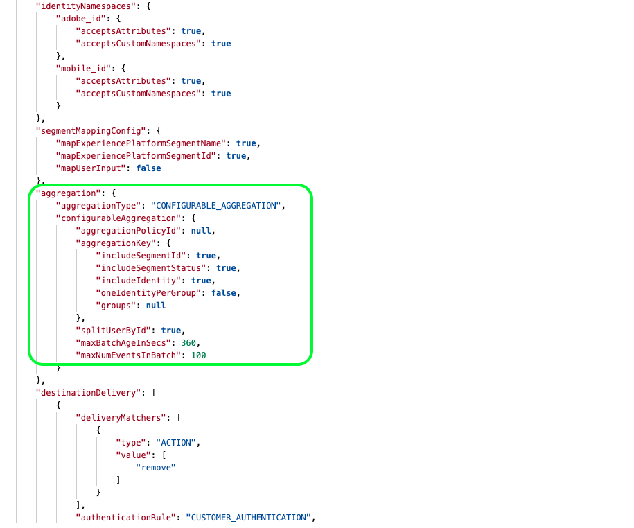

# Destination configuration {#destination-configuration}

## Overview {#overview}

This configuration allows you to indicate basic information like your destination name, category, description, logo, and more. The settings in this configuration also determine how Experience Platform users authenticate to your destination, how it appears in the Experience Platform user interface and the identities that can be exported to your destination.

You can configure the functionality described in this document by using the `/authoring/destinations` API endpoint. Read [Destinations API endpoint operations](./destination-configuration-api.md) for a complete list of operations you can perform on the endpoint.

## Example configuration {#example-configuration}

Below is an example configuration for a fictional destination, Moviestar, which has endpoints in four locations on the globe. The destination belongs to the mobile destinations category. The sections further below break down how this configuration is constructed.

```json

{
   "name":"Moviestar",
   "description":"Moviestar is a fictional destination, used for this example.",
   "status":"TEST",
   "customerAuthenticationConfigurations":[
      {
         "authType":"BEARER"
      }
   ],
   "customerDataFields":[
      {
         "name":"endpointsInstance",
         "type":"string",
         "title":"Select Endpoint",
         "description":"Moviestar manages several instances across the globe for REST endpoints that our customers are provisioned for. Select your endpoint in the dropdown list.",
         "isRequired":true,
         "enum":[
            "US",
            "EU",
            "APAC",
            "NZ"
         ]
      },
      {
         "name":"customerID",
         "type":"string",
         "title":"Moviestar Customer ID",
         "description":"Your customer ID in the Moviestar destination (e.g. abcdef).",
         "isRequired":true,
         "pattern":"^[A-Za-z]+$"
      }
   ],
   "uiAttributes":{
      "documentationLink":"http://www.adobe.com/go/destinations-moviestar-en",
      "category":"mobile",
      "connectionType":"Server-to-server",
      "frequency":"Streaming"
   },
   "identityNamespaces":{
      "external_id":{
         "acceptsAttributes":true,
         "acceptsCustomNamespaces":true
      },
      "another_id":{
         "acceptsAttributes":true,
         "acceptsCustomNamespaces":true
      }
   },
   "schemaConfig":{
      "profileRequired":false,
      "segmentRequired":true,
      "identityRequired":true
   },
   "destinationDelivery":[
      {
         "authenticationRule":"CUSTOMER_AUTHENTICATION",
         "destinationServerId":"9c77000a-4559-40ae-9119-a04324a3ecd4"
      }
   ],
   "segmentMappingConfig":{
      "mapExperiencePlatformSegmentName":false,
      "mapExperiencePlatformSegmentId":false,
      "mapUserInput":false,
      "audienceTemplateId":"cbf90a70-96b4-437b-86be-522fbdaabe9c"
   },
   "inputSchemaId":"cc8621770a9243b98aba4df79898b1ed",
   "aggregation":{
      "aggregationType":"CONFIGURABLE_AGGREGATION",
      "configurableAggregation":{
         "splitUserById":true,
         "maxBatchAgeInSecs":0,
         "maxNumEventsInBatch":0,
         "aggregationKey":{
            "includeSegmentId":true,
            "includeSegmentStatus":true,
            "includeIdentity":true,
            "oneIdentityPerGroup":false,
            "groups":[
               {
                  "namespaces":[
                     "IDFA",
                     "GAID"
                  ]
               },
               {
                  "namespaces":[
                     "EMAIL"
                  ]
               }
            ]
         }
      }
   }
}

```

|Parameter | Type | Description|
|---------|----------|------|
|`name` | String | Indicates the title of your destination in the Experience Platform catalog. |
|`description` | String | Provide a description that Adobe will use in the Experience Platform destinations catalog for your destination card. Aim for no more than 4-5 sentences. |
|`status` | String | Indicates the lifecycle status of the destination card. Accepted values are `TEST`, `PUBLISHED`, and `DELETED`. Use `TEST` when you first configure your destination. |

## Customer authentication configurations {#customer-authentication-configurations}

This section generates the account page in Experience Platform user interface, where users connect Experience Platform to the accounts they have with your destination. Depending on which authentication option you indicate in the `authType` field, the Experience Platform page is generated for the users as follows:

**Bearer authentication**

Users are required to input the bearer token that they obtain from your destination.


**OAuth 2 authentication**

Users select **[!UICONTROL Connect to destination]** to trigger the OAuth 2 authentication flow to your destination.


|Parameter | Type | Description|
|---------|----------|------|
|`customerAuthenticationConfigurations` | String | Indicates the configuration used to authenticate Experience Platform customers to your server. See `authType` below for accepted values. |
|`authType` | String | Accepted values are `OAUTH2, BEARER`. <br><ul><li> If your destination supports OAuth 2 authentication, select the `OAUTH2` value and add the required fields for OAuth 2, as shown in the Destination SDK OAuth 2 authentication page. Additionally, you should select `authenticationRule=CUSTOMER_AUTHENTICATION` in the [destination delivery section](./destination-configuration.md). </li><li>For bearer authentication, select `BEARER` and select `authenticationRule=CUSTOMER_AUTHENTICATION` in the [destination delivery section](./destination-configuration.md).</li></ul> |

## Customer data fields {#customer-data-fields}

This section allows partners to introduce custom fields. In the example configuration above, `customerDataFields` requires users to select an endpoint in the authentication flow and indicate their customer ID with the destination. The configuration is reflected in the authentication flow as shown below:


|Parameter | Type | Description|
|---------|----------|------|
|`name` | String | Provide a name for the custom field you are introducing. |
|`type` | String | Indicates what type of custom field you are introducing. Accepted values are `string`, `object`, `integer`. |
|`title` | String | Indicates the name of the field, as it is seen by customers in the Experience Platform user interface. |
|`description` | String | Provide a description for the custom field. |
|`isRequired` | Boolean | Indicates if this field is required in the destination setup workflow. |
|`enum` | String | Renders the custom field as a dropdown menu and lists the options available to the user. |
|`pattern` | String | Enforces a pattern for the custom field, if needed. Use regular expressions to enforce a pattern. For example, if your customer IDs don't include numbers or underscores, enter `^[A-Za-z]+$` in this field. |

## UI attributes {#ui-attributes}

This section refers to the UI elements in the configuration above that Adobe should use for your destination in the Adobe Experience Platform user interface. See below:

|Parameter | Type | Description|
|---------|----------|------|
|`documentationLink` | String | Refers to the documentation page in the [Destinations Catalog](https://experienceleague.adobe.com/docs/experience-platform/destinations/catalog/overview.html?lang=en#catalog) for your destination. Use `http://www.adobe.com/go/destinations-YOURDESTINATION-en`, where `YOURDESTINATION` is the name of your destination. For a destination called Moviestar, you would use `http://www.adobe.com/go/destinations-moviestar-en` |
|`category` | String | Refers to the category assigned to your destination in Adobe Experience Platform. For more information, read [Destination Categories](https://experienceleague.adobe.com/docs/experience-platform/destinations/destination-types.html). Use one of the following values: `adobeSolutions, advertising, analytics, cdp, cloudStorage, crm, customerSuccess, database, dmp, ecommerce, email, emailMarketing, enrichment, livechat, marketingAutomation, mobile, personalization, protocols, social, streaming, subscriptions, surveys, tagManagers, voc, warehouses, payments`. |
|`connectionType` | String | `Server-to-server` is currently the only available option. |
|`frequency` | String | `Streaming` is currently the only available option. |

## Schema configuration in the mapping step {#schema-configuration}


Use the parameters in `schemaConfig` to enable the mapping step of the destination activation workflow. By using the parameters described below, you can determine if Experience Platform users can map profile attributes and/or identities to the desired schema on your destination's side.

|Parameter | Type | Description|
|---------|----------|------|
|`profileFields` | Array | *Not shown in example configuration above.* When you add predefined `profileFields`, users will have the option of mapping Experience Platform attributes to the predefined attributes on your destination's side. |
|`profileRequired` | Boolean | Use `true` if users should be able to map profile attributes from Experience Platform to custom attributes on your destination's side, as shown in the example configuration above. |
|`segmentRequired` | Boolean | Always use `segmentRequired:true`. |
|`identityRequired` | Boolean | Use `true` if users should be able to map identity namespaces from Experience Platform to your desired schema. |

## Identities and attributes {#identities-and-attributes}

The parameters in this section determine how the target identities and attributes are populated in the mapping step of the Experience Platform user interface, where users map their XDM schemas to the schema in your destination.

Adobe needs to know which [!DNL Platform] identities customers will be able to export to your destination. Some examples are [!DNL Experience Cloud ID], hashed email, device ID ([!DNL IDFA], [!DNL GAID]). These values are [!DNL Platform] identity namespaces that customers can map to identity namespaces from your destination.

Identity namespaces do not require a 1-to-1 correspondence between [!DNL Platform] and your destination.
For instance, customers could map a [!DNL Platform] [!DNL IDFA] namespace to an [!DNL IDFA] namespace from your destination, or they can map the same [!DNL Platform] [!DNL IDFA] namespace to a [!DNL Customer ID] namespace in your destination.

Read more in the [Identity Namespace overview](https://experienceleague.adobe.com/docs/experience-platform/identity/namespaces.html?lang=en).

 

|Parameter | Type | Description|
|---------|----------|------|
|`acceptsAttributes` | Boolean | Indicates if your destination accepts standard profile attributes. Usually, these attributes are highlighted in our partners' documentation. |
|`acceptsCustomNamespaces` | Boolean | Indicates if customers can set up custom namespaces in your destination. |
|`allowedAttributesTransformation` | String | *Not shown in example configuration*. Used, for example, when the [!DNL Platform] customer has plain email addresses as an attribute and your platform only accepts hashed emails. This is where you would provide the transformation that needs to be applied (for example, transform the email to lowercase, then hash).   |
|`acceptedGlobalNamespaces` | - | *Not shown in example configuration*. Used for cases when your platform accepts [standard identity namespaces](https://experienceleague.adobe.com/docs/experience-platform/identity/namespaces.html?lang=en#standard-namespaces) (for example, IDFA), so you can restrict Platform users to only selecting these identity namespaces. |

## Destination delivery {#destination-delivery}

|Parameter | Type | Description|
|---------|----------|------|
|`authenticationRule` | String | Indicates how [!DNL Platform] customers connect to your destination. Accepted values are `CUSTOMER_AUTHENTICATION`, `PLATFORM_AUTHENTICATION`, `NONE`. <br> <ul><li>Use `CUSTOMER_AUTHENTICATION` if Platform customers log into your system via a username and password, a bearer token, or another method of authentication. For example, you would select this option if you also selected `authType: OAUTH2` or `authType:BEARER` in `customerAuthenticationConfigurations`. </li><li> Use `PLATFORM_AUTHENTICATION` if there is a global authentication system between Adobe and your destination and the [!DNL Platform] customer does not need to provide any authentication credentials to connect to your destination. In this case, you must create a credentials object using the [Credentials](./credentials-configuration.md) configuration. </li><li>Use `NONE` if no authentication is required to send data to your destination platform. </li></ul> |
|`destinationServerId` | String | The `instanceId` of the [destination server configuration](./destination-server-api.md) used for this destination. |
|`backfillHistoricalProfileData` | Boolean | Controls whether historical profile data is exported when segments are activated to the destination. <br> <ul><li> `true`: [!DNL Platform] sends the historical user profiles that qualified for the segment before the segment is activated. </li><li> `false`: [!DNL Platform] only includes user profiles that qualify for the segment after the segment is activated. </li></ul> |

## Segment mapping configuration {#segment-mapping}


This section of the destination configuration relates to how segment metadata like segment names or IDs should be shared between Experience Platform and your destination.

Through the `audienceTemplateId`, this section also ties together this configuration with the [audience metadata configuration](./audience-metadata-management.md).

The parameters shown in the configuration above are described in the [destinations endpoint API reference](./destination-configuration-api.md).

## Aggregation policy {#aggregation}



This section allows you to set the aggregation policies that Experience Platform will use when exporting data to your destination.

An aggregation policy determines how the exported profiles are combined together in the data exports. Available options are:
* Best effort aggregation
* Configurable aggregation (shown in the configuration above)

Read the section on [using templating](./message-format.md#using-templating) and the [aggregation key examples](./message-format.md#template-aggregation-key) to understand how to include the aggregation policy in your message transformation template based on your selected aggregation policy.

### Best effort aggregation {#best-effort-aggregation}

>[!TIP]
>
>Use this option if your API endpoint accepts less than 100 profiles per API call. 

This option works best for destinations which prefer less profiles per request and would rather take more requests with less data than less requests with more data.

Use the `maxUsersPerRequest` parameter to specify the maximum number of profiles that your destination can take in a request.

### Configurable aggregation {#configurable-aggregation}

This option works best if you'd rather take large batches, with thousands of profiles on the same call. This option also allows you to aggregate the exported profiles based on complex aggregation rules.

This option allows you to:
* Set the maximum time and number of profiles to aggregate before an API call is made to your destination. 
* Aggregate the exported profiles mapped to the destination based on:
  * segment ID
  * segment status
  * identity or groups of identities

For detailed explanations of the aggregation parameters, refer to the [Destinations API endpoint operations](./destination-configuration-api.md) reference page, where each parameter is described.

<!--

commenting out the `backfillHistoricalProfileData` parameter, which will only be used after an April release

|`backfillHistoricalProfileData` | Boolean | Controls whether historical profile data is exported when segments are activated to the destination. <br> <ul><li> `true`: [!DNL Platform] sends the historical user profiles that qualified for the segment before the segment is activated. </li><li> `false`: [!DNL Platform] only includes user profiles that qualify for the segment after the segment is activated. </li></ul> |

-->
