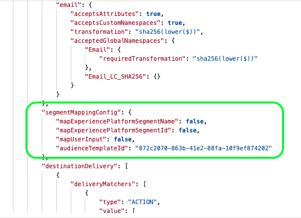

# Streaming destination configuration {#destination-configuration}

## Overview {#overview}

This configuration allows you to indicate essential information for your streaming destination, like your destination name, category, description, and more. The settings in this configuration also determine how Experience Platform users authenticate to your destination, how it appears in the Experience Platform user interface and the identities that can be exported to your destination.

This configuration also connects the other configurations required for your destination to work - destination server and audience metadata - to this one. Read how you can reference the two configurations in a [section further below](./destination-configuration.md#connecting-all-configurations).

You can configure the functionality described in this document by using the `/authoring/destinations` API endpoint. Read [Destinations API endpoint operations](./destination-configuration-api.md) for a complete list of operations you can perform on the endpoint.

## Streaming configuration example {#example-configuration}

This is an example configuration of a fictional streaming destination, Moviestar, which has endpoints in four locations on the globe. The destination belongs to the mobile destinations category.

```json
{
   "name":"Moviestar",
   "description":"Moviestar is a fictional destination, used for this example.",
   "status":"TEST",
   "customerAuthenticationConfigurations":[
      {
         "authType":"BEARER"
      }
   ],
   "customerDataFields":[
      {
         "name":"endpointRegion",
         "type":"string",
         "title":"Select Endpoint",
         "description":"Moviestar manages several instances across the globe for REST endpoints that our customers are provisioned for. Select your endpoint in the dropdown list.",
         "isRequired":true,
         "enum":[
            "US",
            "EU",
            "APAC",
            "NZ"
         ]
      },
      {
         "name":"customerID",
         "type":"string",
         "title":"Moviestar Customer ID",
         "description":"Your customer ID in the Moviestar destination (e.g. abcdef).",
         "isRequired":true,
         "pattern":"^[A-Za-z]+$"
      }
   ],
   "uiAttributes":{
      "documentationLink":"http://www.adobe.com/go/destinations-moviestar-en",
      "category":"mobile",
      "connectionType":"Server-to-server",
      "frequency":"Streaming"
   },
   "identityNamespaces":{
      "external_id":{
         "acceptsAttributes":true,
         "acceptsCustomNamespaces":true,
         "acceptedGlobalNamespaces":{
            "Email":{
               
            }
         }
      },
      "another_id":{
         "acceptsAttributes":true,
         "acceptsCustomNamespaces":true
      }
   },
   "schemaConfig":{
      "profileRequired":false,
      "segmentRequired":true,
      "identityRequired":true
   },
   "destinationDelivery":[
      {
         "authenticationRule":"CUSTOMER_AUTHENTICATION",
         "destinationServerId":"9c77000a-4559-40ae-9119-a04324a3ecd4"
      }
   ],
   "segmentMappingConfig":{
      "mapExperiencePlatformSegmentName":false,
      "mapExperiencePlatformSegmentId":false,
      "mapUserInput":false,
      "audienceTemplateId":"cbf90a70-96b4-437b-86be-522fbdaabe9c"
   },
   "aggregation":{
      "aggregationType":"CONFIGURABLE_AGGREGATION",
      "configurableAggregation":{
         "splitUserById":true,
         "maxBatchAgeInSecs":2400,
         "maxNumEventsInBatch":5000,
         "aggregationKey":{
            "includeSegmentId":true,
            "includeSegmentStatus":true,
            "includeIdentity":true,
            "oneIdentityPerGroup":false,
            "groups":[
               {
                  "namespaces":[
                     "IDFA",
                     "GAID"
                  ]
               },
               {
                  "namespaces":[
                     "EMAIL"
                  ]
               }
            ]
         }
      }
   },
   "backfillHistoricalProfileData":true
}
```

|Parameter | Type | Description|
|---------|----------|------|
|`name` | String | Indicates the title of your destination in the Experience Platform catalog. |
|`description` | String | Provide a description for your destination card in the Experience Platform destinations catalog. Aim for no more than 4-5 sentences. |
|`status` | String | Indicates the lifecycle status of the destination card. Accepted values are `TEST`, `PUBLISHED`, and `DELETED`. Use `TEST` when you first configure your destination. |

{style="table-layout:auto"}

## Customer authentication configurations {#customer-authentication-configurations}

This section in the destinations configuration generates the [Configure new destination](/help/destinations/ui/connect-destination.md) page in the Experience Platform user interface, where users connect Experience Platform to the accounts they have with your destination. Depending on which authentication option you indicate in the `authType` field, the Experience Platform page is generated for the users as follows:

### Bearer authentication

When you configure the bearer authentication type, users are required to input the bearer token that they obtain from your destination.


### OAuth 2 authentication

Users select **[!UICONTROL Connect to destination]** to trigger the OAuth 2 authentication flow to your destination, as shown in the example below for the Twitter Custom Audiences destination. For detailed information on configuring OAuth 2 authentication to your destination endpoint, read the dedicated [Destination SDK OAuth 2 authentication page](./oauth2-authentication.md).


|Parameter | Type | Description|
|---------|----------|------|
|`customerAuthenticationConfigurations` | String | Indicates the configuration used to authenticate Experience Platform customers to your server. See `authType` below for accepted values. |
|`authType` | String | Accepted values for streaming destinations are:<ul><li>`BEARER`. If your destination supports bearer authentication, set `"authType":"Bearer"` and  `"authenticationRule":"CUSTOMER_AUTHENTICATION"` in the [destination delivery section](./destination-configuration.md).</li><li>`OAUTH2`. If your destination supports OAuth 2 authentication, set `"authType":"OAUTH2"` and add the required fields for OAuth 2, as shown in the [Destination SDK OAuth 2 authentication page](./oauth2-authentication.md). Additionally, set `"authenticationRule":"CUSTOMER_AUTHENTICATION"` in the [destination delivery section](./destination-configuration.md).</li>|

{style="table-layout:auto"}

## Customer data fields {#customer-data-fields}

Use this section to ask users to fill in custom fields, specific to your destination, when connecting to the destination in the Experience Platform UI. The configuration is reflected in the authentication flow as shown below.


>[!TIP]
>
>You can access and use the customer inputs from customer data fields in templating. Use the macro `{{customerData.name}}`. For example, if you ask users to input a Customer ID field, with the name `userId`, you can access it in templating by using the macro `{{customerData.userId}}`. View an example of how a customer data field is used in the URL of your API endpoint, in the [destination server configuration](/help/destinations/destination-sdk/server-and-template-configuration.md#server-specs).

|Parameter | Type | Description|
|---------|----------|------|
|`name` | String | Provide a name for the custom field you are introducing. |
|`type` | String | Indicates what type of custom field you are introducing. Accepted values are `string`, `object`, `integer`. |
|`title` | String | Indicates the name of the field, as it is seen by customers in the Experience Platform user interface. |
|`description` | String | Provide a description for the custom field. |
|`isRequired` | Boolean | Indicates if this field is required in the destination setup workflow. |
|`enum` | String | Renders the custom field as a dropdown menu and lists the options available to the user. |
|`pattern` | String | Enforces a pattern for the custom field, if needed. Use regular expressions to enforce a pattern. For example, if your customer IDs don't include numbers or underscores, enter `^[A-Za-z]+$` in this field. |

{style="table-layout:auto"}

## UI attributes {#ui-attributes}

This section refers to the UI elements in the configuration above that Adobe should use for your destination in the Adobe Experience Platform user interface. See below:


|Parameter | Type | Description|
|---------|----------|------|
|`documentationLink` | String | Refers to the documentation page in the [Destinations Catalog](https://experienceleague.adobe.com/docs/experience-platform/destinations/catalog/overview.html?lang=en#catalog) for your destination. Use `http://www.adobe.com/go/destinations-YOURDESTINATION-en`, where `YOURDESTINATION` is the name of your destination. For a destination called Moviestar, you would use `http://www.adobe.com/go/destinations-moviestar-en`. Note that this link works only after Adobe sets your destination live and the documentation is published. |
|`category` | String | Refers to the category assigned to your destination in Adobe Experience Platform. For more information, read [Destination Categories](https://experienceleague.adobe.com/docs/experience-platform/destinations/destination-types.html). Use one of the following values: `adobeSolutions, advertising, analytics, cdp, cloudStorage, crm, customerSuccess, database, dmp, ecommerce, email, emailMarketing, enrichment, livechat, marketingAutomation, mobile, personalization, protocols, social, streaming, subscriptions, surveys, tagManagers, voc, warehouses, payments`. <br> Note that you can currently select only one category per destination.|
|`connectionType` | String | `Server-to-server` is currently the only available option. |
|`frequency` | String | Refers to the type of data export supported by the destination. Supported values: <ul><li>`Streaming`</li><li>`Batch`</li></ul>|

{style="table-layout:auto"}

## Schema configuration in the mapping step {#schema-configuration}


Use the parameters in `schemaConfig` to enable the mapping step of the destination activation workflow. By using the parameters described below, you can determine if Experience Platform users can map profile attributes and/or identities to the desired schema on your destination's side.

|Parameter | Type | Description|
|---------|----------|------|
|`profileFields` | Array | *Not shown in example configuration above.* When you add predefined `profileFields`, Experience Platform users have the option of mapping Platform attributes to the predefined attributes on your destination's side. |
|`profileRequired` | Boolean | Use `true` if users should be able to map profile attributes from Experience Platform to custom attributes on your destination's side, as shown in the example configuration above. |
|`segmentRequired` | Boolean | Always use `segmentRequired:true`. |
|`identityRequired` | Boolean | Use `true` if users should be able to map identity namespaces from Experience Platform to your desired schema. |

{style="table-layout:auto"}

## Identities and attributes {#identities-and-attributes}

The parameters in this section determine which identities your destination accepts. This configuration also populates the target identities and attributes in the [mapping step](/help/destinations/ui/activate-segment-streaming-destinations.md#mapping) of the Experience Platform user interface, where users map identities and attributes from their XDM schemas to the schema in your destination.

You must indicate which [!DNL Platform] identities customers are able to export to your destination. Some examples are [!DNL Experience Cloud ID], hashed email, device ID ([!DNL IDFA], [!DNL GAID]). These values are [!DNL Platform] identity namespaces that customers can map to identity namespaces from your destination. You can also indicate if customers can map custom namespaces to identities supported by your destination (`acceptsCustomNamespaces: true`) and if customers can map standard XDM attributes to identities supported by your destination (`acceptsAttributes: true`). 

Identity namespaces do not require a 1-to-1 correspondence between [!DNL Platform] and your destination.
For instance, customers could map a [!DNL Platform] [!DNL IDFA] namespace to an [!DNL IDFA] namespace from your destination, or they can map the same [!DNL Platform] [!DNL IDFA] namespace to a [!DNL Customer ID] namespace in your destination.

Read more about identities in the [Identity Namespace overview](/help/identity-service/namespaces.md).

 

|Parameter | Type | Description|
|---------|----------|------|
|`acceptsAttributes` | Boolean | Indicates if customers can map standard profile attributes to the identity that you are configuring. |
|`acceptsCustomNamespaces` | Boolean | Indicates if customers can set up custom namespaces in your destination. |
|`transformation` | String | *Not shown in example configuration*. Used, for example, when the [!DNL Platform] customer has plain email addresses as an attribute and your platform only accepts hashed emails. In this object, you can the transformation that needs to be applied (for example, transform the email to lowercase, then hash). For an example, see `requiredTransformation` in the [destination configuration API reference](./destination-configuration-api.md#update). |
|`acceptedGlobalNamespaces` | - | Indicates which [standard identity namespaces](/help/identity-service/namespaces.md#standard) (for example, IDFA) customers can map to the identity that you are configuring. <br> When you use `acceptedGlobalNamespaces`, you can use `"requiredTransformation":"sha256(lower($))"` to lowercase and hash email addresses or phone numbers. |

{style="table-layout:auto"}

## Destination delivery {#destination-delivery}

|Parameter | Type | Description|
|---------|----------|------|
|`authenticationRule` | String | Indicates how [!DNL Platform] customers connect to your destination. Accepted values are `CUSTOMER_AUTHENTICATION`, `PLATFORM_AUTHENTICATION`, `NONE`. <br> <ul><li>Use `CUSTOMER_AUTHENTICATION` if Platform customers log into your system via a username and password, a bearer token, or another method of authentication. For example, you would select this option if you also selected `authType: OAUTH2` or `authType:BEARER` in `customerAuthenticationConfigurations`. </li><li> Use `PLATFORM_AUTHENTICATION` if there is a global authentication system between Adobe and your destination and the [!DNL Platform] customer does not need to provide any authentication credentials to connect to your destination. In this case, you must create a credentials object using the [Credentials](./credentials-configuration-api.md) configuration. </li><li>Use `NONE` if no authentication is required to send data to your destination platform. </li></ul> |
|`destinationServerId` | String | The `instanceId` of the [destination server configuration](./destination-server-api.md) used for this destination. |

{style="table-layout:auto"}

## Segment mapping configuration {#segment-mapping}



This section of the destination configuration relates to how segment metadata like segment names or IDs should be shared between Experience Platform and your destination.

Through the `audienceTemplateId`, this section also ties together this configuration with the [audience metadata configuration](./audience-metadata-management.md).

The parameters shown in the configuration above are described in the [destinations endpoint API reference](./destination-configuration-api.md).

## Aggregation policy {#aggregation}


This section allows you to set the aggregation policies that Experience Platform should use when exporting data to your destination.

An aggregation policy determines how the exported profiles are combined in the data exports. Available options are:
* Best effort aggregation
* Configurable aggregation (shown in the configuration above)

Read the section on [using templating](./message-format.md#using-templating) and the [aggregation key examples](./message-format.md#template-aggregation-key) to understand how to include the aggregation policy in your message transformation template based on your selected aggregation policy. 

### Best effort aggregation {#best-effort-aggregation}

>[!TIP]
>
>Use this option if your API endpoint accepts fewer than 100 profiles per API call.

This option works best for destinations which prefer fewer profiles per request and would rather take more requests with less data than fewer requests with more data.

Use the `maxUsersPerRequest` parameter to specify the maximum number of profiles that your destination can take in a request.

### Configurable aggregation {#configurable-aggregation}

This option works best if you'd rather take large batches, with thousands of profiles on the same call. This option also allows you to aggregate the exported profiles based on complex aggregation rules.

This option allows you to:

* Set the maximum time and maximum number of profiles to aggregate before an API call is made to your destination.
* Aggregate the exported profiles mapped to the destination based on:
  * Segment ID;
  * Segment status;
  * Identity or groups of identities.

>[!NOTE]
>
>When using the configurable aggregation option for your destination, be mindful of the minimum and maximum values that you can use for the two parameters `maxBatchAgeInSecs` (minimum 1,800 and maximum 3,600) and `maxNumEventsInBatch` (minimum 1,000, maximum 10,000).

For detailed explanations of the aggregation parameters, refer to the [Destinations API endpoint operations](./destination-configuration-api.md) reference page, where each parameter is described.

## Historical profile qualifications {#profile-backfill}

You can use the `backfillHistoricalProfileData` parameter in the destinations configuration to determine if historical profile qualifications should be exported to your destination.

|Parameter | Type | Description|
|---------|----------|------|
|`backfillHistoricalProfileData` | Boolean | Controls whether historical profile data is exported when segments are activated to the destination. <br> <ul><li> `true`: [!DNL Platform] sends the historical user profiles that qualified for the segment before the segment is activated. </li><li> `false`: [!DNL Platform] only includes user profiles that qualify for the segment after the segment is activated. </li></ul> |

{style="table-layout:auto"}

## How this configuration connects all necessary information for your destination {#connecting-all-configurations}

Some of your destination settings must be configured through the [destination server](./server-and-template-configuration.md) or the [audience metadata configuration](./audience-metadata-management.md). The destination configuration described here connects all these settings by referencing the two other configurations as follows:

* Use the `destinationServerId` to reference the destination server and template configuration set up for your destination.
* Use the `audienceMetadataId` to reference the audience metadata configuration set up for your destination.