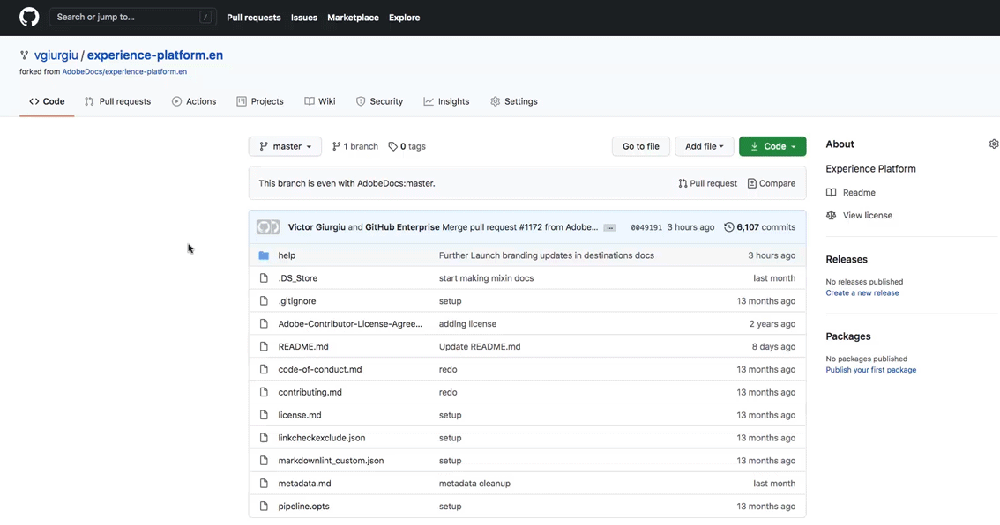
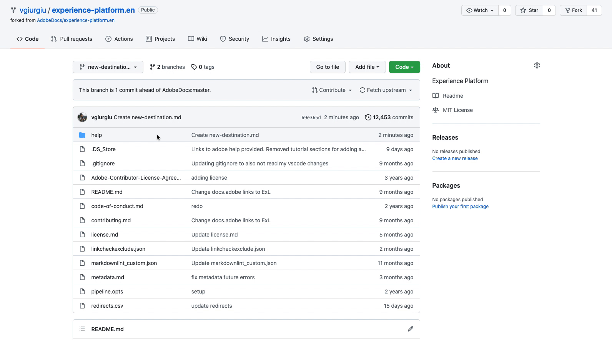

# Document your destination in Adobe Experience Platform

## Overview {#overview}

Welcome to Adobe Experience Platform, great to have you here!
Documenting your destination is the final step before it can be set live in Adobe Experience Platform.

This documentation section includes:

* Step-by step instructions for you to create a documentation page for your new destination;
* A template for you to fill out for your destination;
* [General instructions on using Markdown](https://experienceleague.adobe.com/docs/contributor/contributor-guide/writing-essentials/markdown.html?lang=en);
* [Specific instructions for the Adobe Markdown flavor](https://experienceleague.adobe.com/docs/contributor/contributor-guide/writing-essentials/markdown.html?lang=en#custom-markdown-extensions) (the Adobe Markdown flavor is very similar to regular Markdown).
* A [best practices page](./authoring-best-practices.md) to help you author a documentation page for your destination page, which meets the Experience Platform documentation quality standards.

## Prerequisites {#prerequisites}

To create documentation for your destination according to the instructions in this article, the following items are necessary:

* **A GitHub account**. Sign up for [GitHub](https://github.com/) if you don't have an account yet.
* **GitHub Desktop**. If you select to [create the documentation in your local environment](./work-in-local-environment.md), you must use [GitHub Desktop](https://desktop.github.com/).
* Your integration with Adobe must be in a testing phase with your destination deployed in a staging environment in Adobe Experience Platform.

## High-level instructions to create documentation for your destination in Adobe Experience Platform {#high-level-instructions}

At a high level, to create documentation for your destination, you need to [create a fork](https://experienceleague.adobe.com/docs/contributor/contributor-guide/setup/local-repo.html?lang=en#fork-the-repository) of the Adobe Experience Platform documentation repository and edit the [provided documentation template](./self-service-template.md) in a new branch. Use the Adobe-provided template to create a new destination page. Open a pull request (PR) when you are ready. Instructions to do this are further below, in [Steps to create your new destination page](./documentation-instructions.md#steps-to-create-docs-page).

>[!TIP]
>
>See [Writing guidance for Adobe Documentation](https://experienceleague.adobe.com/docs/contributor/contributor-guide/writing-essentials/general-writing-guidance.html?lang=en) for some quick writing tips that the Adobe documentation team uses when authoring documentation.

<!--

* In the table of contents (TOC.md) `/help/rtcdp/TOC.md`, add a link to your new destination page. Place it within the category where your destination resides in the Adobe Experience Platform user interface (for example: mobile, social, advertising). 
* In the overview page for the respective category, add a link to your new destination page. For example, for cloud storage destinations, you would add a link to [this page](https://docs.adobe.com/content/help/en/experience-platform/rtcdp/destinations/destinations-cat/cloud-storage/cloud-storage-destinations.html). 

-->

## Documentation template {#documentation-template}

To assist you in creating your documentation page, Adobe has prefilled a [documentation template](./self-service-template.md) for you. Further below, you can find instructions how to edit the template and open a pull request. The Adobe documentation team will review and publish the documentation for your new destination.

[Download the template here](assets/yourdestination-template.zip) and unzip the file to extract the `yourdestination.md` file.

Instructions on using the template to create your documentation page are further below.

<!--

## Working in GitHub

You have a two basic options for writing and submitting content to Adobe Real-time CDP:

- [Write in GitHub](#write-in-github): Fast and easy edits through the GitHub website. Write, commit, and branch all through a single page!
- [Write like a Developer](#write-like-a-developer): Clone and write using an editor on your local computer.

We also provide guides to help you write:

- [Writing guidelines](#writing-guidelines): Tips and guides to writing for merchant docs.
- [Writing styles and markdown](#writing-styles-and-markdown): Quick and easy guide for using markdown code.


## Instructions how to fork the Experience Platform repository and open a pull request (PR)

If you are new to the GitHub contribution model and not used to working in a text editor, you can contribute directly in GitHub!


-->


## Steps to create your new destination page {#steps-to-create-docs-page}

You can use the GitHub web interface or your local environment to create documentation for your new destination in Adobe Experience Platform. Find instructions for both options in the links below:

* [Use the GitHub web interface to create a destination documentation page](./use-github-interface-to-create-documentation.md)
* [Use a text editor in your local environment to create a destination documentation page](./work-in-local-environment.md)


<!--

## Steps to create your new destination page {#steps-to-create-docs-page}

### Method 1 - Create your new destination page using the GitHub web interface {#github-interface}

The instructions below show you how to use the GitHub web interface to author documentation and submit a pull request. 


>[!TIP]
>
>If you prefer to work on the documentation in a text editor, read the section below, [Create your new destination page using a text editor in your local environment](./documentation-instructions.md#local-authoring). 
>Refer also to our supporting documentation [Install Git and Markdown Authoring tools](https://docs.adobe.com/content/help/en/contributor/contributor-guide/setup/install-tools.html), [Set up Git repository locally for documentation](https://docs.adobe.com/content/help/en/contributor/contributor-guide/setup/local-repo.html), and [GitHub contribution workflow for major changes](https://docs.adobe.com/content/help/en/contributor/contributor-guide/setup/full-workflow.html) in Adobe's contributor guide.

1. In your browser, navigate to `https://github.com/AdobeDocs/experience-platform.en`.
1. To [fork](https://experienceleague.adobe.com/docs/contributor/contributor-guide/setup/local-repo.html?lang=en#fork-the-repository) the repository, click **Fork** as shown in the image below.

   

1. In your fork of the repository, create a new branch for your project, as shown below. You will use this branch for the work in this tutorial.

   

1. In the GitHub folder structure of the forked repository, navigate to `experience-platform.en/help/destinations/catalog/[...]`, where [...] is the desired category for your destination. For example, if you are adding a personalization destination to Experience Platform, select the `personalization` category. Select **Add file > Create new file**. 

   >[!TIP]
   >
   >The folder structure in the screen recording below is outdated. Navigate to the folder structure indicated above.

   

1. Name your destination `YOURDESTINATION.md`, where YOURDESTINATION is the name of your destination in Adobe Experience Platform. For example, if your company is called Moviestar, you would name your file `moviestar.md`.
1. In your new file in GitHub, paste in the content of the [destination template](./self-service-template.md). Download the template [here](assets/yourdestination-template.zip). Unzip it to extract the `.md` file template.
1. In the GitHub interface, edit the template with relevant information for your destination. Follow the instructions in the template. 
1. For any screenshots or images that you plan on using, use the GitHub interface to upload the files to `experience-platform.en/help/destinations/assets/catalog/` and link to them from the page you are authoring. See [instructions how to link to images](https://docs.adobe.com/content/help/en/contributor/contributor-guide/writing-essentials/linking.html#link-to-images).
   
   >[!TIP]
   >
   >The folder structure in the screen recording below is outdated. Navigate to the folder structure indicated above.

   

1.  When you are ready, save the file in your branch.

      

1. After you saved the file and uploaded your desired images, you can open a pull request (PR) to merge your working branch into the master branch of the Adobe documentation repository. Make sure the branch that you worked on is selected and select **Pull request**.

   

1. Make sure that the base and compare branches are correct. Add a note to the PR, describing your update, and select **Create pull request**. This opens a PR to merge the working branch of your fork into the master branch of the Adobe repository. 
   >[!TIP]
   >
   >Leave the **Allow edits by maintainers** checkbox selected so that the Adobe documentation team can make edits to the PR. 
   
   

1. At this point, a notification appears that prompts you to sign the Adobe CLA. This is a mandatory step. After you signed it, refresh the PR page and submit the pull request.

1. You can confirm that the pull request has been submitted by inspecting the **Pull requests** tab in `https://github.com/AdobeDocs/experience-platform.en`.

   

1.  Thank you! The Adobe documentation team will reach out in the PR in case any edits are required and to let you know when the documentation will be published.

>[!TIP]
>
>To add images and links to your documentation, and for any other questions around Markdown, read [Using Markdown](https://experienceleague.adobe.com/docs/contributor/contributor-guide/writing-essentials/markdown.html?lang=en) in Adobe's collaborative writing guide.

<br>&nbsp;

### Method 2 - Create your new destination page using a text editor in your local environment {#local-authoring}

The instructions below show you how to use a text editor to work in your local environment to author documentation and submit a pull request.

Please see [Install Git and Markdown Authoring tools](https://docs.adobe.com/content/help/en/contributor/contributor-guide/setup/install-tools.html), [Set up Git repository locally for documentation](https://docs.adobe.com/content/help/en/contributor/contributor-guide/setup/local-repo.html), and [GitHub contribution workflow for major changes](https://docs.adobe.com/content/help/en/contributor/contributor-guide/setup/full-workflow.html) in Adobe's contributor guide for reference.


1. In your browser, navigate to `https://github.com/AdobeDocs/experience-platform.en`
1. To [fork](https://experienceleague.adobe.com/docs/contributor/contributor-guide/setup/local-repo.html?lang=en#fork-the-repository) the repository, click **Fork** as shown in the screenshot.

   

1. Clone the repository to your local machine. Select **Code > HTTPS > Open with GitHub Desktop**, as shown below. Make sure you have [GitHub Desktop](https://desktop.github.com/) installed. For further reference, read [Create a local clone of the repository](https://docs.adobe.com/content/help/en/contributor/contributor-guide/setup/local-repo.html#create-a-local-clone-of-the-repository) in the Adobe contributor guide.

   

1. In your local file structure, navigate to `experience-platform.en/help/destinations/catalog/[...]`, where [...] is the desired category for your destination. For example, if you are adding a personalization destination to Experience Platform, select the `personalization` folder.
1. Download the [self-service destination template](assets/yourdestination-template.zip). Unzip it and extract the file `yourdestination-template.md` to the above directory.  Rename the file `YOURDESTINATION.md`, where YOURDESTINATION is the name of your destination in Adobe Experience Platform. For example, if your company is called Moviestar, you would name your file `moviestar.md`.
1. Open your new file in your [text editor of choice](https://docs.adobe.com/content/help/en/contributor/contributor-guide/setup/install-tools.html#understand-markdown-editors).
1. Edit the template with relevant information for your destination. Follow the instructions in the template. 
1.  For any screenshots or images that you plan on adding to your documentation, navigate to `GitHub/experience-platform.en/help/destinations/assets/catalog/[...]`, where [...] is the desired category for your destination. For example, if you are adding a personalization destination to Experience Platform, select the `personalization` folder. Create a new folder for your destination and drop your images here. You can link to them from the page you are authoring. See [instructions how to link to images](https://docs.adobe.com/content/help/en/contributor/contributor-guide/writing-essentials/linking.html#link-to-images).
1. When you are ready, save the file you are working on.
1. In GitHub Desktop, create a working branch for your updates and select **Publish branch** to publish the branch to GitHub.

   >[!TIP]
   >
   >The folder structure in the screen recording below is outdated. For a personalization destination named Moviestar, you would use the following folder structure:
   >* `help/destinations/catalog/personalization/moviestar.md` for the Markdown file.
   >* `help/destinations/assets/catalog/personalization/moviestar/` for any images you are using in the documentation.

   

1. In GitHub Desktop, [commit](https://docs.github.com/en/free-pro-team@latest/github/getting-started-with-github/github-glossary#commit) your work, as shown below.

   >[!TIP]
   >
   >The folder structure in the screen recording below is outdated. For a personalization destination named Moviestar, you would use the following folder structure:
   >* `help/destinations/catalog/personalization/moviestar.md` for the Markdown file.
   >* `help/destinations/assets/catalog/personalization/moviestar/` for any images you are using in the documentation.

   

1. In GitHub Desktop, [push](https://docs.github.com/en/free-pro-team@latest/github/getting-started-with-github/github-glossary#push) your work to the [remote](https://docs.github.com/en/free-pro-team@latest/github/getting-started-with-github/github-glossary#remote) branch, as shown below.

   

1. In the GitHub web interface, open a pull request (PR) to merge your working branch into the master branch of the Adobe documentation repository. Make sure the branch you worked on is selected and select **Pull request**.

   

1.  Make sure that the base and compare branches are correct. Add a note to the PR, describing your update, and select **Create pull request**. This opens a PR to merge the working branch of your fork into the master branch of the Adobe repository. 
   >[!TIP]
   >
   >Leave the **Allow edits by maintainers** checkbox selected so that the Adobe documentation team can make edits to the PR. 
 
   

1. At this point, a notification appears that prompts you to sign the Adobe CLA. Note that this is a mandatory step. After you signed it, refresh the PR page and merge the pull request.
1.  You can confirm that the pull request has been submitted by inspecting the **Pull requests** tab in `https://github.com/AdobeDocs/experience-platform.en`.

   

1. Thank you! The Adobe documentation team will reach out in the PR in case any edits are required and to let you know when the documentation will be published.

>[!TIP]
>
>To add images and links to your documentation, and for any other questions around Markdown, read [Using Markdown](https://experienceleague.adobe.com/docs/contributor/contributor-guide/writing-essentials/markdown.html?lang=en) in Adobe's collaborative writing guide.

-->


<!--

Create a pull request to merge your work into the main Adobe Experience Platform repository.https://docs.github.com/en/free-pro-team@latest/github/collaborating-with-issues-and-pull-requests/creating-a-pull-request-from-a-fork 

-->


<!--

1. In your GitHub Adobe Real-time CDP fork, locate a documentation file you want to edit. 

   You can search in **Find file**, or browse to a file in the `src` folder. All content is located here.

    [[/images/fork-src.png]]

2. Click the edit icon.

    [[/images/fork-edit.png]]

3. Add, edit, and update content in the file.

4. When the changes are complete, scroll down and enter a [meaningful commit message](https://github.com/magento/Adobe Real-time CDP/wiki/Branches-to-PRs#commit-messages).

5. Select **Create a new branch...** and enter a name for the branch.

6. Click **Commit file change**.

    [[/images/fork-branch.png]]

[[/images/info.png]] When ready to submit a pull request (PR), see [Submit a pull request](https://github.com/magento/Adobe Real-time CDP/wiki/Branches-to-PRs#Submit-a-pull-request).

## Write like a Developer

If you have experience with text editors or have a local developer environment, you can branch and write using Git. For detailed information, see [Branches to PRs](https://github.com/magento/Adobe Real-time CDP/wiki/Branches-to-PRs).

[[/images/merchdoc-pr.png]]

1. Clone the forked repo to your local computer.

1. Create a new branch. Name the branch YOURDESTINATION and replace YOURDESTINATION with the name of the destination you are adding.

1. 

1. Write content in the .md source files.

1. Commit updates to the branch with meaningful commit messages.

1. Push your branch to your fork to save work.

1. When ready, create a PR to add your !

For your very first PR, you will be asked to sign the [Adobe Contributor Agreement](https://opensource.adobe.com/cla.html).

### Text editors and IDEs

If looking for a text editor, we recommend:

- [Visual Studio Code](https://code.visualstudio.com/)
- [PHPStorm](https://www.jetbrains.com/phpstorm/)
- [Atom](https://atom.io/)
- [Sublime](https://www.sublimetext.com/)

Add markdown extensions and plugins to help with formatting and previews as you type. For Visual Studio Code, we recommend the following extensions for real-time previews and more:

- Markdown
- Markdown All in One
- Markdownlinter 
- GitLens
- GitHub Pull Requests
- Git Project Manager

[Markdown and Visual Studio Code](https://code.visualstudio.com/docs/languages/markdown) documents markdown extensions, edits, and previews.

## Writing guidelines

- Write content using Markdown, a simple way to format content.
- Focus your efforts on providing useful information for the customers. For example, consider providing or revising code samples, important notes, and clarifying vague or ambiguous content.
- Define the goal of your topic. What exactly do you want to teach the reader?
- For new topics, add a title that reflects the content.
- Keep your sentences concise. Separate conceptual information from procedural steps.
- Remember to write in present tense, use the second person, and use active voice (not passive). For example, _"The log captures commands, output..."_.
- Combine multiple small changes (such as minor editorial and technical changes) into a single pull request. This helps us efficiently and effectively facilitate your contribution.

## Writing styles and markdown

The following sections provide simple formats for content. For additional formats, see markdown guides like [Markdown Guide](https://www.markdownguide.org/). 

For an example of documentation using multiple Markdown formats, see the following: Managing Sources in [HTML](https://docs.magento.com/user-guide/catalog/inventory-sources.html) and [source code](https://github.com/magento/Adobe Real-time CDP/master/src/catalog/inventory-sources.md).

[[/images/markdown-example.png]]

### Create a new page

There are two basic things to do when you want to add a new page. The first is to create the markdown file that contains the content for your page. The second is to add the page to the site navigation so that users will find it alongside related information.

Our content files are organized within a series of folders (directories) that group them by subject area. Before you create a new content file, you should figure out where in belongs in the file structure. The easiest way to do that is to review the User Guide site and decide where it best fits within the existing content organization. When you find that spot, you can look at a neighboring page to determine where that source file is located and create your new markdown file in the same directory.

Each major section of the guide is defined by a .yml file located in the src/_data directory. These files are used to define the structure and navigation, where each one maps to a section of the guide as you see it displayed in the left navigation. If you would rather not work with these files to add your page to the structure, just request assistance in your PR and one of our Doc Team members will help you out and add the correct navigation link for your page.

### Metadata

Every file begins with front matter or metadata for your content. This information includes:

```
---
keywords: Improve search results by adding keywords for your page
title: The title of the page
description: YOURDESTINATION does this and that and you should start using it as soon as possible. 
---
```


The title displays as the title of the page.


### Paragraphs 

As you start writing content, it automatically generates along the left side (or margin). To create a paragraph, leave an empty line between sentences.

If you need to indent content, use the tab key. Each tab moves content to the right, indenting the page content. 

### Text effects
To format for bolding and italics, see the following:

| Example           | Output       |
| ----------------- | ------------ |
|`*emphasis*`       | *emphasis*   |
|`**bold**`         | **bold**     |

### Bulleted lists
We recommend using a dash (`-`) for each line in a bulleted list. Lists also support `*`.

```markdown
- List Item 1
- List Item 2
- List Item 3
```

### Numbered steps

Numbered lists add numbers to a set of instructions or steps. Start every line with `1.`. When building the documentation, the instructions automatically number for you.

For procedures that require supporting information for steps, such as screens or descriptions of the available option, make sure that you nest the supplemental information under the numbered item. As a general rule, the numbered item should be a single-sentence, simple directive. Then you can nest the information that is required for the reader to successfully complete that directive. Use three spaces to indent the supporting elements. 

For example:

```
1. In the _Scheduled Changes_ box at the top of the page, click **Preview**.

   The Preview opens a new browser tab and shows how the product will appear during the scheduled campaign.

   {: .zoom}
   _Promotion - preview scheduled Cchange_

1. In the upper-left corner of the Preview window, click **Calendar**.

   The calendar detail shows other campaigns that are scheduled for the same day. Each record in the list is a separate campaign.

   {: .zoom}
   _List of Campaigns Scheduled for a Specific Date_
```

### Tables

Simple tables can help format content. For example, lists of attributes with descriptions. Adding the style below the table helps with formatting column widths.

```
| Attribute | Description |
|--|--|
|name|Description of name|
|id|Description of ID|
```

### Links

Adding links to content outside of documentation such as an external website: 

```
[text](web-address)
```

For example:

```
[GitHub](http://github.com)
```

Adding links to other pages or topics within the user guide: 

```
[Topic Name]()
```

For example:

```
[Managing Inventory]()
```

### Images

We recommend saving all images in PNG format. Images are typically saved in the src/images location in one of the following folders:

- `images` holds Open Source/all editions images
- `images-b2b` holds B2B images
- `images-ee` holds Commerce images

The code for displaying images is:

```
{: .zoom}
_Caption_
```

The `{: .zoom}` option is used for large images to display a scaled down image. Readers can click the image to open the full size. The caption displays under the image with emphasis.

For example: 

```
{: .zoom}
_Import Settings_
```

### Notes

To highlight content in an information or "note" box, use a standard info note. It adds a blue box and an info icon. Change `info` to `tip` or `warning` for those formats.

```
{:.bs-callout-info}
Note content
```

### Template

For additional formats and options, you can reference this basic template: [**General topic template**](https://github.com/magento/Adobe Real-time CDP/blob/master/.github/TOPIC_TEMPLATE)

-->
