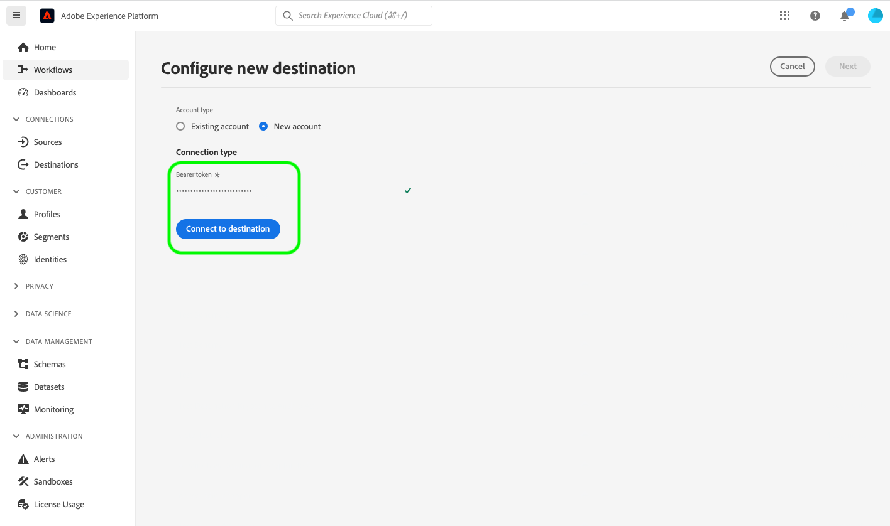

# YourDestination connection {#your-destination}

*As you go through this template, replace or delete all the paragraphs in italics (starting with this one).*

*Start by updating the metadata (title and description) at the top of the page. Please ignore all instances of UICONTROL on this page. This is a tag that helps our machine translation processes correctly translate the page into the multiple languages that we support. We will add tags to your documentation after you submit it.*

>[!IMPORTANT]
>
>* Fill in all the sections in this template, in the order in which they are outlined in the template.
>* This template is updated infrequently, based on partner feedback. Before you begin authoring documentation for your destination, make sure that you have downloaded the [latest version of the template](../assets/docs-framework/yourdestination-template.zip).

## Overview {#overview}

*Provide a short overview of your company, including the value it provides to customers. Include a link to your product documentation homepage, for further reading.*

>[!IMPORTANT]
>
>This destination connector and documentation page are created and maintained by the *YourDestination* team. For any inquiries or update requests, please contact them directly at *Insert link or email address where you can be reached for updates, for example `support@YourDestination.com`.*

## Use cases {#use-cases}

To help you better understand how and when you should use the *YourDestination* destination, here are sample use cases that Adobe Experience Platform customers can solve by using this destination.

### Use case #1 {#use-case-1}

*For mobile messaging platforms:*

*A home rental and sales platform wants to push mobile notifications to customers' Android and iOS devices to let them know that there are 100 updated listings in the area where they previously searched for a rental.*

### Use case #2 {#use-case-2}

*For social network platforms:*

*An athletic apparel brand wants to reach existing customers through their social media accounts. The apparel brand can ingest email addresses from their own CRM to Adobe Experience Platform, build audiences from their own offline data, and send these audiences to YourDestination, to display ads in their customers' social media feeds.*

## Prerequisites {#prerequisites}

*Add information in this section about anything that customers need to be aware of before starting to set up the destination in the Adobe Experience Platform user interface. This can be about:*

* *needing to be added to an allow list*
* *requirements for email hashing*
* *any account specifics on your side*
* *how to obtain an API key to connect to your platform*

*You can link out to your relevant documentation if that would be useful to customers.*

## Supported identities {#supported-identities}

*Add information in this section about the identities supported by your destination. We have prefilled the table with some standard values. Delete the values that don't apply to your destination and any values that are not prefilled.*

*YourDestination* supports the activation of identities described in the table below. Learn more about [identities](/help/identity-service/namespaces.md).

|Target Identity|Description|Considerations|
|---|---|---|
|GAID|Google Advertising ID|Select the GAID target identity when your source identity is a GAID namespace.|
|IDFA|Apple ID for Advertisers|Select the IDFA target identity when your source identity is an IDFA namespace.|
|ECID|Experience Cloud ID|A namespace that represents ECID. This namespace can also be referred to by the following aliases: "Adobe Marketing Cloud ID", "Adobe Experience Cloud ID", "Adobe Experience Platform ID". Read the following document on [ECID](/help/identity-service/ecid.md) for more information.|
|phone_sha256|Phone numbers hashed with the SHA256 algorithm|Both plain text and SHA256 hashed phone numbers are supported by Adobe Experience Platform. When your source field contains unhashed attributes, check the **[!UICONTROL Apply transformation]** option, to have [!DNL Platform] automatically hash the data on activation.|
|email_lc_sha256|Email addresses hashed with the SHA256 algorithm|Both plain text and SHA256 hashed email addresses are supported by Adobe Experience Platform. When your source field contains unhashed attributes, check the **[!UICONTROL Apply transformation]** option, to have [!DNL Platform] automatically hash the data on activation.|
|extern_id|Custom user IDs|Select this target identity when your source identity is a custom namespace.|

{style="table-layout:auto"}

## Supported audiences {#supported-audiences}

*Add information in this section about the audiences supported by your destination. We have prefilled the table with some standard values. Use the `✓` and `X` characters to mark whether your audience type is supported by this destination.*

This section describes which type of audiences you can export to this destination.

| Audience origin | Supported | Description | 
---------|----------|----------|
| [!DNL Segmentation Service] | ✓ | Audiences generated through the Experience Platform [Segmentation Service](../../../segmentation/home.md).|
| Custom uploads | X | Audiences [imported](../../../segmentation/ui/overview.md#import-audience) into Experience Platform from CSV files. |

{style="table-layout:auto"}

## Export type and frequency {#export-type-frequency}

*In the table, keep only the lines that correspond to your destination. You should have one line for Export type and one line for Export frequency. Delete the values that don't apply to your destination.*

Refer to the table below for information about the destination export type and frequency.

| Item | Type | Notes |
---------|----------|---------|
| Export type | **[!UICONTROL Audience export]** | You are exporting all members of an audience with the identifiers (name, phone number, or others) used in the *YourDestination* destination.|
| Export type | **[!UICONTROL Profile-based]** | You are exporting all members of a segment, together with the desired schema fields (for example: email address, phone number, last name), as chosen in the select profile attributes screen of the [destination activation workflow](/help/destinations/ui/activate-batch-profile-destinations.md#select-attributes).|
| Export type | **[!UICONTROL Dataset export]** | You are exporting raw datasets, which are not grouped or structured by audience interests or qualifications.|
| Export frequency | **[!UICONTROL Streaming]** | Streaming destinations are "always on" API-based connections. As soon as a profile is updated in Experience Platform based on audience evaluation, the connector sends the update downstream to the destination platform. Read more about [streaming destinations](/help/destinations/destination-types.md#streaming-destinations).|
| Export frequency | **[!UICONTROL Batch]** | Batch destinations export files to downstream platforms in increments of three, six, eight, twelve, or twenty-four hours. Read more about [batch file-based destinations](/help/destinations/destination-types.md#file-based).|

{style="table-layout:auto"}

## Connect to the destination {#connect}

>[!IMPORTANT]
> 
>To connect to the destination, you need the **[!UICONTROL Manage Destinations]** [access control permission](/help/access-control/home.md#permissions). Read the [access control overview](/help/access-control/ui/overview.md) or contact your product administrator to obtain the required permissions.

To connect to this destination, follow the steps described in the [destination configuration tutorial](../../ui/connect-destination.md). In the configure destination workflow, fill in the fields listed in the two sections below.

### Authenticate to destination {#authenticate}

*Add the fields that customers must fill in when authenticating to your destination. These fields are destination-specific and depend on your configuration in Destination SDK. Your destination's fields may not be the same as the ones listed below. Please also include a screenshot similar to the sample screenshot shown below.*

To authenticate to the destination, fill in the required fields and select **[!UICONTROL Connect to destination]**.



* **[!UICONTROL Bearer token]**: Fill in the bearer token to authenticate to the destination.

### Fill in destination details {#destination-details}

*Add the fields that customers must fill in when configuring a new destination. These fields are destination-specific and depend on your configuration in Destination SDK. Your destination's fields may not be the same as the ones listed below. Please also include a screenshot similar to the sample screenshot shown below.*

To configure details for the destination, fill in the required and optional fields below. An asterisk next to a field in the UI indicates that the field is required.


*  **[!UICONTROL Name]**: A name by which you will recognize this destination in the future.
*  **[!UICONTROL Description]**: A description that will help you identify this destination in the future.
*  **[!UICONTROL Account ID]**: Your *YourDestination* account ID.

### Enable alerts {#enable-alerts}

You can enable alerts to receive notifications on the status of the dataflow to your destination. Select an alert from the list to subscribe to receive notifications on the status of your dataflow. For more information on alerts, read the guide on [subscribing to destinations alerts using the UI](../../ui/alerts.md).

When you are finished providing details for your destination connection, select **[!UICONTROL Next]**.

## Activate audiences to this destination {#activate}

>[!IMPORTANT]
> 
>* To activate data, you need the **[!UICONTROL Manage Destinations]**, **[!UICONTROL Activate Destinations]**, **[!UICONTROL View Profiles]**, and **[!UICONTROL View Segments]** [access control permissions](/help/access-control/home.md#permissions). Read the [access control overview](/help/access-control/ui/overview.md) or contact your product administrator to obtain the required permissions.
>* To export *identities*, you need the **[!UICONTROL View Identity Graph]** [access control permission](/help/access-control/home.md#permissions). <br> {width="100" zoomable="yes"}

*Delete as appropriate - If you are documenting a new streaming destination, keep the first paragraph below. If you are documenting a new file-based destination, keep the second paragraph. If you are documenting a destination that exports datasets, keep the third paragraph.*

Read [Activate profiles and audiences to streaming audience export destinations](/help/destinations/ui/activate-segment-streaming-destinations.md) for instructions on activating audiences to this destination.

Read [Activate audience data to batch profile export destinations](/help/destinations/ui/activate-batch-profile-destinations.md) for instructions on activating audiences to this destination.

Read [(Beta) Export datasets](/help/destinations/ui/export-datasets.md) for extensive instructions on exporting datasets to this destination.

### Map attributes and identities {#map}

*Add information about supported mappings between source and target fields in the Mapping step of the activation workflow. Your destination might support exporting profile attributes, identity namespaces, or both. Some fields might be mandatory. Target attributes might be predefined or custom. Call out the important caveats and use examples, preferably with screenshots. Two examples of destination pages which you can use as reference are:* 

* *[Pega](/help/destinations/catalog/personalization/pega.md#mapping-example)*
* *[Medallia](/help/destinations/catalog/voice/medallia-connector.md#map)*

## Exported data / Validate data export {#exported-data}

*Add a paragraph about how data is exported to your destination. This would help the customer make sure that they have correctly integrated with your destination. For example, you could provide a sample JSON like the one below. Or, you could provide screenshots and information from your destination's interface that show how customers should expect audiences to be populating in the destination platform.*

```
{
  "person": {
    "email": "yourstruly@adobe.com"
  },
  "segmentMembership": {
    "ups": {
      "7841ba61-23c1-4bb3-a495-00d3g5fe1e93": {
        "lastQualificationTime": "2020-05-25T21:24:39Z",
        "status": "exited"
      },
      "59bd2fkd-3c48-4b18-bf56-4f5c5e6967ae": {
        "lastQualificationTime": "2020-05-25T23:37:33Z",
        "status": "realized"
      }
    }
  },
  "identityMap": {
    "ecid": [
      {
        "id": "14575006536349286404619648085736425115"
      },
      {
        "id": "66478888669296734530114754794777368480"
      }
    ],
    "email_lc_sha256": [
      {
        "id": "655332b5fa2aea4498bf7a290cff017cb4"
      },
      {
        "id": "66baf76ef9de8b42df8903f00e0e3dc0b7"
      }
    ]
  }
}

```

## Data usage and governance {#data-usage-governance}

All [!DNL Adobe Experience Platform] destinations are compliant with data usage policies when handling your data. For detailed information on how [!DNL Adobe Experience Platform] enforces data governance, read the [Data Governance overview](/help/data-governance/home.md).

## Additional resources {#additional-resources}

*You can provide further links to your product documentation or any other resources that you consider important for the customer to be successful.*