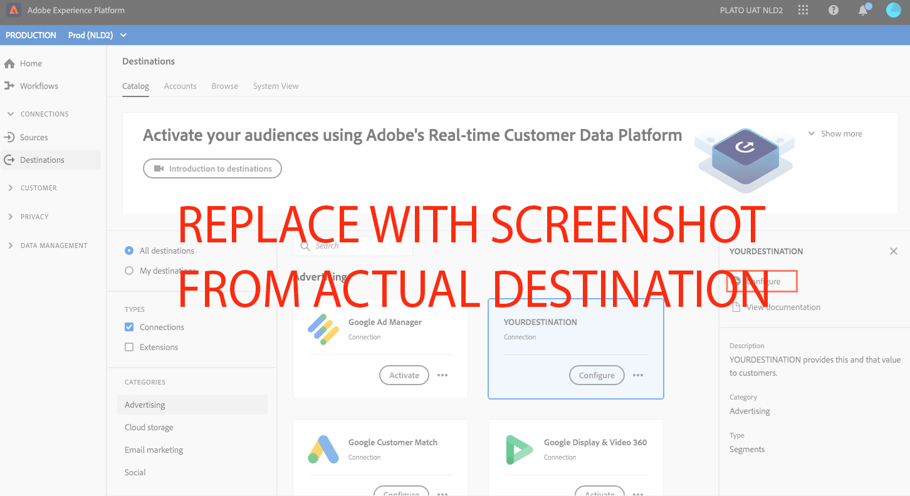
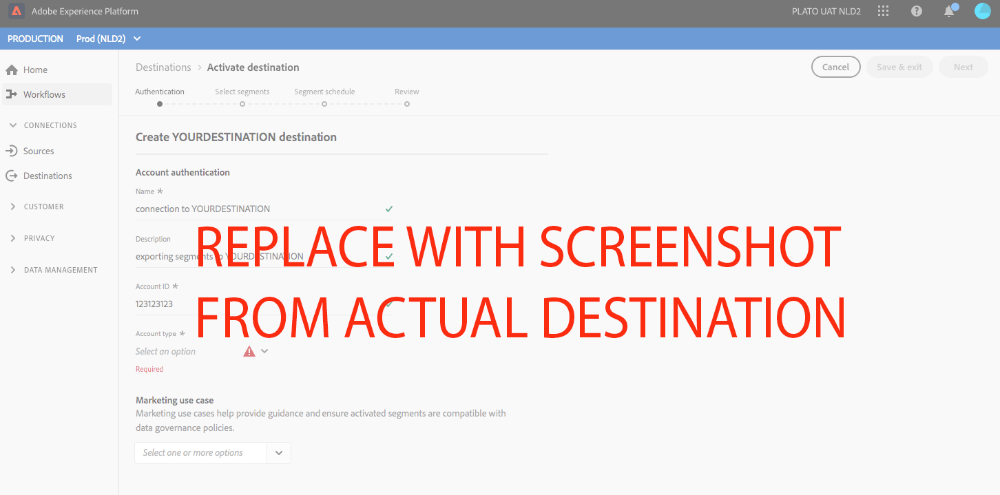
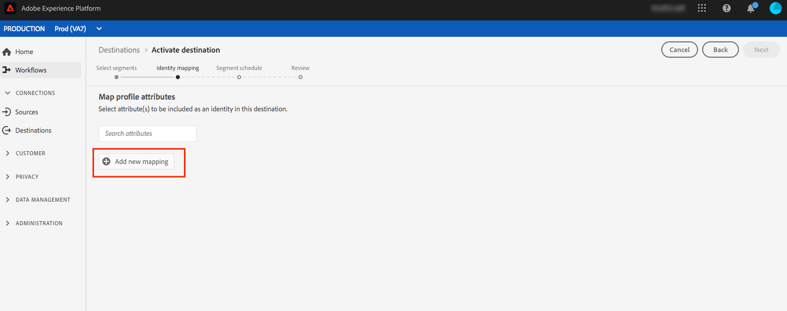
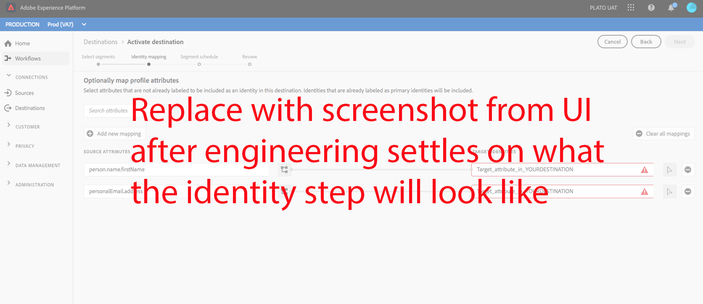

# YOURDESTINATION {#your-destination}

*As you go through this template, replace or delete all the paragraphs in italics (starting with this one).*

*Start by updating the metadata (title and description) at the top of the page. Please ignore all instances of UICONTROL on this page. This is a tag that helps our machine translation processes correctly translate the page into the multiple languages that we support. We will add tags to your documentation after you submit it.*

## Overview {#overview}

*Provide a short overview of your company, including the value it provides to customers. Include a link to your product documentation homepage, for further reading.*

>[!IMPORTANT]
>
>This documentation page was created by the *YOURDESTINATION* team. For any inquiries or update requests, please contact them directly at *Insert link or email address where you can be reached for updates, for example `support@yourdestination.com`.*

## Use cases {#use-cases}

To help you better understand how and when you should use the *YOURDESTINATION* destination, here are sample use cases that Adobe Experience Platform customers can solve by using this destination.

### Use case #1

*For mobile messaging platforms:*

*A home rental and sales platform wants to push mobile notifications to customers' Android and iOS devices to let them know that there are 100 updated listings in the area where they previously searched for a rental.*

### Use case #2

*For social network platforms:*

*An athletic apparel brand wants to reach existing customers through their social media accounts. The apparel brand can ingest email addresses from their own CRM to Adobe Experience Platform, build segments from their own offline data, and send these segments to YOURDESTINATION, to display ads in their customers' social media feeds.*

## Prerequisites {#prerequisites}

*Add information in this section about anything that customers need to be aware of before starting to set up the destination in the Adobe Experience Platform user interface. This can be about:*

* *needing to be added to an allow list*
* *requirements for email hashing*
* *any account specifics on your side*
* *how to obtain an API key to connect to your platform*

*You can link out to your relevant documentation if that would be useful to customers.*

## Supported identities {#supported-identities}

*Add information in this section about the identities supported by your destination. We have prefilled the table with some standard values. Delete the values that don't apply to your destination and any values that are not prefilled.*

*YOURDESTINATION* supports the activation of identities described in the table below. Learn more about [identities](/help/identity-service/namespaces.md).

|Target Identity|Description|Considerations|
|---|---|---|
|GAID|Google Advertising ID|Select the GAID target identity when your source identity is a GAID namespace.|
|IDFA|Apple ID for Advertisers|Select the IDFA target identity when your source identity is an IDFA namespace.|
|ECID|Experience Cloud ID|A namespace that represents ECID. This namespace can also be referred to by the following aliases: “Adobe Marketing Cloud ID”, “Adobe Experience Cloud ID”, “Adobe Experience Platform ID”. See the following document on [ECID](/help/identity-service/ecid.md) for more information.|
|phone_sha256|Phone numbers hashed with the SHA256 algorithm|Both plain text and SHA256 hashed phone numbers are supported by Adobe Experience Platform. When your source field contains unhashed attributes, check the **[!UICONTROL Apply transformation]** option, to have [!DNL Platform] automatically hash the data on activation.|
|email_lc_sha256|Email addresses hashed with the SHA256 algorithm|Both plain text and SHA256 hashed email addresses are supported by Adobe Experience Platform. When your source field contains unhashed attributes, check the **[!UICONTROL Apply transformation]** option, to have [!DNL Platform] automatically hash the data on activation.|
|extern_id|Custom user IDs|Select this target identity when your source identity is a custom namespace.|

{style="table-layout:auto"}

## Export type and frequency {#export-type-frequency}

*In the table, keep only the lines that correspond to your destination. You should have one line for Export type and one line for Export frequency. Delete the values that don't apply to your destination.*

Refer to the table below for information about the destination export type and frequency.

| Item | Type | Notes |
---------|----------|---------|
| Export type | **[!UICONTROL Segment export]** | You are exporting all members of a segment (audience) with the identifiers (name, phone number, or others) used in the *YOURDESTINATION* destination.|
| Export type | **[!UICONTROL Profile-based]** | You are exporting all members of a segment, together with the desired schema fields (for example: email address, phone number, last name), as chosen in the select profile attributes screen of the [destination activation workflow](/help/destinations/ui/activate-batch-profile-destinations.md#select-attributes).|
| Export frequency | **[!UICONTROL Streaming]** | Streaming destinations are "always on" API-based connections. As soon as a profile is updated in Experience Platform based on segment evaluation, the connector sends the update downstream to the destination platform. Read more about [streaming destinations](/help/destinations/destination-types.md#streaming-destinations).|
| Export frequency | **[!UICONTROL Batch]** | Batch destinations export files to downstream platforms in increments of three, six, eight, twelve, or twenty-four hours. Read more about [batch file-based destinations](/help/destinations/destination-types.md#file-based).|

{style="table-layout:auto"}

## Connect to the destination {#connect}

To connect to this destination, follow the steps described in the [destination configuration tutorial](https://experienceleague.adobe.com/docs/experience-platform/destinations/ui/connect-destination.html). In the configure destination workflow, fill in the fields listed in the two sections below.

### Authenticate to destination {#authenticate}

*Add the fields that customers must fill in when authenticating to your destination. These fields are destination-specific and depend on your configuration in Destination SDK. Your destination's fields may not be the same as the ones listed below. Please also include a screenshot similar to the sample screenshot shown below.*

To authenticate to the destination, fill in the required fields and select **[!UICONTROL Connect to destination]**.


* **[!UICONTROL Bearer token]**: Fill in the bearer token to authenticate to the destination.

### Fill in destination details {#destination-details}

*Add the fields that customers must fill in when configuring a new destination. These fields are destination-specific and depend on your configuration in Destination SDK. Your destination's fields may not be the same as the ones listed below. Please also include a screenshot similar to the sample screenshot shown below.*

To configure details for the destination, fill in the required fields and select **[!UICONTROL Next]**.


*  **[!UICONTROL Name]**: A name by which you will recognize this destination in the future.
*  **[!UICONTROL Description]**: A description that will help you identify this destination in the future.
*  **[!UICONTROL Account ID]**: Your *YOURDESTINATION* account ID.


<!--

*Replace YOURDESTINATION with your destination name and TOBEFILLEDIN with the category that your destination belongs to.*

1. In **[!UICONTROL Destinations]** > **[!UICONTROL Catalog]**, scroll to the ***TOBEFILLEDIN*** category. Select ***YOURDESTINATION***, then select **[!UICONTROL Configure]**.


    >[!NOTE]
    >
    >If a connection with this destination already exists, you can see an **[!UICONTROL Activate]** button on the destination card. For more information about the difference between **[!UICONTROL Activate]** and **[!UICONTROL Configure]**, refer to the [Catalog](https://experienceleague.adobe.com/docs/experience-platform/destinations/ui/destinations-workspace.html#catalog) section of the destination workspace documentation.  

    

2. In the **Account** step, if you had previously set up a connection to your *YOURDESTINATION* destination, select **[!UICONTROL Existing Account]** and select your existing connection. Or, you can select **[!UICONTROL New Account]** to set up a new connection to *YOURDESTINATION*. Select **[!UICONTROL Connect to destination]** to log in and connect Adobe Experience Cloud to your *YOURDESTINATION* account.

    >[!NOTE]
    >
    >Adobe Experience Platform supports credentials validation in the authentication process and displays an error message if you input incorrect credentials to your ***YOURDESTINATION*** account. This ensures that you don't complete the workflow with incorrect credentials.

3. Once your credentials are confirmed and Adobe Experience Cloud is connected to your ***YOURDESTINATION*** account, you can select **[!UICONTROL Next]** to proceed to the **[!UICONTROL Setup]** step.

4. In the **[!UICONTROL Authentication]** step, enter a **[!UICONTROL Name]** and a **[!UICONTROL Description]** for your activation flow and fill your account ID. <br> Also in this step, you can select any marketing action that should apply to this destination. Marketing actions indicate the intent for which data will be exported to the destination. You can select from Adobe-defined marketing actions or you can create your own marketing action. For more information about marketing actions, see the [Data usage policies overview](https://experienceleague.adobe.com/docs/experience-platform/data-governance/policies/overview.html).

    

5. Your destination is now created. You can select **[!UICONTROL Save & Exit]** if you want to activate segments later on or you can select **[!UICONTROL Next]** to continue the workflow and select segments to activate. In either case, see the next section, [Activate segments](#activate-segments), for the rest of the workflow.

-->

## Activate segments to this destination {#activate}

Read [Activate profiles and segments to streaming segment export destinations](https://experienceleague.adobe.com/docs/experience-platform/destinations/ui/activate/activate-segment-streaming-destinations.html?lang=en) for instructions on activating audience segments to this destination.

<!--

To activate segments to *YOURDESTINATION*, follow the steps below: 

1. In **[!UICONTROL Destinations > Browse]**, select the *YOURDESTINATION* destination where you want to activate your segments.

2. Click the name of the destination. This takes you to the Activate flow.
    
    Note that if an activation flow already exists for a destination, you can see the segments that are currently being sent to the destination. Select **[!UICONTROL Edit activation]** in the right rail and follow the steps below to modify the activation details.
3. Select **[!UICONTROL Activate]**;
4. In the **[!UICONTROL Activate destination]** workflow, on the **[!UICONTROL Select Segments]** page, select which segments to send to *YOURDESTINATION*.
    
5.  In the **[!UICONTROL Mapping]** step, select which attributes and identities from the source XDM schema to map to the target schema. Select **[!UICONTROL Add new mapping]** and browse your schema, select identity namespaces and map them to the corresponding target identity.  
 <br>&nbsp;
   *Plain text email address as primary identity*: If you have plain text (unhashed) email addresses as primary identity in your schema, select the email field in your **[!UICONTROL Source Attributes]** and map to the Email field in the right column under **[!UICONTROL Target Identities]**, as shown below. Set up a mapping between any other attributes you plan to use.
    <br>&nbsp;
6. On the **[!UICONTROL Segment schedule]** page, you can set the start date for sending data to the destination.
7. On the **[!UICONTROL Review]** page, you can see a summary of your selection. Select **[!UICONTROL Cancel]** to break up the flow, **[!UICONTROL Back]** to modify your settings, or **[!UICONTROL Finish]** to confirm your selection and start sending data to the destination.

>[!IMPORTANT]
>
>In this step, Adobe Experience Platform checks for data usage policy violations. Shown below is an example where a policy is violated. You cannot complete the segment activation workflow until you have resolved the violation. For information on how to resolve policy violations, see [Policy enforcement](https://experienceleague.adobe.com/docs/experience-platform/data-governance/enforcement/auto-enforcement.html#enforcement) in the data governance documentation section.
 


If no policy violations have been detected, select **[!UICONTROL Finish]** to confirm your selection and start sending data to the destination.


-->

## Exported data / Validate data export {#exported-data}

*Add a paragraph about how data is exported to your destination. This would help the customer make sure that they have correctly integrated with your destination. For example, you could provide a sample JSON like the one below. Or, you could provide screenshots and information from your destination's interface that show how customers should expect segments to be populating in the destination platform.*

```
{
  "person": {
    "email": "yourstruly@adobe.com"
  },
  "segmentMembership": {
    "ups": {
      "7841ba61-23c1-4bb3-a495-00d3g5fe1e93": {
        "lastQualificationTime": "2020-05-25T21:24:39Z",
        "status": "exited"
      },
      "59bd2fkd-3c48-4b18-bf56-4f5c5e6967ae": {
        "lastQualificationTime": "2020-05-25T23:37:33Z",
        "status": "existing"
      }
    }
  },
  "identityMap": {
    "ecid": [
      {
        "id": "14575006536349286404619648085736425115"
      },
      {
        "id": "66478888669296734530114754794777368480"
      }
    ],
    "email_lc_sha256": [
      {
        "id": "655332b5fa2aea4498bf7a290cff017cb4"
      },
      {
        "id": "66baf76ef9de8b42df8903f00e0e3dc0b7"
      }
    ]
  }
}

```

## Data usage and governance {#data-usage-governance}

All [!DNL Adobe Experience Platform] destinations are compliant with data usage policies when handling your data. For detailed information on how [!DNL Adobe Experience Platform] enforces data governance, read the [Data Governance overview](/help/data-governance/home.md).

## Additional resources {#additional-resources}

*You can provide further links to your product documentation or any other resources that you consider important for the customer to be successful.*