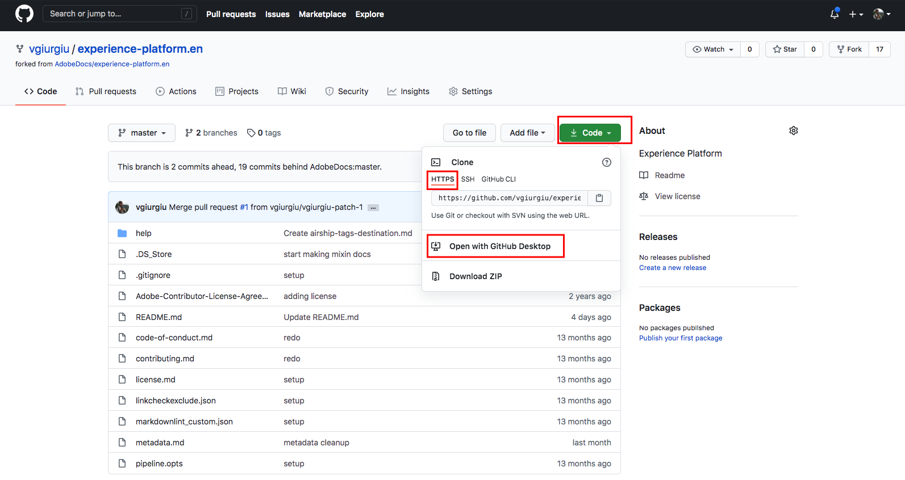
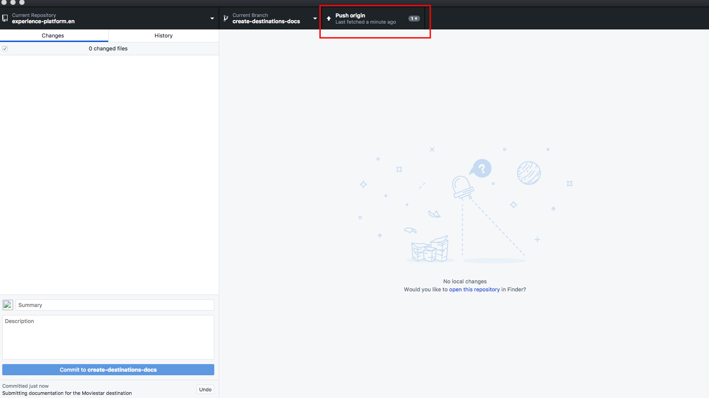
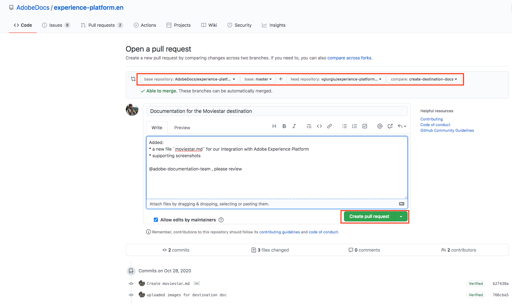
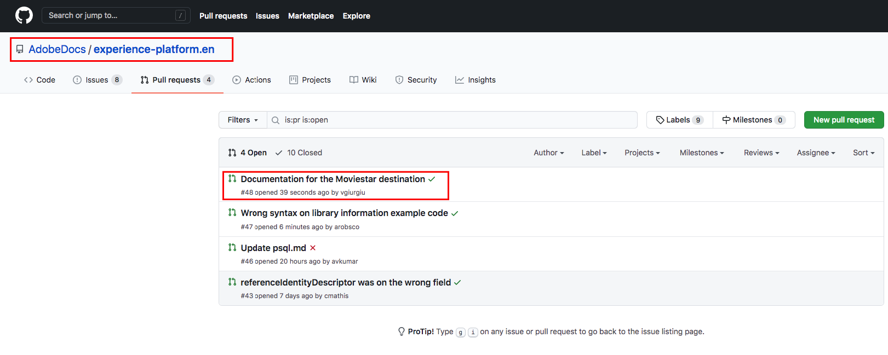

# Use a text editor in your local environment to create a destination documentation page {#local-authoring}

The instructions on this page show you how to use a text editor to work in your local environment to author documentation and submit a pull request (PR). Before going through the steps indicated here, make sure you read [Document your destination in Adobe Experience Platform Destinations](./documentation-instructions.md).

>[!TIP]
>
>Refer also to the supporting documentation in Adobe's contributor guide:
>* [Install Git and Markdown Authoring tools](https://experienceleague.adobe.com/docs/contributor/contributor-guide/setup/install-tools.html)
>* [Set up Git repository locally for documentation](https://experienceleague.adobe.com/docs/contributor/contributor-guide/setup/local-repo.html)
>* [GitHub contribution workflow for major changes](https://experienceleague.adobe.com/docs/contributor/contributor-guide/setup/full-workflow.html).

## Connect to GitHub and set up your local authoring environment {#set-up-environment}

1. In your browser, navigate to `https://github.com/AdobeDocs/experience-platform.en`
2. To [fork](https://experienceleague.adobe.com/docs/contributor/contributor-guide/setup/local-repo.html#fork-the-repository) the repository, click **Fork** as shown below. This creates a copy of the Experience Platform repository in your own GitHub account.

   

3. Clone the repository to your local machine. Select **Code > HTTPS > Open with GitHub Desktop**, as shown below. Make sure you have [GitHub Desktop](https://desktop.github.com/) installed. For further reference, read [Create a local clone of the repository](https://experienceleague.adobe.com/docs/contributor/contributor-guide/setup/local-repo.html#create-a-local-clone-of-the-repository) in the Adobe contributor guide.

   

4. In your local file structure, navigate to `experience-platform.en/help/destinations/catalog/[...]`, where `[...]` is the desired category for your destination. For example, if you are adding a personalization destination to Experience Platform, select the `personalization` folder.

## Author the documentation page for your destination {#author-documentation}

1. Your documentation page is based on the [self-service destination template](../docs-framework/self-service-template.md). Download the [destination template](../assets/docs-framework/yourdestination-template.zip). Unzip it and extract the file `yourdestination-template.md` to the directory mentioned in step 4 above.  Rename the file `YOURDESTINATION.md`, where YOURDESTINATION is the name of your destination in Adobe Experience Platform. For example, if your company is called Moviestar, you would name your file `moviestar.md`.
2. Open your new file in your [text editor of choice](https://experienceleague.adobe.com/docs/contributor/contributor-guide/setup/install-tools.html#understand-markdown-editors). Adobe recommends that you use [Visual Studio Code](https://code.visualstudio.com/) and install the Adobe Markdown Authoring extension. To install the extension, open Visual Studio Code, select the **[!DNL Extensions]** tab on the left of the screen, and search for `adobe markdown authoring`. Select the extension and click **[!DNL Install]**.
   
3. Edit the template with relevant information for your destination. Follow the instructions in the template. 
4.  For any screenshots or images that you plan on adding to your documentation, go to `GitHub/experience-platform.en/help/destinations/assets/catalog/[...]`, where `[...]` is the desired category for your destination. For example, if you are adding a personalization destination to Experience Platform, select the `personalization` folder. Create a new folder for your destination and save your images here. You must link to them from the page you are authoring. See [instructions how to link to images](https://experienceleague.adobe.com/docs/contributor/contributor-guide/writing-essentials/linking.html#link-to-images).
5.  When you are ready, save the file you are working on.

## Submit your documentation for review {#submit-review}

>[!TIP]
>
>Note that there is nothing you can break here. By following the instructions in this section, you are simply suggesting a documentation update. Your suggested update will be approved or edited by the Adobe Experience Platform documentation team.

1.  In GitHub Desktop, create a working branch for your updates and select **Publish branch** to publish the branch to GitHub.
   
   

1. In GitHub Desktop, [commit](https://docs.github.com/en/free-pro-team@latest/github/getting-started-with-github/github-glossary#commit) your work, as shown below.

   

1. In GitHub Desktop, [push](https://docs.github.com/en/free-pro-team@latest/github/getting-started-with-github/github-glossary#push) your work to the [remote](https://docs.github.com/en/free-pro-team@latest/github/getting-started-with-github/github-glossary#remote) branch, as shown below.

   

1. In the GitHub web interface, open a pull request (PR) to merge your working branch into the master branch of the Adobe documentation repository. Make sure the branch you worked on is selected and select **Contribute > Open pull request**.

   

1. Make sure that the base and compare branches are correct. Add a note to the PR, describing your update, and select **Create pull request**. This opens a PR to merge the working branch of your fork into the master branch of the Adobe repository.
   >[!TIP]
   >
   >Leave the **Allow edits by maintainers** checkbox selected so that the Adobe documentation team can make edits to the PR. 
 
   

1. At this point, a notification appears that prompts you to sign the Adobe Contributor License Agreement (CLA). This is a mandatory step. After you sign the CLA, refresh the PR page and submit the pull request.

1.  You can confirm that the pull request has been submitted by inspecting the **Pull requests** tab in `https://github.com/AdobeDocs/experience-platform.en`.

   

1. Thank you! The Adobe documentation team will reach out in the PR in case any edits are required and to let you know when the documentation will be published.

>[!TIP]
>
>To add images and links to your documentation, and for any other questions around Markdown, read [Using Markdown](https://experienceleague.adobe.com/docs/contributor/contributor-guide/writing-essentials/markdown.html) in Adobe's collaborative writing guide.
