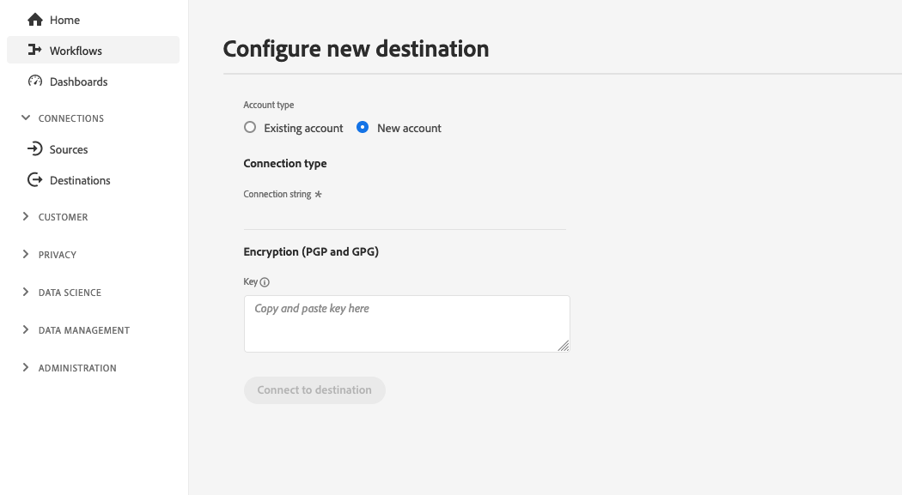

# (Beta) File-based destination configuration {#destination-configuration}

## Overview {#overview}

>[!IMPORTANT]
>
>File-based destination support in Adobe Experience Platform Destination SDK is currently in Beta. The documentation and functionality are subject to change.

This configuration allows you to indicate essential information for your file-based destination, like your destination name, category, description, and more. The settings in this configuration also determine how Experience Platform users authenticate to your destination, how it appears in the Experience Platform user interface and the identities that can be exported to your destination.

This configuration also connects the other configurations required for your destination to work - destination server and audience metadata - to this one. Read how you can reference the two configurations in a [section further below](./destination-configuration.md#connecting-all-configurations).

You can configure the functionality described in this document by using the `/authoring/destinations` API endpoint. Read [Destinations API endpoint operations](./destination-configuration-api.md) for a complete list of operations you can perform on the endpoint.

## Amazon S3 destination configuration example {#batch-example-configuration}

```json
{
   "name":"S3 Destination with CSV Options",
   "description":"S3 Destination with CSV Options",
   "status":"TEST",
   "maxProfileAttributes": "2000",
   "maxIdentityAttributes": "10",
   "customerAuthenticationConfigurations":[
      {
         "authType":"S3"
      }
   ],
   "customerEncryptionConfigurations":[],
   "customerDataFields":[
      {
         "name":"bucket",
         "title":"Amazon S3 bucket name",
         "description":"Enter your Amazon S3 bucket name",
         "type":"string",
         "isRequired":true,
         "readOnly":false,
         "hidden":false
      },
      {
         "name":"path",
         "title":"Amazon S3 bucket path",
         "description":"Enter your S3 bucket path",
         "type":"string",
         "isRequired":true,
         "pattern":"^[A-Za-z]+$",
         "readOnly":false,
         "hidden":false
      },
      {
         "name":"sep",
         "title":"Enter a separator for each field and value",
         "description":"Enter a separator character for each field and value",
         "type":"string",
         "isRequired":false,
         "readOnly":false,
         "hidden":false
      },
      {
         "name":"encoding",
         "title":"Specify encoding (charset) of saved CSV files",
         "description":"Select encoding of csv files",
         "type":"string",
         "enum":[
            "UTF-8",
            "UTF-16"
         ],
         "isRequired":false,
         "readOnly":false,
         "hidden":false
      },
      {
         "name":"quote",
         "title":"Select a single character used for escaping quoted values",
         "description":"Select single charachter for escaping quoted values",
         "type":"string",
         "isRequired":false,
         "readOnly":false,
         "hidden":false
      },
      {
         "name":"quoteAll",
         "title":"Escape all quoted values",
         "description":"Select whether to escape all quoted values",
         "type":"string",
         "enum":[
            "true",
            "false"
         ],
         "default":"true",
         "isRequired":true,
         "readOnly":false,
         "hidden":false
      },
      {
         "name":"escape",
         "title":"Select a single character used for escaping quotes",
         "description":"Select a single character used for escaping quotes inside an already quoted value",
         "type":"string",
         "isRequired":false,
         "readOnly":false,
         "hidden":false
      },
      {
         "name":"escapeQuotes",
         "title":"Escape quotes",
         "description":"A flag indicating whether values containing quotes should always be enclosed in quotes",
         "type":"string",
         "enum":[
            "true",
            "false"
         ],
         "isRequired":false,
         "default":"true",
         "readOnly":false,
         "hidden":false
      },
      {
         "name":"header",
         "title":"header",
         "description":"Writes the names of columns as the first line.",
         "type":"string",
         "isRequired":false,
         "enum":[
            "true",
            "false"
         ],
         "readOnly":false,
         "default":"true",
         "hidden":false
      },
      {
         "name":"ignoreLeadingWhiteSpace",
         "title":"Ignore leading white space",
         "description":"A flag indicating whether or not leading whitespaces from values being written should be skipped.",
         "type":"string",
         "isRequired":false,
         "enum":[
            "true",
            "false"
         ],
         "readOnly":false,
         "default":"true",
         "hidden":false
      },
      {
         "name":"nullValue",
         "title":"Select the string representation of a null value",
         "description":"Sets the string representation of a null value. ",
         "type":"string",
         "isRequired":false,
         "readOnly":false,
         "hidden":false
      },
      {
         "name":"dateFormat",
         "title":"Date format",
         "description":"Select the string that indicates a date format. ",
         "type":"string",
         "default":"yyyy-MM-dd",
         "isRequired":false,
         "readOnly":false,
         "hidden":false
      },
      {
         "name":"charToEscapeQuoteEscaping",
         "title":"Char to escape quote escaping",
         "description":"Sets a single character used for escaping the escape for the quote character",
         "type":"string",
         "isRequired":false,
         "readOnly":false,
         "hidden":false
      },
      {
         "name":"emptyValue",
         "title":"Select the string representation of an empty value",
         "description":"Select the string representation of an empty value",
         "type":"string",
         "isRequired":false,
         "readOnly":false,
         "default":"",
         "hidden":false
      },
      {
         "name":"compression",
         "title":"Select compression",
         "description":"Select compressiont",
         "type":"string",
         "isRequired":true,
         "readOnly":false,
         "enum":[
            "SNAPPY",
            "GZIP",
            "DEFLATE",
            "NONE"
         ]
      },
      {
         "name":"fileType",
         "title":"Select a fileType",
         "description":"Select fileType",
         "type":"string",
         "isRequired":true,
         "readOnly":false,
         "hidden":false,
         "enum":[
            "csv",
            "json",
            "parquet"
         ],
         "default":"csv"
      }
   ],
   "uiAttributes":{
      "documentationLink":"http://www.adobe.com/go/YOURDESTINATION-en",
      "category":"S3",
      "iconUrl":"https://dc5tqsrhldvnl.cloudfront.net/2/90048/da276e30c730ce6cd666c8ca78360df21.png",
      "connectionType":"S3",
      "flowRunsSupported":true,
      "monitoringSupported":true,
      "frequency":"Batch"
   },
   "destinationDelivery":[
      {
         "deliveryMatchers":[
            {
               "type":"SOURCE",
               "value":[
                  "batch"
               ]
            }
         ],
         "authenticationRule":"CUSTOMER_AUTHENTICATION",
         "destinationServerId":"{{destinationServerId}}"
      }
   ],
   "identityNamespaces": {
        "adobe_id": {
            "acceptsAttributes": true,
            "acceptsCustomNamespaces": true
        },
        "mobile_id": {
            "acceptsAttributes": true,
            "acceptsCustomNamespaces": true
        }
    },
   "segmentMappingConfig":{
       "mapExperiencePlatformSegmentName":false,
       "mapExperiencePlatformSegmentId":false,
       "mapUserInput":false,
       "audienceTemplateId":"cbf90a70-96b4-437b-86be-522fbdaabe9c"
   },
   "schemaConfig":{
      "profileFields":[
           {
              "name":"phoneNo",
              "title":"phoneNo",
              "description":"This is a fixed attribute on your destination side that customers can map profile attributes to. For example, the phoneNumber value in Experience Platform could be phoneNo on your side.",
              "type":"string",
              "isRequired":false,
              "readOnly":false,
              "hidden":false
           }
        ],
      "profileRequired":true,
      "segmentRequired":true,
      "identityRequired":true
   },
   "batchConfig":{
      "allowMandatoryFieldSelection":true,
      "allowJoinKeyFieldSelection":true,
      "defaultExportMode":"DAILY_FULL_EXPORT",
      "allowedExportMode":[
         "DAILY_FULL_EXPORT",
         "FIRST_FULL_THEN_INCREMENTAL"
      ],
      "allowedScheduleFrequency":[
         "DAILY",
         "EVERY_3_HOURS",
         "EVERY_6_HOURS",
         "EVERY_8_HOURS",
         "EVERY_12_HOURS",
         "ONCE",
         "EVERY_HOUR"
      ],
      "defaultFrequency":"DAILY",
      "defaultStartTime":"00:00"
   },
   "backfillHistoricalProfileData":true
}
```

|Parameter | Type | Description|
|---------|----------|------|
|`name` | String | Indicates the title of your destination in the Experience Platform catalog. |
|`description` | String | Provide a description for your destination card in the Experience Platform destinations catalog. Aim for no more than 4-5 sentences. |
|`status` | String | Indicates the lifecycle status of the destination card. Accepted values are `TEST`, `PUBLISHED`, and `DELETED`. Use `TEST` when you first configure your destination. |
|`maxProfileAttributes`|String|Indicates the maximum number of profile attributes customers can export to the destination. The default value is `2000`.|
|`maxIdentityAttributes`|String|Indicates the maximum number of identity namespaces customers can export to the destination. The default value is `10`.|

{style="table-layout:auto"}

## Customer authentication configurations {#customer-authentication-configurations}

This section in the destinations configuration generates the [Configure new destination](/help/destinations/ui/connect-destination.md) page in the Experience Platform user interface, where users connect Experience Platform to the accounts they have with your destination.

```json
"customerAuthenticationConfigurations": [
        {
            "authType": "S3"
        }
    ],
```

Depending on which [authentication option](authentication-configuration.md##supported-authentication-types) you indicate in the `authType` field, the Experience Platform page is generated for the users as follows:

### Amazon S3 authentication

When you configure the Amazon S3 authentication type, users are required to input the S3 credentials.


### Azure Blob authentication  {#blob}

When you configure the Azure Blob authentication type, users are required to input the connection string.



### SFTP with password authentication

When you configure the SFTP with password authentication type, users are required to input the SFTP username and password, as well as the SFTP domain and port (default port is 22).


### SFTP with SSH key authentication

When you configure the SFTP with SSH key authentication type, users are required to input the SFTP username and SSH key, as well as the SFTP domain and port (default port is 22).


## Customer data fields {#customer-data-fields}

Use this section to ask users to fill in custom fields, specific to your destination, when connecting to the destination in the Experience Platform UI.

In the example below, `customerDataFields` requires users to enter a name for their destination and provide an [!DNL Amazon S3] bucket name and folder path, as well as a compression type and file format.

```json
 "customerDataFields":[
      {
         "name":"bucket",
         "title":"Amazon S3 bucket name",
         "description":"Enter your Amazon S3 bucket name",
         "type":"string",
         "isRequired":true,
         "readOnly":false,
         "hidden":false
      },
      {
         "name":"path",
         "title":"Amazon S3 bucket path",
         "description":"Enter your S3 bucket path",
         "type":"string",
         "isRequired":true,
         "pattern":"^[A-Za-z]+$",
         "readOnly":false,
         "hidden":false
      },
      {
         "name":"sep",
         "title":"Enter a separator for each field and value",
         "description":"Enter a separator character for each field and value",
         "type":"string",
         "isRequired":false,
         "readOnly":false,
         "hidden":false
      },
      {
         "name":"encoding",
         "title":"Specify encoding (charset) of saved CSV files",
         "description":"Select encoding of csv files",
         "type":"string",
         "enum":[
            "UTF-8",
            "UTF-16"
         ],
         "isRequired":false,
         "readOnly":false,
         "hidden":false
      },
      {
         "name":"quote",
         "title":"Select a single character used for escaping quoted values",
         "description":"Select single charachter for escaping quoted values",
         "type":"string",
         "isRequired":false,
         "readOnly":false,
         "hidden":false
      },
      {
         "name":"quoteAll",
         "title":"Escape all quoted values",
         "description":"Select whether to escape all quoted values",
         "type":"string",
         "enum":[
            "true",
            "false"
         ],
         "default":"true",
         "isRequired":true,
         "readOnly":false,
         "hidden":false
      },
      {
         "name":"escape",
         "title":"Select a single character used for escaping quotes",
         "description":"Select a single character used for escaping quotes inside an already quoted value",
         "type":"string",
         "isRequired":false,
         "readOnly":false,
         "hidden":false
      },
      {
         "name":"escapeQuotes",
         "title":"Escape quotes",
         "description":"A flag indicating whether values containing quotes should always be enclosed in quotes",
         "type":"string",
         "enum":[
            "true",
            "false"
         ],
         "isRequired":false,
         "default":"true",
         "readOnly":false,
         "hidden":false
      },
      {
         "name":"header",
         "title":"header",
         "description":"Writes the names of columns as the first line.",
         "type":"string",
         "isRequired":false,
         "enum":[
            "true",
            "false"
         ],
         "readOnly":false,
         "default":"true",
         "hidden":false
      },
      {
         "name":"ignoreLeadingWhiteSpace",
         "title":"Ignore leading white space",
         "description":"A flag indicating whether or not leading whitespaces from values being written should be skipped.",
         "type":"string",
         "isRequired":false,
         "enum":[
            "true",
            "false"
         ],
         "readOnly":false,
         "default":"true",
         "hidden":false
      },
      {
         "name":"nullValue",
         "title":"Select the string representation of a null value",
         "description":"Sets the string representation of a null value. ",
         "type":"string",
         "isRequired":false,
         "readOnly":false,
         "hidden":false
      },
      {
         "name":"dateFormat",
         "title":"Date format",
         "description":"Select the string that indicates a date format. ",
         "type":"string",
         "default":"yyyy-MM-dd",
         "isRequired":false,
         "readOnly":false,
         "hidden":false
      },
      {
         "name":"charToEscapeQuoteEscaping",
         "title":"Char to escape quote escaping",
         "description":"Sets a single character used for escaping the escape for the quote character",
         "type":"string",
         "isRequired":false,
         "readOnly":false,
         "hidden":false
      },
      {
         "name":"emptyValue",
         "title":"Select the string representation of an empty value",
         "description":"Select the string representation of an empty value",
         "type":"string",
         "isRequired":false,
         "readOnly":false,
         "default":"",
         "hidden":false
      },
      {
         "name":"compression",
         "title":"Select compression",
         "description":"Select compressiont",
         "type":"string",
         "isRequired":true,
         "readOnly":false,
         "enum":[
            "SNAPPY",
            "GZIP",
            "DEFLATE",
            "NONE"
         ]
      },
      {
         "name":"fileType",
         "title":"Select a fileType",
         "description":"Select fileType",
         "type":"string",
         "isRequired":true,
         "readOnly":false,
         "hidden":false,
         "enum":[
            "csv",
            "json",
            "parquet"
         ],
         "default":"csv"
      }
```

|Parameter | Type | Description|
|---------|----------|------|
|`name` | String | Provide a name for the custom field you are introducing. |
|`title` | String | Indicates the name of the field, as it is seen by customers in the Experience Platform user interface. |
|`description` | String | Provide a description for the custom field. |
|`type` | String | Indicates what type of custom field you are introducing. Accepted values are `string`, `object`, `integer`. |
|`isRequired` | Boolean | Indicates if this field is required in the destination setup workflow. |
|`pattern` | String | Enforces a pattern for the custom field, if needed. Use regular expressions to enforce a pattern. For example, if your customer IDs don't include numbers or underscores, enter `^[A-Za-z]+$` in this field.|
|`enum` | String | Renders the custom field as a dropdown menu and lists the options available to the user.|
|`default`|String|Defines the default value from an `enum` list.|

{style="table-layout:auto"}

## UI attributes {#ui-attributes}

This section refers to the UI elements in the configuration above that Adobe should use for your destination in the Adobe Experience Platform user interface.

```json
"uiAttributes":{
      "documentationLink":"http://www.adobe.com/go/YOURDESTINATION-en",
      "category":"S3",
      "iconUrl":"https://dc5tqsrhldvnl.cloudfront.net/2/90048/da276e30c730ce6cd666c8ca78360df21.png",
      "connectionType":"S3",
      "flowRunsSupported":true,
      "monitoringSupported":true,
      "frequency":"Batch"
   }
```

|Parameter | Type | Description|
|---------|----------|------|
|`documentationLink` | String | Refers to the documentation page in the [Destinations Catalog](https://experienceleague.adobe.com/docs/experience-platform/destinations/catalog/overview.html?lang=en#catalog) for your destination. Use `http://www.adobe.com/go/destinations-YOURDESTINATION-en`, where `YOURDESTINATION` is the name of your destination. For a destination called Moviestar, you would use `http://www.adobe.com/go/destinations-moviestar-en` |
|`category` | String | Refers to the category assigned to your destination in Adobe Experience Platform. For more information, read [Destination Categories](https://experienceleague.adobe.com/docs/experience-platform/destinations/destination-types.html). Use one of the following values: `adobeSolutions, advertising, analytics, cdp, cloudStorage, crm, customerSuccess, database, dmp, ecommerce, email, emailMarketing, enrichment, livechat, marketingAutomation, mobile, personalization, protocols, social, streaming, subscriptions, surveys, tagManagers, voc, warehouses, payments`. |
|`iconUrl`|String|The URL where you hosted the icon to be displayed in the destinations catalog card.|
|`connectionType` | String | The type of connection, depending on the destination. Supported values: <ul><li>`Azure Blob`</li><li>`Azure Data Lake Storage`</li><li>`S3`</li><li>`SFTP`</li></ul>|
|`flowRunsSupported`|Boolean| Indicates whether the destination connection is included in the [flow runs UI](../../dataflows/ui/monitor-destinations.md#monitoring-destinations-dashboard). When setting this to `true`: <ul><li>The **[!UICONTROL Last dataflow run date]** and **[!UICONTROL Last dataflow run status]** are displayed in the destination browse page.</li><li>The **[!UICONTROL Dataflow runs]** and **[!UICONTROL Activation data]** tabs are displayed in the destination view page.</li></ul>|
|`monitoringSupported`|Boolean|Indicates whether the destination connection is included in the [monitoring UI](../ui/destinations-workspace.md#browse). When setting this to `true`, the **[!UICONTROL View in monitoring]** option is displayed in the destination browse page.| 
|`frequency` | String | Refers to the type of data export supported by the destination. Set to `Batch` for file-based destinations.|

{style="table-layout:auto"}

## Destination delivery {#destination-delivery}

```json
 "destinationDelivery":[
      {
         "deliveryMatchers":[
            {
               "type":"SOURCE",
               "value":[
                  "batch"
               ]
            }
         ],
         "authenticationRule":"CUSTOMER_AUTHENTICATION",
         "destinationServerId":"{{destinationServerId}}"
      }
   ]
```

|Parameter | Type | Description|
|---------|----------|------|
|`authenticationRule` | String | Indicates how [!DNL Platform] customers connect to your destination. Accepted values are `CUSTOMER_AUTHENTICATION`, `PLATFORM_AUTHENTICATION`, `NONE`. <br> <ul><li>Use `CUSTOMER_AUTHENTICATION` if Platform customers log into your system via any of the following methods: <ul><li>`"authType": "S3"`</li><li>`"authType":"AZURE_CONNECTION_STRING"`</li><li>`"authType":"AZURE_SERVICE_PRINCIPAL"`</li><li>`"authType":"SFTP_WITH_SSH_KEY"`</li><li>`"authType":"SFTP_WITH_PASSWORD"`</li></ul> </li><li> Use `PLATFORM_AUTHENTICATION` if there is a global authentication system between Adobe and your destination and the [!DNL Platform] customer does not need to provide any authentication credentials to connect to your destination. In this case, you must create a credentials object using the [Credentials](./credentials-configuration-api.md) configuration. </li><li>Use `NONE` if no authentication is required to send data to your destination platform. </li></ul> |
|`destinationServerId` | String | The `instanceId` of the [destination server configuration](./destination-server-api.md) used for this destination. |

{style="table-layout:auto"}

## Segment mapping configuration {#segment-mapping}

This section of the destination configuration relates to how segment metadata like segment names or IDs should be shared between Experience Platform and your destination.

Through the `audienceTemplateId`, this section also ties together this configuration with the [audience metadata configuration](./audience-metadata-management.md).

```json
   "segmentMappingConfig":{
       "mapExperiencePlatformSegmentName":false,
       "mapExperiencePlatformSegmentId":false,
       "mapUserInput":false,
       "audienceTemplateId":"cbf90a70-96b4-437b-86be-522fbdaabe9c"
   },
```

|Parameter | Type | Description|
|---------|----------|------|
|`mapExperiencePlatformSegmentName` | Boolean | Controls whether the segment mapping id in the destination activation workflow is the Experience Platform segment name. |
|`mapExperiencePlatformSegmentId` | Boolean | Controls whether the segment mapping id in the destination activation workflow is the Experience Platform segment ID. |
|`mapUserInput` | Boolean | Controls whether the segment mapping id in the destination activation workflow is input by user. |
|`audienceTemplateId` | Boolean | The `instanceId` of the [audience metadata template](./audience-metadata-management.md) used for this destination. To set up an audience metadata template, read the [audience metadata API reference](./audience-metadata-api.md).|

## Schema configuration in the mapping step {#schema-configuration}

Use the parameters in `schemaConfig` to enable the mapping step of the destination activation workflow. By using the parameters described below, you can determine if Experience Platform users can map profile attributes and/or identities to your file-based destination.

```json
"schemaConfig":{
      "profileFields":[
           {
              "name":"phoneNo",
              "title":"phoneNo",
              "description":"This is a fixed attribute on your destination side that customers can map profile attributes to. For example, the phoneNumber value in Experience Platform could be phoneNo on your side.",
              "type":"string",
              "isRequired":false,
              "readOnly":false,
              "hidden":false
           }
        ],
      "profileRequired":true,
      "segmentRequired":true,
      "identityRequired":true
      "requiredMappings": [
      {
          "source": "segment - 0, 1",
          "sourceType": "text/x.schema-path",
          "destination": "delete"
      },
      {
          "source": "{{metadata.segment.alias}}",
          "sourceType": "text/x.schema-path",
          "destination": "ppid"
      },
      {
          "source": "{{segmentMembership.status}}",
          "sourceType": "text/x.schema-path",
          "destination": ""
      }
    ]
}
```

|Parameter | Type | Description|
|---------|----------|------|
|`profileFields` | Array | When you add predefined `profileFields`, Experience Platform users have the option of mapping Platform attributes to the predefined attributes in your destination. |
|`profileRequired` | Boolean | Use `true` if users should be able to map profile attributes from Experience Platform to custom attributes on your destination's side, as shown in the example configuration above. |
|`segmentRequired` | Boolean | Always use `segmentRequired:true`. |
|`identityRequired` | Boolean | Use `true` if users should be able to map identity namespaces from Experience Platform to your desired schema. |
|`requiredMappings`|Object||

{style="table-layout:auto"}

### Dynamic schema configuration in the mapping step {#dynamic-schema-configuration}

Adobe Experience Platform Destination SDK supports partner-defined schemas. A partner-defined schema allows users to map profile attributes and identities to custom schemas defined by destination partners, similar to the [streaming destinations](destination-configuration.md#schema-configuration) workflow.

Use the parameters in  `dynamicSchemaConfig` to define your own schema that Platform profile attributes and/or identities can be mapped to.

```json
"schemaConfig":{
   "dynamicSchemaConfig":{
      "dynamicEnum": {
         "authenticationRule":"CUSTOMER_AUTHENTICATION",
         "destinationServerId":"{{destinationServerId}}",
         "value": "Schema Name",
         "responseFormat": "SCHEMA"
      }
   },
   "profileRequired":true,
   "segmentRequired":true,
   "identityRequired":true
}
```

|Parameter | Type | Description|
|---------|----------|------|
|`profileRequired` | Boolean | Use `true` if users should be able to map profile attributes from Experience Platform to custom attributes on your destination's side, as shown in the example configuration above. |
|`segmentRequired` | Boolean | Always use `segmentRequired:true`. |
|`identityRequired` | Boolean | Use `true` if users should be able to map identity namespaces from Experience Platform to your desired schema. |
|`destinationServerId` | String | The `instanceId` of the [destination server configuration](./destination-server-api.md) used for this destination. |
|`authenticationRule` | String | Indicates how [!DNL Platform] customers connect to your destination. Accepted values are `CUSTOMER_AUTHENTICATION`, `PLATFORM_AUTHENTICATION`, `NONE`. <br> <ul><li>Use `CUSTOMER_AUTHENTICATION` if Platform customers log into your system via any of the following methods: <ul><li>`"authType": "S3"`</li><li>`"authType":"AZURE_CONNECTION_STRING"`</li><li>`"authType":"AZURE_SERVICE_PRINCIPAL"`</li><li>`"authType":"SFTP_WITH_SSH_KEY"`</li><li>`"authType":"SFTP_WITH_PASSWORD"`</li></ul> </li><li> Use `PLATFORM_AUTHENTICATION` if there is a global authentication system between Adobe and your destination and the [!DNL Platform] customer does not need to provide any authentication credentials to connect to your destination. In this case, you must create a credentials object using the [Credentials](./credentials-configuration-api.md) configuration. </li><li>Use `NONE` if no authentication is required to send data to your destination platform. </li></ul> |
|`value`|String|The name of the schema to be displayed in the Experience Platform user interface, in the mapping step.|
|`responseFormat`|String|Always set to `SCHEMA` when defining a custom schema.|

{style="table-layout:auto"}

## Identities and attributes {#identities-and-attributes}

The parameters in this section determine which identities your destination accepts. This configuration also populates the target identities and attributes in the [mapping step](/help/destinations/ui/activate-segment-streaming-destinations.md#mapping) of the Experience Platform user interface, where users map identities and attributes from their XDM schemas to the schema in your destination.


```json
"identityNamespaces": {
        "adobe_id": {
            "acceptsAttributes": true,
            "acceptsCustomNamespaces": true
        },
        "mobile_id": {
            "acceptsAttributes": true,
            "acceptsCustomNamespaces": true
        }
    },
```

You must indicate which [!DNL Platform] identities customers are able to export to your destination. Some examples are [!DNL Experience Cloud ID], hashed email, device ID ([!DNL IDFA], [!DNL GAID]). These values are [!DNL Platform] identity namespaces that customers can map to identity namespaces from your destination. You can also indicate if customers can map custom namespaces to identities supported by your destination.

Identity namespaces do not require a 1-to-1 correspondence between [!DNL Platform] and your destination.
For instance, customers could map a [!DNL Platform] [!DNL IDFA] namespace to an [!DNL IDFA] namespace from your destination, or they can map the same [!DNL Platform] [!DNL IDFA] namespace to a [!DNL Customer ID] namespace in your destination.

## Batch configuration {#batch-configuration}

This section refers to the file export settings in the configuration above that Adobe should use for your destination in the Adobe Experience Platform user interface.

```json
 "batchConfig":{
      "allowMandatoryFieldSelection":true,
      "allowDedupeKeyFieldSelection":true,
      "defaultExportMode":"DAILY_FULL_EXPORT",
      "allowedExportMode":[
         "DAILY_FULL_EXPORT",
         "FIRST_FULL_THEN_INCREMENTAL"
      ],
      "allowedScheduleFrequency":[
         "DAILY",
         "EVERY_3_HOURS",
         "EVERY_6_HOURS",
         "EVERY_8_HOURS",
         "EVERY_12_HOURS",
         "ONCE",
         "EVERY_HOUR"
      ],
      "defaultFrequency":"DAILY",
      "defaultStartTime":"00:00",
      "filenameConfig": {
            "allowedFilenameAppendOptions": [
                "SEGMENT_NAME",
                "DATETIME",
                "TIMESTAMP",
                "DESTINATION_NAME",
                "SANDBOX_NAME"
            ],
            "defaultFilename": "{{DESTINATION_NAME}}_{{SEGMENT_ID}}"
      }
   }
```

|Parameter | Type | Description|
|---------|----------|------|
|`allowMandatoryFieldSelection`|Boolean|Set to `true` to allow customers to specify which profile attributes are mandatory. Default value is `false`. See [Mandatory attributes](../ui/activate-batch-profile-destinations.md#mandatory-attributes) for more information. |
|`allowDedupeKeyFieldSelection`|Boolean|Set to `true` to allow customers to specify deduplication keys. Default value is `false`.  See [Deduplication keys](../ui/activate-batch-profile-destinations.md#deduplication-keys) for more information. |
|`defaultExportMode`|Enum|Defines the default file export mode. Supported values:<ul><li>`DAILY_FULL_EXPORT`</li><li>`FIRST_FULL_THEN_INCREMENTAL`</li></ul><br> Default value is `DAILY_FULL_EXPORT`. See the [batch activation documentation](../ui/activate-batch-profile-destinations.md#scheduling) for details about file exports scheduling. |
|`allowedExportModes`|List|Defines the file export modes available to customers. Supported values:<ul><li>`DAILY_FULL_EXPORT`</li><li>`FIRST_FULL_THEN_INCREMENTAL`</li></ul>|
|`allowedScheduleFrequency`|List|Defines the file export frequency available to customers. Supported values:<ul><li>`ONCE`</li><li>`EVERY_3_HOURS`</li><li>`EVERY_6_HOURS`</li><li>`EVERY_8_HOURS`</li><li>`EVERY_12_HOURS`</li><li>`DAILY`</li></ul>|
|`defaultFrequency`|Enum|Defines the default file export frequency.Supported values:<ul><li>`ONCE`</li><li>`EVERY_3_HOURS`</li><li>`EVERY_6_HOURS`</li><li>`EVERY_8_HOURS`</li><li>`EVERY_12_HOURS`</li><li>`DAILY`</li></ul> <br> Default value is `DAILY`.|
|`defaultStartTime`|String|Defines the default start time for the file export. Uses 24-hour file format. Default value is "00:00".|
|`filenameConfig.allowedFilenameAppendOptions`|String|Defines the fields that users can append to the exported file names.|
|`filenameConfig.defaultFilename`|String|Defines the default file name format for the exported files.|

## Historical profile qualifications {#profile-backfill}

You can use the `backfillHistoricalProfileData` parameter in the destinations configuration to determine if historical profile qualifications should be exported to your destination.

```json
   "backfillHistoricalProfileData":true
```

|Parameter | Type | Description|
|---------|----------|------|
|`backfillHistoricalProfileData` | Boolean | Controls whether historical profile data is exported when segments are activated to the destination. <br> <ul><li> `true`: [!DNL Platform] sends the historical user profiles that qualified for the segment before the segment is activated. </li><li> `false`: [!DNL Platform] only includes user profiles that qualify for the segment after the segment is activated. </li></ul> |

## How this configuration connects all necessary information for your destination {#connecting-all-configurations}

Some of your destination settings must be configured through the [destination server](./server-and-file-configuration.md) or the [audience metadata configuration](./audience-metadata-management.md). The destination configuration described here connects all these settings by referencing the two other configurations as follows:

* Use the `destinationServerId` to reference the destination server and template configuration set up for your destination.
* Use the `audienceMetadataId` to reference the audience metadata configuration set up for your destination.
