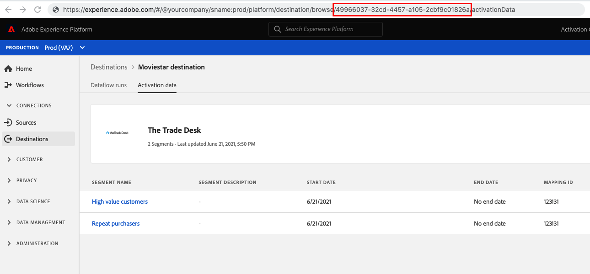

# Test file-based destination results with the testing API {#test-destination-configuration-api}

## Overview {#overview}

>[!IMPORTANT]
>
>**API endpoint**: `https://platform.adobe.io/data/core/activation/authoring/testing/destinationInstance/`

This page lists and describes all the API operations that you can perform using the `/authoring/testing/destinationInstance/` API endpoint, to test if your destination is configured correctly and to verify the integrity of data flows to your configured destination. For a description of the functionality supported by this endpoint, read [Test your destination configuration](./test-destination.md).

## How to get the destination instance ID {#get-destination-instance-id}

>[!IMPORTANT]
>
>In order to use this API, you must have an existing connection to your destination in the Experience Platform UI. Read [connect to destination](../ui/connect-destination.md) and [activate profiles and segments to a destination](../ui/activate-segment-streaming-destinations.md) for more information. After establishing the connection to your destination, get the destination instance ID that you should use in API calls to this endpoint from the URL when [browsing a connection with your destination](../ui/destination-details-page.md).
>

## Getting started with destination testing API operations {#get-started}

Before continuing, please review the [getting started guide](getting-started.md) for important information that you need to know in order to successfully make calls to the API, including how to obtain the required destination authoring permission and required headers.

## Test activation results {#test-activation-results}

You can test your activation results by making a GET request to the `authoring/testing/destinationInstance/{DESTINATION_INSTANCE_ID}` endpoint and providing the destination instance ID of the destination that you are testing, and the flow run IDs.

### API format

```http
GET authoring/testing/destinationInstance/{DESTINATION_INSTANCE_ID}/results?flowRunIds={FLOWRUN_ID},{FLOWRUN_ID}'
```

| Query parameter | Description |
| -------- | ----------- |
| `{DESTINATION_INSTANCE_ID}` | The destination instance ID of the destination that you are testing.| 
| `{FLOWRUN_ID}`| The flow run IDs of the activated segments.|

### Request

The following request calls your destination's REST API endpoint. The request is configured by the `{DESTINATION_INSTANCE_ID}` query parameter.

```shell
curl --location --request GET 'https://platform.adobe.io/data/core/activation/authoring/testing/destinationInstance/fd3449fb-b929-45c8-9f3d-06b9d6aac328/results?flowRunIds=30d34875-e7ba-4520-ab6e-5705e01dfb16,86c00ad7-443c-459a-855d-0e8cbee43c4f,12305c58-42a9-4230-8fad-1661ee49cb70' 
--header 'Content-Type: application/json' 
--header 'Accept: application/json'
--header 'x-api-key: {API_KEY}'
--header 'Authorization: Bearer {ACCESS_TOKEN}'
--header 'x-gw-ims-org-id: {IMS_ORG}'
--header 'x-sandbox-name: {SANDBOX_NAME}'
```

### Response

```json
{
   "items":[
      {
         "id":"18efd5d2-40ae-4f5c-afd1-37a39a45183a",
         "flowId":"a02071ad-f3a4-496c-a2b1-468812301d5d",
         "flowSpec":{
            "id":"25473b67-0801-418a-ab49-ed74ebf88137",
            "version":"1.0"
         },
         "providerRefId":"67605eb662cdc1d34bf804d359163fd0",
         "sandboxId":"becddb60-c64a-45ee-8ddb-60c64a45ee38",
         "sandboxName":"PROD",
         "createdAt":1646652233979,
         "updatedAt":1646652279707,
         "createdBy":"AepActivationService@AdobeID",
         "updatedBy":"acp_foundation_connectors@AdobeID",
         "createdClient":"AepActivationService",
         "updatedClient":"acp_foundation_connectors",
         "etag":"\"8603ccea-0000-0200-0000-6225eb770000\"",
         "metrics":{
            "durationSummary":{
               "startedAtUTC":1646652235124,
               "completedAtUTC":1646652270439
            },
            "latencySummary":null,
            "sizeSummary":{
               "inputBytes":122,
               "outputBytes":122
            },
            "recordSummary":{
               "inputRecordCount":1,
               "outputRecordCount":1,
               "createdRecordCount":1,
               "skippedRecordCount":0,
               "sourceSummaries":[
                  {
                     "id":"76e4b969-9700-4557-8330-0a8390afbdde",
                     "entitySummaries":[
                        {
                           "inputRecordCount":1,
                           "skippedRecordCount":0,
                           "id":"segment:4326c566-f81c-4ab0-8a80-9e741a5d0b1f"
                        }
                     ]
                  }
               ],
               "targetSummaries":[
                  {
                     "id":"b43607b6-0dca-43b3-a0bc-ecdea4fa6aa9",
                     "entitySummaries":[
                        {
                           "outputRecordCount":1,
                           "createdRecordCount":1,
                           "id":"segment:4326c566-f81c-4ab0-8a80-9e741a5d0b1f"
                        }
                     ]
                  }
               ]
            },
            "fileSummary":{
               "inputFileCount":1,
               "outputFileCount":1
            },
            "statusSummary":{
               "status":"success"
            }
         },
         "activities":[
            {
               "id":"c4f238e3-7334-4933-8b56-64d7ea43ea54",
               "name":"Activation Batch XdmProcessor Activity",
               "updatedAtUTC":0,
               "durationSummary":{
                  "startedAtUTC":1646652235124,
                  "completedAtUTC":1646652255157
               },
               "latencySummary":{
                  
               },
               "sizeSummary":{
                  "inputBytes":122,
                  "outputBytes":122
               },
               "recordSummary":{
                  "inputRecordCount":1,
                  "outputRecordCount":1,
                  "createdRecordCount":1,
                  "skippedRecordCount":0
               },
               "fileSummary":{
                  "inputFileCount":1,
                  "outputFileCount":1
               },
               "statusSummary":{
                  "status":"success",
                  "extensions":{
                     "incremental.batchId":"",
                     "snapshot.batchId":"",
                     "snapshot.datasetId":"",
                     "incremental.datasetId":""
                  }
               },
               "sourceInfo":null,
               "targetInfo":null
            },
            {
               "id":"51d82b36-6b8f-11eb-9439-0242ac130002",
               "name":"Activation Batch Publisher Activity",
               "updatedAtUTC":0,
               "durationSummary":{
                  "startedAtUTC":1646652270326,
                  "completedAtUTC":1646652270439
               },
               "latencySummary":{
                  
               },
               "sizeSummary":{
                  "outputBytes":122
               },
               "recordSummary":{
                  "inputRecordCount":1,
                  "outputRecordCount":1,
                  "createdRecordCount":1,
                  "skippedRecordCount":0
               },
               "fileSummary":{
                  "outputFileCount":1
               },
               "statusSummary":{
                  "status":"success",
                  "extensions":{
                     
                  }
               },
               "sourceInfo":null,
               "targetInfo":null
            }
         ],
         "predecessors":null
      }
   ],
   "_links":{
      
   }
}
```

## API error handling {#api-error-handling}

Destination SDK API endpoints follow the general Experience Platform API error message principles. Refer to [API status codes](../../landing/troubleshooting.md#api-status-codes) and [request header errors](../../landing/troubleshooting.md#request-header-errors) in the Platform troubleshooting guide.

## Next steps

After reading this document, you now know how to test your destination. You can now use the Adobe [self-service documentation process](../destination-sdk/docs-framework/documentation-instructions.md) to create a documentation page for your destination.