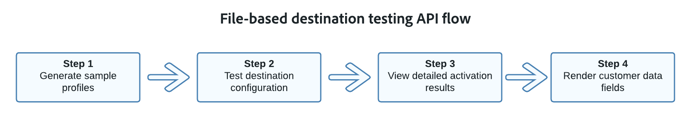

# File-based destination testing API

## Overview {#overview}

The file-based destination testing API is a set of endpoints that you can use to validate the configuration of your file-based destinations built through the Destination SDK.

We recommend using these tools to validate your configuration before [submitting](submit-destination.md) your destination for review to Adobe.

For the best testing results, we recommend using this API based on the flow diagram below.

See the sections below for a brief overview of what each endpoint can do.

## Sample generation endpoint {#sample-generation-endpoint}

This endpoint helps you generate sample profiles based on your existing source schema.

Sample profiles are meant to help you understand the JSON structure of a profile. Additionally, they give you a backbone that you can customize with your own profile data, for further destination testing.

See the [dedicated documentation](file-based-sample-profile-generation-api.md) to learn how to generate sample profiles.

## Destination configuration testing endpoint {#sample-generation-endpoint}

This endpoint helps you test if your file-based destination is configured correctly and verify the integrity of data flows to your configured destination.

You can make requests to the testing endpoint with or without adding [sample profiles](file-based-sample-profile-generation-api.md) to the call. If you don't send any profiles on the request, the API generates a sample profile automatically and adds it to the request.

See the [dedicated documentation](file-based-destination-testing-api.md) to learn how to test your destination configuration with sample profiles.

## Activation results endpoint {#activation-results}

This endpoint helps you view the complete details of your file-based destination testing results.

This API endpoint returns the same result as you would obtain when using the [Flow Service API](../api/update-destination-dataflows.md) to monitor dataflows.

See the [dedicated documentation](file-based-destination-results-api.md) to learn how to view detailed activation results.

## Customer fields rendering endpoint {#customer-fields-rendering-endpoint}

This endpoint helps you visualize how the templatized [customer data fields](file-based-destination-configuration.md#customer-data-fields) defined in your destination configuration would look like.

The endpoint generates random values for your customer data fields, and returns them in the response. This helps you validate the semantic structure of customer data fields, such as bucket names or folder paths.

See the [dedicated documentation](file-based-render-template-api.md) to learn how to view detailed activation results.