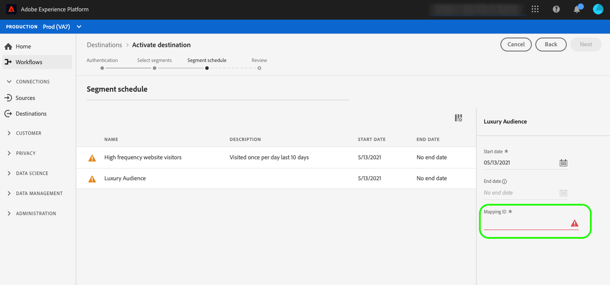

# Audience metadata management

Use audience metadata templates to programmatically create, update, or delete audiences in your destination. Adobe provides an extensible audience metadata template, which you can configure based on the specifications of your marketing API. After you define, test, and submit the configuration, it will be used by Adobe to structure the API calls to your destination.

You can configure the functionality described in this document by using the `/authoring/audience-templates` API endpoint. Read [create a metadata template](../metadata-api/create-audience-template.md) for a complete list of operations you can perform on the endpoint.

## When to use the audience metadata management endpoint {#when-to-use}

Depending on your API configuration, you may or may not need to use the audience metadata management endpoint as you configure your destination in Experience Platform. Use the decision tree diagram below to understand when to use the audience metadata endpoint and how to configure an audience metadata template for your destination.


## Use cases supported by audience metadata management {#use-cases}

With audience metadata support in Destination SDK, when you configure your Experience Platform destination, you can give Platform users one of several options when they map and activate segments to your destination. You can control the options available to the user via the parameters in the segment mapping section of the [destination configuration](./destination-configuration.md#segment-mapping).

### Use case 1 - You have a 3rd party API and users don't need to input mapping IDs

If you have an API endpoint to create/update/delete segments or audiences, you can use audience metadata templates to configure Destination SDK to match the specs of your segment create/update/delete endpoint. Experience Platform can programmatically create/update/delete segments and synchronize metadata back to Experience Platform.

When activating segments to your destination in the Experience Platform user interface (UI), users don't need to manually fill in a segment mapping ID field in the activation workflow.

### Use case 2 - Users need to create a segment in your destination first and are required to manually input mapping ID

If segments and other metadata need to be created by partners or users manually in your destination, then users must manually fill in the segment mapping ID field in the activation workflow to sync the segment metadata between your destination and Experience Platform.



### Use case 3 - Your destination accepts the Experience Platform segment ID, users don't need to manually input mapping ID  

If your destination system accepts the Experience Platform segment ID, you can configure this in your audience metadata template. Users do not have to populate a segment mapping ID when activating a segment.

## Generic and extensible audience template {#generic-and-extensible}

To support the use cases listed above, Adobe provides you with a generic template that can be customized to adjust to your API specifications.

You can use the generic template to [create a new audience template](./audience-metadata-api.md#create) if your API supports:

* The HTTP methods: POST, GET, PUT, DELETE, PATCH
* The authentication types: OAuth 1, OAuth 2 with refresh token, OAuth 2 with bearer token
* The functions: create an audience, update an audience, get an audience, delete an audience, validate credentials

The Adobe engineering team can work with you to expand the generic template with custom fields if your use cases requires it.

## Configuration examples {#configuration-examples}

This section includes three examples of generic audience metadata configurations, for your reference, along with descriptions of the main sections of the configuration. Notice how the url, headers, request and response body differ between the three example configurations. This is due to the different specifications of the three sample platforms' marketing API.

Note that in some examples, macro fields like `{{authData.accessToken}}` or `{{segment.name}}` are used in the URL, and in other examples these are used in the headers or request body. It really depends on your marketing API specifications.

|Template section | Description |
|--- |--- |
|`create` | Includes all required components (URL, HTTP method, headers, request and response body) to make an HTTP call to your API, to programmatically create segments/audiences in your platform and sync the information back to Adobe Experience Platform. |
|`update` | Includes all required components (URL, HTTP method, headers, request and response body) to make an HTTP call to your API, to programmatically update segments/audiences in your platform and sync the information back to Adobe Experience Platform. |
|`delete` | Includes all required components (URL, HTTP method, headers, request and response body) to make an HTTP call to your API, to programmatically delete segments/audiences in your platform. |
|`validate` | Runs validations for any fields in the template configuration before making a call to the partner API. For example, you could validate that the user's account ID is input correctly. |
|`notify`| Applies only to file-based destinations. Includes all required components (URL, HTTP method, headers, request and response body) to make an HTTP call to your API, to notify you of successful file exports.|

{style="table-layout:auto"}

### Streaming example 1 {#example-1}

```json
{
   "instanceId":"34ab9cc2-2536-44a5-9dc5-b2fea60b3bd6",
   "createdDate":"2021-07-26T19:30:52.012490Z",
   "lastModifiedDate":"2021-07-27T21:25:42.763478Z",
   "metadataTemplate":{
      "create":{
         "url":"https://adsapi.moviestar.com/v1/adaccounts/{{customerData.accountId}}/segments",
         "httpMethod":"POST",
         "headers":[
            {
               "value":"application/json",
               "header":"Content-Type"
            },
            {
               "value":"Bearer {{oauth2ServiceAccessToken}}",
               "header":"Authorization"
            }
         ],
         "requestBody":{
            "json":{
               "segments":[
                  {
                     "name":"{{segment.name}}",
                     "description":"{{segment.description}}",
                     "source_type":"FIRST_PARTY",
                     "ad_account_id":"{{customerData.accountId}}",
                     "retention_in_days":180
                  }
               ]
            }
         },
         "responseFields":[
            {
               "value":"{{body.segments[0].segment.id}}",
               "name":"externalAudienceId"
            }
         ],
         "responseErrorFields":[
            {
               "value":"{{root}}",
               "name":"message"
            }
         ]
      },
      "update":{
         "url":"https://adsapi.moviestar.com/v1/adaccounts/{{customerData.accountId}}/segments/{{segment.alias}}",
         "httpMethod":"PUT",
         "headers":[
            {
               "value":"application/json",
               "header":"Content-Type"
            },
            {
               "value":"Bearer {{oauth2ServiceAccessToken}}",
               "header":"Authorization"
            }
         ],
         "requestBody":{
            "json":{
               "segments":[
                  {
                     "id":"{{segment.alias}}",
                     "name":"{{segment.name}}",
                     "description":"{{segment.description}}"
                  }
               ]
            }
         },
         "responseFields":[
            {
               "value":"{{body.segments[0].segment.id}}",
               "name":"externalAudienceId"
            }
         ],
         "responseErrorFields":[
            {
               "value":"{{root}}",
               "name":"message"
            }
         ]
      },
      "delete":{
         "url":"https://adsapi.moviestar.com/v1/adaccounts/{{customerData.accountId}}/segments/{{segment.alias}}",
         "httpMethod":"DELETE",
         "headers":[
            {
               "value":"application/json",
               "header":"Content-Type"
            },
            {
               "value":"Bearer {{oauth2ServiceAccessToken}}",
               "header":"Authorization"
            }
         ],
         "responseErrorFields":[
            {
               "value":"{{root}}",
               "name":"message"
            }
         ]
      },
      "name":"Moviestar destination audience template - Example 1"
   }
}
```

### Streaming example 2 {#example-2}

```json

{
   "instanceId":"12c78017-5af3-4d4e-8f9c-d330c547c482",
   "createdDate":"2021-07-20T13:27:37.029490Z",
   "lastModifiedDate":"2021-07-20T18:53:03.622306Z",
   "metadataTemplate":{
      "create":{
         "url":"https://api.moviestar.com/v1.0/{{customerData.accountId}}/customaudiences?fields=name,description,account_id&subtype=CUSTOM&name={{segment.name}}&customer_file_source={{segment.metadata.customer_file_source}}&access_token={{authData.accessToken}}",
         "httpMethod":"POST",
         "headers":[
            {
               "value":"application/x-www-form-urlencoded",
               "header":"Content-Type"
            }
         ],
         "responseFields":[
            {
               "value":"{{response.id}}",
               "name":"externalAudienceId"
            }
         ],
         "responseErrorFields":[
            {
               "value":"{{error.message}}",
               "name":"message"
            }
         ]
      },
      "update":{
         "url":"https://api.moviestar.com/v1.0/{{segment.alias}}?field=name,description,account_id&access_token={{authData.accessToken}}&customerAudienceId={{segment.alias}}&&name={{segment.name}}&description={{segment.description}}&customer_file_source={{segment.metadata.customer_file_source}}",
         "httpMethod":"POST",
         "headers":[
            {
               "value":"application/x-www-form-urlencoded",
               "header":"Content-Type"
            }
         ],
         "responseFields":[
            {
               "value":"{{response.id}}",
               "name":"externalAudienceId"
            }
         ],
         "responseErrorFields":[
            {
               "value":"{{error.message}}",
               "name":"message"
            }
         ]
      },
      "delete":{
         "url":"https://api.moviestar.com/v1.0/{{segment.alias}}?fields=name,description,account_id&access_token={{authData.accessToken}}&customerAudienceId={{segment.alias}}",
         "httpMethod":"DELETE",
         "headers":[
            {
               "value":"application/x-www-form-urlencoded",
               "header":"Content-Type"
            }
         ],
         "responseErrorFields":[
            {
               "value":"{{error.message}}",
               "name":"message"
            }
         ]
      },
      "validate":{
         "url":"https://api.moviestar.com/v1.0/permissions?access_token={{authData.accessToken}}",
         "httpMethod":"GET",
         "headers":[
            {
               "value":"application/x-www-form-urlencoded",
               "header":"Content-Type"
            }
         ],
         "responseFields":[
            {
               "value":"{{response.data[0].permission}}",
               "name":"Id"
            }
         ],
         "responseErrorFields":[
            {
               "value":"{{error.message}}",
               "name":"message"
            }
         ]
      }
   }
}

```

### Streaming example 3 {#example-3}

```json
{
   "instanceId":"12a3238f-b509-4a40-b8fb-0a5006e7901d",
   "createdDate":"2021-07-20T13:30:30.843054Z",
   "lastModifiedDate":"2021-07-21T16:33:05.787472Z",
   "metadataTemplate":{
      "create":{
         "url":"https://api.moviestar.com/v2/dmpSegments",
         "httpMethod":"POST",
         "headers":[
            {
               "value":"application/json",
               "header":"Content-Type"
            },
            {
               "value":"Bearer {{authData.accessToken}}",
               "header":"Authorization"
            }
         ],
         "requestBody":{
            "json":{
               "name":"{{segment.name}}",
               "type":"USER",
               "account":"{{customerData.accountId}}",
               "accessPolicy":"PRIVATE",
               "destinations":[
                  {
                     "destination":"MOVIESTAR"
                  }
               ],
               "sourcePlatform":"ADOBE"
            }
         },
         "responseFields":[
            {
               "value":"{{headers.x-moviestar-id}}",
               "name":"externalAudienceId"
            }
         ],
         "responseErrorFields":[
            {
               "value":"{{message}}",
               "name":"message"
            }
         ]
      },
      "update":{
         "url":"https://api.moviestar.com/v2/dmpSegments/{{segment.alias}}",
         "httpMethod":"POST",
         "headers":[
            {
               "value":"application/json",
               "header":"Content-Type"
            },
            {
               "value":"Bearer {{authData.accessToken}}",
               "header":"Authorization"
            }
         ],
         "requestBody":{
            "json":{
               "patch":{
                  "$set":{
                     "name":"{{segment.name}}"
                  }
               }
            }
         },
         "responseErrorFields":[
            {
               "value":"{{message}}",
               "name":"message"
            }
         ]
      },
      "delete":{
         "url":"https://api.moviestar.com/v2/dmpSegments/{{segment.alias}}",
         "httpMethod":"DELETE",
         "headers":[
            {
               "value":"application/json",
               "header":"Content-Type"
            },
            {
               "value":"Bearer {{authData.accessToken}}",
               "header":"Authorization"
            }
         ],
         "responseErrorFields":[
            {
               "value":"{{message}}",
               "name":"message"
            }
         ]
      },
      "name":"Moviestar audience template - Third example"
   }
}
```


### File-based example {#example-file-based}

```json
{
   "instanceId":"34ab9cc2-2536-44a5-9dc5-b2fea60b3bd6",
   "createdDate":"2021-07-26T19:30:52.012490Z",
   "lastModifiedDate":"2021-07-27T21:25:42.763478Z",
   "metadataTemplate":{
      "create":{
         "url":"https://adsapi.moviestar.com/v1/adaccounts/{{customerData.accountId}}/segments",
         "httpMethod":"POST",
         "headers":[
            {
               "value":"application/json",
               "header":"Content-Type"
            },
            {
               "value":"Bearer {{oauth2ServiceAccessToken}}",
               "header":"Authorization"
            }
         ],
         "requestBody":{
            "json":{
               "segments":[
                  {
                     "name":"{{segment.name}}",
                     "description":"{{segment.description}}",
                     "source_type":"FIRST_PARTY",
                     "ad_account_id":"{{customerData.accountId}}",
                     "retention_in_days":180
                  }
               ]
            }
         },
         "responseFields":[
            {
               "value":"{{body.segments[0].segment.id}}",
               "name":"externalAudienceId"
            }
         ],
         "responseErrorFields":[
            {
               "value":"{{root}}",
               "name":"message"
            }
         ]
      },
      "update":{
         "url":"https://adsapi.moviestar.com/v1/adaccounts/{{customerData.accountId}}/segments/{{segment.alias}}",
         "httpMethod":"PUT",
         "headers":[
            {
               "value":"application/json",
               "header":"Content-Type"
            },
            {
               "value":"Bearer {{oauth2ServiceAccessToken}}",
               "header":"Authorization"
            }
         ],
         "requestBody":{
            "json":{
               "segments":[
                  {
                     "id":"{{segment.alias}}",
                     "name":"{{segment.name}}",
                     "description":"{{segment.description}}"
                  }
               ]
            }
         },
         "responseFields":[
            {
               "value":"{{body.segments[0].segment.id}}",
               "name":"externalAudienceId"
            }
         ],
         "responseErrorFields":[
            {
               "value":"{{root}}",
               "name":"message"
            }
         ]
      },
      "notify":{
         "url":"https://adsapi.moviestar.com/v1/adaccounts/{{customerData.accountId}}/segments/{{segment.alias}}",
         "httpMethod":"PUT",
         "headers":[
            {
               "value":"application/json",
               "header":"Content-Type"
            },
            {
               "value":"Bearer {{oauth2ServiceAccessToken}}",
               "header":"Authorization"
            }
         ],
         "requestBody":{
            "json":{
               "segments":[
                  {
                     "id":"{{segment.alias}}",
                     "name":"{{segment.name}}",
                     "description":"{{segment.description}}"
                  }
               ]
            }
         },
         "responseFields":[
            {
               "value":"{{body.segments[0].segment.id}}",
               "name":"externalAudienceId"
            }
         ],
         "responseErrorFields":[
            {
               "value":"{{root}}",
               "name":"message"
            }
         ]
      },
      "delete":{
         "url":"https://adsapi.moviestar.com/v1/adaccounts/{{customerData.accountId}}/segments/{{segment.alias}}",
         "httpMethod":"DELETE",
         "headers":[
            {
               "value":"application/json",
               "header":"Content-Type"
            },
            {
               "value":"Bearer {{oauth2ServiceAccessToken}}",
               "header":"Authorization"
            }
         ],
         "responseErrorFields":[
            {
               "value":"{{root}}",
               "name":"message"
            }
         ]
      },
      "name":"Moviestar destination audience template - Example 1"
   }
}
```

Find descriptions of all parameters in the template in the reference documentation [Audience metadata endpoint API operations](./audience-metadata-api.md).

## Macros used in audience metadata templates

To pass information such as segment IDs, access tokens, error messages, and more between Experience Platform and your API, the audience templates include macros that you can use. Read below a description of the macros that are used in the three configuration examples on this page:

|Macro | Description |
|--- |--- |
|`{{segment.alias}}` | Allows you to access the segment alias in Experience Platform. |
|`{{segment.name}}` | Allows you to access the segment name in Experience Platform. |
|`{{segment.id}}` | Allows you to access the segment id in Experience Platform. |
|`{{customerData.accountId}}` | Allows you to access the account Id field that you set up in the destination configuration. |
|`{{oauth2ServiceAccessToken}}` | Allows you to dynamically generate an access token based on your OAuth 2 configuration. |
|`{{authData.accessToken}}` | Allows you to pass the access token to your API endpoint. Use `{{authData.accessToken}}` if Experience Platform should use non-expiring tokens to connect to your destination, otherwise use `{{oauth2ServiceAccessToken}}` to generate an access token. |
|`{{body.segments[0].segment.id}}` | Returns the unique identifier of the created audience, as the value of the key `externalAudienceId`. |
|`{{error.message}}` | Returns an error message that will be surfaced to users in the Experience Platform UI. |

{style="table-layout:auto"}
