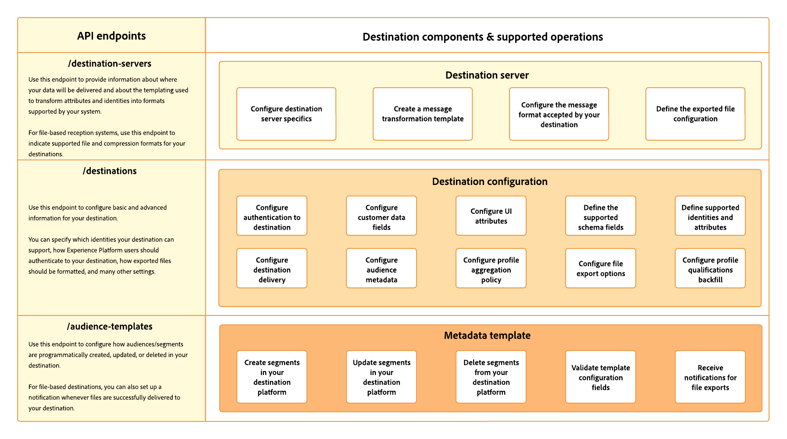

# Configuration options in Destination SDK

The destinations service in Adobe Experience Platform uses configuration endpoints for several components that build up the destinations functionality.

Combined, these components allow Experience Platform to connect to destination platforms, send custom messages, export custom files, and activate profile data across the digital ecosystem.

The diagram below shows a high-level overview of the components that you can configure through Destination SDK to build your own destination. These components are described further below.

## Server configuration {#server-configuration}

The destination server configuration ties together information about your server specs and the templating used by Adobe to deliver payloads to your destination.

For example, this is where you specify the API endpoints on your side that Experience Platform needs to connect to as well as the headers and the format of the API calls that Platform will make.

For file-based destinations, this configuration also includes the supported file formatting and compression formats for your destination. You can configure the functionalities described below via the [destination-servers endpoint](../authoring-api/destination-server/create-destination-server.md).

* [Server specs](destination-server/server-specs.md): A configuration template that contains information about the storage location or HTTP endpoint where data is sent to.
* [Template specs](destination-server/templating-specs.md): In this template, you can define how to structure the HTTP API request to your endpoint, including how to transform profile attribute fields between the XDM schema and the format that your platform supports. Use this information together with the [message format](destination-server/message-format.md) documentation.
* [Message format](destination-server/message-format.md): This section addresses in-depth information about supported templating languages, message formats, and the information required by Adobe to set up the integration with your platform. Use this information together with the [template specs](destination-server/templating-specs.md) documentation.
* [File specs](destination-server/file-formatting.md): A configuration template that includes the file formatting and compression options for your batch destination.

## Destination configuration {#destination-configuration}

This configuration endpoint contains basic and advanced information about your destination. For example, this is where you specify the identity types that your destination can support, the desired format of exported files (for file-based destinations), and various UI attributes for your destination card in the Adobe Experience Platform user interface.

See the documentation below for details about each of the destination configuration components. You can configure the functionalities described below via the [destinations endpoint](../authoring-api/destination-configuration/create-destination-configuration.md).

* [Customer authentication configuration](destination-configuration/customer-authentication.md): Select the authentication mechanism that Experience Platform should use to connect to your destination. This configuration generates the [Configure new destination](../../ui/connect-destination.md) page in the Experience Platform user interface, where users connect Experience Platform to the accounts they have with your destination.
* [OAuth2 authentication](destination-configuration/oauth2-authentication.md): Learn about all the [!DNL OAuth2] authentication flows supported by Destination SDK, and get instructions to set up [!DNL OAuth2] authentication for your destination..
* [Customer data fields](destination-configuration/customer-data-fields.md): Learn how to create input fields in the Experience Platform UI that allow your users to specify various information relevant to how to connect and export data to your destination.
* [UI attributes](destination-configuration/ui-attributes.md): Learn how to configure the UI attributes, such as the documentation link, the destination card category, and the destination connection type and frequency, for destinations built with Destination SDK.
* [Schema configuration](destination-configuration/schema-configuration.md): Learn how to define your destination's target schema to which users can map profile attributes and identities.
* [Identity namespace configuration](destination-configuration/identity-namespace-configuration.md): Learn how to configure the identities supported by your destination. This configuration populates the target identities in the [mapping step](../../ui/activate-segment-streaming-destinations.md#mapping) of the Experience Platform user interface, where users map identities and attributes from their XDM schemas to the schema in your destination.
* [Destination delivery](destination-configuration/destination-delivery.md): Learn how to configure where exactly the exported data goes and what authentication rule is used in the location where the data will land.
* [Audience metadata configuration](destination-configuration/audience-metadata-configuration.md): Learn how segment metadata like segment names or IDs should be shared between Experience Platform and your destination.
* [Aggregation policy](destination-configuration/aggregation-policy.md): Learn how to set up an aggregation policy to determine how HTTP requests to your destination should be grouped and batched.
* [Batch configuration](destination-configuration/batch-configuration.md): Set up various file naming and export scheduling settings available to users when connecting to your destination in the Experience Platform user interface.
* [Historical profile qualifications](destination-configuration/historical-profile-qualifications.md): Learn about the historical profile qualifications supported by destinations built with Destination SDK.

## Audience metadata configuration {#audience-metadata-configuration}

This component allows you to configure how audiences/segments are programmatically created, updated, or deleted in your destination. For file-based destinations, it allows you to set up a notification whenever files are successfully delivered to your destination. You can configure this functionality via the [audience-templates endpoint](../metadata-api/create-audience-template.md).

## Next steps {#next-steps}

By reading this article, you now have a general overview of the functionality provided by Destination SDK and which pages to read for more information about specific configurations. Next, you can read the guides which include all the steps to [configure a streaming](../guides/configure-destination-instructions.md) or a [file-based destination](../guides/configure-file-based-destination-instructions.md) by using Destination SDK.
