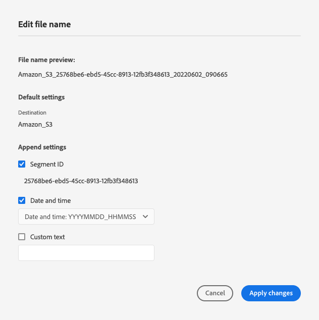

# Batch configuration {#batch-configuration}

Use the batch configuration options in Destination SDK to allow users to customize the exported file names and to configure the export schedule according to their preference.

When you create file-based destinations through Destination SDK, you can configure default file naming and export schedules, or you can give users the option to configure these settings from the Platform UI. For instance, you can configure behaviors such as:

* Including specific information in the file name, such as audience IDs, destination IDs, or custom information.
* Allowing users to customize the file naming from the Platform UI.
* Configure file exports to occur at set time intervals.
* Define what file naming and export schedule customization options the users can see in the Platform UI.

Batch configuration settings are part of the destination configuration for file-based destinations. 

To understand where this component fits into an integration created with Destination SDK, see the diagram in the [configuration options](../configuration-options.md) documentation or see the the guide on how to [use Destination SDK to configure a file-based destination](../../guides/configure-file-based-destination-instructions.md#create-server-file-configuration).

You can configure the file naming and export schedule settings via the `/authoring/destinations` endpoint. See the following API reference pages for detailed API call examples where you can configure the components shown in this page.

* [Create a destination configuration](../../authoring-api/destination-configuration/create-destination-configuration.md)
* [Update a destination configuration](../../authoring-api/destination-configuration/update-destination-configuration.md)

This article describes all the supported batch configuration options that you can use for your destination, and shows what customers will see in the Platform UI.

>[!IMPORTANT]
>
>All parameter names and values supported by Destination SDK are **case sensitive**. To avoid case sensitivity errors, please use the parameters names and values exactly as shown in the documentation.

## Supported integration types {#supported-integration-types}

Refer to the table below for details on which types of integrations support the functionality described on this page.

|Integration type| Supports functionality |
|---|---|
| Real-time (streaming) integrations | No |
| File-based (batch) integrations | Yes |

## Supported parameters {#supported-parameters}

The values that you set up here are surfaced in the [Schedule audience export](../../../ui/activate-batch-profile-destinations.md#scheduling) step of the file-based destinations activation workflow. 

```json
"batchConfig":{
   "allowMandatoryFieldSelection":true,
   "allowDedupeKeyFieldSelection":true,
   "defaultExportMode":"DAILY_FULL_EXPORT",
   "allowedExportMode":[
      "DAILY_FULL_EXPORT",
      "FIRST_FULL_THEN_INCREMENTAL"
   ],
   "allowedScheduleFrequency":[
      "DAILY",
      "EVERY_3_HOURS",
      "EVERY_6_HOURS",
      "EVERY_8_HOURS",
      "EVERY_12_HOURS",
      "ONCE"
   ],
   "defaultFrequency":"DAILY",
   "defaultStartTime":"00:00",
   "filenameConfig":{
         "allowedFilenameAppendOptions":[
            "SEGMENT_NAME",
            "DESTINATION_INSTANCE_ID",
            "DESTINATION_INSTANCE_NAME",
            "ORGANIZATION_NAME",
            "SANDBOX_NAME",
            "DATETIME",
            "CUSTOM_TEXT"
         ],
         "defaultFilenameAppendOptions":[
            "DATETIME"
         ],
         "defaultFilename":"%DESTINATION%_%SEGMENT_ID%"
      },
   "segmentGroupingEnabled": true
   }
```

|Parameter | Type | Description|
|---------|----------|------|
|`allowMandatoryFieldSelection`|Boolean|Set to `true` to allow customers to specify which profile attributes are mandatory. Default value is `false`. See [Mandatory attributes](../../../ui/activate-batch-profile-destinations.md#mandatory-attributes) for more information. |
|`allowDedupeKeyFieldSelection`|Boolean|Set to `true` to allow customers to specify deduplication keys. Default value is `false`.  See [Deduplication keys](../../../ui/activate-batch-profile-destinations.md#deduplication-keys) for more information. |
|`defaultExportMode`|Enum|Defines the default file export mode. Supported values:<ul><li>`DAILY_FULL_EXPORT`</li><li>`FIRST_FULL_THEN_INCREMENTAL`</li></ul> Default value is `DAILY_FULL_EXPORT`. See the [batch activation documentation](../../../ui/activate-batch-profile-destinations.md#scheduling) for details about file exports scheduling. |
|`allowedExportModes`|List|Defines the file export modes available to customers. Supported values:<ul><li>`DAILY_FULL_EXPORT`</li><li>`FIRST_FULL_THEN_INCREMENTAL`</li></ul>|
|`allowedScheduleFrequency`|List|Defines the file export frequency available to customers. Supported values:<ul><li>`ONCE`</li><li>`EVERY_3_HOURS`</li><li>`EVERY_6_HOURS`</li><li>`EVERY_8_HOURS`</li><li>`EVERY_12_HOURS`</li><li>`DAILY`</li></ul>|
|`defaultFrequency`|Enum|Defines the default file export frequency.Supported values:<ul><li>`ONCE`</li><li>`EVERY_3_HOURS`</li><li>`EVERY_6_HOURS`</li><li>`EVERY_8_HOURS`</li><li>`EVERY_12_HOURS`</li><li>`DAILY`</li></ul> Default value is `DAILY`.|
|`defaultStartTime`|String|Defines the default start time for the file export. Uses 24-hour file format. Default value is "00:00".|
|`filenameConfig.allowedFilenameAppendOptions`|String|*Required*. List of available file name macros for users to choose from. This determines which items are appended to exported file names (audience ID, organization name, date and time of export, and others). When setting `defaultFilename`, make sure to avoid duplicating macros. <br><br>Supported values: <ul><li>`DESTINATION`</li><li>`SEGMENT_ID`</li><li>`SEGMENT_NAME`</li><li>`DESTINATION_INSTANCE_ID`</li><li>`DESTINATION_INSTANCE_NAME`</li><li>`ORGANIZATION_NAME`</li><li>`SANDBOX_NAME`</li><li>`DATETIME`</li><li>`CUSTOM_TEXT`</li></ul>Regardless of the order in which you define the macros, the Experience Platform UI will always display them in the order presented here. <br><br> If `defaultFilename` is empty, the `allowedFilenameAppendOptions` list must contain at least one macro.|
|`filenameConfig.defaultFilenameAppendOptions`|String|*Required*. Pre-selected default file name macros that users can uncheck.<br><br> The macros in this list are a subset of the ones defined in `allowedFilenameAppendOptions`. |
|`filenameConfig.defaultFilename`|String|*Optional*. Defines the default file name macros for the exported files. These cannot be overwritten by users. <br><br>Any macro defined by `allowedFilenameAppendOptions` will be appended after the `defaultFilename` macros. <br><br>If `defaultFilename` is empty, you must define at least one macro in `allowedFilenameAppendOptions`.|
|`segmentGroupingEnabled`|Boolean|Defines whether the activated audiences should be exported in a single file or multiple files, based on audience [merge policy](../../../../profile/merge-policies/overview.md). Supported values: <ul><li>`true`: exports one file per merge policy.</li><li>`false`: exports one file per audience, regardless of the merge policy. This is the default behavior. You can achieve the same result by ommitting this paramter entirely.</li></ul>|

{style="table-layout:auto"}

## File name configuration {#file-name-configuration}

Use file name configuration macros to define what the exported file names should include. The macros in the table below describe elements found in the UI in the [file name configuration](../../../ui/activate-batch-profile-destinations.md#file-names) screen.

>[!TIP]
> 
>As a best practice, you should always include the `SEGMENT_ID` macro in your exported file names. Segment IDs are unique, so including them in the file name is the best way to ensure that file names are unique as well. 

|Macro|UI label|Description|Example|
|---|---|---|---|
|`DESTINATION`|[!UICONTROL Destination]|Destination name in the UI.|Amazon S3|
|`SEGMENT_ID`|[!UICONTROL Segment ID]|Unique, Platform-generated audience ID|ce5c5482-2813-4a80-99bc-57113f6acde2|
|`SEGMENT_NAME`|[!UICONTROL Segment Name]|User-defined audience name|VIP subscriber|
|`DESTINATION_INSTANCE_ID`|[!UICONTROL Destination ID]|Unique, Platform-generated ID of the destination instance|7b891e5f-025a-4f0d-9e73-1919e71da3b0|
|`DESTINATION_INSTANCE_NAME`|[!UICONTROL Destination Name]|User-defined name of the destination instance.|My 2022 Advertising Destination|
|`ORGANIZATION_NAME`|[!UICONTROL Organization Name]|Name of the customer organization in Adobe Experience Platform.|My Organization Name|
|`SANDBOX_NAME`|[!UICONTROL Sandbox Name]|Name of the sandbox used by the customer.|prod|
|`DATETIME` / `TIMESTAMP`|[!UICONTROL Date and time]|`DATETIME` and `TIMESTAMP` both define when the file was generated, but in different formats. <br><br><ul><li>`DATETIME` uses the following format: YYYYMMDD_HHMMSS.</li><li>`TIMESTAMP` uses the 10-digit Unix format. </li></ul> `DATETIME` and `TIMESTAMP` are mutually exclusive, and cannot be used simultaneously. |<ul><li>`DATETIME`: 20220509_210543</li><li>`TIMESTAMP`: 1652131584</li></ul>|
|`CUSTOM_TEXT`|[!UICONTROL Custom text]|User-defined custom text to be included in the file name. Cannot be used in `defaultFilename`.|My_Custom_Text|
|`TIMESTAMP`|[!UICONTROL Date and time]|10-digit timestamp of the time when the file was generated, in Unix format.|1652131584|
|`MERGE_POLICY_ID`|[!UICONTROL Merge Policy ID]|The ID of the [merge policy](../../../../profile/merge-policies/overview.md) used to generate the exported audience. Use this macro when you are grouping exported audiences in files, based on merge policy. Use this macro together with `segmentGroupingEnabled:true`. |e8591fdb-2873-4b12-b63e-15275b1c1439|
|`MERGE_POLICY_NAME`|[!UICONTROL Merge Policy Name]|The name of the [merge policy](../../../../profile/merge-policies/overview.md) used to generate the exported audience. Use this macro when you are grouping exported audiences in files, based on merge policy. Use this macro together with `segmentGroupingEnabled:true`.|My Custom Merge Policy|

{style="table-layout:auto"}

### File name configuration example

The configuration example below shows the correspondence between the configuration used in the API call and the options shown in the UI.

```json
"filenameConfig":{
   "allowedFilenameAppendOptions":[
      "CUSTOM_TEXT",
      "SEGMENT_ID",
      "DATETIME"
   ],
   "defaultFilenameAppendOptions":[
      "SEGMENT_ID",
      "DATETIME"
   ],
   "defaultFilename": "%DESTINATION%"
}
```



## Next steps {#next-steps}

After reading this article, you should have a better understanding of how you can configure file naming and export schedules for your file-based destinations.

To learn more about the other destination components, see the following articles:

* [Customer authentication configuration](customer-authentication.md)
* [OAuth2 authentication](oauth2-authentication.md)
* [Customer data fields](customer-data-fields.md)
* [UI attributes](ui-attributes.md)
* [Schema configuration](schema-configuration.md)
* [Identity namespace configuration](identity-namespace-configuration.md)
* [Supported mapping configurations](supported-mapping-configurations.md)
* [Destination delivery](destination-delivery.md)
* [Audience metadata configuration](audience-metadata-configuration.md)
* [Aggregation policy](aggregation-policy.md)
* [Historical profile qualifications](historical-profile-qualifications.md)