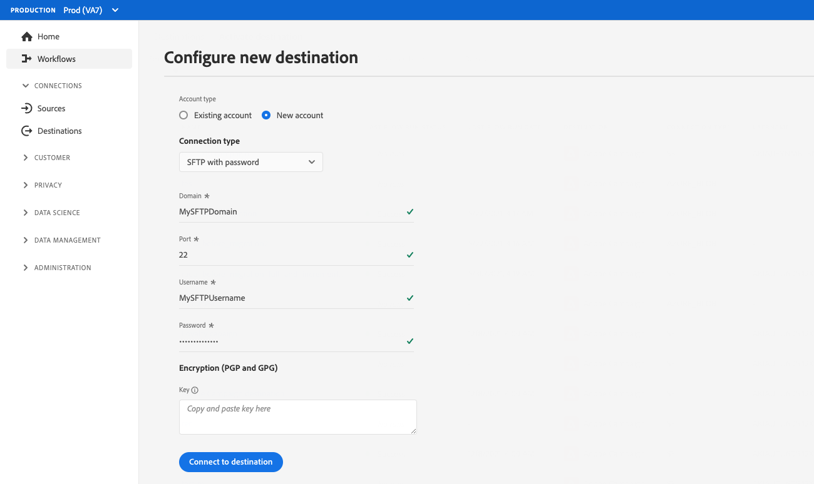

# Customer authentication configuration

Experience Platform provides great flexibility in the authentication protocols available to partners and customers. You can configure your destination to support any of the industry-standard authentication methods like [!DNL OAuth2], bearer token authentication, password authentication, and many more.

This page explains how to set up your destination using your preferred authentication method. Based on the authentication configuration that you use when you create your destination, customers will see different types of authentication pages when connecting to the destination in the Experience Platform UI.

To understand where this component fits into an integration created with Destination SDK, see the diagram in the [configuration options](../configuration-options.md) documentation or see the following destination configuration overview pages:

* [Use Destination SDK to configure a streaming destination](../../guides/configure-destination-instructions.md#create-destination-configuration)
* [Use Destination SDK to configure a file-based destination](../../guides/configure-file-based-destination-instructions.md#create-destination-configuration)

Before customers can export data from Platform to your destination, they must create a new connection between Experience Platform and your destination, by following the steps described in the [destination connection](../../../ui/connect-destination.md) tutorial.

When creating a destination through Destination SDK, the `customerAuthenticationConfigurations` section defines what customers see in the [authentication screen](../../../ui/connect-destination.md#authenticate). Depending on the destination authentication type, customers must provide various authentication details, such as:

* For destinations using [bearer authentication](#bearer), users must provide a bearer token.
* For [Amazon S3](#s3) destinations, users must provide their [!DNL Amazon S3] access key and secret key.
* For [Azure Blob](#blob) destinations, users must provide their [!DNL Azure Blob] connection string.

You can configure customer authentication details via the `/authoring/destinations` endpoint. See the following API reference pages for detailed API call examples where you can configure the components shown in this page.

* [Create a destination configuration](../../authoring-api/destination-configuration/create-destination-configuration.md)
* [Update a destination configuration](../../authoring-api/destination-configuration/update-destination-configuration.md)

This article describes all the supported customer authentication configurations that you can use for your destination, and shows what customers will see in the Experience Platform UI.

>[!IMPORTANT]
>
>The customer authentication configuration does not require you to configure any parameters. You can copy and paste the snippets below in your API calls when [creating](../../authoring-api/destination-configuration/create-destination-configuration.md) or [updating](../../authoring-api/destination-configuration/update-destination-configuration.md) a destination configuration, and your users will see the corresponding authentication screen in the Platform UI.

## Supported integration types {#supported-integration-types}

Refer to the table below for details on what type of destinations support the functionality described in this page.

|Integration type| Supports functionality |
|---|---|
| Real-time (streaming) integrations | :white_check_mark: |
| File-based (batch) integrations | :white_check_mark: |

## Authentication rule configuration {#authentication-rule}

When using any of the customer authentication configurations described in this page, always configure the `authenticationRule` parameter in [destination delivery](destination-delivery.md) as `"CUSTOMER_AUTHENTICATION"`.

## Bearer authentication {#bearer}

When you configure the bearer authentication type, users are required to input the bearer token that they obtain from your destination.


To set up bearer type authentication for your destination, configure the `customerAuthenticationConfigurations` section via the `/destinations` endpoint as shown below:

```json
"customerAuthenticationConfigurations":[
   {
      "authType":"BEARER"
   }
]
```

## OAuth 2 authentication {#oauth2}

Users select **[!UICONTROL Connect to destination]** to trigger the OAuth 2 authentication flow to your destination, as shown in the example below for the Twitter Custom Audiences destination. For detailed information on configuring OAuth 2 authentication to your destination endpoint, read the dedicated [Destination SDK OAuth 2 authentication page](oauth2-authentication.md).


To set up [!DNL OAuth2] authentication for your destination, configure the `customerAuthenticationConfigurations` section via the `/destinations` endpoint as shown below:

```json
"customerAuthenticationConfigurations":[
   {
      "authType":"OAUTH2"
   }
]
```

{style="table-layout:auto"}

## Amazon S3 authentication {#s3}

[!DNL Amazon S3] authentication is supported for file-based destinations in Experience Platform.

When you configure the Amazon S3 authentication type, users are required to input their S3 credentials.


To set up [!DNL Amazon S3] authentication for your destination, configure the `customerAuthenticationConfigurations` section via the `/destinations` endpoint as shown below:

```json
"customerAuthenticationConfigurations":[
   {
      "authType":"S3"
   }
]
```

## Azure Blob authentication  {#blob}

[!DNL Azure Blob Storage] authentication is supported for file-based destinations in Experience Platform.

When you configure the Azure Blob authentication type, users are required to input the connection string.


To set up [!DNL Azure Blob] authentication for your destination, configure the `customerAuthenticationConfigurations` parameter in the `/destinations` endpoint as shown below:

```json
"customerAuthenticationConfigurations":[
   {
      "authType":"AZURE_CONNECTION_STRING"
   }
]
```

## [!DNL Azure Data Lake Storage] {#adls}

[!DNL Azure Data Lake Storage] authentication is supported for file-based destinations in Experience Platform.

When you configure the [!DNL Azure Data Lake Storage] authentication type, users are required to input the Azure Service Principal credentials and their tenant information.

![UI render with [!DNL Azure Data Lake Storage] authentication](../../assets/functionality/destination-configuration/adls-authentication-ui.png)

To set up [!DNL Azure Data Lake Storage] (ADLS) authentication for your destination, configure the `customerAuthenticationConfigurations` parameter in the `/destinations` endpoint as shown below:

```json
"customerAuthenticationConfigurations":[
   {
      "authType":"AZURE_SERVICE_PRINCIPAL"
   }
]
```

## SFTP with password authentication

[!DNL SFTP] authentication with password is supported for file-based destinations in Experience Platform.

When you configure the SFTP with password authentication type, users are required to input the SFTP username and password, as well as the SFTP domain and port (default port is 22).



To set up SFTP authentication with password for your destination, configure the `customerAuthenticationConfigurations` parameter in the `/destinations` endpoint as shown below:

```json
"customerAuthenticationConfigurations":[
   {
      "authType":"SFTP_WITH_PASSWORD"
   }
]
```

## SFTP with SSH key authentication

[!DNL SFTP] authentication with [!DNL SSH] key is supported for file-based destinations in Experience Platform.

When you configure the SFTP with SSH key authentication type, users are required to input the SFTP username and SSH key, as well as the SFTP domain and port (default port is 22).


To set up SFTP authentication with SSH key for your destination, configure the `customerAuthenticationConfigurations` parameter in the `/destinations` endpoint as shown below:

```json
"customerAuthenticationConfigurations":[
   {
      "authType":"SFTP_WITH_SSH_KEY"
   }
]
```

## [!DNL Google Cloud Storage] {#gcs}

[!DNL Google Cloud Storage] authentication is supported for file-based destinations in Experience Platform.

When you configure the [!DNL Google Cloud Storage] authentication type, users are required to input their [!DNL Google Cloud Storage] [!UICONTROL access key ID] and [!UICONTROL secret access key].


To set up [!DNL Google Cloud Storage] authentication for your destination, configure the `customerAuthenticationConfigurations` parameter in the `/destinations` endpoint as shown below:

```json
"customerAuthenticationConfigurations":[
   {
      "authType":"GOOGLE_CLOUD_STORAGE"
   }
]
```

## Next steps {#next-steps}

After reading this article, you should have a better understanding of how you can configure user authentication to your destination platform.

To learn more about the other destination components, see the following articles:

* [Customer authentication configuration](customer-authentication.md)
* [OAuth2 authentication](destination-configuration/oauth2-authentication.md)
* [Customer data fields](destination-configuration/customer-data-fields.md)
* [UI attributes](destination-configuration/ui-attributes.md)
* [Schema configuration](destination-configuration/schema-configuration.md)
* [Identities and attributes](destination-configuration/identities-attributes.md)
* [Destination delivery](destination-configuration/destination-delivery.md)
* [Audience metadata configuration](destination-configuration/audience-metadata-configuration.md)
* [Aggregation policy](destination-configuration/aggregation-policy.md)
* [Batch configuration](destination-configuration/batch-configuration.md)
* [Historical profile qualifications](destination-configuration/historical-profile-qualifications.md)