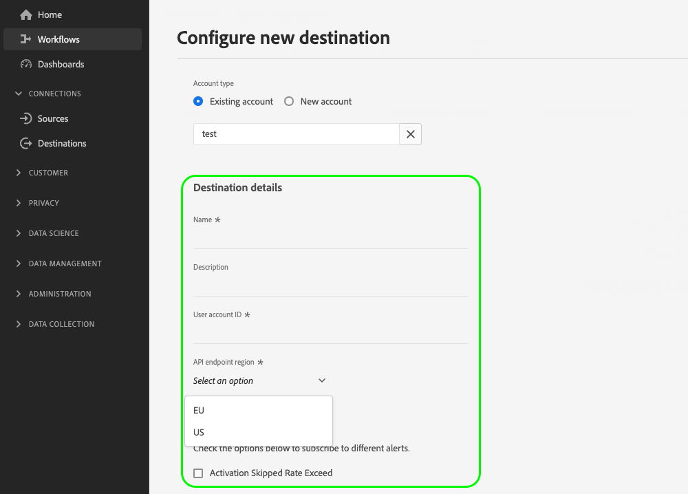
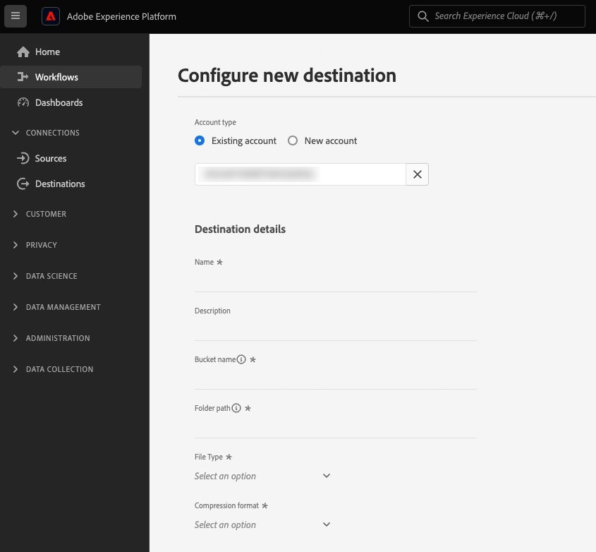
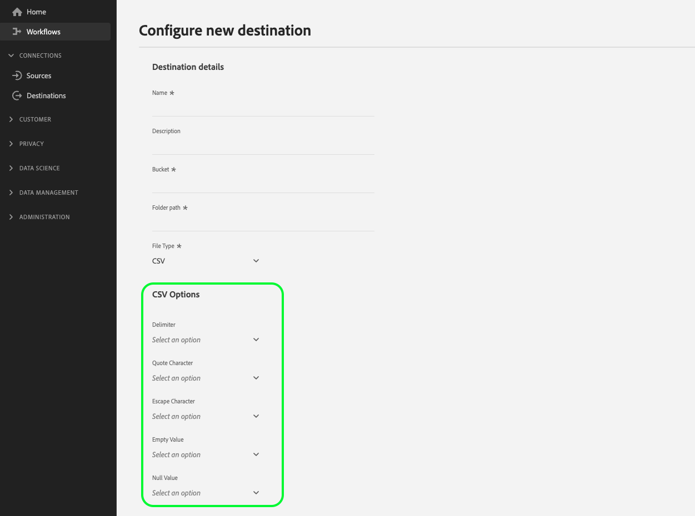
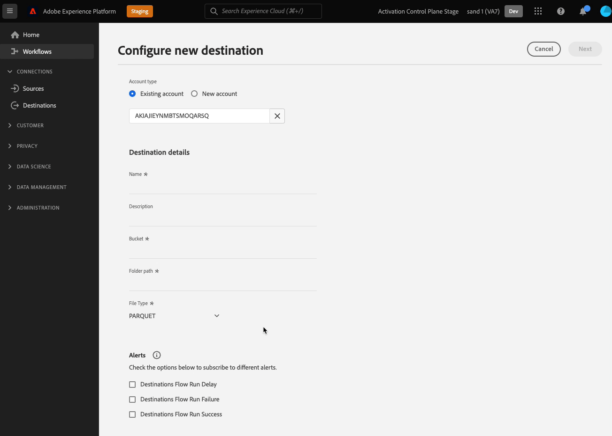

# Customer data fields

When connecting to your destination in the Experience Platform UI, you might need your users to provide specific configuration details or select specific options that you make available to them. In Destination SDK, these options are called customer data fields.

To understand where this component fits into an integration created with Destination SDK, see the diagram in the [configuration options](../configuration-options.md) documentation or see the following destination configuration overview pages:

* [Use Destination SDK to configure a streaming destination](../../guides/configure-destination-instructions.md#create-destination-configuration)
* [Use Destination SDK to configure a file-based destination](../../guides/configure-file-based-destination-instructions.md#create-destination-configuration)

When [creating a destination](../../authoring-api/destination-configuration/create-destination-configuration.md) through Destination SDK, the `customerDataFields` section defines the properties of the fields your users will see in the UI, such as, but not limited to:

* Cloud storage bucket names and paths, for file-based destinations.
* The format accepted by the customer data fields.
* Available file compression types that users can select from.
* Lists of available endpoints for URL-based integrations.

You can configure customer data fields via the `/authoring/destinations` endpoint. See the following API reference pages for detailed API call examples where you can configure the components shown in this page.

* [Create a destination configuration](../../authoring-api/destination-configuration/create-destination-configuration.md)
* [Update a destination configuration](../../authoring-api/destination-configuration/update-destination-configuration.md)

This article describes all the supported customer data fields configuration types that you can use for your destination, and shows what customers will see in the Experience Platform UI.

## Supported integration types {#supported-integration-types}

Refer to the table below for details on what type of destinations support the functionality described in this page.

|Integration type| Supports functionality |
|---|---|
| Real-time (streaming) integrations | :white_check_mark: |
| File-based (batch) integrations | :white_check_mark: |

## Supported parameters {#supported-parameters}

When creating your own customer data fields, you can use the parameters described in the table below to configure their behavior.

|Parameter | Type | Required/Optional |Description|
|---------|----------|------|---|
|`name` | String | Required| Provide a name for the custom field you are introducing. This name is not visible in the Platform UI, unless the `title` field is empty or missing.|
|`type` | String | Required |Indicates the type of the custom field you are introducing. Accepted values: <ul><li>`string`</li><li>`object`</li><li>`integer`</li></ul> |
|`title` | String | Optional |Indicates the name of the field, as it is seen by customers in the Platform UI. If this field is empty or missing, the UI inherits the field name from the `name` value. |
|`description` | String | Optional | Provide a description for the custom field. This description is not visible in the Platform UI. |
|`isRequired` | Boolean | Optional |Indicates whether users are required to provide a value for this field in the destination configuration workflow. |
|`pattern` | String |Optional| Enforces a pattern for the custom field, if needed. Use regular expressions to enforce a pattern. For example, if your customer IDs don't include numbers or underscores, enter `^[A-Za-z]+$` in this field.|
|`enum` | String |Optional| Renders the custom field as a dropdown menu and lists the options available to the user.|
|`default`|String|Optional|Defines the default value from an `enum` list.|
|`hidden`|Boolean|Optional|Indicates whether the customer data field is shown in the UI or not.|
|`unique`|Boolean|Optional|Use this parameter when you need to create a customer data field whose value must be unique across all destination dataflows set up by a user's organization. For example, the **[!UICONTROL Integration alias]** field in the [Custom Personalization](../../../catalog/personalization/custom-personalization.md) destination must be unique, meaning that two separate dataflows to this destination cannot have the same value for this field.|
|`readOnly`|Boolean|Optional|Indicates whether the customer can change the value of the field or not.|

{style="table-layout:auto"}

In the example below, the `customerDataFields` section defines two fields that users must input in the Platform UI when connecting to the destination:

* `Account ID`: A user account ID for your destination platform.
* `Endpoint region`: The regional endpoint of the API they will connect to. The `enum` section creates a drop-down menu with the values defined within available for the users to select.

```json
"customerDataFields":[
   {
      "name":"accountID",
      "title":"User account ID",
      "description":"User account ID for the destination platform.",
      "type":"string",
      "isRequired":true
   },
   {
      "name":"region",
      "title":"API endpoint region",
      "description":"The API endpoint region that the user should connect to.",
      "type":"string",
      "isRequired":true,
      "enum":[
         "EU"
         "US",
      ],
      "readOnly":false,
      "hidden":false
   }
]
```

The resulting UI experience is shown in the image below.



## Destination connection names and descriptions {#names-description}

When creating a new destination, Destination SDK automatically adds **[!UICONTROL Name]** and **[!UICONTROL Description]** fields to the destination connection screen in the Platform UI. As you can see in the example above, the **[!UICONTROL Name]** and **[!UICONTROL Description]** fields are rendered in the UI without being included in the customer data fields configuration.

>[!IMPORTANT]
>
>If you add **[!UICONTROL Name]** and **[!UICONTROL Description]** fields in the customer data fields configuration, users will see them duplicated in the UI.

## Order customer data fields {#ordering}

The order in which you add the customer data fields in the destination configuration is reflected in the Platform UI.

For example, the configuration below is reflected accordingly in the UI, with the options showing up in the order **[!UICONTROL Name]**, **[!UICONTROL Description]**, **[!UICONTROL Bucket name]**, **[!UICONTROL Folder path]**, **[!UICONTROL File Type]**, **[!UICONTROL Compression format]**.

```json
"customerDataFields":[
{
   "name":"bucketName",
   "title":"Bucket name",
   "description":"Amazon S3 bucket name",
   "type":"string",
   "isRequired":true,
   "pattern":"(?=^.{3,63}$)(?!^(\\d+\\.)+\\d+$)(^(([a-z0-9]|[a-z0-9][a-z0-9\\-]*[a-z0-9])\\.)*([a-z0-9]|[a-z0-9][a-z0-9\\-]*[a-z0-9])$)",
   "readOnly":false,
   "hidden":false
},
{
   "name":"path",
   "title":"Folder path",
   "description":"Enter the path to your S3 bucket folder",
   "type":"string",
   "isRequired":true,
   "pattern":"^[0-9a-zA-Z\\/\\!\\-_\\.\\*\\''\\(\\)]*((\\%SEGMENT_(NAME|ID)\\%)?\\/?)+$",
   "readOnly":false,
   "hidden":false
},
{
   "name":"fileType",
   "title":"File Type",
   "description":"Select the exported file type.",
   "type":"string",
   "isRequired":true,
   "readOnly":false,
   "hidden":false,
   "enum":[
      "csv",
      "json",
      "parquet"
   ],
   "default":"csv"
},
{
   "name":"compression",
   "title":"Compression format",
   "description":"Select the desired file compression format.",
   "type":"string",
   "isRequired":true,
   "readOnly":false,
   "enum":[
      "SNAPPY",
      "GZIP",
      "DEFLATE",
      "NONE"
   ]
}
]
```



## Group customer data fields {#grouping}

You can group several customer data fields within one section. When setting up the connection to the destination in the UI, users can see and benefit from a visual grouping of similar fields. 

To do this, use `"type": "object"` to create the group, and collect the desired customer data fields within a `properties` object, as shown in the image below, where the grouping **[!UICONTROL CSV Options]** is highlighted. 

```json {line-numbers="true" start-number="100" highlight="106-128"}
"customerDataFields":[
[...]
{
   "name":"csvOptions",
   "title":"CSV Options",
   "description":"Select your CSV options",
   "type":"object",
   "properties":[
      {
         "name":"delimiter",
         "title":"Delimiter",
         "description":"Select your Delimiter",
         "type":"string",
         "isRequired":false,
         "default":",",
         "namedEnum":[
            {
               "name":"Comma (,)",
               "value":","
            },
            {
               "name":"Tab (\\t)",
               "value":"\t"
            }
         ],
         "readOnly":false,
         "hidden":false
      },
      [...]
   ]
}
[...]
]
```



## Create dropdown selectors for customer data fields {#dropdown-selectors}

For situations where you want to allow users to select between several options, for example which character should be used to delimit the fields in CSV files, you can add dropdown fields to the UI. 

To do this, use the `namedEnum` object as shown below and configure a `default` value for the options that the user can select.

```json {line-numbers="true" start-number="100" highlight="114-124"}
[...]
"customerDataFields":[
[...]
{
   "name":"csvOptions",
   "title":"CSV Options",
   "description":"Select your CSV options",
   "type":"object",
   "properties":[
      {
         "name":"delimiter",
         "title":"Delimiter",
         "description":"Select your Delimiter",
         "type":"string",
         "isRequired":false,
         "default":",",
         "namedEnum":[
            {
               "name":"Comma (,)",
               "value":","
            },
            {
               "name":"Tab (\\t)",
               "value":"\t"
            }
         ],
         "readOnly":false,
         "hidden":false
      },
      [...]
   ]
}
[...]
]
```


## Create conditional customer data fields {#conditional-options}

You can create conditional customer data fields, which are displayed in the activation workflow only when users select a certain option.

For example, you can create conditional file formatting options to be displayed only when users select a specific file export type.

The configuration below creates a conditional grouping for CSV file formatting options. The CSV file options are displayed only when the user selects CSV as the desired file type for export. 

To set a field as conditional, use the `conditional` parameter as shown below:

```json
"conditional": {
   "field": "fileType",
   "operator": "EQUALS",
   "value": "CSV"
}
```

In a wider context, you can see the `conditional` field being used in the destination configuration below, alongside the `fileType` string and the `csvOptions` object in which it is defined.

```json {line-numbers="true" start-number="100" highlight="103-115, 121-125"}
"customerDataFields":[
[...]
{
   "name":"fileType",
   "title":"File Type",
   "description":"Select your file type",
   "type":"string",
   "isRequired":true,
   "enum":[
      "PARQUET",
      "CSV",
      "JSON"
   ],
   "readOnly":false,
   "hidden":false
},
{
   "name":"csvOptions",
   "title":"CSV Options",
   "description":"Select your CSV options",
   "type":"object",
   "conditional":{
      "field":"fileType",
      "operator":"EQUALS",
      "value":"CSV"
   },
   "properties":[
      {
         "name":"delimiter",
         "title":"Delimiter",
         "description":"Select your Delimiter",
         "type":"string",
         "isRequired":false,
         "default":",",
         "namedEnum":[
            {
               "name":"Comma (,)",
               "value":","
            },
            {
               "name":"Tab (\\t)",
               "value":"\t"
            }
         ],
         "readOnly":false,
         "hidden":false
      },
      {
         "name":"quote",
         "title":"Quote Character",
         "description":"Select your Quote character",
         "type":"string",
         "isRequired":false,
         "default":"",
         "namedEnum":[
            {
               "name":"Double Quotes (\")",
               "value":"\""
            },
            {
               "name":"Null Character (\u0000)",
               "value":"\u0000"
            }
         ],
         "readOnly":false,
         "hidden":false
      },
      {
         "name":"escape",
         "title":"Escape Character",
         "description":"Select your Escape character",
         "type":"string",
         "isRequired":false,
         "default":"\\",
         "namedEnum":[
            {
               "name":"Back Slash (\\)",
               "value":"\\"
            },
            {
               "name":"Single Quote (')",
               "value":"'"
            }
         ],
         "readOnly":false,
         "hidden":false
      },
      {
         "name":"emptyValue",
         "title":"Empty Value",
         "description":"Select the output value of blank fields",
         "type":"string",
         "isRequired":false,
         "default":"",
         "namedEnum":[
            {
               "name":"Empty String",
               "value":""
            },
            {
               "name":"\"\"",
               "value":"\"\""
            },
            {
               "name":"null",
               "value":"null"
            }
         ],
         "readOnly":false,
         "hidden":false
      },
      {
         "name":"nullValue",
         "title":"Null Value",
         "description":"Select the output value of 'null' fields",
         "type":"string",
         "isRequired":false,
         "default":"null",
         "namedEnum":[
            {
               "name":"Empty String",
               "value":""
            },
            {
               "name":"\"\"",
               "value":"\"\""
            },
            {
               "name":"null",
               "value":"null"
            }
         ],
         "readOnly":false,
         "hidden":false
      }
   ],
   "isRequired":false,
   "readOnly":false,
   "hidden":false
}
[...]
]
```

Below, you can see the resulting UI screen, based on the configuration above. When the user selects the file type CSV, additional file formatting options referring to the CSV file type are displayed in the UI.



## Accessing templatized customer data fields {#accessing-templatized-fields}

When your destination requires user input to be configured correctly, you must provide a selection of customer data fields to your users, which they can fill in through the Platform UI. Then, you must configure your destination server to correctly read the user input from the customer data fields. This is done through templatized fields.

Templatized fields use the format `{{customerData.fieldName}}`, where `fieldName` is the name of the customer data field that you are reading information from. All templatized customer data fields are preceded by `customerData.` and enclosed within double braces `{{ }}`.

For example, let's consider the following Amazon S3 destination configuration:

```json
"customerDataFields":[
   {
      "name":"bucketName",
      "title":"Enter the name of your Amazon S3 bucket",
      "description":"Amazon S3 bucket name",
      "type":"string",
      "isRequired":true,
      "pattern":"(?=^.{3,63}$)(?!^(\\d+\\.)+\\d+$)(^(([a-z0-9]|[a-z0-9][a-z0-9\\-]*[a-z0-9])\\.)*([a-z0-9]|[a-z0-9][a-z0-9\\-]*[a-z0-9])$)",
      "readOnly":false,
      "hidden":false
   },
   {
      "name":"path",
      "title":"Enter the path to your S3 bucket folder",
      "description":"Enter the path to your S3 bucket folder",
      "type":"string",
      "isRequired":true,
      "pattern":"^[0-9a-zA-Z\\/\\!\\-_\\.\\*\\''\\(\\)]*((\\%SEGMENT_(NAME|ID)\\%)?\\/?)+$",
      "readOnly":false,
      "hidden":false
   }
]
```

This configuration prompts your users to enter their [!DNL Amazon S3] bucket name and folder path into their respective customer data fields.

For Experience Platform to correctly connect to [!DNL Amazon S3], your destination server must be configured to read the values from these two customer data fields, as shown below:

```json
 "fileBasedS3Destination":{
      "bucketName":{
         "templatingStrategy":"PEBBLE_V1",
         "value":"{{customerData.bucketName}}"
      },
      "path":{
         "templatingStrategy":"PEBBLE_V1",
         "value":"{{customerData.path}}"
      }
   }
```

The templatized values `{{customerData.bucketName}}` and {{customerData.path}} read the user-provided values so that Experience Platform can successfully connect to the destination platform.

For more information about how to configure your destination server to read templatized fields, see the documentation on [hard-coded versus templatized fields](../destination-server/server-specs.md#templatized-fields).

## Next steps {#next-steps}

After reading this article, you should have a better understanding of how you can configure, order, and group customer data fields in the Platform UI.

To learn more about the other destination components, see the following articles:

* [Customer authentication](customer-authentication.md)
* [OAuth2 authentication](oauth2-authentication.md)
* [UI attributes](ui-attributes.md)
* [Schema configuration](schema-configuration.md)
* [Identities and attributes](identities-attributes.md)
* [Destination delivery](destination-delivery.md)
* [Audience metadata configuration](audience-metadata-configuration.md)
* [Aggregation policy](aggregation-policy.md)
* [Batch configuration](batch-configuration.md)
* [Historical profile qualifications](historical-profile-qualifications.md)