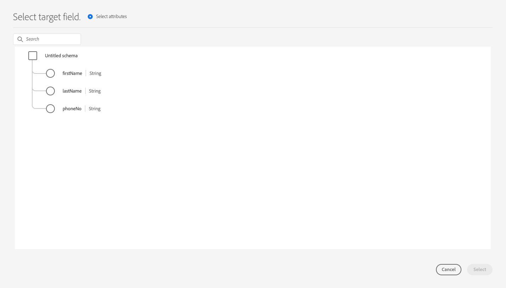
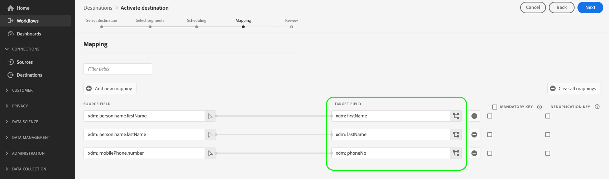
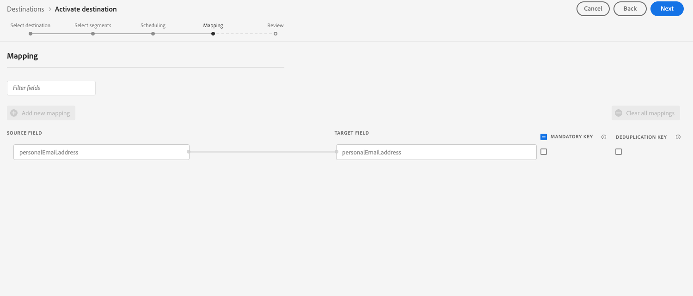

# Partner schema configuration

Experience Platform uses schemas to describe the structure of data in a consistent and reusable way. When data is ingested into Platform, it is structured according to an XDM schema. For more information on the schema composition model, including design principles and best practices, see the [basics of schema composition](../../../../xdm/schema/composition.md).

When building a destination with Destination SDK, you can define your own partner schema to be used by your destination platform. This gives users the ability to map profile attributes from Platform to specific fields that your destination platform recognizes, all within the Platform UI.

When configuring the partner schema for your destination, you can fine tune the field mapping supported by your destination platform, such as:

* Allow users to map a `phoneNumber` XDM attribute to a `phone` attribute supported by your destination platform.
* Create dynamic partner schemas that Experience Platform can dynamically call to retrieve a list of all supported attributes within your destination.
* Define mandatory field mappings that your destination platform requires.

To understand where this component fits into an integration created with Destination SDK, see the diagram in the [configuration options](../configuration-options.md) documentation or see the the guide on how to [use Destination SDK to configure a file-based destination](../../guides/configure-file-based-destination-instructions.md#create-server-file-configuration).

You can configure your schema settings via the `/authoring/destinations` endpoint. See the following API reference pages for detailed API call examples where you can configure the components shown in this page.

* [Create a destination configuration](../../authoring-api/destination-configuration/create-destination-configuration.md)
* [Update a destination configuration](../../authoring-api/destination-configuration/update-destination-configuration.md)

This article describes all the supported schema configuration options that you can use for your destination, and shows what customers will see in the Platform UI.

>[!IMPORTANT]
>
>All parameter names and values supported by Destination SDK are **case sensitive**. To avoid case sensitivity errors, please use the parameters names and values exactly as shown in the documentation.

## Supported integration types {#supported-integration-types}

Refer to the table below for details on which types of integrations support the functionality described on this page.

|Integration type| Supports functionality |
|---|---|
| Real-time (streaming) integrations | Yes |
| File-based (batch) integrations | Yes |

## Supported schema configuration {#supported-schema-types}

Destination SDK supports multiple schema configurations:

* Static schemas are defined through the `profileFields` array in the `schemaConfig` section. In a static schema, you define every target attribute that should be shown in the Experience Platform UI in the `profileFields` array. If you need to update your schema, you must [update the destination configuration](../../authoring-api/destination-configuration/update-destination-configuration.md).
* Dynamic schemas use an additional destination server type, called a [dynamic schema server](../../authoring-api/destination-server/create-destination-server.md), to dynamically generate schemas based on your own API. Dynamic schemas do not use the `profileFields` array. If you need to update your schema, there is no need to [update the destination configuration](../../authoring-api/destination-configuration/update-destination-configuration.md). Instead, the dynamic schema server retrieves the updated schema from your API.
* Within the schema configuration, you have the option of adding required (or predefined) mappings. These are mappings that users are able to view in the Platform UI, but they cannot modify them when setting up a connection to your destination. For example, you can enforce the email address field to always be sent to the destination.

The `schemaConfig` section uses multiple configuration parameters, depending on the type of schema that you need, as shown in the sections below.

## Create a static schema {#attributes-schema}

To create a static schema with profile attributes, define the target attributes in the `profileFields` array as shown below.

```json
"schemaConfig":{
      "profileFields":[
           {
              "name":"phoneNo",
              "title":"phoneNo",
              "description":"This is a fixed attribute on your destination side that customers can map profile attributes to. For example, the mobilePhone.number value in Experience Platform could be phoneNo on your side.",
              "type":"string",
              "isRequired":false,
              "readOnly":false,
              "hidden":false
           },
                      {
              "name":"firstName",
              "title":"firstName",
              "description":"This is a fixed attribute on your destination side that customers can map profile attributes to. For example, the person.name.firstName value in Experience Platform could be firstName on your side.",
              "type":"string",
              "isRequired":false,
              "readOnly":false,
              "hidden":false
           },
                      {
              "name":"lastName",
              "title":"lastName",
              "description":"This is a fixed attribute on your destination side that customers can map profile attributes to. For example, the person.name.lastName value in Experience Platform could be phoneNo on your side.",
              "type":"string",
              "isRequired":false,
              "readOnly":false,
              "hidden":false
           }
        ],
      "useCustomerSchemaForAttributeMapping":false,
      "profileRequired":true,
      "segmentRequired":true,
      "identityRequired":true,
      "segmentNamespaceAllowed": ["someNamespace"],
      "segmentNamespaceDenied": ["someOtherNamespace"]

}
```

|Parameter | Type | Required/Optional | Description |
|---------|----------|------|---|
|`profileFields` | Array | Optional | Defines the array of target attributes accepted by your destination platform to which customers can map their profile attributes. When using a `profileFields` array, you can omit the `useCustomerSchemaForAttributeMapping` parameter entirely. |
|`useCustomerSchemaForAttributeMapping`| Boolean | Optional | Enables or disables the mapping of attributes from the customer schema to the attributes that you define in the `profileFields` array. <ul><li>If set to `true`, users only see the source column in the mapping field. `profileFields` are not applicable in this case.</li><li>If set to `false`, users can map source attributes from their schema to the attributes you defined in the `profileFields` array.</li></ul> The default value is `false`.|
|`profileRequired` | Boolean | Optional | Use `true` if users should be able to map profile attributes from Experience Platform to custom attributes on your destination platform. |
|`segmentRequired` | Boolean | Required | This parameter is required by Destination SDK and should always be set to `true`. |
|`identityRequired` | Boolean | Required | Set to `true` if users should be able to map [identity types](identity-namespace-configuration.md) from Experience Platform to the attributes you defined in the `profileFields` array . |
|`segmentNamespaceAllowed`| Array | Optional | Defines specific audience namespaces from which users can map audiences to the destination. Use this parameter to restrict Platform users to export audiences from only the audience namespaces that you define in the array. This parameter cannot be used together with `segmentNamespaceDenied`.<br> <br> Example: `"segmentNamespaceAllowed": ["AudienceManager"]` will allow users to map only audiences from the `AudienceManager` namespace to this destination. <br> <br> To allow users to export any audience to your destination, you can ignore this parameter.|
|`segmentNamespaceDenied`| Array | Optional | Restricts users from mapping audiences to the destination, from the audience namespaces defined in the array. Cannot be used together with `segmentNamespaceAllowed`. <br> <br> Example: `"segmentNamespaceDenied": ["AudienceManager"]` will block users from mapping audiences from the `AudienceManager` namespace to this destination. <br> <br> To allow users to export any audience to your destination, you can ignore this parameter. |

{style="table-layout:auto"}

The resulting UI experience is shown in the images below.

When users select the target mapping, they can see the fields defined in the `profileFields` array.



After selecting the attributes, they can see them in the target field column.



## Create a dynamic schema {#dynamic-schema-configuration}

Destination SDK supports the creation of dynamic partner schemas. As opposed to a static schema, a dynamic schema does not use a `profileFields` array. Instead, dynamic schemas use a dynamic schema server which connects to your own API from where it retrieves the schema configuration.

>[!IMPORTANT]
>
>Before you create a dynamic schema, you must [create a dynamic schema server](../../authoring-api/destination-server/create-destination-server.md).

In a dynamic schema configuration, the `profileFields` array is replaced by the `dynamicSchemaConfig` section, as shown below.

```json
"schemaConfig":{
   "dynamicSchemaConfig":{
      "dynamicEnum": {
         "authenticationRule":"CUSTOMER_AUTHENTICATION",
         "destinationServerId":"DYNAMIC_SCHEMA_SERVER_ID",
         "value": "Schema Name",
         "responseFormat": "SCHEMA"
      }
   },
   "profileRequired":true,
   "segmentRequired":true,
   "identityRequired":true
}
```

|Parameter | Type | Required/Optional |Description|
|---------|----------|------|---|
| `dynamicEnum.authenticationRule` | String | Required | Indicates how [!DNL Platform] customers connect to your destination. Accepted values are `CUSTOMER_AUTHENTICATION`, `PLATFORM_AUTHENTICATION`, `NONE`. <br> <ul><li>Use `CUSTOMER_AUTHENTICATION` if Platform customers log into your system via any of the authentication methods described [here](customer-authentication.md). </li><li> Use `PLATFORM_AUTHENTICATION` if there is a global authentication system between Adobe and your destination and the [!DNL Platform] customer does not need to provide any authentication credentials to connect to your destination. In this case, you must [create a credentials object](../../credentials-api/create-credential-configuration.md) using the Credentials API. </li><li>Use `NONE` if no authentication is required to send data to your destination platform. </li></ul> |
| `dynamicEnum.destinationServerId` | String | Required | The `instanceId` of your dynamic schema server. This destination server includes the API endpoint which Experience Platform will call to retrieve the dynamic schema. |
| `dynamicEnum.value` |String| Required |The name of the dynamic schema, as defined in the dynamic schema server configuration.|
| `dynamicEnum.responseFormat` | String | Required | Always set to `SCHEMA` when defining a dynamic schema.|
|`profileRequired` | Boolean | Optional | Use `true` if users should be able to map profile attributes from Experience Platform to custom attributes on your destination platform. |
|`segmentRequired` | Boolean | Required | This parameter is required by Destination SDK and should always be set to `true`. |
|`identityRequired` | Boolean | Required | Set to `true` if users should be able to map [identity types](identity-namespace-configuration.md) from Experience Platform to the attributes you defined in the `profileFields` array . |

{style="table-layout:auto"}

## Required mappings {#required-mappings}

Within the schema configuration, in addition to your static or dynamic schema, you have the option of adding required (or predefined) mappings. These are mappings that users are able to view in the Platform UI, but they cannot modify them when setting up a connection to your destination.

For example, you can enforce the email address field to always be sent to the destination.

>[!NOTE]
>
>The following combinations of required mappings are currently supported: 
>* You can configure a required source field and a required destination field. In this case, users cannot edit or select any of the two fields and can only view the selection.
>* You can configure a required destination field only. In this case, users will be allowed to select a source field to map to the destination.
>
> Configuring a required source field only is currently *not* supported.

See below two examples of a schema configuration with required mappings and what these look like in the mapping step of the [activate data to batch destinations workflow](../../../ui/activate-batch-profile-destinations.md). 


>[!BEGINTABS]

>[!TAB Required source and destination mappings]

The example below shows both required source and destination mappings. When both source and destination fields are specified as required mappings, users cannot select or edit any of the two fields, and can only view the predefined selection.

```json
"schemaConfig": {
    "requiredMappingsOnly": true,
    "requiredMappings": [
      {
        "sourceType": "text/x.schema-path",
        "source": "personalEmail.address",
        "destination": "personalEmail.address"
      }
    ] 
}
```

|Parameter | Type | Required/Optional |Description|
|---|---|---|---|
|`requiredMappingsOnly`| Boolean | Optional | When this is set to true , users cannot map other attributes and identities in the activation flow, apart from the required mappings that you define in the `requiredMappings` array.|
|`requiredMappings.sourceType`| String | Required | Indicates the type of the `source` field. Supported values: <ul><li>`text/x.schema-path`: Use this value when the `source` field is a profile attribute from an XDM schema.</li><li>`text/x.aep-xl`: Use this value when your `source` field is defined by a regular expression. Example: `iif(segmentMembership.ups.aep_seg_id.status==\"exited\", \"1\", \"0\")`</li><li>`text/plain`: Use this value when your `source` field is defined by a macro template. Currently, the only supported macro template is `metadata.segment.alias`.</li></ul> |
|`requiredMappings.source`| String | Required| Indicates the value of the source field. Supported value types: <ul><li>XDM profile attributes. Example: `personalEmail.address`. When your source attribute is an XDM profile attribute, set the `sourceType` parameter to `text/x.schema-path`.</li><li>Regular expressions. Example: `iif(segmentMembership.ups.aep_seg_id.status==\"exited\", \"1\", \"0\")`. When your source attribute is a regular expression, set the `sourceType` parameter to `text/x.aep-xl`.</li><li>Macro templates. Example:`metadata.segment.alias`. When your source attribute is a macro template, set the `sourceType` parameter to `text/plain`. Currently, the only supported macro template is `metadata.segment.alias`.</li></ul>|
|`requiredMappings.destination`| String | Required | Indicates the value of the target field. When both source and destination fields are specified as required mappings, users cannot select or edit any of the two fields and can only view the selection.|

{style="table-layout:auto"}

As a result, both the **[!UICONTROL Source field]** and **[!UICONTROL Target field]** sections in the Platform UI are greyed out.



>[!TAB Required destination mapping]

The example below shows a required destination mapping. If only the destination field is specified as required, users can select what source field to map to it.

```json
"schemaConfig": {
    "requiredMappingsOnly": true,
    "requiredMappings": [
      {
        "destination": "identityMap.ExamplePartner_ID",
        "mandatoryRequired": true,
        "primaryKeyRequired": true
      }
    ] 
}
```

|Parameter | Type | Required/Optional |Description|
|---|---|---|---|
|`requiredMappingsOnly`| Boolean | Optional | When this is set to true , users cannot map other attributes and identities in the activation flow, apart from the required mappings that you define in the `requiredMappings` array.|
|`requiredMappings.destination`| String | Required | Indicates the value of the target field. When only the destination field is specified, users can select a source field to map to the destination.|
|`mandatoryRequired`| Boolean | Optional | Indicates whether the mapping should be marked as a [mandatory attribute](../../../ui/activate-batch-profile-destinations.md#mandatory-attributes). |
|`primaryKeyRequired`| Boolean | Optional | Indicates whether the mapping should be marked as a [deduplication key](../../../ui/activate-batch-profile-destinations.md#deduplication-keys).|

{style="table-layout:auto"}

As a result, the **[!UICONTROL Target field]** section in the Platform UI is greyed out, while the **[!UICONTROL Source field]** section is active and users can interact with it. The **[!UICONTROL Mandatory key]** and **[!UICONTROL Deduplication key]** options are active, and users cannot change them.


>[!ENDTABS]

## Next steps {#next-steps}

After reading this article, you should have a better understanding of what schema types are supported by Destination SDK and how you can configure your schema.

To learn more about the other destination components, see the following articles:

* [Customer authentication](customer-authentication.md)
* [OAuth2 authentication](oauth2-authentication.md)
* [UI attributes](ui-attributes.md)
* [Customer data fields](customer-data-fields.md)
* [Identity namespace configuration](identity-namespace-configuration.md)
* [Supported mapping configurations](supported-mapping-configurations.md)
* [Destination delivery](destination-delivery.md)
* [Audience metadata configuration](audience-metadata-configuration.md)
* [Aggregation policy](aggregation-policy.md)
* [Batch configuration](batch-configuration.md)
* [Historical profile qualifications](historical-profile-qualifications.md)