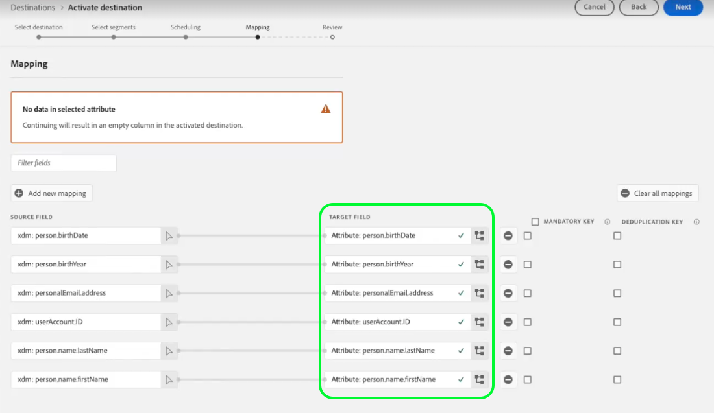

# Partner schema configuration

Experience Platform uses schemas to describe the structure of data in a consistent and reusable way. When data is ingested into Platform, it is structured according to an XDM schema. For more information on the schema composition model, including design principles and best practices, see the [basics of schema composition](../../../../xdm/schema/composition.md).

When building a destination with Destination SDK, you can define your own partner schema to be used by your destination platform. This gives users the ability to map identity namespaces or profile attributes from Platform to specific fields that your destination platform recognizes, all within the Platform UI.

When configuring the partner schema for your destination, you can fine tune the field mapping supported by your destination platform, such as:

* Allow users to map a `phoneNumber` XDM attribute to a `phone` attribute supported by your destination platform.
* Create dynamic partner schemas that your users can choose from when mapping their Platform data.
* Define mandatory field mappings that your destination platform requires.

To understand where this component fits into an integration created with Destination SDK, see the diagram in the [configuration options](../configuration-options.md) documentation or see the the guide on how to [use Destination SDK to configure a file-based destination](../../guides/configure-file-based-destination-instructions.md#create-server-file-configuration).

You can configure your schema settings via the `/authoring/destinations` endpoint. See the following API reference pages for detailed API call examples where you can configure the components shown in this page.

* [Create a destination configuration](../../authoring-api/destination-configuration/create-destination-configuration.md)
* [Update a destination configuration](../../authoring-api/destination-configuration/update-destination-configuration.md)

This article describes all the supported schema configuration options that you can use for your destination, and shows what customers will see in the Platform UI.

## Supported integration types {#supported-integration-types}

Refer to the table below for details on what type of destinations support the functionality described in this page.

|Integration type| Supports functionality |
|---|---|
| Real-time (streaming) integrations | :white_check_mark: |
| File-based (batch) integrations | :white_check_mark: |

## Supported parameters {#supported-parameters}

When creating your own schema configuration, you can use the parameters described in the table below to define how users can map data to your schema.

|Parameter | Type | Required/Optional |Description|
|---------|----------|------|---|
|`profileFields` | Array | | When you add predefined profile fields, users have the option to map Platform attributes to predefined attributes in your destination platform. |
|`identityRequired` | Boolean | | Use `true` if users should be able to map identity namespaces from Experience Platform to your schema. |
|`profileRequired` | Boolean | | Use `true` if users should be able to map profile attributes from Experience Platform to custom attributes on your destination platform. |
|`segmentRequired` | Boolean | | This parameter should always be set to `true`. |
|`useCustomerSchemaForAttributeMapping`|Boolean|||
|`destinationServerId` | String | Required if using dynamic partner schemas. | The `instanceId` of the [destination server configuration](../../authoring-api/destination-server/create-destination-server.md) that you created for your dynamic partner schema. This destination server includes the HTTP endpoint which Experience Platform will call to retrieve the dynamic schema used to populate target fields. |
|`authenticationRule` | String | |Indicates how [!DNL Platform] customers connect to your destination. Accepted values are `CUSTOMER_AUTHENTICATION`, `PLATFORM_AUTHENTICATION`, `NONE`. <br> <ul><li>Use `CUSTOMER_AUTHENTICATION` if Platform customers log into your system via any of the following methods: <ul><li>`"authType": "S3"`</li><li>`"authType":"AZURE_CONNECTION_STRING"`</li><li>`"authType":"AZURE_SERVICE_PRINCIPAL"`</li><li>`"authType":"SFTP_WITH_SSH_KEY"`</li><li>`"authType":"SFTP_WITH_PASSWORD"`</li></ul> </li><li> Use `PLATFORM_AUTHENTICATION` if there is a global authentication system between Adobe and your destination and the [!DNL Platform] customer does not need to provide any authentication credentials to connect to your destination. In this case, you must [create a credentials object](../../credentials-api/create-credential-configuration.md) using the Credentials API. </li><li>Use `NONE` if no authentication is required to send data to your destination platform. </li></ul> |
|`value`| String | | The name of the schema to be displayed in the Experience Platform user interface, in the mapping step. |
|`responseFormat`|String| |Always set to `SCHEMA` when defining a custom schema.|
| `requiredMappingsOnly` |Boolean|| Indicates if users can map other attributes and identities in the activation flow, *apart from* the required mappings that you define. |
| `mandatoryRequired`|Boolean| |Set to `true` if this field must be a mandatory attribute which should always be present in file exports to your destination. Read more about [mandatory attributes](../../../ui/activate-batch-profile-destinations.md#mandatory-attributes). |
| `requiredMappings.primaryKeyRequired` |Boolean| |Set to true if this field must be used as a deduplication key in file exports to your destination. Read more about [deduplication keys](../../../ui/activate-batch-profile-destinations.md#deduplication-keys). |
| `sourceType` | String| | Used when you configure a source field as required mapping. Set this value to `"text/x.schema-path"`, which indicates that the source field is a predefined XDM attribute.|
| `source` | String | | Indicates what the required source field should be. For example: `"source":"personalEmail.address"`. |
| `destination` | String |  | Indicates what the required destination field should be. For example: `"destination":"emailAddress"`.|


Use the parameters in `schemaConfig` to enable the mapping step of the destination activation workflow. By using the parameters described below, you can determine if Experience Platform users can map profile attributes and/or identities to your file-based destination.

You can create static, hardcoded schema fields or you can specify a dynamic schema that Experience Platform should connect to in order to dynamically retrieve and populate fields in the target schema of the mapping workflow. The target schema is shown in the screenshot below.



## Static hardcoded schema field configuration

```json
"schemaConfig":{
      "profileFields":[
           {
              "name":"phoneNo",
              "title":"phoneNo",
              "description":"This is a fixed attribute on your destination side that customers can map profile attributes to. For example, the phoneNumber value in Experience Platform could be phoneNo on your side.",
              "type":"string",
              "isRequired":false,
              "readOnly":false,
              "hidden":false
           }
        ],
      "profileRequired":true,
      "segmentRequired":true,
      "identityRequired":true
}
```


## Dynamic schema configuration in the mapping step {#dynamic-schema-configuration}

Use the parameters in  `dynamicSchemaConfig` to dynamically retrieve your own schema that Platform profile attributes and/or identities can be mapped to.

```json
"schemaConfig":{
   "dynamicSchemaConfig":{
      "dynamicEnum": {
         "authenticationRule":"CUSTOMER_AUTHENTICATION",
         "destinationServerId":"2aa8a809-c4ae-4f66-bb02-12df2e0a2279",
         "value": "Schema Name",
         "responseFormat": "SCHEMA"
      }
   },
   "profileRequired":true,
   "segmentRequired":true,
   "identityRequired":true
}
```

|Parameter | Type | Description|
|---------|----------|------|
| `profileRequired` | Boolean | Use `true` if users should be able to map profile attributes from Experience Platform to custom attributes on your destination's side, as shown in the example configuration above. |
| `segmentRequired` | Boolean | Always use `segmentRequired:true`. |
| `identityRequired` | Boolean | Use `true` if users should be able to map identity namespaces from Experience Platform to your desired schema. |
| `destinationServerId` | String | The `instanceId` of the [destination server configuration](../../authoring-api/destination-server/create-destination-server.md) that you created for your dynamic schema. This destination server includes the HTTP endpoint which Experience Platform will call to retrieve the dynamic schema used to populate target fields. |
| `authenticationRule` | String | Indicates how [!DNL Platform] customers connect to your destination. Accepted values are `CUSTOMER_AUTHENTICATION`, `PLATFORM_AUTHENTICATION`, `NONE`. <br> <ul><li>Use `CUSTOMER_AUTHENTICATION` if Platform customers log into your system via any of the following methods: <ul><li>`"authType": "S3"`</li><li>`"authType":"AZURE_CONNECTION_STRING"`</li><li>`"authType":"AZURE_SERVICE_PRINCIPAL"`</li><li>`"authType":"SFTP_WITH_SSH_KEY"`</li><li>`"authType":"SFTP_WITH_PASSWORD"`</li></ul> </li><li> Use `PLATFORM_AUTHENTICATION` if there is a global authentication system between Adobe and your destination and the [!DNL Platform] customer does not need to provide any authentication credentials to connect to your destination. In this case, you must [create a credentials object](../../credentials-api/create-credential-configuration.md) using the Credentials API. </li><li>Use `NONE` if no authentication is required to send data to your destination platform. </li></ul> |
| `value` |String|The name of the schema to be displayed in the Experience Platform user interface, in the mapping step.|
| `responseFormat` |String|Always set to `SCHEMA` when defining a custom schema.|

{style="table-layout:auto"}

## Required mappings {#required-mappings}

Within the schema configuration, you have the option of adding required (or predefined) mappings. These are mappings that users are able to view but not modify when they set up a connection to your destination. For example, you can enforce the email address field to always be sent to the destination in the exported files. See below two examples of a schema configuration with required mappings and what these look like in the mapping step of the [activate data to batch destinations workflow](../../../ui/activate-batch-profile-destinations.md). 

```json
    "requiredMappingsOnly": true, // when this is selected true , users cannot map other attributes and identities in the activation flow, apart from the required mappings that you define.
    "requiredMappings": [
      {
        "destination": "identityMap.ExamplePartner_ID", //if only the destination field is specified, then the user is able to select a source field to map to the destination.
        "mandatoryRequired": true,
        "primaryKeyRequired": true
      }
    ] 
```


```json
    "requiredMappingsOnly": true, // when this is set to true , users cannot map other attributes and identities in the activation flow, apart from the required mappings that you define.
    "requiredMappings": [
      {
        "sourceType": "text/x.schema-path",
        "source": "personalEmail.address",
        "destination": "personalEmail.address" //when both source and destination fields are specified as required mappings, then the user can not select or edit any of the two fields and can only view the selection.
      }
    ] 
```


>[!NOTE]
>
>Currently supported combinations of required mappings are: 
>* You can configure a required source field and a required destination field. In this case, users cannot edit or select any of the two fields and can only view the selection.
>* You can configure a required destination field only. In this case, users will be allowed to select a source field to map to the destination.
>
> Configuring a required source field only is currently *not* supported.

Use the parameters described in the table below if you would like to add required mappings in the activation workflow for your destination.

|Parameter | Type | Description|
|---------|----------|------|
|`requiredMappingsOnly`|Boolean|Indicates if users are be able to map other attributes and identities in the activation flow, *apart from* the required mappings that you define.|
|`requiredMappings.mandatoryRequired`|Boolean| Set to true if this field must be a mandatory attribute which should always be present in file exports to your destination. Read more about [mandatory attributes](../../../ui/activate-batch-profile-destinations.md#mandatory-attributes). |
|`requiredMappings.primaryKeyRequired`|Boolean| Set to true if this field must be used as a deduplication key in file exports to your destination. Read more about [deduplication keys](../../../ui/activate-batch-profile-destinations.md#deduplication-keys). |
|`requiredMappings.sourceType`|String| Used when you configure a source field as required. Use `"text/x.schema-path"`,  which indicates that the source field is a predefined XDM attribute|
|`requiredMappings.source`|String|Indicates what the required source field should be.|
|`requiredMappings.destination`|String|Indicates what the required destination field should be.|

{style="table-layout:auto"}
