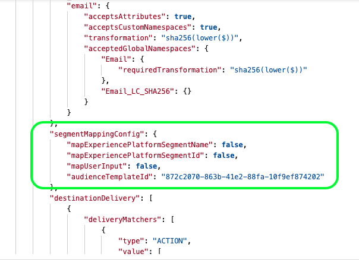

# Segment mapping configuration

This section of the destination configuration relates to how segment metadata like segment names or IDs should be shared between Experience Platform and your destination.

|Parameter|Type|Description|
|---|---|---|
|`mapExperiencePlatformSegmentName` | Boolean | Controls whether the segment mapping ID in the destination activation workflow is the Experience Platform segment name. |
|`mapExperiencePlatformSegmentId` | Boolean | Controls whether the segment mapping ID in the destination activation workflow is the Experience Platform segment ID. |
|`mapUserInput` | Boolean | Controls whether the segment mapping ID in the destination activation workflow is input by user. |
|`audienceTemplateId` | Boolean | The `instanceId` of the [audience metadata template](../../metadata-api/create-audience-template.md) used for this destination. Through the `audienceTemplateId`, this section also ties together this configuration with the [audience metadata configuration](../audience-metadata-management.md).|

