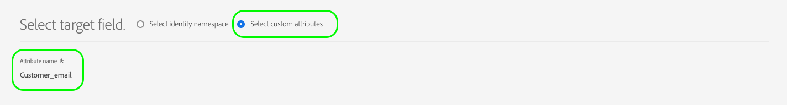
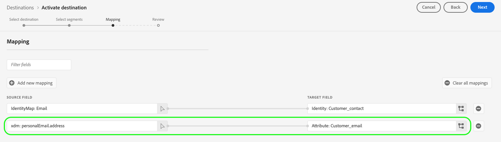
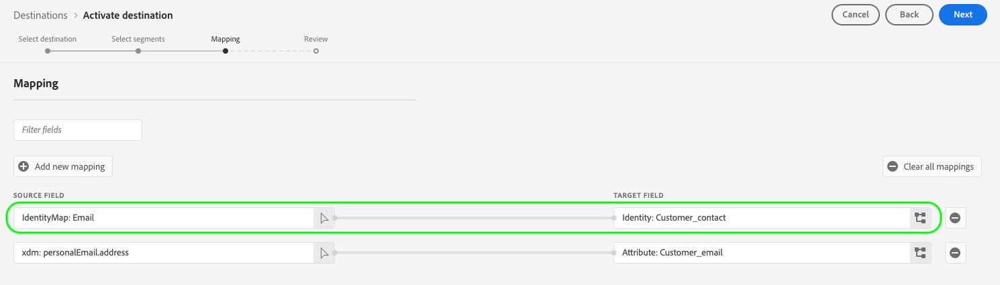
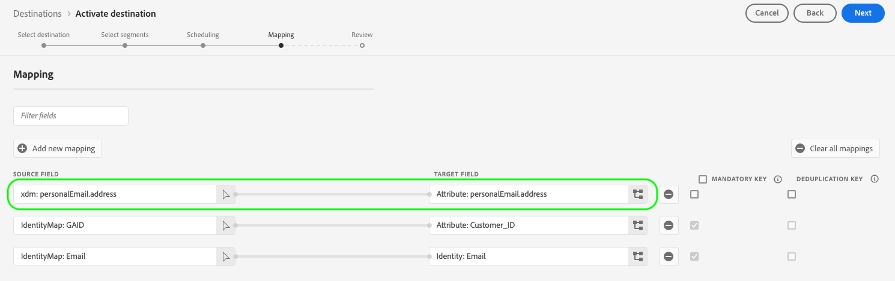
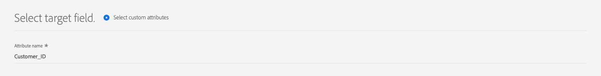
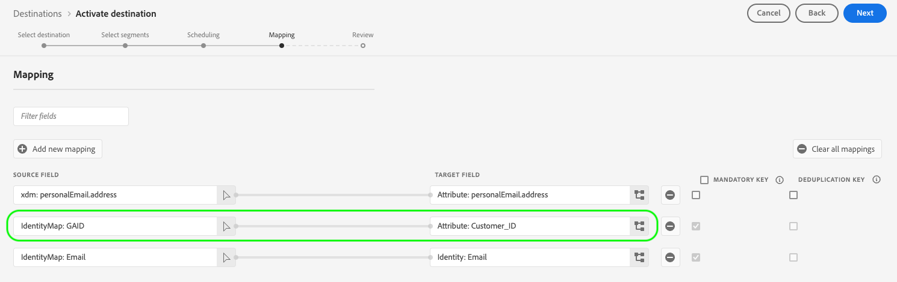
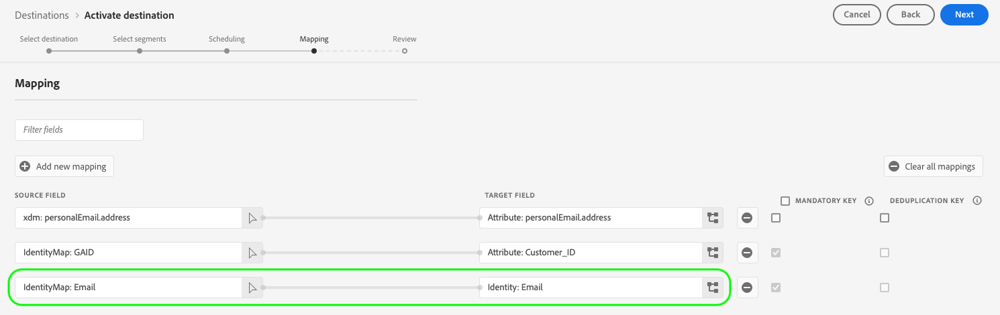

# Supported mapping configurations

Destinations built with Destination SDK support specific identity namespace and attribute mapping configurations, based on the destination type.

This article describes all the supported mapping configurations that you can use when configuring your destination.

>[!WARNING]
>
>Any mapping configuration that is not described in this article is not supported by Destination SDK.

When building your destination, configure your schema and identity namespaces according to one of the mapping configurations described in this page.

## Supported mappings for streaming destinations {#streaming-mappings}

Streaming (or URL-based) destinations built with Destination SDK support the mapping configurations described in the table below.

| Source field | Target field |
| --- | --- |
| XDM attribute | Custom attribute |
| Identity namespace | Identity namespace |

The configuration example below allows customers to use both mappings in the table above.

```json
"schemaConfig":{
   "profileRequired":true,
   "segmentRequired":true,
   "identityRequired":true
},
"identityNamespaces":{
   "Customer_contact":{
      "acceptsAttributes":false,
      "acceptsCustomNamespaces":true,
      "acceptedGlobalNamespaces":{
         "Email":{
            
         },
         "Phone":{
            
         }
      }
   }
},
```

### Map XDM attributes to custom attributes {#streaming-xdm-to-custom}

Users can map attributes from their source XDM profile to custom attributes on your destination's side.

Users must manually enter the name of the target custom attribute when selecting the target field mapping.



The resulting UI experience is shown in the image below.



### Map identity namespaces to partner identity namespaces {#streaming-identity-to-identity}

Users can map custom or global identity namespaces from Platform to identity namespaces that you defined.

The resulting UI experience is shown in the image below.



## Supported mappings for file-based destinations {#batch-mappings}

File-based destinations built with Destination SDK support the mapping configurations described in the table below. See the next sections for detailed mapping examples.

| Source field | Target field |
| --- | --- |
| XDM attribute | Attribute / Custom attribute |
| Identity namespace | Attribute / Custom attribute |
| Identity namespace | Identity namespace |

The configuration example below allows customers to use all the mappings from the table above.

```json
"schemaConfig":{
   "profileRequired":true,
   "segmentRequired":true,
   "identityRequired":true
},
"identityNamespaces":{
   "Customer_contact":{
      "acceptsAttributes":false,
      "acceptsCustomNamespaces":true,
      "acceptedGlobalNamespaces":{
         "Email":{
            
         },
         "Phone":{
            
         }
      }
   }
},
```

### Map XDM attributes to custom attributes {#batch-xdm-to-custom}

Users can map attributes from their source XDM profile to custom attributes on your destination's side.

For file-based destinations, the target field is automatically populated with a default attribute of the same name as the source field.

The resulting UI experience is shown in the image below.



Users can leave the default name in place or enter a custom attribute name in the target field selection screen.



### Map identity namespaces to custom attributes {#batch-identity-to-custom}

Users can map custom or global identity namespaces from Platform to custom attributes on your destination's side.

When selecting an identity namespace as a source field, the target field is automatically populated with an equivalent identity namespace. To replace the target field with a custom attribute, users must enter a custom attribute name in the target field selection screen.


The resulting UI experience is shown in the image below.



### Map identity namespaces to partner identity namespaces {#batch-identity-to-identity}

Users can map custom or global identity namespaces from Platform to equivalent identity namespaces.

When selecting an identity namespace as a source field, the target field is automatically populated with an equivalent identity namespace. 

The resulting UI experience is shown in the image below.

