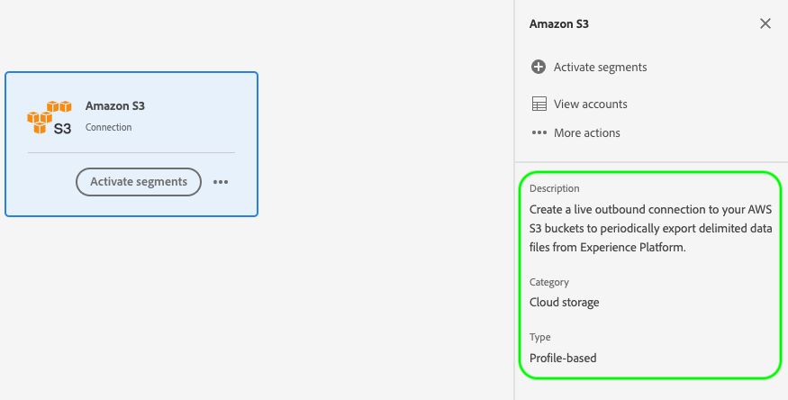
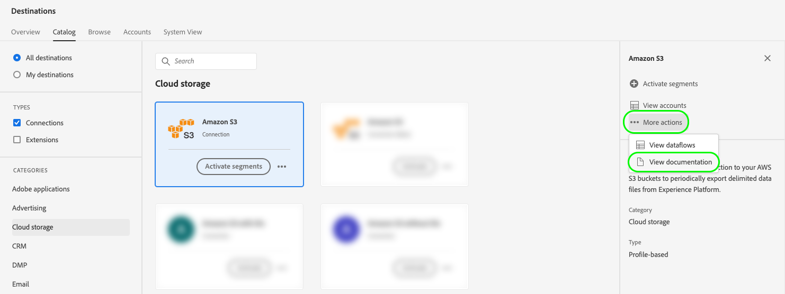
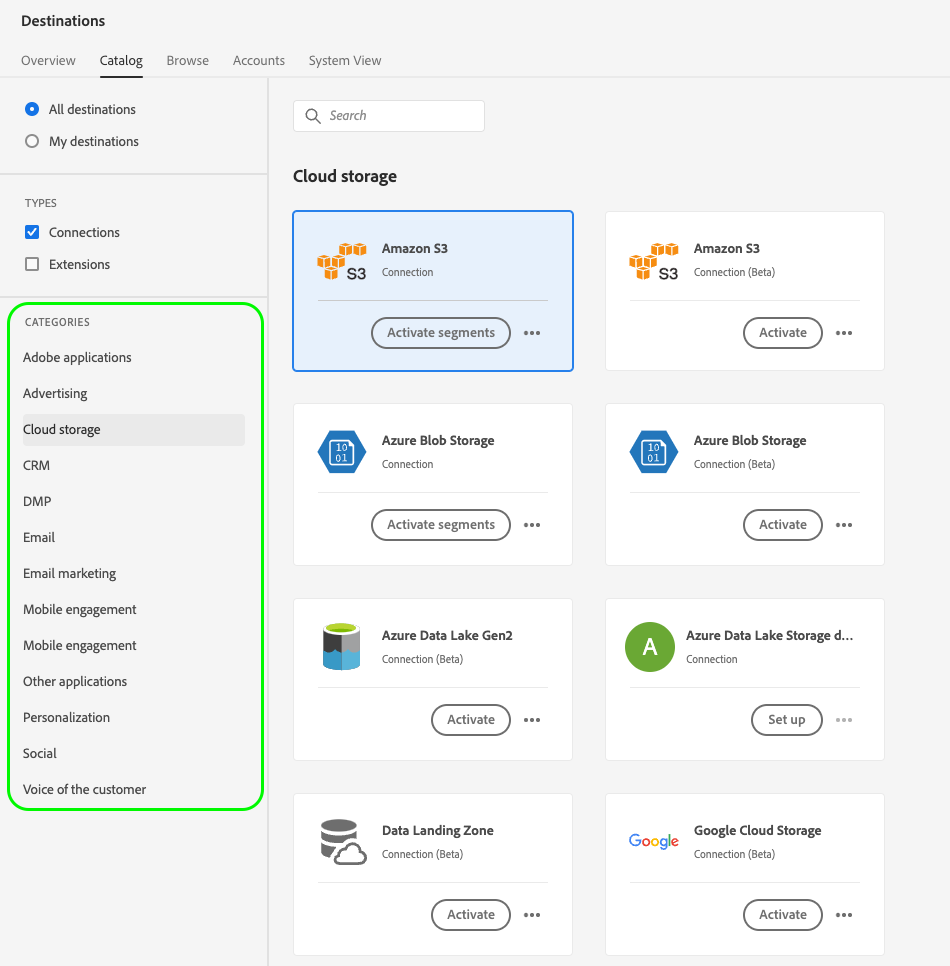
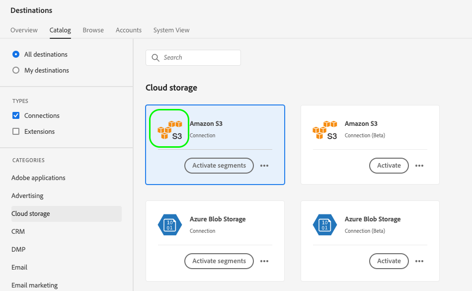
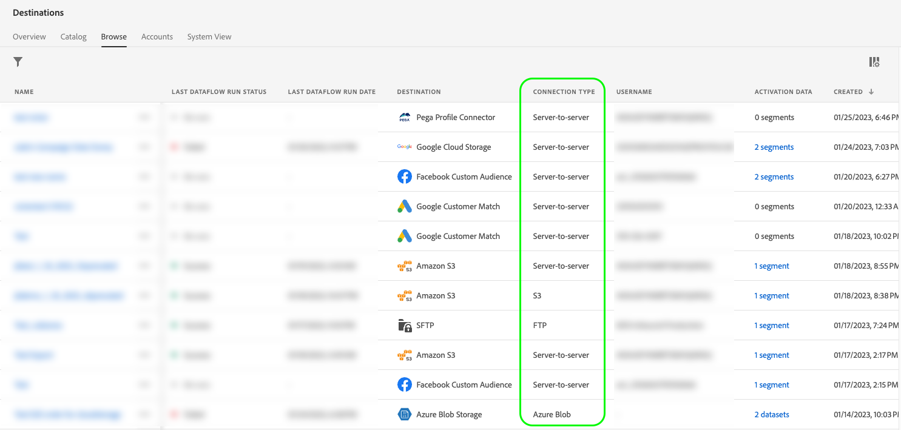
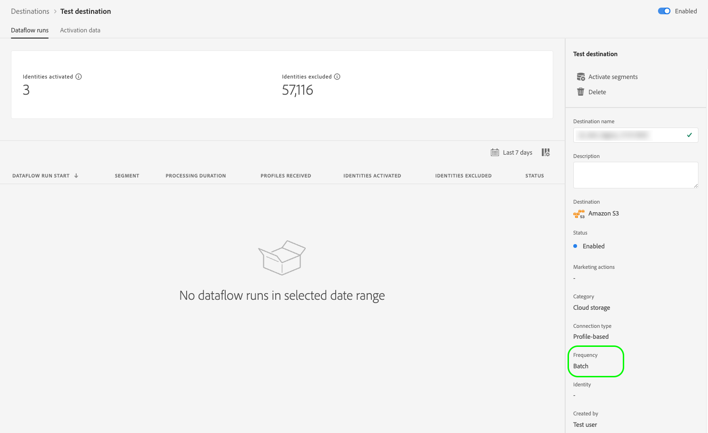

# UI attributes

UI attributes define the visual elements that Adobe should display for your destination card in the Adobe Experience Platform user interface, such as the destination platform logo, a link to the documentation page, a destination description and its category and type.

To understand where this component fits into an integration created with Destination SDK, see the diagram in the [configuration options](../configuration-options.md) documentation or see the following destination configuration overview pages:

* [Use Destination SDK to configure a streaming destination](../../guides/configure-destination-instructions.md#create-destination-configuration)
* [Use Destination SDK to configure a file-based destination](../../guides/configure-file-based-destination-instructions.md#create-destination-configuration)

When [creating a destination](../../authoring-api/destination-configuration/create-destination-configuration.md) through Destination SDK, the `uiAttributes` section defines the following visual properties of your destination card:

* The URL of your destination documentation page in the [destination catalog](../../../catalog/overview.md).
* The URL where you hosted the icon to be displayed in the destinations catalog card.
* The category under which your destination will be visible in the Platform UI.
* The data export frequency for your destination.
* The destination connection type, such as Amazon S3, Azure Blob, etc.

You can configure UI attributes via the `/authoring/destinations` endpoint. See the following API reference pages for detailed API call examples where you can configure the components shown in this page.

* [Create a destination configuration](../../authoring-api/destination-configuration/create-destination-configuration.md)
* [Update a destination configuration](../../authoring-api/destination-configuration/update-destination-configuration.md)

This article describes all the supported UI attributes that you can use for your destination, and shows what customers will see in the Experience Platform UI.



## Supported integration types {#supported-integration-types}

Refer to the table below for details on which types of integrations support the functionality described on this page.

|Integration type| Supports functionality |
|---|---|
| Real-time (streaming) integrations | Yes |
| File-based (batch) integrations | Yes |

## Supported parameters {#supported-parameters}

```json
"uiAttributes":{
      "documentationLink":"http://www.adobe.com/go/YOURDESTINATION-en",
      "category":"cloudStorage",
      "iconUrl":"https://dc5tqsrhldvnl.cloudfront.net/2/90048/da276e30c730ce6cd666c8ca78360df21.png",
      "connectionType":"S3",
      "frequency":"batch"
   }
```

### `documentationLink` {#documentation-link}

`documentationLink` is a string parameter that refers to the documentation page in the [Destinations Catalog](../../../catalog/overview.md) for your destination. Every productized destination in Adobe Experience Platform must have a corresponding documentation page. [Learn how to create a destination documentation page](../../docs-framework/documentation-instructions.md) for your destination. Note that this is not required for private/custom destinations.

Use the following format: `http://www.adobe.com/go/destinations-YOURDESTINATION-en`, where `YOURDESTINATION` is the name of your destination. For a destination called Moviestar, you would use `http://www.adobe.com/go/destinations-moviestar-en`.

Users can see and visit your documentation link from the destinations catalog page in the UI. They need to browse to your destination card, then select **[!UICONTROL More actions]**, and then **[!UICONTROL View documentation]**, as shown in the image below.



>[!NOTE]
>
>This link works only after Adobe sets your destination live and the documentation is published. 

### `category` {#category}

`category` is a string parameter that refers to the category assigned to your destination in Adobe Experience Platform. For more information, read [Destination Categories](../../../destination-types.md). Use one of the following values: `adobeSolutions, advertising, analytics, cdp, cloudStorage, crm, customerSuccess, database, dmp, ecommerce, email, emailMarketing, enrichment, livechat, marketingAutomation, mobile, personalization, protocols, social, streaming, subscriptions, surveys, tagManagers, voc, warehouses, payments`.

Users can see the list of destination categories on the left side of the screen in the destination catalog, as shown in the image below.



<!-- ### `iconUrl` {#icon-url}

`iconUrl` is a string parameter that refers to the URL where you hosted the icon to be displayed in the destinations catalog card. For private custom integrations, this is not required. For productized configurations, you need to share an icon with the Adobe team when you [submit the destination for review](../../guides/submit-destination.md#logo).

Users can see the icon on your destination card, as shown in the image below.

 -->

### `connectionType` {#connection-type}

`connectionType` is a string parameter that refers to the type of connection, depending on the destination. Supported values: <ul><li>`Server-to-server`</li><li>`Cloud storage`</li><li>`Azure Blob`</li><li>`Azure Data Lake Storage`</li><li>`S3`</li><li>`SFTP`</li><li>`DLZ`</li></ul>

Users can see the destination connection type in the [Browse](../../../ui/destinations-workspace.md#browse) tab of the destinations workspace.



### `frequency` {#frequency}

`frequency` is a string parameter that refers to the type of data export supported by your destination. Set to `Streaming` for API-based integrations, or `Batch` when you export files to your destinations.

Users can see the frequency type in the **[!UICONTROL Dataflow runs]** page of each destination connection.



## Next steps {#next-steps}

After reading this article, you should have a better understanding of what UI attributes you can configure for your destination and where the users will see them in the Platform UI.

To learn more about the other destination components, see the following articles:

* [Customer authentication](customer-authentication.md)
* [OAuth2 authentication](oauth2-authentication.md)
* [Customer data fields](customer-data-fields.md)
* [Schema configuration](schema-configuration.md)
* [Identity namespace configuration](identity-namespace-configuration.md)
* [Destination delivery](destination-delivery.md)
* [Audience metadata configuration](audience-metadata-configuration.md)
* [Aggregation policy](aggregation-policy.md)
* [Batch configuration](batch-configuration.md)
* [Historical profile qualifications](historical-profile-qualifications.md)