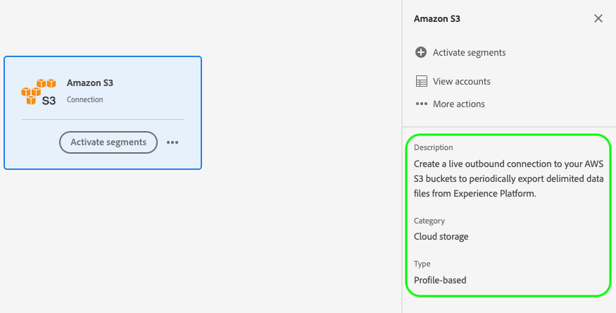
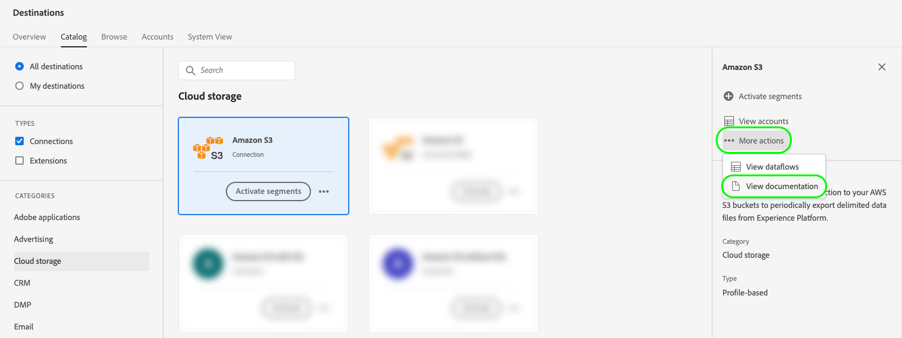
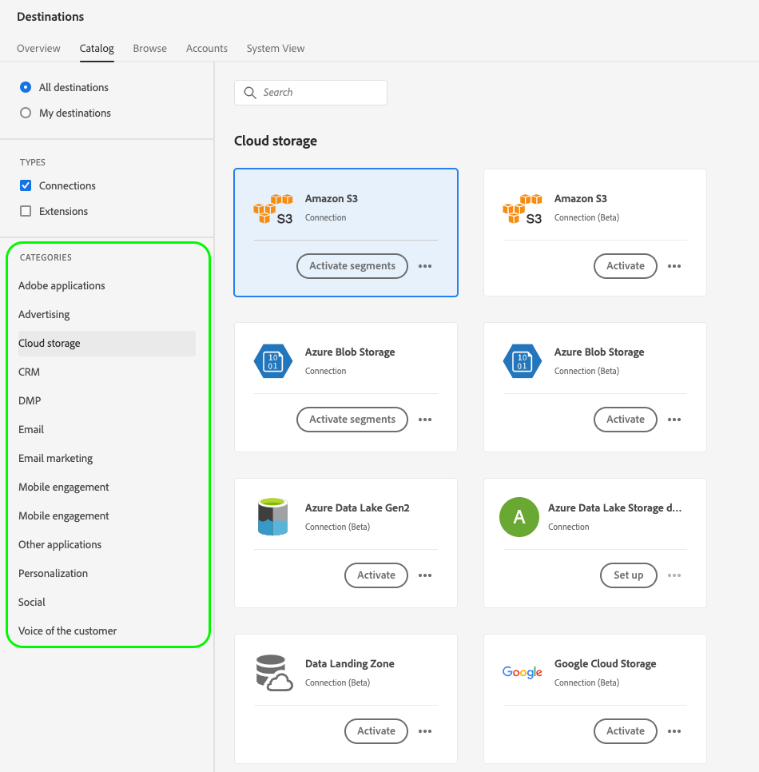
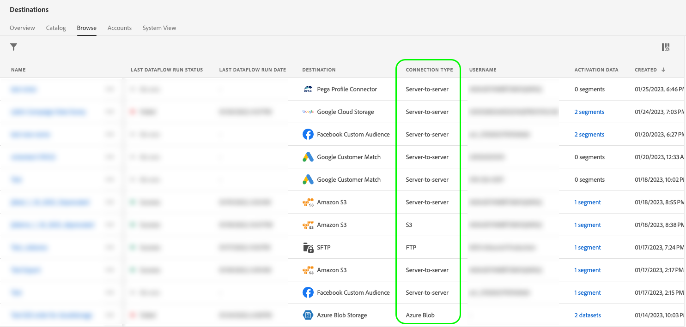
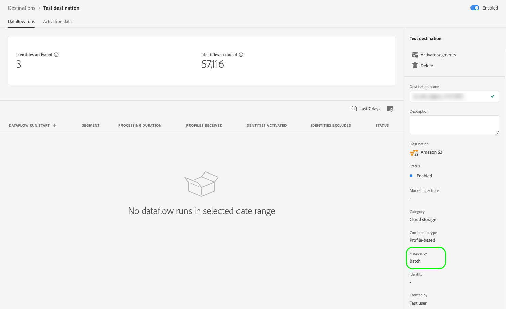
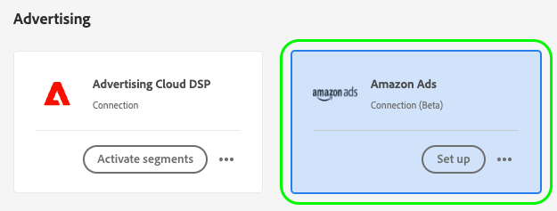
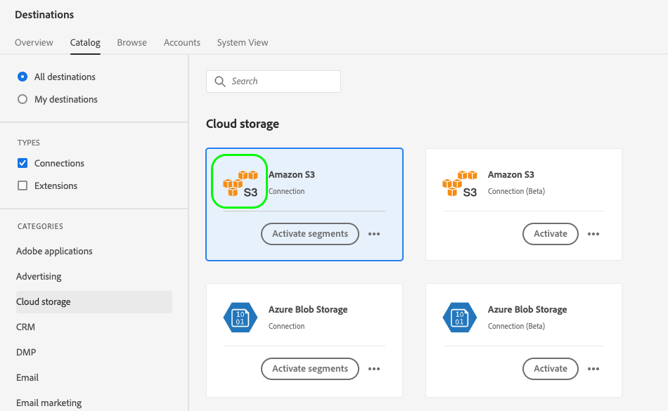

# UI attributes

UI attributes define the visual elements that Adobe should display for your destination card in the [!DNL Adobe Experience Platform] user interface, such as a logo, a link to the documentation page, a destination description, and its category and type.

To understand where this component fits into an integration created with Destination SDK, see the diagram in the [configuration options](../configuration-options.md) documentation or see the following destination configuration overview pages:

* [Use Destination SDK to configure a streaming destination](../../guides/configure-destination-instructions.md#create-destination-configuration)
* [Use Destination SDK to configure a file-based destination](../../guides/configure-file-based-destination-instructions.md#create-destination-configuration)

When [creating a destination](../../authoring-api/destination-configuration/create-destination-configuration.md) through Destination SDK, the `uiAttributes` section defines the following visual properties of your destination card:

* The URL of your destination documentation page in the [destination catalog](../../../catalog/overview.md).
* The category under which your destination appears in the [!DNL Experience Platform] UI.
* The data export frequency for your destination.
* The destination connection type, such as [!DNL Amazon S3] or [!DNL Azure Blob].
* The URL where you hosted the icon to be displayed in the destinations catalog card.

You can configure UI attributes via the `/authoring/destinations` endpoint. See the following API reference pages for detailed API call examples where you can configure the components shown in this page.

* [Create a destination configuration](../../authoring-api/destination-configuration/create-destination-configuration.md)
* [Update a destination configuration](../../authoring-api/destination-configuration/update-destination-configuration.md)

This article describes all the supported UI attributes that you can use for your destination, and shows what customers will see in the [!DNL Experience Platform] UI.



>[!IMPORTANT]
>
>All parameter names and values supported by [!DNL Destination SDK] are **case sensitive**. To avoid case sensitivity errors, use the parameter names and values exactly as shown in the documentation.

## Supported integration types {#supported-integration-types}

Refer to the table below for details on which types of integrations support the functionality described on this page.

|Integration type| Supports functionality |
|---|---|
| Real-time (streaming) integrations | Yes |
| File-based (batch) integrations | Yes |

{style="table-layout:auto"}

## Supported parameters {#supported-parameters}

```json
"uiAttributes":{
      "documentationLink":"http://www.adobe.com/go/YOURDESTINATION-en",
      "category":"cloudStorage",
      "connectionType":"S3",
      "frequency":"batch",
      "isBeta":"true"
   }
```

### `documentationLink` {#documentation-link}

`documentationLink` is a string parameter that refers to the documentation page in the [Destinations Catalog](../../../catalog/overview.md) for your destination. Every productized destination in [!DNL Adobe Experience Platform] must have a corresponding documentation page. [Learn how to create a destination documentation page](../../docs-framework/documentation-instructions.md) for your destination. Note that this is not required for private/custom destinations.

Use the following format: `http://www.adobe.com/go/destinations-YOURDESTINATION-en`, where `YOURDESTINATION` is the name of your destination. For a destination called Moviestar, you would use `http://www.adobe.com/go/destinations-moviestar-en`.

Users can see and visit your documentation link from the destinations catalog page in the UI. They need to browse to your destination card, then select **[!UICONTROL More actions]**, and then **[!UICONTROL View documentation]**, as shown in the following image.



>[!NOTE]
>
>This link works only after Adobe sets your destination live and the documentation is published.

### `category` {#category}

`category` is a string parameter that refers to the category assigned to your destination in [!DNL Adobe Experience Platform]. For more information, read [Destination Categories](../../../destination-types.md). Use one of the following values: `adobeSolutions, advertising, analytics, cdp, cloudStorage, crm, customerSuccess, database, dmp, ecommerce, email, emailMarketing, enrichment, livechat, marketingAutomation, mobile, personalization, protocols, social, streaming, subscriptions, surveys, tagManagers, voc, warehouses, payments`.

Users can see the list of destination categories in the filters panel of the destination catalog, as shown in the following image.



### `connectionType` {#connection-type}

`connectionType` is a string parameter that refers to the type of connection, depending on the destination. Supported values: <ul><li>`Server-to-server`</li><li>`Cloud storage`</li><li>`Azure Blob`</li><li>`Azure Data Lake Storage`</li><li>`S3`</li><li>`SFTP`</li><li>`DLZ`</li></ul>

Users can see the destination connection type in the [Browse](../../../ui/destinations-workspace.md#browse) tab of the destinations workspace.



### `frequency` {#frequency}

`frequency` is a string parameter that refers to the type of data export supported by your destination. Set to `Streaming` for API-based integrations, or `Batch` when you export files to your destinations.

Users can see the frequency type in the **[!UICONTROL Dataflow runs]** page of each destination connection.



### `isBeta` {#isbeta}

If the destination that you are creating with Destination SDK is available to a limited number of customers, you might want to mark the destination card from the destination catalog as beta.

To do this, you can use the `isBeta: "true"` parameter in the UI attributes section of the destination configuration to mark the destination card appropriately.



### `icon` {#icon}

You can add a logo icon to your destination, as shown in the following image.



To add a logo to your destination card, you need to share the desired image with the Adobe team when you [submit the destination for review](../../guides/submit-destination.md#logo).

## Next steps {#next-steps}

You now understand which UI attributes you can configure for your destination and where users see them in the [!DNL Experience Platform] UI.

To learn more about the other destination components, see the following articles:

* [Customer authentication](customer-authentication.md)
* [OAuth2 authorization](oauth2-authorization.md)
* [Customer data fields](customer-data-fields.md)
* [Schema configuration](schema-configuration.md)
* [Identity namespace configuration](identity-namespace-configuration.md)
* [Destination delivery](destination-delivery.md)
* [Audience metadata configuration](audience-metadata-configuration.md)
* [Aggregation policy](aggregation-policy.md)
* [Batch configuration](batch-configuration.md)
* [Historical profile qualifications](historical-profile-qualifications.md)
