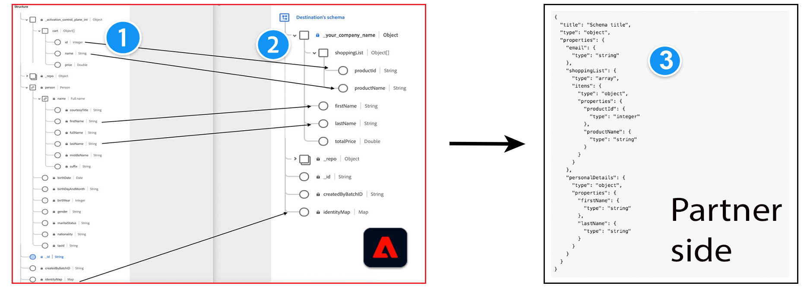

# Message format

## Prerequisites - Adobe Experience Platform concepts {#prerequisites}

To understand the message format and profile configuration and transformation process on the Adobe side, please familiarize yourself with the following Experience Platform concepts:

* **Experience Data Model (XDM)**. [XDM overview](../../../../xdm/home.md) and  [How to create an XDM schema in Adobe Experience Platform](../../../../xdm/tutorials/create-schema-ui.md).
* **Class**. [Create and edit classes in the UI](../../../../xdm/ui/resources/classes.md).
* **IdentityMap**. The identity map represents a map of all end-user identities in Adobe Experience Platform. Refer to `xdm:identityMap` in the [XDM field dictionary](../../../../xdm/schema/field-dictionary.md).
* **SegmentMembership**. The [segmentMembership](../../../../xdm/schema/field-dictionary.md) XDM attribute informs which segments a profile is a member of. For the three different values in the `status` field, read the documentation on [Segment Membership Details schema field group](../../../../xdm/field-groups/profile/segmentation.md).

## Supported integration types {#supported-integration-types}

Refer to the table below for details on what type of destinations support the functionality described in this page.

|Integration type| Supports functionality |
|---|---|
| Real-time (streaming) integrations | Yes |
| File-based (batch) integrations | Yes (only steps 1 and 2 in the diagram further below) |

## Overview {#overview}

Use the content on this page together with the rest of the [configuration options for partner destinations](../configuration-options.md). This page addresses the message format and the profile transformation in data exported from Adobe Experience Platform to destinations. The other page addresses specifics about connecting and authenticating to your destination.

Adobe Experience Platform exports data to a significant number of destinations, in various data formats. Some examples of destination types are advertising platforms (Google), social networks (Facebook), and cloud storage locations (Amazon S3, Azure Event Hubs).

Experience Platform can adjust the message format of exported profiles to match the expected format on your side. To understand this customization, the following concepts are important:

* The source (1) and target (2) XDM schema in Adobe Experience Platform
* The expected message format on the partner side (3), and 
* The transformation layer between XDM schema and expected message format, which you can define by creating a [message transformation template](#using-templating).



Experience Platform uses XDM schemas to describe the structure of data in a consistent and reusable way.

<!--

Users who want to activate data to your destination need to map the fields in their Experience Platform datasets to a schema that translates to your destination's expected format. Adobe will create a custom field group for your company to add to the target schema. The fields in the field group depend on the profile attribute fields that you can receive.

-->

**Source XDM schema (1)**: This item refers to the schema that customers use in Experience Platform. In Experience Platform, in the [mapping step](../../../ui/activate-segment-streaming-destinations.md#mapping) of the activate destination workflow, customers map fields from their XDM schema to your destination's target schema (2).

**Target XDM schema (2)**: Based on the JSON standard schema (3) of your destination's expected format and the attributes that your destination can interpret, you can define profile attributes and identities in your target XDM schema. You can do this in the destinations configuration, in the [schemaConfig](../../functionality/destination-configuration/schema-configuration.md) and [identityNamespaces](../../functionality/destination-configuration/identity-types.md) objects.

**JSON standard schema of your destination profile attributes (3)**: This example represents a [JSON schema](https://json-schema.org/learn/miscellaneous-examples.html) of all the profile attributes that your platform supports and their types (for example: object, string, array). Example fields that your destination could support could be `firstName`, `lastName`, `gender`, `email`, `phone`, `productId`, `productName`, and so on. You need a [message transformation template](#using-templating) to tailor the data exported out of Experience Platform to your expected format.

Based on the schema transformations described above, here is how a profile configuration changes between the source XDM schema and a sample schema on the partner side:


## Getting started - transforming three basic attributes {#getting-started}

To demonstrate the profile transformation process, the example below uses three common profile attributes in Adobe Experience Platform: **first name**, **last name**, and **email address**.

>[!NOTE]
>
>The customer maps the attributes from the source XDM schema to the partner XDM schema in the Adobe Experience Platform UI, in the **Mapping** step of the [activate destination workflow](../../../ui/activate-segment-streaming-destinations.md#mapping).

Let's say your platform can receive a message format like:

```shell
POST https://YOUR_REST_API_URL/users/
Content-Type: application/json
Authorization: Bearer YOUR_REST_API_KEY

{
  "attributes":
    {
      "first_name": "Yours",
      "last_name": "Truly",
      "external_id": "yourstruly@adobe.com"
    }
}

```

Considering the message format, the corresponding transformations are as follows:

|Attribute in partner XDM schema on the Adobe side| Transformation | Attribute in HTTP message on your side|
|---------|----------|---------|
|`_your_custom_schema.firstName` |` attributes.first_name` | `first_name` |
|`_your_custom_schema.lastName` | `attributes.last_name` | `last_name` |
|`personalEmail.address` | `attributes.external_id` | `external_id` |

{style="table-layout:auto"}

## Profile structure in Experience Platform {#profile-structure}

To understand the examples further below on the page, it is important to know the structure of a profile in Experience Platform.

Profiles have 3 sections:

* `segmentMembership` (always present on a profile)
  * this section contains all the segments that are present on the profile. The segments can have one of 3 statuses: `realized`, `existing`, `exited`.
* `identityMap` (always present on a profile)
  * this section contains all the identities that are present on the profile (email, Google GAID, Apple IDFA, and so on) and that the user mapped for exporting in the activation workflow.
* attributes (depending on the destination configuration, these might be present on the profile). There is also a slight difference to note between predefined attributes and freeform attributes:
  * for *freeform attributes*, these contain a `.value` path if the attribute is present on the profile (see the `lastName` attribute from example 1). If they aren't present on the profile, they won't contain the `.value` path (see `firstName` attribute from example 1).
  * for *predefined attributes*, these do not contain a `.value` path. All mapped attributes that are present on a profile will be present in the attributes map. The ones that are not will not be present (see Example 2 - the `firstName` attribute does not exist on the profile).

See below two examples of profiles in Experience Platform:

### Example 1 with `segmentMembership`, `identityMap` and attributes for freeform attributes {#example-1}

```json
{
  "segmentMembership": {
    "ups": {
      "11111111-1111-1111-1111-111111111111": {
        "lastQualificationTime": "2019-04-15T02:41:50.000+0000",
        "status": "existing"
      }
    }
  },
  "identityMap": {
    "mobileIds": [
      {
        "id": "e86fb215-0921-4537-bc77-969ff775752c"
      }
    ]
  },
  "attributes": {
    "firstName": {
    },
    "lastName": {
      "value": "lastName"
    }
  }
}
```

### Example 2 with `segmentMembership`, `identityMap` and attributes for predefined attributes {#example-2}

```json
{
  "segmentMembership": {
    "ups": {
      "11111111-1111-1111-1111-111111111111": {
        "lastQualificationTime": "2019-04-15T02:41:50.000+0000",
        "status": "existing"
      }
    }
  },
  "identityMap": {
    "mobileIds": [
      {
        "id": "e86fb215-0921-4537-bc77-969ff775752c"
      }
    ]
  },
  "attributes": {
    "lastName": "lastName"
  }
}
```

## Using a templating language for the identity, attributes, and segment membership transformations {#using-templating}

Adobe uses [Pebble templates](https://pebbletemplates.io/), a templating language similar to [Jinja](https://jinja.palletsprojects.com/en/2.11.x/), to transform the fields from the Experience Platform XDM schema into a format supported by your destination.

This section provides several examples of how these transformations are made - from the input XDM schema, through the template, and outputting into payload formats accepted by your destination. The examples below are presented by increasing complexity, as follows:

1. Simple transformation examples. Learn how templating works with simple transformations for [Profile attributes](#attributes), [Segment membership](#segment-membership), and [Identity](#identities) fields.
2. Increased complexity examples of templates that combine the fields above: [Create a template that sends segments and identities](./message-format.md#segments-and-identities) and [Create a template that sends segments, identities, and profile attributes](#segments-identities-attributes).
3. Templates that include the aggregation key. When you use [configurable aggregation](../../functionality/destination-configuration/aggregation-policy.md#configurable-aggregation) in the destination configuration, Experience Platform groups the profiles exported to your destination based on criteria such as segment ID, segment status, or identity namespaces.

### Profile Attributes {#attributes}

To transform the profile attributes exported to your destination, see the JSON and code samples below.

>[!IMPORTANT]
>
>For a list of all available profile attributes in Adobe Experience Platform, see the [XDM field dictionary](../../../../xdm/schema/field-dictionary.md).


**Input**

Profile 1:

```json
{
    "attributes": {
        "firstName": {
            "value": "Hermione"
    },
    "birthDate": {}
  }
}
```

Profile 2:

```json
{
  "attributes": {
    "firstName": {
      "value": "Harry"
    },
    "birthDate": {
        "value": "1980/07/31"
    }
  }
}
```

**Template**

>[!IMPORTANT]
>
>For all templates that you use, you must escape the illegal characters, such as double quotes `""` before inserting the [template](../../functionality/destination-server/templating-specs.md) in the [destination server configuration](../../authoring-api/destination-server/create-destination-server.md). For more information on escaping double quotes, see Chapter 9 in the [JSON standard](https://www.ecma-international.org/publications-and-standards/standards/ecma-404/).

```python
{
    "profiles": [
        
        {
            
            "{{ attribute.key }}":
                
                    null
                
                    "{{ attribute.value.value }}"
                
            ,
            
        },
        
    ]
}
```

**Result**


```json
{
    "profiles": [
        {
            "firstName": "Hermione",
            "birthDate": null
        },
        {
            "firstName": "Harry",
            "birthDate": "1980/07/31"
        }
    ]
}
```

### Segment membership {#segment-membership}

The [segmentMembership](../../../../xdm/schema/field-dictionary.md) XDM attribute informs which segments a profile is a member of.
For the three different values in the `status` field, read the documentation on [Segment Membership Details schema field group](../../../../xdm/field-groups/profile/segmentation.md).

**Input**

Profile 1:

```json
{
  "segmentMembership": {
    "ups": {
      "36a51c13-9dd6-4d2c-8aa3-07d785ea5075": {
        "lastQualificationTime": "2019-11-20T13:15:49Z",
        "status": "realized"
      },
      "788d8874-8007-4253-92b7-ee6b6c20c6f3": {
        "lastQualificationTime": "2019-11-20T13:15:49Z",
        "status": "existing"
      },
      "8f812592-3f06-416b-bd50-e7831848a31a": {
        "lastQualificationTime": "2019-11-20T13:15:49Z",
        "status": "exited"
      }
    }
  }
}
```

Profile 2:

```json
{
  "segmentMembership": {
    "ups": {
      "32396e4b-16f6-4033-9702-fc69b5e24e7c": {
        "lastQualificationTime": "2021-08-20T17:23:04Z",
        "status": "realized"
      },
      "af854278-894a-4192-a96b-320fbf2623fd": {
        "lastQualificationTime": "2021-08-20T16:44:37Z",
        "status": "existing"
      },
      "66505bf9-bc08-4bac-afbc-8b6706650ea4": {
        "lastQualificationTime": "2019-08-20T17:23:04Z",
        "status": "realized"
      }
    }
  }
}
```

**Template**

>[!IMPORTANT]
>
>For all templates that you use, you must escape the illegal characters, such as double quotes `""` before inserting the [template](../../functionality/destination-server/templating-specs.md) in the [destination server configuration](../../authoring-api/destination-server/create-destination-server.md). For more information on escaping double quotes, see Chapter 9 in the [JSON standard](https://www.ecma-international.org/publications-and-standards/standards/ecma-404/).


```python
{
    "profiles": [
        
        {
            "AdobeExperiencePlatformSegments": {
                "add": [
                
                "{{ segment.key }}",
                
                ],
                "remove": [
                {# Alternative syntax for filtering segments by status: #}
                
                "{{ segment.key }}",
                
                ]
            }
        },
        
    ]
}
```

**Result**

```json
{
    "profiles": [
        {
            "AdobeExperiencePlatformSegments": {
                "add": [
                    "36a51c13-9dd6-4d2c-8aa3-07d785ea5075",
                    "788d8874-8007-4253-92b7-ee6b6c20c6f3"
                ],
                "remove": [
                    "8f812592-3f06-416b-bd50-e7831848a31a"
                ]
            }
        },
        {
            "AdobeExperiencePlatformSegments": {
                "add": [
                    "32396e4b-16f6-4033-9702-fc69b5e24e7c",
                    "af854278-894a-4192-a96b-320fbf2623fd",
                    "66505bf9-bc08-4bac-afbc-8b6706650ea4"
                ],
                "remove": [
                ]
            }
        }
    ]
}
```

### Identities {#identities}

For information about identities in Experience Platform, see the [Identity namespace overview](../../../../identity-service/namespaces.md).

**Input**

Profile 1:

```json
{
    "identityMap": {
        "email": [
            {
                "id": "johndoe@example.com"
            },
            {
                "id": "jd@example.com"
            }
        ],
        "external_id": [
            {
                "id": "123456"
            }
        ]
    }
}
```

Profile 2:

```json
{
    "identityMap": {
        "email": [
            {
                "id": "jane.doe@example.com"
            }
        ]
    }
}
```

**Template**

>[!IMPORTANT]
>
>For all templates that you use, you must escape the illegal characters, such as double quotes `""` before inserting the [template](../../functionality/destination-server/templating-specs.md) in the [destination server configuration](../../authoring-api/destination-server/create-destination-server.md). For more information on escaping double quotes, see Chapter 9 in the [JSON standard](https://www.ecma-international.org/publications-and-standards/standards/ecma-404/).

```python
{
    "profiles": [
        
        {
            "identities": [
                
                {
                    "type": "email",
                    "id": "{{ email.id }}"
                },
                

                {# Add a comma only if you have both emails and external_ids. #}
                
                    ,
                

                
                {
                    "type": "external_id",
                    "id": "{{ external.id }}"
                },
                
            ]
        },
        
    ]
}
```

**Result**

```json
{
    "profiles": [
        {
            "identities": [
                {
                    "type": "email",
                    "id": "johndoe@example.com"
                },
                {
                    "type": "email",
                    "id": "jd@example.com"
                },
                {
                    "type": "external_id",
                    "id": "123456"
                }
            ]
        },
        {
            "identities": [
                {
                    "type": "email",
                    "id": "jane.doe@example.com"
                }
            ]
        }
    ]
}
```

### Create a template that sends segments and identities {#segments-and-identities}

This section provides an example of a commonly used transformation between the Adobe XDM schema and partner destination schema.
The example below shows you how to transform the segment membership and identities format and output them to your destination.

**Input**

Profile 1:

```json
{
    "identityMap": {
        "email": [
            {
                "id": "johndoe@example.com"
            },
            {
                "id": "jd@example.com"
            }
        ],
        "external_id": [
            {
                "id": "123456"
            }
        ]
    },
    "segmentMembership": {
        "ups": {
            "36a51c13-9dd6-4d2c-8aa3-07d785ea5075": {
                "lastQualificationTime": "2019-11-20T13:15:49Z",
                "status": "realized"
            },
            "788d8874-8007-4253-92b7-ee6b6c20c6f3": {
              "lastQualificationTime": "2019-11-20T13:15:49Z",
              "status": "existing"
            },
            "8f812592-3f06-416b-bd50-e7831848a31a": {
                "lastQualificationTime": "2019-11-20T13:15:49Z",
                "status": "exited"
            }
        }
    }
}
```

Profile 2:

```json
{
    "identityMap": {
        "email": [
            {
                "id": "jane.doe@example.com"
            }
        ]
    },
    "segmentMembership": {
        "ups": {
            "36a51c13-9dd6-4d2c-8aa3-07d785ea5075": {
                "lastQualificationTime": "2021-08-31T10:01:42Z",
                "status": "realized"
            }
        }
    }
}
```

**Template**

>[!IMPORTANT]
>
>For all templates that you use, you must escape the illegal characters, such as double quotes `""` before inserting the [template](../../functionality/destination-server/templating-specs.md) in the [destination server configuration](../../authoring-api/destination-server/create-destination-server.md). For more information on escaping double quotes, see Chapter 9 in the [JSON standard](https://www.ecma-international.org/publications-and-standards/standards/ecma-404/).

```python
{
    "profiles": [
        
        {
            "identities": [
                
                {
                    "type": "email",
                    "id": "{{ email.id }}"
                },
                
                
                {# Add a comma only if you have both emails and external_ids. #}
                
                    ,
                
                
                
                {
                    "type": "external_id",
                    "id": "{{ external.id }}"
                },
                
            ],
            "AdobeExperiencePlatformSegments": {
                "add": [
                    
                    "{{ segment.key }}",
                    
                ],
                "remove": [
                    {# Alternative syntax for filtering segments by status: #}
                    
                    "{{ segment.key }}",
                    
                ]
            }
        },
        
    ]
}

```

**Result**

The `json` below represents the data exported out of Adobe Experience Platform.

```json
{
    "profiles": [
        {
            "identities": [
                {
                    "type": "email",
                    "id": "johndoe@example.com"
                },
                {
                    "type": "email",
                    "id": "jd@example.com"
                },
                {
                    "type": "external_id",
                    "id": "123456"
                }
            ],
            "AdobeExperiencePlatformSegments": {
                "add": [
                    "36a51c13-9dd6-4d2c-8aa3-07d785ea5075",
                    "788d8874-8007-4253-92b7-ee6b6c20c6f3"
                ],
                "remove": [
                    "8f812592-3f06-416b-bd50-e7831848a31a"
                ]
            }
        },
        {
            "identities": [
                {
                    "type": "email",
                    "id": "jane.doe@example.com"
                }
            ],
            "AdobeExperiencePlatformSegments": {
                "add": [
                    "36a51c13-9dd6-4d2c-8aa3-07d785ea5075"
                ],
                "remove": []
            }
        }
    ]
}
```

### Create a template that sends segments, identities, and profile attributes {#segments-identities-attributes}

This section provides an example of a commonly used transformation between the Adobe XDM schema and partner destination schema.

Another common use case is exporting data that contains segment membership, identities (for example: email address, phone number, advertising ID), and profile attributes. To export data in this manner, see the example below:

**Input**

Profile 1:

```json
{
    "attributes": {
        "firstName": {
            "value": "Hermione"
        },
        "birthDate": {}
    },
    "identityMap": {
        "email": [
            {
                "id": "johndoe@example.com"
            },
            {
                "id": "jd@example.com"
            }
        ],
        "external_id": [
            {
                "id": "123456"
            }
        ]
    },
    "segmentMembership": {
        "ups": {
            "36a51c13-9dd6-4d2c-8aa3-07d785ea5075": {
                "lastQualificationTime": "2019-11-20T13:15:49Z",
                "status": "realized"
            },
            "788d8874-8007-4253-92b7-ee6b6c20c6f3": {
              "lastQualificationTime": "2019-11-20T13:15:49Z",
              "status": "existing"
            },
            "8f812592-3f06-416b-bd50-e7831848a31a": {
                "lastQualificationTime": "2019-11-20T13:15:49Z",
                "status": "exited"
            }
        }
    }
}
```

Profile 2:

```json
{
    "attributes": {
        "firstName": {
            "value": "Harry"
        },
        "birthDate": {
            "value": "1980/07/31"
        }
    },
    "identityMap": {
        "email": [
            {
                "id": "harry.p@example.com"
            }
        ]
    },
    "segmentMembership": {
        "ups": {
            "36a51c13-9dd6-4d2c-8aa3-07d785ea5075": {
                "lastQualificationTime": "2019-11-20T13:15:49Z",
                "status": "realized"
            }
        }
    }
}
```

**Template**

>[!IMPORTANT]
>
>For all templates that you use, you must escape the illegal characters, such as double quotes `""` before inserting the [template](../../functionality/destination-server/templating-specs.md) in the [destination server configuration](../../authoring-api/destination-server/create-destination-server.md). For more information on escaping double quotes, see Chapter 9 in the [JSON standard](https://www.ecma-international.org/publications-and-standards/standards/ecma-404/).

```python
{
    "profiles": [
        
        {
            "attributes": {
            
                "{{ attribute.key }}":
                    
                        null
                    
                        "{{ attribute.value.value }}"
                    
                ,
            
            },
            "identities": [
                
                {
                    "type": "email",
                    "id": "{{ email.id }}"
                },
                

                {# Add a comma only if we have both emails and external_ids. #}
                
                    ,
                

                
                {
                    "type": "external_id",
                    "id": "{{ external.id }}"
                },
                
            ],
            "AdobeExperiencePlatformSegments": {
                "add": [
                
                    "{{ segment.key }}",
                
                ],
                "remove": [
                {# Alternative syntax for filtering segments by status: #}
                
                    "{{ segment.key }}",
                
                ]
            }
        }
    ]
}
```

**Result**

The `json` below represents the data exported out of Adobe Experience Platform.

```json
{
    "profiles": [
        {
            "attributes": {
                "firstName": "Hermione",
                "birthDate": null
            },
            "identities": [
                {
                    "type": "email",
                    "id": "johndoe@example.com"
                },
                {
                    "type": "email",
                    "id": "jd@example.com"
                },
                {
                    "type": "external_id",
                    "id": "123456"
                }
            ],
            "AdobeExperiencePlatformSegments": {
                "add": [
                    "36a51c13-9dd6-4d2c-8aa3-07d785ea5075",
                    "788d8874-8007-4253-92b7-ee6b6c20c6f3"
                ],
                "remove": [
                    "8f812592-3f06-416b-bd50-e7831848a31a"
                ]
            }
        },
        {
            "attributes": {
                "firstName": "Harry",
                "birthDate": "1980/07/21"
            },
            "identities": [
                {
                    "type": "email",
                    "id": "harry.p@example.com"
                }
            ],
            "AdobeExperiencePlatformSegments": {
                "add": [
                    "36a51c13-9dd6-4d2c-8aa3-07d785ea5075"
                ],
                "remove": []
            }
        }
    ]
}
```

### Include aggregation key in your template to access exported profiles grouped by various criteria {#template-aggregation-key}

When you use [configurable aggregation](../../functionality/destination-configuration/aggregation-policy.md#configurable-aggregation) in the destination configuration, you can group the profiles exported to your destination based on criteria such as segment ID, segment alias, segment membership, or identity namespaces.

In the message transformation template, you can access the aggregation keys mentioned above, as shown in the examples in the following sections. Use aggregation keys to structure the HTTP message exported out of Experience Platform to match the format and rate limits expected by your destination.

#### Use segment ID aggregation key in the template {#aggregation-key-segment-id}

If you use [configurable aggregation](../../functionality/destination-configuration/aggregation-policy.md#configurable-aggregation) and set `includeSegmentId` to true, the profiles in the HTTP messages exported to your destination are grouped by segment ID. See below how you can access the segment ID in the template.

**Input**

Consider the four profiles below, where:

* the first two are part of the segment with the segment ID `788d8874-8007-4253-92b7-ee6b6c20c6f3` 
* the third profile is part of the segment with the segment ID `8f812592-3f06-416b-bd50-e7831848a31a`
* the fourth profile is part of both segments above.

Profile 1:

```json
{
   "attributes":{
      "firstName":{
         "value":"Hermione"
      }
   },
   "segmentMembership":{
      "ups":{
         "788d8874-8007-4253-92b7-ee6b6c20c6f3":{
            "lastQualificationTime":"2020-11-20T13:15:49Z",
            "status":"existing"
         }
      }
   }
}
```

Profile 2:

```json
{
   "attributes":{
      "firstName":{
         "value":"Harry"
      }
   },
   "segmentMembership":{
      "ups":{
         "788d8874-8007-4253-92b7-ee6b6c20c6f3":{
            "lastQualificationTime":"2020-11-20T13:15:49Z",
            "status":"existing"
         }
      }
   }
}
```

Profile 3:

```json
{
   "attributes":{
      "firstName":{
         "value":"Tom"
      }
   },
   "segmentMembership":{
      "ups":{
         "8f812592-3f06-416b-bd50-e7831848a31a":{
            "lastQualificationTime":"2021-02-20T12:00:00Z",
            "status":"existing"
         }
      }
   }
}
```

Profile 4:

```json
{
   "attributes":{
      "firstName":{
         "value":"Jerry"
      }
   },
   "segmentMembership":{
      "ups":{
         "8f812592-3f06-416b-bd50-e7831848a31a":{
            "lastQualificationTime":"2021-02-20T12:00:00Z",
            "status":"existing"
         },
         "788d8874-8007-4253-92b7-ee6b6c20c6f3":{
            "lastQualificationTime":"2020-11-20T13:15:49Z",
            "status":"existing"
         }
      }
   }
}
```

**Template**

>[!IMPORTANT]
>
>For all templates that you use, you must escape the illegal characters, such as double quotes `""` before inserting the [template](../../functionality/destination-server/templating-specs.md) in the [destination server configuration](../../authoring-api/destination-server/create-destination-server.md). For more information on escaping double quotes, see Chapter 9 in the [JSON standard](https://www.ecma-international.org/publications-and-standards/standards/ecma-404/).

Notice below how `audienceId` is used in the template to access segment IDs. This example assumes that you use `audienceId` for segment membership in your destination taxonomy. You can use any other field name instead, depending on your own taxonomy.

```python
{
    "audienceId": "{{ input.aggregationKey.segmentId }}",
    "profiles": [
        
        {
            "first_name": "{{ profile.attributes.firstName.value }}"
        },
        
    ]
}
```

**Result**

When exported to your destination, the profiles are split into two groups, based on their segment ID.

```json
{
   "audienceId":"788d8874-8007-4253-92b7-ee6b6c20c6f3",
   "profiles":[
      {
         "firstName":"Hermione"
      },
      {
         "firstName":"Harry"
      },
      {
         "firstName":"Jerry"
      }
   ]
}
```

```json
{
   "audienceId":"8f812592-3f06-416b-bd50-e7831848a31a",
   "profiles":[
      {
         "firstName":"Tom"
      },
      {
         "firstName":"Jerry"
      }
   ]
}
```

#### Use segment alias aggregation key in the template {#aggregation-key-segment-alias}

If you use [configurable aggregation](../../functionality/destination-configuration/aggregation-policy.md#configurable-aggregation) and set `includeSegmentId` to true, you can also access segment alias in the template.

Add the line below to the template to access the exported profiles grouped by segment alias.

```python
customerList={{input.aggregationKey.segmentAlias}}
```

#### Use segment status aggregation key in the template {#aggregation-key-segment-status}

If you use [configurable aggregation](../../functionality/destination-configuration/aggregation-policy.md#configurable-aggregation) and set `includeSegmentId` and `includeSegmentStatus` to true, you can access the segment status in the template. This way, you can group profiles in the HTTP messages exported to your destination based on whether the profiles should be added or removed from segments.

Possible values are:

* realized
* existing
* exited

Add the line below to the template to add or remove profiles from segments, based on the values above:

```python
action=REMOVEADD
```

#### Use identity namespace aggregation key in the template {#aggregation-key-identity}

Below is an example where the [configurable aggregation](../../functionality/destination-configuration/aggregation-policy.md#configurable-aggregation) in the destination configuration is set to aggregate exported profiles by identity namespaces, in the form `"namespaces": ["email", "phone"]` and `"namespaces": ["GAID", "IDFA"]`. Refer to the `groups` parameter in the [create destination configuration](../../authoring-api/destination-configuration/create-destination-configuration.md) documentation for more details about grouping.

**Input**

Profile 1:

```json
{
   "identityMap":{
      "email":[
         {
            "id":"e1@example.com"
         },
         {
            "id":"e2@example.com"
         }
      ],
      "phone":[
         {
            "id":"+40744111222"
         }
      ],
      "IDFA":[
         {
            "id":"AEBE52E7-03EE-455A-B3C4-E57283966239"
         }
      ],
      "GAID":[
         {
            "id":"e4fe9bde-caa0-47b6-908d-ffba3fa184f2"
         }
      ]
   }
}
```

Profile 2:

```json
{
   "identityMap":{
      "email":[
         {
            "id":"e3@example.com"
         }
      ],
      "phone":[
         {
            "id":"+40744333444"
         },
         {
            "id":"+40744555666"
         }
      ],
      "IDFA":[
         {
            "id":"134GHU45-34HH-GHJ7-K0H8-LHN665998NN0"
         }
      ],
      "GAID":[
         {
            "id":"47bh00i9-8jv6-334n-lll8-nb7f24sghg76"
         }
      ]
   }
}
```

**Template**

>[!IMPORTANT]
>
>For all templates that you use, you must escape the illegal characters, such as double quotes `""` before inserting the [template](../../functionality/destination-server/templating-specs.md) in the [destination server configuration](../../authoring-api/destination-server/create-destination-server.md). For more information on escaping double quotes, see Chapter 9 in the [JSON standard](https://www.ecma-international.org/publications-and-standards/standards/ecma-404/).

Notice that `input.aggregationKey.identityNamespaces` is used in the template below

```python
{
            "profiles": [
            
            {
                
                "{{ns}}": [
                    
                    "{{id.id}}",
                    
                ],
                
            },
            
        ]
}
```

**Result**

When exported to your destination, the profiles are split into two groups, based on their identity namespaces. Email and phone are in one group, while GAID and IDFA are in another.

```json
{
   "profiles":[
      {
         "email":[
            "e1@example.com",
            "e2@example.com"
         ],
         "phone":[
            "+40744111222"
         ]
      },
      {
         "email":[
            "e3@example.com"
         ],
         "phone":[
            "+40744333444",
            "+40744555666"
         ]
      }
   ]
}
```

```json
{
   "profiles":[
      {
         "IDFA":[
            "AEBE52E7-03EE-455A-B3C4-E57283966239"
         ],
         "GAID":[
            "e4fe9bde-caa0-47b6-908d-ffba3fa184f2"
         ]
      },
      {
         "IDFA":[
            "134GHU45-34HH-GHJ7-K0H8-LHN665998NN0"
         ],
         "GAID":[
            "47bh00i9-8jv6-334n-lll8-nb7f24sghg76"
         ]
      }
   ]
}
```

#### Use the aggregation key in a URL template {#aggregation-key-url-template}

Depending on your use case, you can also use the aggregation keys described here in a URL, as shown below:

```python
https://api.example.com/audience/{{input.aggregationKey.segmentId}}
```

### Reference: Context and functions used in the transformation templates {#reference}

The context provided to the template contains `input`  (the profiles / data that is exported in this call) and `destination` (data about the destination that Adobe is sending data to, valid for all profiles).

The table below provides descriptions for the functions in the examples above.

|Function | Description |
|---------|----------|
| `input.profile` | The profile, represented as a [JsonNode](https://fasterxml.github.io/jackson-databind/javadoc/2.11/com/fasterxml/jackson/databind/node/JsonNodeType.html). Follows the partner XDM schema mentioned further above on this page.|
| `destination.segmentAliases` | Map from segment IDs in the Adobe Experience Platform namespace to segment aliases in the partner's system. |
| `destination.segmentNames` | Map from segment names in the Adobe Experience Platform namespace to segment names in the partner's system. |
| `addedSegments(listOfSegments)` | Returns only the segments that have status `realized` or `existing`. |
| `removedSegments(listOfSegments)` | Returns only the segments that have status `exited`. |

{style="table-layout:auto"}

## Next steps {#next-steps}

After reading this document, you now know how data exported out of Experience Platform is transformed. Next, read the following pages to complete your knowledge about creating message transformation templates for your destination:

* [Create and test a message transformation template](../../testing-api/create-template.md)
* [Render template API operations](../../testing-api/streaming-destinations/render-template-api.md)
* [Supported transformation functions in Destination SDK](../supported-functions.md)

To learn more about the other destination server components, see the following articles:

* [Server specs for destinations created with Destination SDK](server-specs.md)
* [Templating specs](templating-specs.md)
* [File formatting configuration](file-formatting.md)