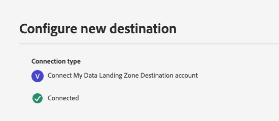
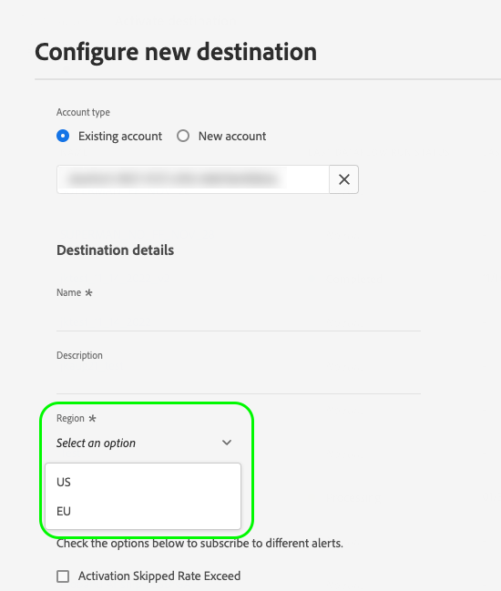

# Server specs for destinations created with Destination SDK

Destination server specs define the type of destination platform that will receive the data from Adobe Experience Platform, and the communication parameters between Platform and your destination. For instance:

* A [streaming](#streaming-example) destination server spec defines the HTTP server endpoint that will receive the HTTP messages from Platform. To learn to configure how the HTTP calls to the endpoint are formatted, read the [templating specs](templating-specs.md) page.
* An [Amazon S3](#s3-example) destination server spec defines the [!DNL S3] bucket name and path where Platform will export the files.
* An [SFTP](#sftp-example) destination server spec defines the host name, root directory, communication port, and encryption type of the SFTP server where Platform will export the files.

To understand where this component fits into an integration created with Destination SDK, see the diagram in the [configuration options](../configuration-options.md) documentation or see the following destination configuration overview pages:

* [Use Destination SDK to configure a streaming destination](../../guides/configure-destination-instructions.md#create-server-template-configuratiom)
* [Use Destination SDK to configure a file-based destination](../../guides/configure-file-based-destination-instructions.md#create-server-file-configuration)

You can configure the destination server specs via the `/authoring/destination-servers` endpoint. See the following API reference pages for detailed API call examples where you can configure the components shown in this page.

* [Create a destination server configuration](../../authoring-api/destination-server/create-destination-server.md)
* [Update a destination server configuration](../../authoring-api/destination-server/update-destination-server.md)

This page shows all the destination server types supported by Destination SDK, with all their configuration parameters. When creating your destination, replace the parameter values with your own.

## Supported integration types {#supported-integration-types}

Refer to the table below for details on which types of integrations support the functionality described on this page.

|Integration type| Supports functionality |
|---|---|
| Real-time (streaming) integrations | Yes |
| File-based (batch) integrations | Yes |

When [creating](../../authoring-api/destination-server/create-destination-server.md) or [updating](../../authoring-api/destination-server/update-destination-server.md) a destination server, use one of the server type configurations described in this page. Depending on your integration requirements, make sure to replace the sample parameter values from these examples with your own.

## Hard-coded versus templatized fields {#templatized-fields}

When creating a destination server through Destination SDK, you can define configuration parameter values either by hard-coding them into the configuration, or by using templatized fields. Templatized fields allow you to read user-provided values from the Platform UI.

Destination server parameters have two configurable fields. These options dictate whether you are using hard-coded or templatized values.

|Parameter | Type | Description|
|---|---|---|
|`templatingStrategy`|String|*Required.* Defines whether there is a hard-coded value provided via the `value` field, or a user-configurable value in the UI. Supported values: <ul><li>`NONE`: Use this value when you are hard-coding the parameter value via the `value` parameter (see the next row). Example:`"value": "my-storage-bucket"`.</li><li>`PEBBLE_V1`: Use this value when you want your users to provide a parameter value in the UI. Example: `"value": "{{customerData.bucket}}"`. </li></ul> |
|`value`|String|*Required*. Defines the parameter value. Supported value types: <ul><li>**Hard-coded value**: Use a hard-coded value (such as `"value": "my-storage-bucket"`) when you do not need users to enter a parameter value in the UI. When hard-coding a value, `templatingStrategy` should always be set to `NONE`.</li><li>**Templatized value**: Use a templatized value (such as `"value": "{{customerData.bucket}}"`) when you want your users to provide a parameter value in the UI. When using templatized values, `templatingStrategy` should always be set to `PEBBLE_V1`.</li></ul>|

{style="table-layout:auto"}

### When to use hard-coded versus templatized fields

Both hard-coded and templatized fields have their own uses in Destination SDK, depending on what type of integration you are creating.

**Connecting to your destination without user input**

When users [connect to your destination](../../../ui/connect-destination.md) in the Platform UI, you might want to handle the destination connection process without their input.

To do this, you can hard-code the destination platform connection parameters in the server spec. When you use hard-coded parameter values in your destination server configuration, the connection between Adobe Experience Platform and your destination platform is handled without any input from the user.

In the example below, a partner creates a Data Landing Zone destination server with the `path.value` field being hardcoded.

```json
{
   "name":"Data Landing Zone destination server",
   "destinationServerType":"FILE_BASED_DLZ",
   "fileBasedDlzDestination":{
      "path":{
         "templatingStrategy":"NONE",
         "value":"Your/hardcoded/path/here"
      },
      "useCase": "Your use case"
   }
}
```

As a result, when users go through the [destination connection tutorial](../../../ui/connect-destination.md), they will not see an [authentication step](../../../ui/connect-destination.md#authenticate). Instead, the authentication is handled by Platform, as shown in the image below.



**Connecting to your destination with user input**

When the connection between Platform and your destination should be established following a specific user input in the Platform UI, such as selecting an API endpoint or providing a field value, you can use templatized fields in the server spec to read the user input and connect to your destination platform.

In the example below, a partner creates a [real-time (streaming)](#streaming-example) integration and the `url.value` field uses the templatized parameter `{{customerData.region}}` to personalize part of the API endpoint based on user input.

```json
{
   "name":"Templatized API endpoint example",
   "destinationServerType":"URL_BASED",
   "urlBasedDestination":{
      "url":{
         "templatingStrategy":"PEBBLE_V1",
         "value":"https://api.yourcompany.com/data/{{customerData.region}}/items"
      }
   }
}
```

To give users the option of selecting a value from the Platform UI, the `region` parameter must also be defined in the [destination configuration](../../authoring-api/destination-configuration/create-destination-configuration.md) as a customer data field, as shown below:

```json
"customerDataFields":[
   {
      "name":"region",
      "title":"Region",
      "description":"Select an option",
      "type":"string",
      "isRequired":true,
      "readOnly":false,
      "enum":[
         "US",
         "EU"
      ]
   }
```

As a result, when users go through the [destination connection tutorial](../../../ui/connect-destination.md), they must select a region before they can connect to the destination platform. When they connect to the destination, the templatized field `{{customerData.region}}` is replaced with the value that the user has selected in the UI, as shown in the image below.



## Real-time (streaming) destination server {#streaming-example}

This destination server type allows you export data from Adobe Experience Platform to your destination via HTTP requests. The server configuration contains information about the server receiving the messages (the server on your side).

This process delivers user data as a series of HTTP messages to your destination platform. The parameters below form the HTTP server specs template.

The sample below shows an example of a destination server configuration for a real-time (streaming) destination.

```json
{
   "name":"Your destination server name",
   "destinationServerType":"URL_BASED",
   "urlBasedDestination":{
      "url":{
         "templatingStrategy":"PEBBLE_V1",
         "value":"{YOUR_API_ENDPOINT}"
      }
   }
}
```

|Parameter | Type | Description|
|---|---|---|
|`name` | String | *Required.* Represents a friendly name of your server, visible only to Adobe. This name is not visible to partners or customers. Example: `Moviestar destination server`. |
|`destinationServerType` | String |*Required.* Set this to `URL_BASED` for streaming destinations.|
|`templatingStrategy` | String | *Required.* <ul><li>Use `PEBBLE_V1` if you are using a templatized field instead of a hard-coded value in the `value` field. Use this option if you have an endpoint like: `https://api.moviestar.com/data/{{customerData.region}}/items`, where users must select the endpoint region from the Platform UI. </li><li> Use `NONE` if no temmplatized transformation is needed on the Adobe side, for example if you have an endpoint like: `https://api.moviestar.com/data/items` </li></ul>  |
|`value` | String | *Required.* Fill in the address of the API endpoint that Experience Platform should connect to. |

{style="table-layout:auto"}

## [!DNL Amazon S3] destination server {#s3-example}

This destination server allows you to export files containing Adobe Experience Platform data to your Amazon S3 storage.

The sample below shows an example of a destination server configuration for an Amazon S3 destination.

```json
{
   "name":"Amazon S3 destination",
   "destinationServerType":"FILE_BASED_S3",
   "fileBasedS3Destination":{
      "bucket":{
         "templatingStrategy":"PEBBLE_V1",
         "value":"{{customerData.bucket}}"
      },
      "path":{
         "templatingStrategy":"PEBBLE_V1",
         "value":"{{customerData.path}}"
      }
   }
}
```

|Parameter|Type|Description|
|---|---|---|
|`name`|String|The name of your destination server.|
|`destinationServerType`|String|Set this value according to your destination platform. To export files to an [!DNL Amazon S3] bucket, set this to `FILE_BASED_S3`.|
|`fileBasedS3Destination.bucket.templatingStrategy`| String|*Required*. Set this value according to the type of value used in the `bucket.value` field.<ul><li>If you want your users to input their own bucket name in the Experience Platform UI, set this value to `PEBBLE_V1`. In this case, you must templatize the `value` field to read a value from the [customer data fields](../destination-configuration/customer-data-fields.md) filled in by the user. This use case is shown in the example above.</li><li>If you are using a hard-coded bucket name for your integration, such as `"bucket.value":"MyBucket"`, then set this value to `NONE`.</li></ul>|
|`fileBasedS3Destination.bucket.value`|String|The name of the [!DNL Amazon S3] bucket to be used by this destination. This can either be a templatized field which will read the value from the [customer data fields](../destination-configuration/customer-data-fields.md) filled in by the user (as shown in the example above), or a hard-coded value, such as `"value":"MyBucket"`. |
|`fileBasedS3Destination.path.templatingStrategy`|String| *Required*. Set this value according to the type of value used in the `path.value` field.<ul><li>If you want your users to input their own path in the Experience Platform UI, set this value to `PEBBLE_V1`. In this case, you must templatize the `path.value` field to read a value from the [customer data fields](../destination-configuration/customer-data-fields.md) filled in by the user. This use case is shown in the example above.</li><li>If you are using a hard-coded path for your integration, such as `"bucket.value":"/path/to/MyBucket"`, then set this value to `NONE`.</li></ul>|
|`fileBasedS3Destination.path.value`|String|The path to the [!DNL Amazon S3] bucket to be used by this destination. This can either be a templatized field which will read the value from the [customer data fields](../destination-configuration/customer-data-fields.md) filled in by the user (as shown in the example above), or a hard-coded value, such as `"value":"/path/to/MyBucket"`.|

{style="table-layout:auto"}

## [!DNL SFTP] destination server {#sftp-example}

This destination server allows you to export files containing Adobe Experience Platform data to your [!DNL SFTP] storage server.

The sample below shows an example of a destination server configuration for an SFTP destination.

```json
{
   "name":"File-based SFTP destination server",
   "destinationServerType":"FILE_BASED_SFTP",
   "fileBasedSFTPDestination":{
      "rootDirectory":{
         "templatingStrategy":"PEBBLE_V1",
         "value":"{{customerData.rootDirectory}}"
      },
      "hostName":{
         "templatingStrategy":"PEBBLE_V1",
         "value":"{{customerData.hostName}}"
      },
      "port":22,
      "encryptionMode":"PGP"
   }
}
```

|Parameter|Type|Description|
|---|---|---|
|`name`|String|The name of your destination server.|
|`destinationServerType`|String|Set this value according to your destination platform. To export files to an [!DNL SFTP] destination, set this to `FILE_BASED_SFTP`.|
|`fileBasedSFTPDestination.rootDirectory.templatingStrategy`|String|*Required*. Set this value according to the type of value used in the `rootDirectory.value` field.<ul><li>If you want your users to input their own root directory path in the Experience Platform UI, set this value to `PEBBLE_V1`. In this case, you must templatize the `rootDirectory.value` field to read a user-provided value from the [customer data fields](../destination-configuration/customer-data-fields.md) filled in by the user. This use case is shown in the example above.</li><li>If you are using a hard-coded root directory path for your integration, such as `"rootDirectory.value":"Storage/MyDirectory"`, then set this value to `NONE`.</li></ul>|
|`fileBasedSFTPDestination.rootDirectory.value`|String|The path to the directory that will host the exported files. This can either be a templatized field which will read the value from the [customer data fields](../destination-configuration/customer-data-fields.md) filled in by the user (as shown in the example above), or a hard-coded value, such as `"value":"Storage/MyDirectory"` |
|`fileBasedSFTPDestination.hostName.templatingStrategy`|String|*Required*. Set this value according to the type of value used in the `hostName.value` field.<ul><li>If you want your users to input their own host name in the Experience Platform UI, set this value to `PEBBLE_V1`. In this case, you must templatize the `hostName.value` field to read a user-provided value from the [customer data fields](../destination-configuration/customer-data-fields.md) filled in by the user. This use case is shown in the example above.</li><li>If you are using a hard-coded host name for your integration, such as `"hostName.value":"my.hostname.com"`, then set this value to `NONE`.</li></ul>|
|`fileBasedSFTPDestination.hostName.value`|String|The host name of your SFTP server. This can either be a templatized field which will read the value from the [customer data fields](../destination-configuration/customer-data-fields.md) filled in by the user (as shown in the example above), or a hard-coded value, such as `"hostName.value":"my.hostname.com"`.|
|`port`|Integer|The SFTP file server port.|
|`encryptionMode`|String|Indicates whether to use file encryption. Supported values: <ul><li>PGP</li><li>None</li></ul>|

{style="table-layout:auto"}

## [!DNL Azure Data Lake Storage] ([!DNL ADLS]) destination server {#adls-example}

This destination server allows you to export files containing Adobe Experience Platform data to your [!DNL Azure Data Lake Storage] account.

The sample below shows an example of a destination server configuration for an [!DNL Azure Data Lake Storage] destination.

```json
{
   "name":"ADLS destination server",
   "destinationServerType":"FILE_BASED_ADLS_GEN2",
   "fileBasedAdlsGen2Destination":{
      "path":{
         "templatingStrategy":"PEBBLE_V1",
         "value":"{{customerData.path}}"
      }
   }
}
```

|Parameter|Type|Description|
|---|---|---|
|`name`|String|The name of your destination connection.|
|`destinationServerType`|String|Set this value according to your destination platform. For [!DNL Azure Data Lake Storage] destinations, set this to `FILE_BASED_ADLS_GEN2`.|
|`fileBasedAdlsGen2Destination.path.templatingStrategy`|String|*Required*. Set this value according to the type of value used in the `path.value` field.<ul><li>If you want your users to input their [!DNL ADLS] folder path in the Experience Platform UI, set this value to `PEBBLE_V1`. In this case, you must templatize the `path.value` field to read a value from the [customer data fields](../destination-configuration/customer-data-fields.md) filled in by the user. This use case is shown in the example above.</li><li>If you are using a hard-coded path for your integration, such as `"abfs://<file_system>@<account_name>.dfs.core.windows.net/<path>/"`, then set this value to `NONE`.</li></ul>|
|`fileBasedAdlsGen2Destination.path.value`|String|The path to your [!DNL ADLS] storage folder. This can either be a templatized field which will read the value from the [customer data fields](../destination-configuration/customer-data-fields.md) filled in by the user (as shown in the example above), or a hard-coded value, such as `abfs://<file_system>@<account_name>.dfs.core.windows.net/<path>/`.|

{style="table-layout:auto"}

## [!DNL Azure Blob Storage] destination server {#blob-example}

This destination server allows you to export files containing Adobe Experience Platform data to your [!DNL Azure Blob Storage] container.

The sample below shows an example of a destination server configuration for an [!DNL Azure Blob Storage] destination.

```json
{
   "name":"Blob destination server",
   "destinationServerType":"FILE_BASED_AZURE_BLOB",
   "fileBasedAzureBlobDestination":{
      "path":{
         "templatingStrategy":"PEBBLE_V1",
         "value":"{{customerData.path}}"
      },
      "container":{
         "templatingStrategy":"PEBBLE_V1",
         "value":"{{customerData.container}}"
      }
   }
}
```

|Parameter|Type|Description|
|---|---|---|
|`name`|String|The name of your destination connection.|
|`destinationServerType`|String|Set this value according to your destination platform. For [!DNL Azure Blob Storage] destinations, set this to `FILE_BASED_AZURE_BLOB`.|
|`fileBasedAzureBlobDestination.path.templatingStrategy`|String|*Required*. Set this value according to the type of value used in the `path.value` field.<ul><li>If you want your users to input their own [!DNL Azure Blob] [storage account URI](https://learn.microsoft.com/en-us/azure/storage/blobs/storage-blobs-introduction) in the Experience Platform UI, set this value to `PEBBLE_V1`. In this case, you must templatize the `path.value` field to read the value from the [customer data fields](../destination-configuration/customer-data-fields.md) filled in by the user. This use case is shown in the example above.</li><li>If you are using a hard-coded path for your integration, such as `"path.value": "https://myaccount.blob.core.windows.net/"`, then set this value to `NONE`.|
|`fileBasedAzureBlobDestination.path.value`|String|The path to your [!DNL Azure Blob] storage. This can either be a templatized field which will read the value from the [customer data fields](../destination-configuration/customer-data-fields.md) filled in by the user (as shown in the example above), or a hard-coded value, such as `https://myaccount.blob.core.windows.net/`.|
|`fileBasedAzureBlobDestination.container.templatingStrategy`|String|*Required*. Set this value according to the type of value used in the `container.value` field.<ul><li>If you want your users to input their own [!DNL Azure Blob] [container name](https://learn.microsoft.com/en-us/azure/storage/blobs/storage-blobs-introduction) in the Experience Platform UI, set this value to `PEBBLE_V1`. In this case, you must templatize the `container.value` field to read the value from the [customer data fields](../destination-configuration/customer-data-fields.md) filled in by the user. This use case is shown in the example above.</li><li>If you are using a hard-coded container name for your integration, such as `"path.value: myContainer"`, then set this value to `NONE`.|
|`fileBasedAzureBlobDestination.container.value`|String|The name of the Azure Blob Storage container to be used for this destination. This can either be a templatized field which will read the value from the [customer data fields](../destination-configuration/customer-data-fields.md) filled in by the user (as shown in the example above), or a hard-coded value, such as `myContainer`.|

{style="table-layout:auto"}

## [!DNL Data Landing Zone] ([!DNL DLZ]) destination server {#dlz-example}

This destination server allows you to export files containing Platform data to a [[!DNL Data Landing Zone]](../../../catalog/cloud-storage/data-landing-zone.md) storage.

The sample below shows an example of a destination server configuration for a [!DNL Data Landing Zone] ([!DNL DLZ]) destination.

```json
{
   "name":"Data Landing Zone destination server",
   "destinationServerType":"FILE_BASED_DLZ",
   "fileBasedDlzDestination":{
      "path":{
         "templatingStrategy":"PEBBLE_V1",
         "value":"{{customerData.path}}"
      },
      "useCase": "Your use case"
   }
}
```

|Parameter|Type|Description|
|---|---|---|
|`name`|String|The name of your destination connection.|
|`destinationServerType`|String|Set this value according to your destination platform. For [!DNL Data Landing Zone] destinations, set this to `FILE_BASED_DLZ`.|
|`fileBasedDlzDestination.path.templatingStrategy`|String|*Required*. Set this value according to the type of value used in the `path.value` field.<ul><li>If you want your users to input their own [!DNL Data Landing Zone] account in the Experience Platform UI, set this value to `PEBBLE_V1`. In this case, you must templatize the `path.value` field to read a value from the [customer data fields](../destination-configuration/customer-data-fields.md) filled in by the user. This use case is shown in the example above.</li><li>If you are using a hard-coded path for your integration, such as `"path.value": "https://myaccount.blob.core.windows.net/"`, then set this value to `NONE`.|
|`fileBasedDlzDestination.path.value`|String|The path to the destination folder that will host the exported files.|

{style="table-layout:auto"}

## File-based [!DNL Google Cloud Storage] destination server {#gcs-example}

This destination server allows you to export files containing Platform data to your [!DNL Google Cloud Storage] account.

The sample below shows an example of a destination server configuration for a [!DNL Google Cloud Storage] destination.

```json
{
   "name":"Google Cloud Storage Server",
   "destinationServerType":"FILE_BASED_GOOGLE_CLOUD",
   "fileBasedGoogleCloudStorageDestination":{
      "bucket":{
         "templatingStrategy":"PEBBLE_V1",
         "value":"{{customerData.bucket}}"
      },
      "path":{
         "templatingStrategy":"PEBBLE_V1",
         "value":"{{customerData.path}}"
      }
   }
}
```

|Parameter|Type|Description|
|---|---|---|
|`name`|String|The name of your destination connection.|
|`destinationServerType`|String|Set this value according to your destination platform. For [!DNL Google Cloud Storage] destinations, set this to `FILE_BASED_GOOGLE_CLOUD`.|
|`fileBasedGoogleCloudStorageDestination.bucket.templatingStrategy`|String|*Required*. Set this value according to the type of value used in the `bucket.value` field.<ul><li>If you want your users to input their own [!DNL Google Cloud Storage] bucket name in the Experience Platform UI, set this value to `PEBBLE_V1`. In this case, you must templatize the `bucket.value` field to read a value from the [customer data fields](../destination-configuration/customer-data-fields.md) filled in by the user. This use case is shown in the example above.</li><li>If you are using a hard-coded bucket name for your integration, such as `"bucket.value": "my-bucket"`, then set this value to `NONE`.|
|`fileBasedGoogleCloudStorageDestination.bucket.value`|String|The name of the [!DNL Google Cloud Storage] bucket to be used by this destination. This can either be a templatized field which will read the value from the [customer data fields](../destination-configuration/customer-data-fields.md) filled in by the user (as shown in the example above), or a hard-coded value, such as `"value": "my-bucket"`.|
|`fileBasedGoogleCloudStorageDestination.path.templatingStrategy`|String| *Required*. Set this value according to the type of value used in the `path.value` field.<ul><li>If you want your users to input their own [!DNL Google Cloud Storage] bucket path in the Experience Platform UI, set this value to `PEBBLE_V1`. In this case, you must templatize the `path.value` field to read a value from the [customer data fields](../destination-configuration/customer-data-fields.md) filled in by the user. This use case is shown in the example above.</li><li>If you are using a hard-coded path for your integration, such as `"path.value": "/path/to/my-bucket"`, then set this value to `NONE`.</li></ul>|
|`fileBasedGoogleCloudStorageDestination.path.value`|String|The path to the [!DNL Google Cloud Storage] folder to be used by this destination. This can either be a templatized field which will read the value from the [customer data fields](../destination-configuration/customer-data-fields.md) filled in by the user (as shown in the example above), or a hard-coded value, such as `"value": "/path/to/my-bucket"`.|

{style="table-layout:auto"}

## Next steps {#next-steps}

After reading this article, you should have a better understanding of what a destination server spec is, and how you can configure it.

To learn more about the other destination server components, see the following articles:

* [Templating specs](templating-specs.md)
* [Message format](message-format.md)
* [File formatting configuration](file-formatting.md)
