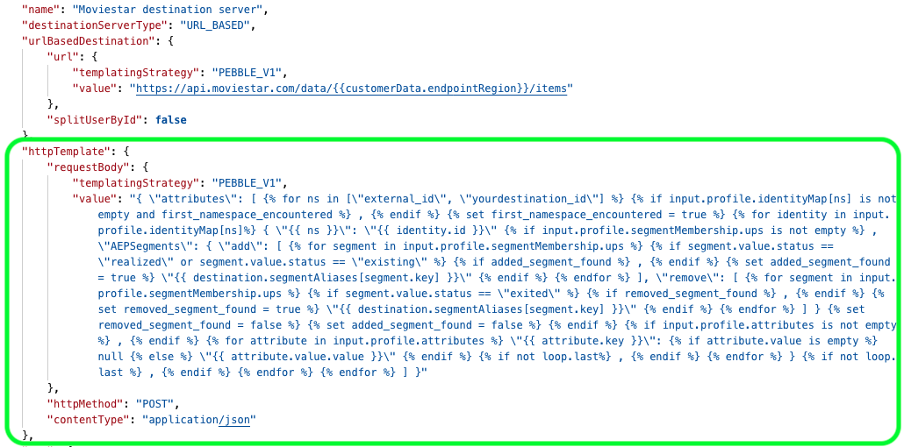

# Template specs for destinations created with Destination SDK

Use the template spec part of the destination server configuration to configure how to format the HTTP requests sent to your destination.

In a template spec you can define how to transform profile attribute fields between the XDM schema and the format that your platform supports.

Template specs are part of the destination server configuration for real-time (streaming) destinations. 

To understand where this component fits into an integration created with Destination SDK, see the diagram in the [configuration options](../configuration-options.md) documentation or see the guide on how to [use Destination SDK to configure a streaming destination](../../guides/configure-destination-instructions.md#create-server-template-configuration).

You can configure the template specs for your destination via the `/authoring/destination-servers` endpoint. See the following API reference pages for detailed API call examples where you can configure the components shown in this page.

* [Create a destination server configuration](../../authoring-api/destination-server/create-destination-server.md)
* [Update a destination server configuration](../../authoring-api/destination-server/update-destination-server.md)

>[!IMPORTANT]
>
>All parameter names and values supported by Destination SDK are **case sensitive**. To avoid case sensitivity errors, use the parameter names and values exactly as shown in the documentation.

## Supported integration types {#supported-integration-types}

Refer to the table below for details on which types of integrations support the functionality described on this page.

|Integration type| Supports functionality |
|---|---|
| Real-time (streaming) integrations | Yes |
| File-based (batch) integrations | No |

## Configure a template spec {#configure-template-spec}

Adobe uses a templating language similar to [Jinja](https://jinja.palletsprojects.com/en/2.11.x/) to transform the fields from the XDM schema into a format supported by your destination.



For more information about the transformation, visit the links below:

* [Message format](message-format.md)
* [Using a templating language for the identity, attributes, and audience membership transformations](message-format.md#using-templating)

>[!TIP]
>
>Adobe offers a [developer tool](../../testing-api/streaming-destinations/create-template.md) that helps you create and test a message transformation template. 

See below an example of an HTTP request template, together with descriptions of each individual parameter.

```json

{
   "httpTemplate":{
      "httpMethod":"POST",
      "requestBody":{
         "templatingStrategy":"PEBBLE_V1",
         "value":"{ \"attributes\": [   ,    { \"{{ ns }}\": \"{{ identity.id }}\"  , \"AEPSegments\": { \"add\": [     ,   \"{{ destination.namespaceSegmentAliases[namespace.key][segment.key] }}\"    ], \"remove\": [     ,   \"{{ destination.namespaceSegmentAliases[namespace.key][segment.key] }}\"    ] }     ,   \"{{ attribute.key }}\":  null  \"{{ attribute.value.value }}\"   ,   }  ,    ] }"
      },
      "contentType":"application/json"
   }
}
```

|Parameter | Type | Description|
|---|---|---|
|`httpMethod` | String | *Required.* The method that Adobe will use in calls to your server. Supported methods: `GET`, `PUT`, `POST`, `DELETE`, `PATCH`. |
|`templatingStrategy` | String | *Required.* Use `PEBBLE_V1`. |
|`value` | String | *Required.* This string is the character-escaped version of the template that formats the HTTP requests sent by Experience Platform into the format expected by your destination. <br> For information on how to write the template, read the section on [using templating](message-format.md#using-templating). <br> For more information about character escaping, see the [RFC JSON standard, section seven](https://tools.ietf.org/html/rfc8259#section-7). <br> For an example of a simple transformation, see the [profile attributes](message-format.md#attributes) transformation. |
|`contentType` | String | *Required.* The content type that your server accepts. Depending on what type of output your transformation template produces, this can be any of the supported [HTTP application content types](https://www.iana.org/assignments/media-types/media-types.xhtml#application). In most cases, this value should be set to `application/json`. |

{style="table-layout:auto"}

## Convert a template to support external audiences {#template-converter-tool}

Older templates only read audience membership from the `ups` namespace. Update these templates to iterate over every namespace in `segmentMembership`, so that they also read membership for [external audiences](/help/segmentation/api/external-audiences.md).

For information on how to configure your destination to support external audiences, see [Configure support for external audiences](/help/destinations/destination-sdk/functionality/destination-configuration/schema-configuration.md#external-audiences).

Use the *Template Converter* tool to convert your existing template automatically. The tool rewrites a template that reads only the `ups` namespace into a template that iterates over all namespaces in `segmentMembership`, including external audiences.

[Download the Template Converter tool](../../assets/functionality/destination-server/templates-converter.zip)

The tool requires Java Runtime Environment (JRE) 11 or later. It supports two modes:

* **Command line interface (CLI) mode**: Run the tool from a terminal and pass your existing template as a parameter.

  ```shell
  java -jar templates-converter-cli.jar "your-existing-template-string"
  ```

  The tool prints the converted template to the terminal.

* **User interface (UI) mode**: Run the tool with a graphical interface. This mode requires the JavaFX SDK, which is included in the downloaded archive.

  ```shell
  java --module-path="./javafx-sdk-17.0.7/lib" --add-modules=javafx.controls,javafx.fxml -jar templates-converter-ui.jar
  ```

After you convert your template, test it against multiple sample profiles using the [render template API](../../testing-api/streaming-destinations/render-template-api.md) to confirm that it still renders correctly before you add it to your destination server configuration.

>[!IMPORTANT]
>
>The Templates Converter tool only rewrites the syntax of your template. It does not validate the business logic of the converted template. Always test your converted template before using it in production.

## Configure request headers {#headers}

In addition to the request body, you can add custom HTTP headers to the calls Experience Platform makes to your destination. Each header entry uses the same `templatingStrategy` and `value` fields as other templatized fields in the destination server.

```json
"httpTemplate": {
  "httpMethod": "POST",
  "headers": [
    {
      "header": "Authorization",
      "value": {
        "templatingStrategy": "PEBBLE_V1",
        "value": "Basic {{ (authData.username + ':' + authData.password) | base64encode }}"
      }
    },
    {
      "header": "x-integration",
      "value": {
        "templatingStrategy": "PEBBLE_V1",
        "value": "{{customerData.integrationId}}"
      }
    },
    {
      "header": "Amazon-Advertising-API-ClientId",
      "value": {
        "templatingStrategy": "PEBBLE_V1",
        "value": "{{authData.clientId}}"
      }
    },
    {
      "header": "Accept",
      "value": {
        "templatingStrategy": "NONE",
        "value": "application/json"
      }
    }
  ]
}
```

| Parameter | Type | Description |
|---|---|---|
| `header` | String | *Required.* The header name, such as `Authorization`, `Content-Type`, or a custom header. |
| `value.templatingStrategy` | String | *Required.* Use `PEBBLE_V1` when the header value is dynamic or uses Pebble expressions. Use `NONE` for static values. |
| `value.value` | String | *Required.* The header value. Supports Pebble expressions that reference customer data or authentication data fields, such as `{{customerData.integrationId}}`, `{{authData.clientId}}`, or `{{ (authData.username + ':' + authData.password) \| base64encode }}`. |

{style="table-layout:auto"}

Some partner APIs require a custom header populated with a value from the authentication credentials that customers provide, rather than the standard `Authorization` header. The `Amazon-Advertising-API-ClientId` header shown above is an example of this pattern, where the header value comes directly from an `authData` field.

>[!NOTE]
>
>This structure applies to destination server headers only. Audience metadata template headers use a simpler form, where `value` is a flat string instead of an object with `templatingStrategy` and `value` fields. For an example, see [audience metadata management](/help/destinations/destination-sdk/functionality/audience-metadata-management.md#configuration-examples).

For destinations using Basic authentication that require a custom Base64-encoded header, see [Customize the Basic authentication header](/help/destinations/destination-sdk/functionality/destination-configuration/customer-authentication.md#basic-override).

## Next steps {#next-steps}

After reading this article, you should have a better understanding of what a template spec is, and how you can configure it.

To learn more about the other destination server components, see the following articles:

* [Server specs for destinations created with Destination SDK](server-specs.md)
* [Message format](message-format.md)
* [File formatting configuration](file-formatting.md)
