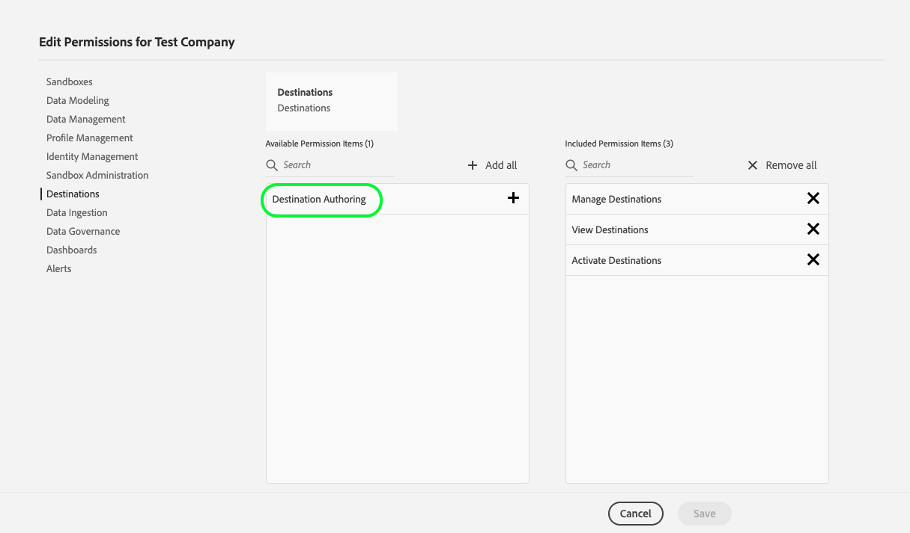

# Getting started 

## Overview {#overview}

This page describes how to authenticate and start using Adobe Experience Platform Destination SDK. It includes instructions on how to obtain Adobe I/O authentication credentials, a sandbox name, and the destination authoring access control permission.

## Terminology {#terminology}

This guide uses Platform-specific concepts, such as organization and sandboxes. Consult the [Experience Platform glossary](https://experienceleague.adobe.com/docs/experience-platform/landing/glossary.html) for definitions of these and other terms.

## Obtain required authentication credentials {#obtain-authentication-credentials}

Destination SDK uses the [Adobe I/O](https://www.adobe.io/) gateway for authentication. To make API calls to Destination SDK endpoints, you must provide certain headers in your API calls. Work with the Adobe Exchange team to set up authentication for you to the [Adobe Developer Console](https://developer.adobe.com/console).

To successfully make calls to Destination SDK API endpoints, follow the [Experience Platform authentication tutorial](https://experienceleague.adobe.com/docs/experience-platform/landing/platform-apis/api-authentication.html). Start the tutorial from the "[Generate an API key, organization ID, and client secret](https://experienceleague.adobe.com/docs/experience-platform/landing/platform-apis/api-authentication.html#api-ims-secret)" step. The Adobe Exchange team will handle the previous steps for you. Completing the authentication tutorial provides the values for each of the required headers in Destination SDK API calls, as shown below:

* `x-api-key: {API_KEY}`, also referred to as Client ID
* `x-gw-ims-org-id: {ORG_ID}`, also referred to as Organization ID
* `Authorization: Bearer {ACCESS_TOKEN}`. The access token has an expiration time of 24 hours, expressed in milliseconds, so you will have to refresh it. To refresh the access token, repeat the steps outlined in the authentication tutorial.

<!--

### Obtain `Authorization: Bearer {ACCESS_TOKEN}`

To obtain the `{ACCESS_TOKEN}`, you must generate a JWT token and exchange it for the access token. Follow the steps below:

1. Follow the instructions in the [Generate JWT section](https://www.adobe.io/apis/experienceplatform/console/docs.html#!AdobeDocs/adobeio-console/master/credentials.md) in the credentials guide.
2. Follow the instructions in [Step 3: try it](https://www.adobe.io/authentication/auth-methods.html#!AdobeDocs/adobeio-auth/master/AuthenticationOverview/ServiceAccountIntegration.md) in the Service account connection guide.

You now have the required authentication headers `x-api-key: {API_KEY}`, `x-gw-ims-org-id: {ORG_ID}`, and `Authorization: Bearer {ACCESS_TOKEN}`.

>[!NOTE]
>
>The access token has an expiration time of 24 hours, expressed in milliseconds, so you will have to refresh it. To refresh the access token, repeat the steps outlined in this section.

-->

## Destination ownership and sandboxes {#destination-ownership}

All resources in Experience Platform are isolated to specific virtual sandboxes. Requests to Destination SDK require headers that specify the name of the sandbox the operation takes place in:

* `x-sandbox-name: {SANDBOX_NAME}`

The Adobe Exchange team provides you with your sandbox name, which you are required to use in calls to the Destination SDK API endpoints.

## Role-based access control (RBAC) {#rbac}

To use the Destination SDK API endpoints described in the [reference documentation](./configuration-options.md), you need the **[!UICONTROL Destination Authoring]** access control permission. Work with the Adobe Exchange team to get this permission assigned to you in [Adobe Admin Console](https://adminconsole.adobe.com/). 

For more information, read the following Experience Platform Access Control documents:

* [Manage permissions for a product profile](/help/access-control/ui/permissions.md)
* [Available permissions for Experience Platform](/help/access-control/home.md#permissions)
* [Adobe Admin Console documentation](https://helpx.adobe.com/enterprise/using/admin-console.html)

## Additional considerations {#additional-considerations}

* Any changes that you make to destination configurations, whether you create or edit a destination configuration, need to be reviewed and approved by Adobe. Your changes are reflected in your destinations only after the review is done.
* Only the users that belong to the same organization and have access to the sandbox can edit the destination configuration.

## Next steps {#next-steps}

By following the steps in this article, you obtained authentication credentials to Adobe I/O, a sandbox name, and the destination authoring access control permission. Next, you can set up a destination using Destination SDK.

* Read the following configuration guides, depending on your destination type:

  * [Use Destination SDK to configure a streaming destination](./configure-destination-instructions.md)
  * [Use Destination SDK to configure a file-based destination](./configure-file-based-destination-instructions.md)

* For all operations, refer to the [Destination Authoring API documentation](https://www.adobe.io/experience-platform-apis/references/destination-authoring/).
* Use the [Destination Authoring API Postman collection](https://github.com/adobe/experience-platform-postman-samples/blob/master/apis/experience-platform/Destination%20Authoring%20API.postman_collection.json) to configure your destination using the Destination SDK API endpoints. To get started with Postman, see the [steps for importing environments and collections](https://learning.postman.com/docs/getting-started/importing-and-exporting-data/) and a [video guide for creating the Postman environment](https://video.tv.adobe.com/v/28832).
