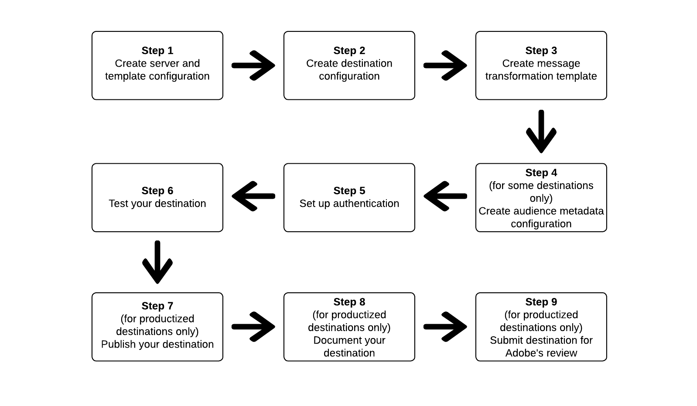

# Use Destination SDK to configure a streaming destination

## Overview {#overview}

This page describes how to use the information in [Configuration options in Destinations SDK](../functionality/configuration-options.md) and in other Destination SDK functionality and API reference documents to configure a [streaming destination](../../destination-types.md#streaming-destinations). The steps are laid out in sequential order below.

## Prerequisites {#prerequisites}

Before advancing to the steps illustrated below, please read the [Destination SDK getting started](../getting-started.md) page for information on obtaining the necessary Adobe I/O authentication credentials and other prerequisites to work with Destination SDK APIs. This assumes that you have completed the partnership and permission prerequisites and are ready to start developing your destination.

## Steps to use the configuration options in Destination SDK to set up your destination {#steps}



## Step 1: Create a server and template configuration {#create-server-template-configuration}

Start by [creating a server and template configuration](../authoring-api/destination-server/create-destination-server.md) using the `/destinations-server` endpoint.

Shown below is an example configuration. Note that the message transformation template in the `requestBody.value` parameter is addressed in step 3, [Create transformation template](#create-transformation-template).

```shell
POST platform.adobe.io/data/core/activation/authoring/destination-servers
```

```json {line-numbers="true" highlight="14"}
{
   "name":"Moviestar destination server",
   "destinationServerType":"URL_BASED",
   "urlBasedDestination":{
      "url":{
         "templatingStrategy":"PEBBLE_V1",
         "value":"https://api.moviestar.com/data/{{customerData.region}}/items"
      }
   },
   "httpTemplate":{
      "httpMethod":"POST",
      "requestBody":{
         "templatingStrategy":"PEBBLE_V1",
         "value":"insert after you create a template in step 3"
      },
      "contentType":"application/json"
   }
}

```

## Step 2: Create destination configuration {#create-destination-configuration}

Shown below is an example configuration for a destination template, created by using the `/destinations` API endpoint. See [create a destination configuration](../authoring-api/destination-configuration/create-destination-configuration.md) for more information.

To connect the server and template configuration in step 1 to this destination configuration, add the instance ID of the server and template configuration as `destinationServerId` here.

>[!IMPORTANT]
>
>To create a correctly configured real-time (streaming) destination, you *must* add at least one target identity in `identityNamespaces`, as shown below. If no target identity is configured, users will not be able to proceed past the [Mapping step](../../ui/activate-segment-streaming-destinations.md#mapping) of the activation workflow.

```shell
POST platform.adobe.io/data/core/activation/authoring/destinations
```

```json {line-numbers="true" highlight="74"} 
{
   "name":"Moviestar",
   "description":"Moviestar is a fictional destination, used for this example.",
   "status":"TEST",
   "customerAuthenticationConfigurations":[
      {
         "authType":"BEARER"
      }
   ],
   "customerDataFields":[
      {
         "name":"endpointsInstance",
         "type":"string",
         "title":"Select Endpoint",
         "description":"Moviestar manages several instances across the globe for REST endpoints that our customers are provisioned for. Select your endpoint in the dropdown list.",
         "isRequired":true,
         "enum":[
            "US",
            "EU",
            "APAC",
            "NZ"
         ]
      },
      {
         "name":"customerID",
         "type":"string",
         "title":"Moviestar Customer ID",
         "description":"Your customer ID in the Moviestar destination (e.g. abcdef).",
         "isRequired":true,
         "pattern":""
      }
   ],
   "uiAttributes":{
      "documentationLink":"http://www.adobe.com/go/destinations-moviestar-en",
      "category":"mobile",
      "connectionType":"Server-to-server",
      "frequency":"Streaming"
   },
   "identityNamespaces":{
      "external_id":{
         "acceptsAttributes":true,
         "acceptsCustomNamespaces":true
      },
      "another_id":{
         "acceptsAttributes":true,
         "acceptsCustomNamespaces":true
      }
   },
   "segmentMappingConfig":{
      "mapExperiencePlatformSegmentName":false,
      "mapExperiencePlatformSegmentId":false,
      "mapUserInput":false,
      "audienceTemplateId":"cbf90a70-96b4-437b-86be-522fbdaabe9c"
   },   
   "aggregation":{
      "aggregationType":"CONFIGURABLE_AGGREGATION",
      "configurableAggregation":{
         "aggregationPolicyId":null,
         "aggregationKey":{
            "includeSegmentId":true,
            "includeSegmentStatus":true,
            "includeIdentity":true,
            "oneIdentityPerGroup":true,
            "groups":null
         },
         "splitUserById":true,
         "maxBatchAgeInSecs":2400,
         "maxNumEventsInBatch":5000
      }
   },
   "destinationDelivery":[
      {
         "authenticationRule":"CUSTOMER_AUTHENTICATION",
         "destinationServerId":"9c77000a-4559-40ae-9119-a04324a3ecd4"
      }
   ]
}

```

## Step 3: Create message transformation template - use templating language to specify the message output format {#create-transformation-template}

Based on the payloads that your destination supports, you must create a template that transforms the format of the exported data from Adobe XDM format into a format supported by your destination. See template examples in the section [Using a templating language for the identity, attributes, and segment membership transformations](../functionality/destination-server/message-format.md#using-templating) and use the [template authoring tool](../testing-api/streaming-destinations/create-template.md) provided by Adobe.

Once you have crafted a message transformation template that works for you, add it to the server and template configuration you created in step 1.

## Step 4: Create audience metadata configuration {#create-audience-metadata-configuration}

For some destinations, Destination SDK requires that you configure an audience metadata configuration to programmatically create, update, or delete audiences in your destination. Refer to [Audience metadata management](../functionality/audience-metadata-management.md) for information on when you need to set up this configuration and how to do it.

If you use an audience metadata configuration, you must connect it to the destination configuration you created in step 2. Add the instance ID of your audience metadata configuration to your destination configuration as `audienceTemplateId`.

## Step 5: Set up authentication {#set-up-authentication}

Depending on whether you specify `"authenticationRule": "CUSTOMER_AUTHENTICATION"` or `"authenticationRule": "PLATFORM_AUTHENTICATION"` in the destination configuration above, you can set up authentication for your destination by using the `/destination` or the `/credentials` endpoint.

If you selected `"authenticationRule": "CUSTOMER_AUTHENTICATION"` in the destination configuration and your destination supports the OAuth 2 authentication method, read [OAuth 2 authentication](../functionality/destination-configuration/oauth2-authentication.md).

If you selected `"authenticationRule": "PLATFORM_AUTHENTICATION"`, you must create a [credentials configuration](../credentials-api/create-credential-configuration.md).

## Step 6: Test your destination {#test-destination}

After setting up your destination using the configuration endpoints in the previous steps, you can use the [destination testing tool](../testing-api/streaming-destination-testing-overview.md) to test the integration between Adobe Experience Platform and your destination.

As part of the process to test your destination, you must use the Experience Platform UI to create segments, which you will activate to your destination. Refer to the two resources below for instructions how to create segments in Experience Platform:

* [Create a segment documentation page](/help/segmentation/ui/overview.md#create-segment)
* [Create a segment video walkthrough](https://experienceleague.adobe.com/docs/platform-learn/tutorials/segments/create-segments.html?lang=en)

## Step 7: Publish your destination {#publish-destination}

>[!NOTE]
>
>This step is not required if you are creating a private destination for your own use, and are not looking to publish it in the destinations catalog for other customers to use.

After configuring and testing your destination, use the [destination publishing API](../publishing-api/create-publishing-request.md) to submit your configuration to Adobe for review.

## Step 8: Document your destination {#document-destination}

>[!NOTE]
>
>This step is not required if you are creating a private destination for your own use, and are not looking to publish it in the destinations catalog for other customers to use.

If you are an Independent Software Vendor (ISV) or System Integrator (SI) creating a [productized integration](../overview.md#productized-custom-integrations), use the [self-service documentation process](../docs-framework/documentation-instructions.md) to create a product documentation page for your destination in the [Experience Platform destinations catalog](/help/destinations/catalog/overview.md).

## Step 9: Submit destination for Adobe's review {#submit-for-review}

>[!NOTE]
>
>This step is not required if you are creating a private destination for your own use, and are not looking to publish it in the destinations catalog for other customers to use.

Finally, before the destination can be published in the Experience Platform catalog and visible to all Experience Platform customers, you need to officially submit the destination for Adobe's review. Find complete information about how to [submit for review a productized destination authored in Destination SDK](../guides/submit-destination.md).
