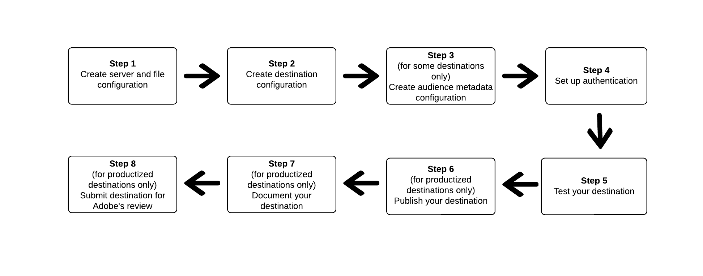

# Use Destination SDK to configure a file-based destination

## Overview {#overview}

This page describes how to use the information in [Configuration options in Destinations SDK](../functionality/configuration-options.md) and in other Destination SDK functionality and API reference documents to configure a [file-based destination](../../destination-types.md#file-based). The steps are laid out in sequential order below.

## Prerequisites {#prerequisites}

Before advancing to the steps illustrated below, please read the [Destination SDK getting started](../getting-started.md) page for information on obtaining the necessary Adobe I/O authentication credentials and other prerequisites to work with Destination SDK APIs.

## Steps to use the configuration options in Destination SDK to set up your destination {#steps}



## Step 1: Create a server and file configuration {#create-server-file-configuration}

Start by [creating a server and file configuration](../authoring-api/destination-server/create-destination-server.md) using the `/destinations-server` endpoint.

Shown below is an example configuration for an [!DNL Amazon S3] destination. To configure other types of file-based destinations, see their corresponding [server configurations](../functionality/destination-server/server-specs.md).

**API format**

```http
POST platform.adobe.io/data/core/activation/authoring/destination-servers
```

```json
{
    "name": "S3 destination",
    "destinationServerType": "FILE_BASED_S3",
    "fileBasedS3Destination": {
        "bucket": {
            "templatingStrategy": "PEBBLE_V1",
            "value": "{{customerData.bucket}}"
        },
        "path": {
            "templatingStrategy": "PEBBLE_V1",
            "value": "{{customerData.path}}"
        }
    },
    "fileConfigurations": {
        "compression": {
            "templatingStrategy": "PEBBLE_V1",
            "value": "{{customerData.compression}}"
        },
        "fileType": {
            "templatingStrategy": "PEBBLE_V1",
            "value": "{{customerData.fileType}}"
        },
        "csvOptions": {
            "quote": {
                "templatingStrategy": "NONE",
                "value": "\""
            },
            "quoteAll": {
                "templatingStrategy": "NONE",
                "value": "false"
            },
            "escape": {
                "templatingStrategy": "NONE",
                "value": "\\"
            },
            "escapeQuotes": {
                "templatingStrategy": "NONE",
                "value": "true"
            },
            "header": {
                "templatingStrategy": "NONE",
                "value": "true"
            },
            "ignoreLeadingWhiteSpace": {
                "templatingStrategy": "NONE",
                "value": "true"
            },
            "ignoreTrailingWhiteSpace": {
                "templatingStrategy": "NONE",
                "value": "true"
            },
            "nullValue": {
                "templatingStrategy": "NONE",
                "value": ""
            },
            "dateFormat": {
                "templatingStrategy": "NONE",
                "value": "yyyy-MM-dd"
            },
            "timestampFormat": {
                "templatingStrategy": "NONE",
                "value": "yyyy-MM-dd'T':mm:ss[.SSS][XXX]"
            },
            "charToEscapeQuoteEscaping": {
                "templatingStrategy": "NONE",
                "value": "\\"
            },
            "emptyValue": {
                "templatingStrategy": "NONE",
                "value": ""
            }
        }
    }
}
```

## Step 2: Create destination configuration {#create-destination-configuration}

Shown below is an example of a destination configuration, created by using the `/destinations` API endpoint.

To connect the server and file configuration in step 1 to this destination configuration, add the instance ID of the server and template configuration as `destinationServerId` here.

**API format**

```http
POST platform.adobe.io/data/core/activation/authoring/destinations
``` 

```json

{
    "name": "Amazon S3 destination",
    "description": "Amazon S3 destination is a fictional destination, used for this example.",
    "releaseNotes": "Test",
    "status": "Test",
    "customerAuthenticationConfigurations": [
        {
            "authType": "S3"
        }
    ],
    "customerEncryptionConfigurations": [],
    "customerDataFields": [
        {
            "name": "bucket",
            "title": "Amazon S3 bucket name",
            "description": "Enter the Amazon S3 Bucket name that will host the exported files.",
            "type": "string",
            "isRequired": true,
            "readOnly": false,
            "hidden": false
        },
        {
            "name": "path",
            "title": "Amazon S3 path",
            "description": "Enter Amazon S3 folder path",
            "type": "string",
            "isRequired": true,
            "pattern": "^[A-Za-z]+$",
            "readOnly": false,
            "hidden": false
        },
        {
            "name": "compression",
            "title": "Select compression type",
            "description": "Select the file compression type used by the exported files.",
            "type": "string",
            "isRequired": true,
            "readOnly": false,
            "enum": [
                "GZIP",
                "NONE",
                "bzip2",
                "lz4",
                "snappy",
                "deflate"
            ]
        },
        {
            "name": "fileType",
            "title": "Select a file format",
            "description": "Select the file format to be used by the exported files.",
            "type": "string",
            "isRequired": true,
            "readOnly": false,
            "hidden": false,
            "enum": [
                "csv",
                "json",
                "parquet"
            ],
            "default": "csv"
        }
    ],
    "uiAttributes": {
        "documentationLink": "https://www.adobe.io/apis/experienceplatform.html",
        "category": "S3",
        "iconUrl": "https://dc5tqsrhldvnl.cloudfront.net/2/90048/da276e30c730ce6cd666c8ca78360df21.png",
        "connectionType": "S3",
        "flowRunsSupported": true,
        "monitoringSupported": true,
        "frequency": "Batch"
    },
    "destinationDelivery": [
        {
            "deliveryMatchers": [
                {
                    "type": "SOURCE",
                    "value": [
                        "batch"
                    ]
                }
            ],
            "authenticationRule": "CUSTOMER_AUTHENTICATION",
            "destinationServerId": "eec25bde-4f56-4c02-a830-9aa9ec73ee9d"
        }
    ],
    "schemaConfig": {
        "profileRequired": true,
        "segmentRequired": true,
        "identityRequired": true
    },
    "batchConfig": {
        "allowMandatoryFieldSelection": true,
        "allowDedupeKeyFieldSelection": true,
        "defaultExportMode": "DAILY_FULL_EXPORT",
        "allowedExportMode": [
            "DAILY_FULL_EXPORT",
            "FIRST_FULL_THEN_INCREMENTAL"
        ],
        "allowedScheduleFrequency": [
            "DAILY",
            "EVERY_3_HOURS",
            "EVERY_6_HOURS",
            "EVERY_8_HOURS",
            "EVERY_12_HOURS",
            "ONCE"
        ],
        "defaultFrequency": "DAILY",
        "defaultStartTime": "00:00"
    },
    "backfillHistoricalProfileData": true
}
```

## Step 3: Create audience metadata configuration {#create-audience-metadata-configuration}

For some destinations, Destination SDK requires that you configure an audience metadata configuration to programmatically create, update, or delete audiences in your destination. Refer to [Audience metadata management](../functionality/audience-metadata-management.md) for information on when you need to set up this configuration and how to do it.

If you use an audience metadata configuration, you must connect it to the destination configuration you created in step 2. Add the instance ID of your audience metadata configuration to your destination configuration as `audienceTemplateId`.

## Step 4: Set up authentication {#set-up-authentication}

Depending on whether you specify `"authenticationRule": "CUSTOMER_AUTHENTICATION"` or `"authenticationRule": "PLATFORM_AUTHENTICATION"` in the destination configuration above, you can set up authentication for your destination by using the `/destination` or the `/credentials` endpoint.

* If you selected `"authenticationRule": "CUSTOMER_AUTHENTICATION"` in the destination configuration, see the following sections for the authentication types supported by Destination SDK for file-based destinations:
    
    * [Amazon S3 authentication](../functionality/destination-configuration/customer-authentication.md#s3)
    * [Azure Blob](../functionality/destination-configuration/customer-authentication.md#blob)
    * [Azure Data Lake Storage](../functionality/destination-configuration/customer-authentication.md#adls)
    * [Google Cloud Storage](../functionality/destination-configuration/customer-authentication.md#gcs)
    * [SFTP authentication with SSH key](../functionality/destination-configuration/customer-authentication.md#sftp-ssh)
    * [SFTP authentication with password](../functionality/destination-configuration/customer-authentication.md#sftp-password)

* If you selected `"authenticationRule": "PLATFORM_AUTHENTICATION"`, refer to the [credential configuration API documentation](../credentials-api/create-credential-configuration.md#when-to-use).


## Step 5: Test your destination {#test-destination}

After setting up your destination using the configuration endpoints in the previous steps, you can use the [destination testing tool](../testing-api/batch-destinations/file-based-destination-testing-overview.md) to test the integration between Adobe Experience Platform and your destination.

As part of the process to test your destination, you must use the Experience Platform UI to create segments, which you will activate to your destination. Refer to the two resources below for instructions how to create segments in Experience Platform:

* [Create a segment documentation page](/help/segmentation/ui/overview.md#create-segment)
* [Create a segment video walkthrough](https://experienceleague.adobe.com/docs/platform-learn/tutorials/segments/create-segments.html?lang=en)

## Step 6: Publish your destination {#publish-destination}

>[!NOTE]
>
>This step is not required if you are creating a private destination for your own use, and are not looking to publish it in the destinations catalog for other customers to use.

After configuring and testing your destination, use the [destination publishing API](../publishing-api/create-publishing-request.md) to submit your configuration to Adobe for review.

## Step 7: Document your destination {#document-destination}

>[!NOTE]
>
>This step is not required if you are creating a private destination for your own use, and are not looking to publish it in the destinations catalog for other customers to use.

If you are an Independent Software Vendor (ISV) or System Integrator (SI) creating a [productized integration](../overview.md#productized-custom-integrations), use the [self-service documentation process](../docs-framework/documentation-instructions.md) to create a product documentation page for your destination in the [Experience Platform destinations catalog](/help/destinations/catalog/overview.md).

## Step 8: Submit destination for Adobe's review {#submit-for-review}

>[!NOTE]
>
>This step is not required if you are creating a private destination for your own use, and are not looking to publish it in the destinations catalog for other customers to use.

Finally, before the destination can be published in the Experience Platform catalog and visible to all Experience Platform customers, you need to officially submit the destination for Adobe's review. Find complete information about how to [submit for review a productized destination authored in Destination SDK](../guides/submit-destination.md).
