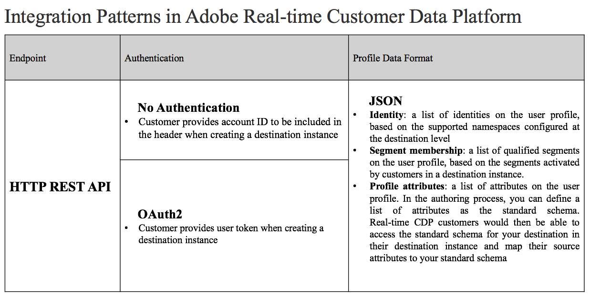

# Integration patterns with Adobe Experience Platform

>[!IMPORTANT]
>
>* The content on this page is Adobe confidential information, please do not share outside of your company.
>* The Adobe Experience Platform Destination SDK is currently a beta release. The documentation and the functionality are subject to change.

## Overview

In Adobe Experience Platform, customers can activate their customer profile data into destinations with up-to-date segment membership data and the corresponding identities and attributes for cross-channel personalization. When a user qualifies for a segment, the profile data would be passed to the destination with the following integration patterns: 

* REST API with segment membership, user identity (excluding cookies) and attributes in the payload

Here is a list of the configurations supported in Adobe Experience Platform. You can customize your destination configuration based on your product capability, and all Adobe customers will share the common configurations when activating data into your product: 

Please refer to [configuration options](./configuration-options.md) and [message formats](./message-format.md) for more details.
