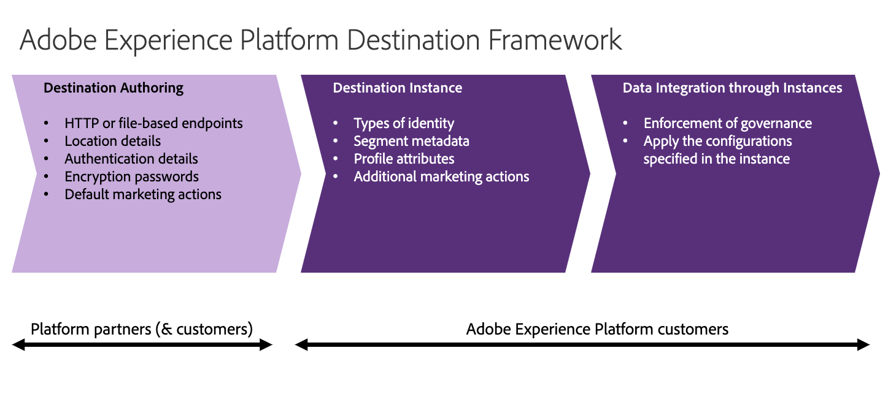

# (Beta) Adobe Experience Platform Destination SDK

>[!IMPORTANT]
>
>* This feature is in limited beta and is only available to select [Adobe Exchange](https://partners.adobe.com/exchangeprogram/creativecloud.html) members. If you are interested in using Destination SDK, please contact Adobe Exchange. 
>* The documentation and the functionality are subject to change.

## Destination SDK for partners {#destinations-sdk}

Adobe Experience Platform Destination SDK is a set of configuration APIs that allow you to configure destination integration patterns for Experience Platform to deliver audience and profile data to your endpoint, based on data and authentication formats of your choice. The configurations will be stored in Experience Platform and can be retrieved via API for additional updates.

<!--

This documentation set provides all the configuration options needed for *Destination Authoring*. For the elements listed in the image below in the *Destinations Authoring* section, use Destination SDK API endpoints to configure your destination in Experience Platform. Find more information in [Configuration options for Destination SDK](./configuration-options.md).

-->
 
## Adobe Real-time Customer Data Platform and the destinations service - an overview {#overview}

Built on [Adobe Experience Platform](https://www.adobe.com/experience-platform/documentation-and-developer-resources.html), [Adobe Real-time Customer Data Platform](https://experienceleague.adobe.com/docs/experience-platform/rtcdp/overview.html?lang=en) (Real-time CDP) helps companies bring together known and unknown data to activate customer profiles with intelligent decisioning throughout the customer journey. Real-time CDP combines multiple enterprise data sources to create unified profiles in real time that can be used to provide one-to-one personalized customer experiences across all channels and devices.

In Adobe Real-time CDP, [destinations](https://experienceleague.adobe.com/docs/experience-platform/destinations/home.html?lang=en) are pre-built integrations with destination platforms that allow for the seamless activation of data.

Adobe connects to a large ecosystem of partners, not to mention native integrations with Adobe Experience Cloud, allowing customers to seamlessly activate these audiences and deliver great customer experiences across all channels, from on-site or in-app personalization to email, paid media, call centers, connected devices, and more.

This documentation set provides instructions for you to use the Adobe Experience Platform Destination SDK to integrate with Adobe Experience Platform as a partner, and have your destination become part of the ever-growing destinations catalog.

## Types of destinations in Adobe Experience Platform {#types-of-destinations}

In Adobe Experience Platform, we distinguish between two destination types - *connections* and *extensions*. In the user interface, customers can choose between two types of connection destinations, Profile Export destinations and Segment Export destinations. For more details around the difference between the different destination types, read [Destination Types and Categories](https://experienceleague.adobe.com/docs/experience-platform/destinations/destination-types.html?lang=en).

This documentation set provides you with all the necessary information to add your destination to Adobe Experience Platform, as a *connection*, either Profile Export or Segment Export. To set up an extension, visit the [Experience Platform Launch developer portal](https://developer.adobelaunch.com/extensions/).

## Prerequisites {#prerequisites}

Adobe recommends that you read and understand the following Experience Platform documentation:

* [Basis of XDM schema composition](https://experienceleague.adobe.com/docs/experience-platform/xdm/schema/composition.html?lang=en)
* [Identity namespace overview](https://experienceleague.adobe.com/docs/experience-platform/identity/namespaces.html?lang=en)
* [Adobe Real-time CDP destinations overview](https://experienceleague.adobe.com/docs/experience-platform/destinations/home.html?lang=en)

## Where to start {#where-to-start}

<!--

First, see the [integration patterns](./integration-methods.md). This page presents an overview of integration patterns and should help you decide which configuration options to select for your destination.

-->

Read [Configuration options for Destination SDK](./configuration-options.md) and [Message format](./message-format.md) for information on the configuration options available to you.

<!--

Then, see [Destination Authoring Process & Lifecycle](./destinations-authoring-process.md) for timelines and steps to complete the configuration and set your destination live in Adobe Real-time CDP.

See the tech specs below for configuration options for each destination type in Adobe Real-time CDP.

* [Batch destinations](./batch-destinations.md)
* [Streaming destinations](./streaming-destinations.md)
* [OAuth destinations](./oauth-destinations.md)

-->

## Known limitations {#known-limitations}

This feature is currently a limited beta release and is only available to select Adobe partners in the Adobe Exchange partner program. Developers using the beta feature should expect the following known product limitation:
* Updates to your destination configurations require 3-5 business days to take effect in your [Experience Platform sandbox](https://experienceleague.adobe.com/docs/experience-platform/sandbox/home.html?lang=en#sandboxes-in-the-experience-platform-ui);
* You are expected to ingest test data into your sandbox in order to test the destination integration.
