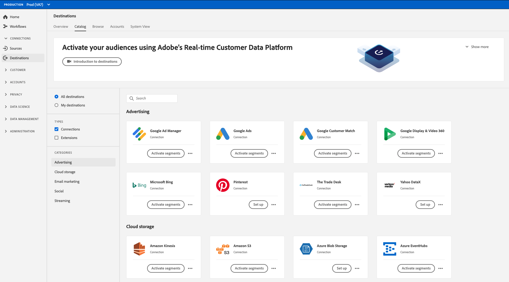

# Adobe Experience Platform Destination SDK

Adobe Experience Platform Destination SDK is a suite of configuration APIs that allow you to configure destination integration patterns for Experience Platform to deliver audience and profile data to your endpoint or storage location, based on data and authentication formats of your choice. The configurations are stored in Experience Platform and can be retrieved via API for additional updates.

The Destination SDK documentation provides instructions for you to use the Adobe Experience Platform Destination SDK to configure, test and release a productized destination integration with Adobe Experience Platform, and have your destination become part of the ever-growing destinations catalog. By using Destination SDK, you can also create your own custom private destination to export data tailored to your needs.

## Quick start - explore essential information {#quick-start}

Review the documentation in the links below to quickly get started configuring and submitting your destination via Destination SDK.

>[!BEGINSHADEBOX]

<table style="border: 0;">
  <tbody>
    <tr>
        <td>
            
<b>Configuration pages</b>

            <ul>
                <li><a href="/help/destinations/destination-sdk/functionality/configuration-options.md">All configuration options explained</a></li>
                <li> Destination server configuration - <a href="/help/destinations/destination-sdk/functionality/destination-server/server-specs.md">server specs</a> and <a href="/help/destinations/destination-sdk/functionality/destination-server/templating-specs.md">templating specs</a></li>
                <li><a href="/help/destinations/destination-sdk/functionality/destination-configuration/customer-data-fields.md">Customer data fields and other destination configuration components</a></li>
                <li><a href="https://experienceleague.adobe.com/en/docs/experience-platform/destinations/destination-sdk/functionality/destination-server/message-format">Templatizing and macros</a></li>
            </ul>
        </td>
        <td>
            
<b>Guides</b>

            <ul>
                <li><a href="/help/destinations/destination-sdk/overview.md#process">High-level integration process</a></li>
                <li><a href="/help/destinations/destination-sdk/guides/configure-destination-instructions.md">Configure a streaming destination</a></li>
                <li><a href="/help/destinations/destination-sdk/guides/configure-file-based-destination-instructions.md">Configure a file-based destination</a></li>
                <li><a href="/help/destinations/destination-sdk/guides/batch/configure-prospect-audience-destination.md">Configure a destination to export prospect profiles</a></li>
                <li><a href="/help/destinations/destination-sdk/guides/submit-destination.md">Submit destination for publishing</a></li>
            </ul>
        </td>
                <td>
            
<b>API references</b>

            <ul>
                <li><a href="https://developer.adobe.com/experience-platform-apis/references/destination-authoring/#tag/Destination-servers-and-templates">Destination server endpoint API reference</a></li>
                <li><a href="https://developer.adobe.com/experience-platform-apis/references/destination-authoring/#tag/Destination-configurations">Destination endpoint API reference</a></li>
                <li><a href="https://developer.adobe.com/experience-platform-apis/references/destination-authoring/#tag/Audience-metadata-templates">Audience Metadata API reference</a></li>
                <li><a href="https://developer.adobe.com/experience-platform-apis/references/destination-authoring/#tag/Destination-testing">Testing API reference</a></li>
                <li><a href="https://developer.adobe.com/experience-platform-apis/references/destination-authoring/#tag/Destination-publishing">Destination publishing API reference</a></li>
            </ul>
        </td>
    </tr>
  </tbody>
</table>

<table style="border: 0;">
  <tbody>
    <tr>
        <td>
            
<b>Configure a streaming destination - cheat sheet</b>

            <ul>
                <li><a href="/help/destinations/destination-sdk/guides/configure-destination-instructions.md">Configure a streaming destination end-to-end guide</a></li>
                <li><a href="/help/destinations/destination-sdk/functionality/destination-server/message-format.md">Understand data transformation through Pebble templates</a> and <a href="/help/destinations/destination-sdk/functionality/destination-server/supported-functions.md">view supported templating functions</a></li>
                <li><a href="/help/destinations/destination-sdk/functionality/destination-configuration/aggregation-policy.md">Understand data aggregation policies</a></li>
                <li><a href="https://experienceleague.adobe.com/en/docs/experience-platform/destinations/destination-sdk/functionality/destination-server/message-format">Live configuration example</a></li>
                <li><a href="/help/destinations/destination-sdk/testing-api/streaming-destinations/streaming-destination-testing-overview.md">Test your streaming destination</a></li>
            </ul>
        </td>
        <td>
            
<b>Configure a file-based destination - cheat sheet</b>

            <ul>
                <li><a href="/help/destinations/destination-sdk/guides/configure-file-based-destination-instructions.md">Configure a file-based destination end-to-end guide</a></li>
                <li><a href="/help/destinations/destination-sdk/guides/batch/configure-file-formatting-options.md">Configure file formats for the exported files</a></li>
                <li><a href="/help/destinations/destination-sdk/guides/batch/configure-amazon-s3-destination-with-predefined-file-formatting.md">Live configuration example for an Amazon S3 destination</a></li>
                <li><a href="/help/destinations/destination-sdk/functionality/destination-configuration/batch-configuration.md">Batch configuration</a> for file export schedule and file naming</li>
                <li><a href="/help/destinations/destination-sdk/testing-api/batch-destinations/file-based-destination-testing-overview.md">Test your file-based destination</a></li>
            </ul>
        </td>
        <td>
            
<b>Other essential information</b>

            <ul>
                <li><a href="/help/destinations/destination-sdk/getting-started.md#obtain-authentication-credentials">Obtain required authentication credentials to use the API</a></li>
                <li><a href="/help/destinations/destination-sdk/integration-prerequisites.md">Integration prerequisites</a></li>
                <li><a href="/help/destinations/destination-sdk/glossary.md">Glossary of Destination SDK terms</a></li>                
                <li><a href="/help/destinations/destination-sdk/functionality/rate-limiting-retry-policy.md">Rate limits and retry policy</a></li>
                <li><a href="/help/destinations/destination-sdk/docs-framework/self-service-template.md">Self-service template to document your destination</a></li>
            </ul>
        </td>
    </tr>
  </tbody>
</table>

>[!ENDSHADEBOX]

## Productized and custom integrations {#productized-custom-integrations}

>[!IMPORTANT]
>
> This functionality to create private custom destinations is available only to [Adobe Real-Time Customer Data Platform Ultimate](https://helpx.adobe.com/legal/product-descriptions/real-time-customer-data-platform.html) customers.

As a Destination SDK partner, you can benefit from adding your productized destination to the [Experience Platform catalog](../catalog/overview.md):

1. Standardize integration configurations across customers with pre-configured parameters and simplify the setup experience for customers.
2. Introduce a branded destination card in the Experience Platform destinations catalog for simplified customer setup and awareness.
3. Be featured as a productized destination integration with Adobe Experience Platform & Adobe Real-Time Customer Data Platform.

As an Experience Platform customer, you can also author your own private custom destination, which can best suit your activation needs.

## Supported integration types {#supported-integration-types}

### Real-time (streaming) integrations {#real-time-integrations}

Through Destination SDK, Adobe Experience Platform supports real-time (also referred to as streaming) integrations with destinations that have a REST API endpoint. The real-time integration with Experience Platform supports capabilities like:

* Message transformation and aggregation
* Profile backfill
* Configurable metadata integration to initialize audience setup and data transfer
* Configurable authentication
* A suite of testing & validation APIs for you to test and iterate your destination configurations

### File-based integrations {#file-based-integrations}

Through Destination SDK, you can also set up integrations to periodically export files to the storage location of your choice. The file-based integration with Experience Platform supports capabilities like:

* File export in several supported formats (CSV, Parquet, JSON)
* Configurable file formatting options, which allow you to structure the format of the exported files to meet your downstream requirements.

Read about the technical requirements on the destinations side in the [integration prerequisites](integration-prerequisites.md) article and read about all supported configurations in the [configuration options](functionality/configuration-options.md) article

## Get access to Destination SDK {#get-access}

Destination SDK access varies based on your status as a partner or Experience Platform, Real-Time CDP customer. See the table below for more information.

|Type of partner or customer | How to access Destination SDK |
---------|----------|
| Independent Software Vendor (ISV) | Join the [Adobe Technology Partner Program](https://partners.adobe.com/technologyprogram/experiencecloud.html) and request to get an Experience Platform sandbox provisioned to access Destination SDK. |
| System Integrator (SI) | You need to be at either Gold or Platinum level in the [Adobe Solution Partner Program](https://solutionpartners.adobe.com/home.html) to get an Experience Platform sandbox provisioned and access to Destination SDK. |
| Experience Platform customer on the [Real-Time CDP Ultimate package](https://helpx.adobe.com/legal/product-descriptions/real-time-customer-data-platform.html) | By default, you get access to Experience Platform sandboxes and Destination SDK, allowing you to build private destinations for your organization.|

{style="table-layout:auto"}

## High-level process {#process}

The process to configure your destination in Experience Platform is outlined below:

1. If you are an ISV or SI, see the [getting access](#get-access) information in the section above. [Real-Time CDP Ultimate package](https://helpx.adobe.com/legal/product-descriptions/real-time-customer-data-platform.html) customers can skip this step.
2. [Request to provision an Experience Platform sandbox](https://adobeexchangeec.zendesk.com/hc/en-us/articles/360037457812-Adobe-Experience-Platform-Sandbox-Accounts-Access-Adding-Users-and-Support) and enable the destination authoring permission.
3. Build your integration. Follow the instructions in the product documentation to configure [streaming destinations](guides/configure-destination-instructions.md) or [file-based destinations](guides/configure-file-based-destination-instructions.md).
4. Test your integration. Follow the instructions in the product documentation to test [streaming destinations](testing-api/streaming-destinations/streaming-destination-testing-overview.md) or [file-based destinations](testing-api/batch-destinations/file-based-destination-testing-overview.md).
5. If you are an ISV or SI creating a [productized integration](./overview.md#productized-custom-integrations), [submit your integration](guides/submit-destination.md) for Adobe's review (the standard response time is five business days).
6. If you are an ISV or SI creating a productized integration, use the [self-service documentation process](docs-framework/documentation-instructions.md) to create a product documentation page on Experience League for your destination.
7. For productized integrations, once approved by Adobe, your integration will show up in the [Experience Platform catalog](../catalog/overview.md).
8. If you'd like to update your integration, follow the same process.

## Reference {#reference}

Adobe recommends that you read and understand the following Experience Platform documentation:

* [Adobe Experience Platform destinations overview](https://experienceleague.adobe.com/docs/experience-platform/destinations/home.html)
* [Basis of XDM schema composition](https://experienceleague.adobe.com/docs/experience-platform/xdm/schema/composition.html)
* [Identity namespace overview](https://experienceleague.adobe.com/docs/experience-platform/identity/namespaces.html)
