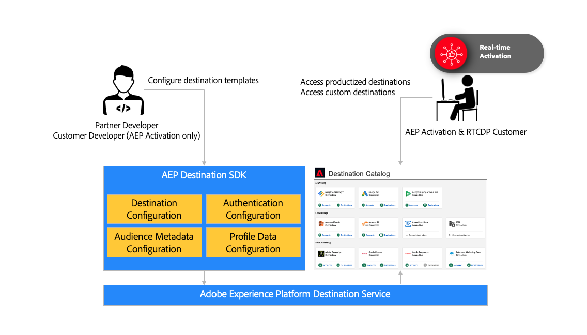

# (Beta) Adobe Experience Platform Destination SDK

>[!IMPORTANT]
>
>* This feature is in limited beta and is only available to select [Adobe Exchange](https://partners.adobe.com/exchangeprogram/creativecloud.html) members. If you are interested in using Destination SDK, please contact Adobe Exchange. 
>* The documentation and the functionality are subject to change.

## Overview {#destinations-sdk}

Adobe Experience Platform Destination SDK is a suite of configuration APIs that allow you to configure destination integration patterns for Experience Platform to deliver audience and profile data to your endpoint, based on data and authentication formats of your choice. The configurations will be stored in Experience Platform and can be retrieved via API for additional updates.

The Destination SDK documentation set provides instructions for you to use the Adobe Experience Platform Destination SDK to integrate with Adobe Experience Platform as a partner, and have your destination become part of the ever-growing destinations catalog.

## Productized and custom integrations

As a Destination SDK partner, you can benefit from adding your productized destination to the Experience Platform catalog:
1. Standardize integration configurations across customers with pre-configured parameters and simplify the setup experience for customers.
2. Introduce a branded destination card in the Experience Platform destinations catalog for simplified customer setup and awareness.
3. Be featured as a productized integration in Adobe marketing materials (product documentation, partner listing in Adobe Exchange).

<!--

## Types of destinations in Adobe Experience Platform {#types-of-destinations}

In Adobe Experience Platform, we distinguish between two destination types - *connections* and *extensions*. In the user interface, customers can choose between two types of connection destinations, Profile Export destinations and Segment Export destinations. For more details around the difference between the different destination types, read [Destination Types and Categories](https://experienceleague.adobe.com/docs/experience-platform/destinations/destination-types.html?lang=en).

This documentation set provides you with all the necessary information to add your destination to Adobe Experience Platform, as a *connection*, either Profile Export or Segment Export. To set up an extension, visit the [Experience Platform Launch developer portal](https://developer.adobelaunch.com/extensions/).

-->

## Types of integrations supported {#supported-integration-types}

Standard capability
Profile backfill
Audience initialization (metadata)
Streaming destinations
REST API required
Real-time integration with AEP with capability like message transformation & aggregation, etc
Customers will be responsible for implementing the AEP schema and mapping to your payload (i.e. you don’t have to follow standard AEP schemas)
File-based destinations
More to come in Q4

## Process {#process}

The process to configure your destination in Experience Platform is outlined below:

1. You need to sign up to become a member of the Adobe Exchange program. [Adobe Experience Platform Activation](https://helpx.adobe.com/legal/product-descriptions/adobe-experience-platform0.html) customers can skip this step.
2. Request to provision an Experience Platform sandbox and enable the destination authoring permission.
3. Build your integration following the product documentation.
4. Test your integration following the product documentation.
5. Submit your integration for Adobe’s review (the standard response time is 5 business days)
6. Use the self-service documentation process to create a product documentation page on Experience League for your destination.
7. Once approved by Adobe, your integration will show up in the Experience Platform catalog.
8. If you’d like to update your integration, follow the same process

## Reference {#reference}

Adobe recommends that you read and understand the following Experience Platform documentation:

* [Basis of XDM schema composition](https://experienceleague.adobe.com/docs/experience-platform/xdm/schema/composition.html?lang=en)
* [Identity namespace overview](https://experienceleague.adobe.com/docs/experience-platform/identity/namespaces.html?lang=en)
* [Adobe Real-time CDP destinations overview](https://experienceleague.adobe.com/docs/experience-platform/destinations/home.html?lang=en)