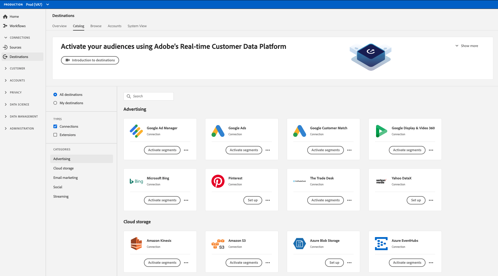

# [!DNL Adobe Experience Platform] Destination SDK

Use [!DNL Adobe Experience Platform] Destination SDK to build destination integrations that deliver audience and profile data to your endpoint or storage location. Choose your data and authentication formats, store configurations in Experience Platform, and retrieve them via API for updates.

Follow this documentation to configure, test, and release a productized destination integration with [!DNL Adobe Experience Platform] and list it in the [destinations catalog](/help/destinations/catalog/overview.md). You can also use Destination SDK to build a private custom destination to export data tailored to your needs.

## Quick start {#quick-start}

Use these resources to configure and submit your destination via Destination SDK.

>[!BEGINSHADEBOX]

<table style="border: 0;">
  <tbody>
    <tr>
        <td>
            
<b>Configuration pages</b>

            <ul>
                <li><a href="/help/destinations/destination-sdk/functionality/configuration-options.md">All configuration options explained</a></li>
                <li>Destination server configuration: <a href="/help/destinations/destination-sdk/functionality/destination-server/server-specs.md">server specs</a> and <a href="/help/destinations/destination-sdk/functionality/destination-server/templating-specs.md">templating specs</a></li>
                <li><a href="/help/destinations/destination-sdk/functionality/destination-configuration/customer-data-fields.md">Customer data fields and other destination configuration components</a></li>
                <li><a href="https://experienceleague.adobe.com/en/docs/experience-platform/destinations/destination-sdk/functionality/destination-server/message-format">Templatizing and macros</a></li>
            </ul>
        </td>
        <td>
            
<b>Guides</b>

            <ul>
                <li><a href="/help/destinations/destination-sdk/overview.md#process">High-level integration process</a></li>
                <li><a href="/help/destinations/destination-sdk/guides/configure-destination-instructions.md">Configure a streaming destination</a></li>
                <li><a href="/help/destinations/destination-sdk/guides/configure-file-based-destination-instructions.md">Configure a file-based destination</a></li>
                <li><a href="/help/destinations/destination-sdk/guides/batch/configure-prospect-audience-destination.md">Configure a destination to export prospect profiles</a></li>
                <li><a href="/help/destinations/destination-sdk/guides/submit-destination.md">Submit destination for publishing</a></li>
            </ul>
        </td>
        <td>
            
<b>API references</b>

            <ul>
                <li><a href="https://developer.adobe.com/experience-platform-apis/references/destination-authoring/#tag/Destination-servers-and-templates">Destination server endpoint API reference</a></li>
                <li><a href="https://developer.adobe.com/experience-platform-apis/references/destination-authoring/#tag/Destination-configurations">Destination endpoint API reference</a></li>
                <li><a href="https://developer.adobe.com/experience-platform-apis/references/destination-authoring/#tag/Audience-metadata-templates">Audience Metadata API reference</a></li>
                <li><a href="https://developer.adobe.com/experience-platform-apis/references/destination-authoring/#tag/Destination-testing">Testing API reference</a></li>
                <li><a href="https://developer.adobe.com/experience-platform-apis/references/destination-authoring/#tag/Destination-publishing">Destination publishing API reference</a></li>
            </ul>
        </td>
    </tr>
  </tbody>
</table>

<table style="border: 0;">
  <tbody>
    <tr>
        <td>
            
<b>Streaming destination quick reference</b>

            <ul>
                <li><a href="/help/destinations/destination-sdk/guides/configure-destination-instructions.md">Configure a streaming destination end-to-end guide</a></li>
                <li><a href="/help/destinations/destination-sdk/functionality/destination-server/message-format.md">Understand data transformation through Pebble templates</a> and <a href="/help/destinations/destination-sdk/functionality/destination-server/supported-functions.md">view supported templating functions</a></li>
                <li><a href="/help/destinations/destination-sdk/functionality/destination-configuration/aggregation-policy.md">Understand data aggregation policies</a></li>
                <li><a href="https://experienceleague.adobe.com/en/docs/experience-platform/destinations/destination-sdk/functionality/destination-server/message-format">Live configuration example</a></li>
                <li><a href="/help/destinations/destination-sdk/testing-api/streaming-destinations/streaming-destination-testing-overview.md">Test your streaming destination</a></li>
            </ul>
        </td>
        <td>
            
<b>File-based destination quick reference</b>

            <ul>
                <li><a href="/help/destinations/destination-sdk/guides/configure-file-based-destination-instructions.md">Configure a file-based destination end-to-end guide</a></li>
                <li><a href="/help/destinations/destination-sdk/guides/batch/configure-file-formatting-options.md">Configure file formats for the exported files</a></li>
                <li><a href="/help/destinations/destination-sdk/guides/batch/configure-amazon-s3-destination-with-predefined-file-formatting.md">Live configuration example for an Amazon S3 destination</a></li>
                <li><a href="/help/destinations/destination-sdk/functionality/destination-configuration/batch-configuration.md">Batch configuration</a> for file export schedule and file naming</li>
                <li><a href="/help/destinations/destination-sdk/testing-api/batch-destinations/file-based-destination-testing-overview.md">Test your file-based destination</a></li>
            </ul>
        </td>
        <td>
            
<b>Other essential information</b>

            <ul>
                <li><a href="/help/destinations/destination-sdk/getting-started.md#obtain-authentication-credentials">Obtain required authentication credentials to use the API</a></li>
                <li><a href="/help/destinations/destination-sdk/integration-prerequisites.md">Integration prerequisites</a></li>
                <li><a href="/help/destinations/destination-sdk/glossary.md">Glossary of Destination SDK terms</a></li>
                <li><a href="/help/destinations/destination-sdk/functionality/rate-limiting-retry-policy.md">Rate limits and retry policy</a></li>
                <li><a href="/help/destinations/destination-sdk/docs-framework/self-service-template.md">Self-service template to document your destination</a></li>
            </ul>
        </td>
    </tr>
  </tbody>
</table>

>[!ENDSHADEBOX]

## Productized and custom integrations {#productized-custom-integrations}

>[!IMPORTANT]
>
> This functionality to create private custom destinations is available only to [Adobe Real-Time Customer Data Platform Ultimate](https://helpx.adobe.com/legal/product-descriptions/real-time-customer-data-platform.html) customers.

As a Destination SDK partner, you can add your productized destination to the [Experience Platform catalog](/help/destinations/catalog/overview.md) to:

* Standardize integration configurations across customers using pre-configured parameters and simplify their setup experience.
* Give customers a branded destination card in the catalog for easier discovery and setup.
* Be listed as a productized integration with [!DNL Adobe Experience Platform] and [!DNL Real-Time Customer Data Platform].

As an Experience Platform customer, you can also build a private custom destination to fit your activation needs.

![Overview diagram showing how destination developers interact with Destination SDK and how [!DNL Real-Time CDP] customers benefit from productized and private destinations.](assets/destination-sdk-visual.png)

## Supported integration types {#supported-integration-types}

### Real-time (streaming) integrations {#real-time-integrations}

Through Destination SDK, [!DNL Adobe Experience Platform] supports real-time (streaming) integrations with destinations that have a REST API endpoint. These integrations support:

* [Message transformation](/help/destinations/destination-sdk/functionality/destination-server/message-format.md) and [aggregation](/help/destinations/destination-sdk/functionality/destination-configuration/aggregation-policy.md)
* [Profile backfill](/help/destinations/destination-sdk/functionality/destination-configuration/historical-profile-qualifications.md)
* [Configurable metadata integration](/help/destinations/destination-sdk/functionality/audience-metadata-management.md) to initialize audience setup and data transfer
* [Configurable authentication](/help/destinations/destination-sdk/functionality/destination-configuration/customer-authentication.md)
* A suite of testing and validation APIs to test and iterate your destination configurations

### File-based integrations {#file-based-integrations}

Through Destination SDK, you can also set up integrations to periodically export files to your preferred storage location. File-based integrations support:

* File export in several [supported formats](/help/destinations/destination-sdk/functionality/destination-server/file-formatting.md) (CSV, Parquet, JSON)
* Configurable file formatting options to structure exported files to fit your downstream needs.

For technical requirements, see [integration prerequisites](/help/destinations/destination-sdk/integration-prerequisites.md). For all supported configurations, see [configuration options](/help/destinations/destination-sdk/functionality/configuration-options.md).

## Get access to Destination SDK {#get-access}

Destination SDK access depends on your status as a partner or [!DNL Real-Time CDP] customer.

|Type of partner or customer | How to access Destination SDK |
|---------|----------|
| Independent Software Vendor (ISV) | Join the [Adobe Technology Partner Program](https://partners.adobe.com/technologyprogram/experiencecloud.html) and request an Experience Platform sandbox to access Destination SDK. |
| System Integrator (SI) | You need to be at either Gold or Platinum level in the [Adobe Solution Partner Program](https://solutionpartners.adobe.com/home.html) to get an Experience Platform sandbox provisioned and access to Destination SDK. |
| Experience Platform customer on the [Real-Time CDP Ultimate package](https://helpx.adobe.com/legal/product-descriptions/real-time-customer-data-platform.html) | By default, you get access to Experience Platform sandboxes and Destination SDK, allowing you to build private destinations for your organization.|

{style="table-layout:auto"}

## High-level process {#process}

To configure your destination in Experience Platform, follow these steps:

1. If you are an ISV or SI, see [Get access to Destination SDK](#get-access). [Real-Time CDP Ultimate package](https://helpx.adobe.com/legal/product-descriptions/real-time-customer-data-platform.html) customers can skip this step.
2. [Request to provision an Experience Platform sandbox](https://adobeexchangeec.zendesk.com/hc/en-us/articles/360037457812-Adobe-Experience-Platform-Sandbox-Accounts-Access-Adding-Users-and-Support) and enable the destination authoring permission. For authentication credentials and access control setup, see [Getting started with Destination SDK](/help/destinations/destination-sdk/getting-started.md).
3. Build your integration. Follow the instructions in the product documentation to configure [streaming destinations](/help/destinations/destination-sdk/guides/configure-destination-instructions.md) or [file-based destinations](/help/destinations/destination-sdk/guides/configure-file-based-destination-instructions.md).
4. Test your integration. Follow the instructions in the product documentation to test [streaming destinations](/help/destinations/destination-sdk/testing-api/streaming-destinations/streaming-destination-testing-overview.md) or [file-based destinations](/help/destinations/destination-sdk/testing-api/batch-destinations/file-based-destination-testing-overview.md).
5. If you are an ISV or SI creating a productized integration, [submit your integration](/help/destinations/destination-sdk/guides/submit-destination.md) for Adobe's review. The standard response time is five business days.
6. If you are an ISV or SI creating a productized integration, use the [self-service documentation process](/help/destinations/destination-sdk/docs-framework/documentation-instructions.md) to create a product documentation page on Experience League for your destination.
7. For productized integrations, once Adobe approves your submission, your integration appears in the [Experience Platform catalog](/help/destinations/catalog/overview.md).
8. To update your integration, follow the same process.

## Reference {#reference}

Before building your integration, review the following Experience Platform documentation:

* [Adobe Experience Platform destinations overview](https://experienceleague.adobe.com/docs/experience-platform/destinations/home.html)
* [Basis of XDM schema composition](https://experienceleague.adobe.com/docs/experience-platform/xdm/schema/composition.html)
* [Identity namespace overview](https://experienceleague.adobe.com/docs/experience-platform/identity/namespaces.html)
