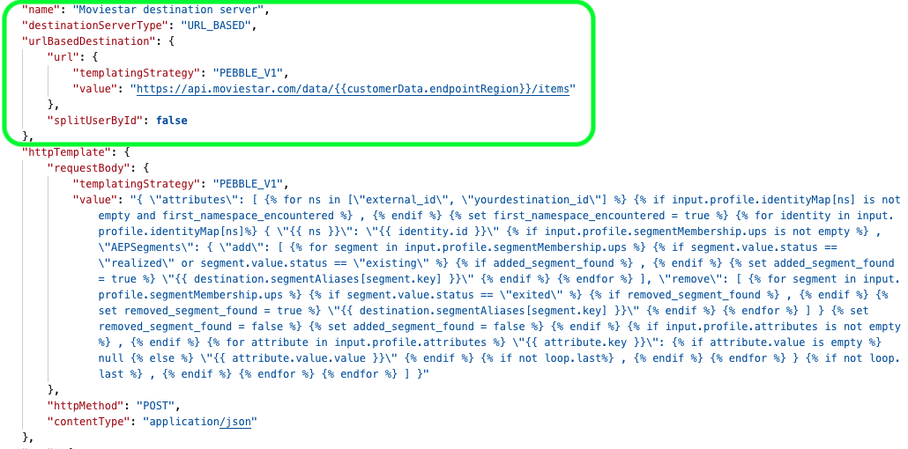
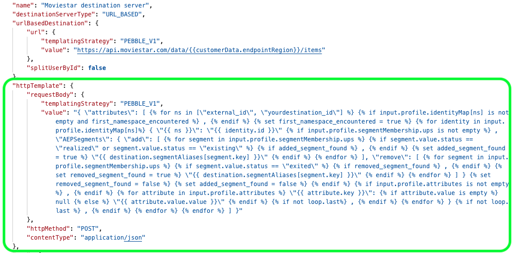

# Configuration options for streaming destinations server and template specs

## Overview {#overview}

The server and template specs can be configured in Adobe Experience Platform Destination SDK via the common endpoint `/authoring/destination-servers`. Read [Destinations API endpoint operations](./destination-server-api.md) for a complete list of operations you can perform on the endpoint.

## Server specs {#server-specs}



Customers will be able to activate data from Adobe Experience Platform to your destination via HTTP exports. The server configuration contains information about the server receiving the messages (the server on your side).

This process delivers user data as a series of HTTP messages to your destination platform. The parameters below form the HTTP server specs template.

|Parameter | Type | Description|
|---|---|---|
|`name` | String | *Required.* Represents a friendly name of your server, visible only to Adobe. This name is not visible to partners or customers. Example `Moviestar destination server`.  |
|`destinationServerType` | String | *Required.* Set to `URL_BASED` for streaming destinations.|
|`templatingStrategy` | String | *Required.* <ul><li>Use `PEBBLE_V1` if you are using a macro instead of a fixed value in the `value` field. Use this option if you have an endpoint like: `https://api.moviestar.com/data/{{customerData.region}}/items` </li><li> Use `NONE` if no transformation is needed on the Adobe side, for example if you have an endpoint like: `https://api.moviestar.com/data/items` </li></ul>  |
|`value` | String | *Required.* Fill in the address of the API endpoint that Experience Platform should connect to. |

{style="table-layout:auto"}

## Template specs {#template-specs}



The template spec allows you to configure how to format the exported message to your destination. Adobe uses a templating language similar to [Jinja](https://jinja.palletsprojects.com/en/2.11.x/) to transform the fields from the XDM schema into a format supported by your destination. For more information about the transformation, visit the links below:

* [Message format](./message-format.md)
* [Using a templating language for the identity, attributes, and segment membership transformations ](./message-format.md#using-templating)

>[!TIP]
>
>Adobe offers a [developer tool](./create-template.md) that helps you create and test a message transformation template. 

## Streaming destination example configuration  {#example-configuration}

```json

{
   "name":"Moviestar destination server",
   "destinationServerType":"URL_BASED",
   "urlBasedDestination":{
      "url":{
         "templatingStrategy":"PEBBLE_V1",
         "value":"https://api.moviestar.com/data/{{customerData.endpointRegion}}/items"
      }
   },
   "httpTemplate":{
      "httpMethod":"POST",
      "requestBody":{
         "templatingStrategy":"PEBBLE_V1",
         "value":"{ \"attributes\": [   ,    { \"{{ ns }}\": \"{{ identity.id }}\"  , \"AEPSegments\": { \"add\": [    ,   \"{{ destination.segmentAliases[segment.key] }}\"   ], \"remove\": [    ,   \"{{ destination.segmentAliases[segment.key] }}\"   ] }     ,   \"{{ attribute.key }}\":  null  \"{{ attribute.value.value }}\"   ,   }  ,    ] }"
      },
      "contentType":"application/json"
   }
}
```

|Parameter | Type | Description|
|---|---|---|
|`httpMethod` | String | *Required.* The method that Adobe will use in calls to your server. Options are `GET`, `PUT`, `POST`, `DELETE`, `PATCH`. |
|`templatingStrategy` | String | *Required.* Use `PEBBLE_V1`. |
|`value` | String | *Required.* This string is the character-escaped version that transforms Platform customers' data to the format your service expects. <br> For information how to write the template, read the [Using templating section](./message-format.md#using-templating). <br> For more information about character escaping, refer to the [RFC JSON standard, section seven](https://tools.ietf.org/html/rfc8259#section-7). <br> For an example of a simple transformation, refer to the [Profile Attributes](./message-format.md#attributes) transformation. |
|`contentType` | String | *Required.* The content type that your server accepts. This value is most likely `application/json`. |

{style="table-layout:auto"}