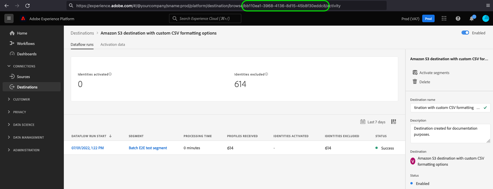

# View detailed activation results {#view-test-results}

## Overview {#overview}

This page explains how to use the `/testing/destinationInstance` API endpoint to view the complete details of your file-based destination testing results.

If you have already [tested your destination](file-based-destination-testing-api.md) and received a valid API response, your destination is working correctly.

If you want to see more detailed information about your activation flow, you can use the `results` property from the [destination testing](file-based-destination-testing-api.md) endpoint response, as described further below. 

>[!NOTE]
>
>This API endpoint returns the same result as you would obtain when using the [Flow Service API](../api/update-destination-dataflows.md) to monitor dataflows.

## Getting started {#getting-started}

Before continuing, please review the [getting started guide](../../getting-started.md) for important information that you need to know in order to successfully make calls to the API, including how to obtain the required destination authoring permission and required headers.

## Prerequisites {#prerequisites}

Before you can use the `/testing/destinationInstance` endpoint, make sure you meet the following conditions:

* You have an existing file-based destination created through the Destination SDK and you can see it in your [destinations catalog](../../../ui/destinations-workspace.md).
* You have created at least one activation flow for your destination in the Experience Platform UI.
* To successfully make the API request, you need the destination instance ID corresponding to the destination instance that you will be testing. Get the destination instance ID that you should use in the API call, from the URL, when browsing a connection with your destination in the Platform UI.

   
* You have previously [tested your destination configuration](file-based-destination-testing-api.md), and received a valid API response, which includes a `results` property. You will use this `results` value to further test your destination.

## View detailed destination testing results {#test-activation-results}

Once you have [validated your destination configuration](file-based-destination-testing-api.md), you can view detailed activation results by making a GET request to the `authoring/testing/destinationInstance/` endpoint and providing the destination instance ID of the destination that you are testing, and the flow run IDs of the activated segments.

You can find the complete API URL that you need to use in the `results` property returned in the [response of the destination testing call](file-based-destination-testing-api.md).

**API format**

```http
GET /authoring/testing/destinationInstance/{DESTINATION_INSTANCE_ID}/results?flowRunIds=id1,id2
```

| Path parameters | Description |
| -------- | ----------- |
| `{DESTINATION_INSTANCE_ID}` | The ID of the destination instance for which you are generating sample profiles. See the [prerequisites](#prerequisites) section for details on how to obtain this ID. |

| Query string parameters | Description |
| -------- | ----------- |
| `flowRunIds` | The flow run IDs corresponding to the activated segments. You can find the flow run IDs in the `results` property returned in the [response of the destination testing call](file-based-destination-testing-api.md).|

**Request**

```shell
curl -X GET 'https://platform.adobe.io/data/core/activation/authoring/testing/destinationInstance/fd3449fb-b929-45c8-9f3d-06b9d6aac328/results?flowRunIds=30d34875-e7ba-4520-ab6e-5705e01dfb16,86c00ad7-443c-459a-855d-0e8cbee43c4f,12305c58-42a9-4230-8fad-1661ee49cb70' \
 -H 'Authorization: Bearer {ACCESS_TOKEN}' \
 -H 'Content-Type: application/json' \
 -H 'x-gw-ims-org-id: {IMS_ORG}' \
 -H 'x-api-key: {API_KEY}' \
 -H 'x-sandbox-name: {SANDBOX_NAME}' \
```

**Response**

The response contains the complete details of the activation flow. You can obtain the same response by calling the [Flow Service API](../../../api/update-destination-dataflows.md) to monitor dataflows.

```json
{
   "items":[
      {
         "id":"18efd5d2-40ae-4f5c-afd1-37a39a45183a",
         "flowId":"a02071ad-f3a4-496c-a2b1-468812301d5d",
         "flowSpec":{
            "id":"25473b67-0801-418a-ab49-ed74ebf88137",
            "version":"1.0"
         },
         "metrics":{
            "durationSummary":{
               "startedAtUTC":1646652235124,
               "completedAtUTC":1646652270439
            },
            "latencySummary":null,
            "sizeSummary":{
               "inputBytes":122,
               "outputBytes":122
            },
            "recordSummary":{
               "inputRecordCount":1,
               "outputRecordCount":1,
               "createdRecordCount":1,
               "skippedRecordCount":0,
               "sourceSummaries":[
                  {
                     "id":"76e4b969-9700-4557-8330-0a8390afbdde",
                     "entitySummaries":[
                        {
                           "inputRecordCount":1,
                           "skippedRecordCount":0,
                           "id":"segment:4326c566-f81c-4ab0-8a80-9e741a5d0b1f"
                        }
                     ]
                  }
               ],
               "targetSummaries":[
                  {
                     "id":"b43607b6-0dca-43b3-a0bc-ecdea4fa6aa9",
                     "entitySummaries":[
                        {
                           "outputRecordCount":1,
                           "createdRecordCount":1,
                           "id":"segment:4326c566-f81c-4ab0-8a80-9e741a5d0b1f"
                        }
                     ]
                  }
               ]
            },
            "fileSummary":{
               "inputFileCount":1,
               "outputFileCount":1
            },
            "statusSummary":{
               "status":"success"
            }
         },
         "activities":[
            {
               "id":"c4f238e3-7334-4933-8b56-64d7ea43ea54",
               "name":"Activation Batch XdmProcessor Activity",
               "updatedAtUTC":0,
               "durationSummary":{
                  "startedAtUTC":1646652235124,
                  "completedAtUTC":1646652255157
               },
               "latencySummary":{
                  
               },
               "sizeSummary":{
                  "inputBytes":122,
                  "outputBytes":122
               },
               "recordSummary":{
                  "inputRecordCount":1,
                  "outputRecordCount":1,
                  "createdRecordCount":1,
                  "skippedRecordCount":0
               },
               "fileSummary":{
                  "inputFileCount":1,
                  "outputFileCount":1
               },
               "statusSummary":{
                  "status":"success",
                  "extensions":{
                     "incremental.batchId":"",
                     "snapshot.batchId":"",
                     "snapshot.datasetId":"",
                     "incremental.datasetId":""
                  }
               },
               "sourceInfo":null,
               "targetInfo":null
            },
            {
               "id":"51d82b36-6b8f-11eb-9439-0242ac130002",
               "name":"Activation Batch Publisher Activity",
               "updatedAtUTC":0,
               "durationSummary":{
                  "startedAtUTC":1646652270326,
                  "completedAtUTC":1646652270439
               },
               "latencySummary":{
                  
               },
               "sizeSummary":{
                  "outputBytes":122
               },
               "recordSummary":{
                  "inputRecordCount":1,
                  "outputRecordCount":1,
                  "createdRecordCount":1,
                  "skippedRecordCount":0
               },
               "fileSummary":{
                  "outputFileCount":1
               },
               "statusSummary":{
                  "status":"success",
                  "extensions":{
                     
                  }
               },
               "sourceInfo":null,
               "targetInfo":null
            }
         ],
         "predecessors":null
      }
   ],
   "_links":{
      
   }
}
```

## API error handling {#api-error-handling}

Destination SDK API endpoints follow the general Experience Platform API error message principles. Refer to [API status codes](../../../../landing/troubleshooting.md#api-status-codes) and [request header errors](../../../../landing/troubleshooting.md#request-header-errors) in the Platform troubleshooting guide.

## Next steps

After reading this document, you now know how to test your file-based destination configuration and see the full details of your activation results.

If you are building a public destination, you can now [submit your destination configuration](../../guides/submit-destination.md) to Adobe for review.
