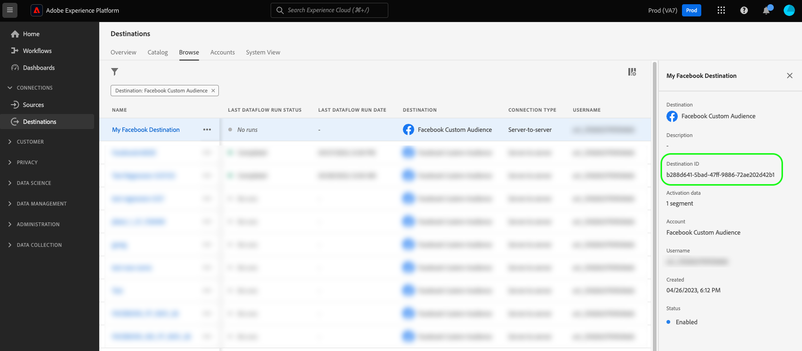
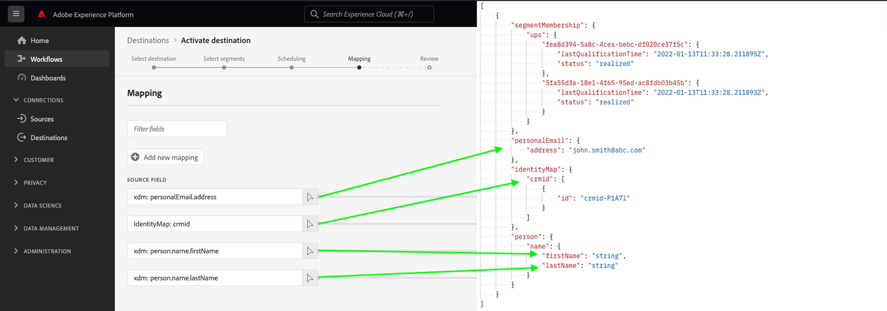

# Generate sample profiles based on a source schema

## Overview {#overview}

The first step in testing your file-based destination is to use the `/sample-profiles` endpoint to generate a sample profile based on your existing source schema.

Sample profiles can help you understand the JSON structure of a profile. Additionally, they give you a default that you can customize with your own profile data, for further destination testing.

## Getting started {#getting-started}

Before continuing, please review the [getting started guide](../../getting-started.md) for important information that you need to know in order to successfully make calls to the API, including how to obtain the required destination authoring permission and required headers.

## Prerequisites {#prerequisites}

Before you can use the `/sample-profiles` endpoint, make sure you meet the following conditions:

* You have an existing file-based destination created through the Destination SDK and you can see it in your [destinations catalog](../../../ui/destinations-workspace.md).
* You have created at least one activation flow for your destination in the Experience Platform UI. The `/sample-profiles` endpoint creates the profiles based on the source schema that you defined in your activation flow. See the [activation tutorial](../../../ui/activate-batch-profile-destinations.md) to learn how to create an activation flow.
* To successfully make the API request, you need the destination instance ID corresponding to the destination instance that you will be testing. Get the destination instance ID that you should use in the API call, from the URL, when browsing a connection with your destination in the Platform UI.

   

## Generate sample profiles for destination testing {#generate-sample-profiles}

You can generate sample profiles based on your source schema by making a GET request to the `/sample-profiles` endpoint with the destination instance ID of the destination that you want to test.

**API format**

```http
GET /authoring/sample-profiles?destinationInstanceId={DESTINATION_INSTANCE_ID}&count={NUMBER_OF_GENERATED_PROFILES}
```

| Query parameters | Description |
| -------- | ----------- |
| `destinationInstanceId` | The ID of the destination instance for which you are generating sample profiles. See the [prerequisites](#prerequisites) section for details on how to obtain this ID. |
| `count` | *Optional*. The number of sample profiles that you want to generate. The parameter can take values between `1 - 1000`. If this property is not defined, then the API generates a single sample profile. |

**Request**

The following request generates a sample profile based on the source schema defined in the destination instance with the corresponding `destinationInstanceId`.

```shell
curl -X GET 'https://platform.adobe.io/data/core/activation/authoring/sample-profiles?destinationInstanceId={DESTINATION_INSTANCE_ID}' \
 -H 'Authorization: Bearer {ACCESS_TOKEN}' \
 -H 'Content-Type: application/json' \
 -H 'x-gw-ims-org-id: {IMS_ORG}' \
 -H 'x-api-key: {API_KEY}' \
 -H 'x-sandbox-name: {SANDBOX_NAME}' \
```

**Response**

A successful response returns HTTP status 200 with the specified number of sample profiles, with segment membership, identities, and profile attributes that correspond to the source XDM schema.

>[!NOTE]
>
> The response returns only segment membership, identities, and profile attributes that are used in the destination instance. Even if your source schema has other fields, these are ignored.

```json
[
   {
      "segmentMembership":{
         "ups":{
            "fea8d394-5a8c-4cea-bebc-df020ce37f5c":{
               "lastQualificationTime":"2022-01-13T11:33:28.211895Z",
               "status":"realized"
            },
            "5fa55d3a-18e1-4f65-95ed-ac8fdb03b45b":{
               "lastQualificationTime":"2022-01-13T11:33:28.211893Z",
               "status":"realized"
            }
         }
      },
      "personalEmail":{
         "address":"john.smith@abc.com"
      },
      "identityMap":{
         "crmid":[
            {
               "id":"crmid-P1A7l"
            }
         ]
      },
      "person":{
         "name":{
            "firstName":"string",
            "lastName":"string"
         }
      }
   }
]
```



| Property | Description |
| -------- | ----------- |
| `segmentMembership` | A map object which describes the individual's segment memberships. For more information on `segmentMembership`, read [Segment Membership Details](../../../../xdm/field-groups/profile/segmentation.md). |
| `lastQualificationTime` | A timestamp of the last time this profile qualified for the segment. |
| `status` | A string field that indicates whether the segment membership has been realized as part of the current request. The following values are accepted: <ul><li>`existing`: The profile was already part of the segment prior to the request, and continues to maintain its membership.</li><li>`realized`: The profile is entering the segment as part of the current request.</li><li>`exited`: The profile is exiting the segment as part of the current request.</li></ul> |
| `identityMap` | A map-type field that describes the various identity values for an individual, along with their associated namespaces. For more information on `identityMap`, see [basis of schema composition](../../../../xdm/schema/composition.md#identityMap). |

{style="table-layout:auto"}

## API error handling {#api-error-handling}

Destination SDK API endpoints follow the general Experience Platform API error message principles. Refer to [API status codes](../../../../landing/troubleshooting.md#api-status-codes) and [request header errors](../../../../landing/troubleshooting.md#request-header-errors) in the Platform troubleshooting guide.

## Next steps

After reading this document, you now know how to generate sample profiles based on the source schema that you configured in your destination [activation flow](../../../ui/activate-batch-profile-destinations.md).

You can now customize these profiles or use them as they are returned by the API, to [test your file-based destination configuration](file-based-destination-testing-api.md).
