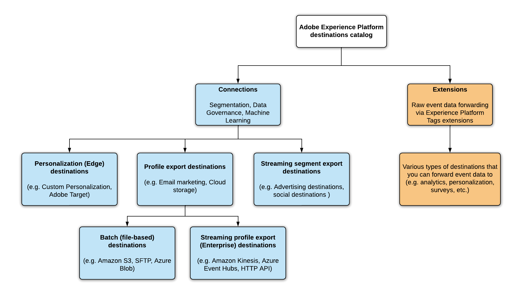
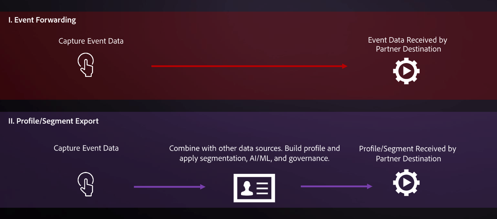

# Destination types and categories

Read this page to understand the different types and categories of Adobe Experience Platform destinations.

## Destination types {#destination-types}

In Adobe Experience Platform, we distinguish between two destination types - connections and extensions. There are two types of connection destinations, Profile Export destinations and Segment Export destinations.

## Connections {#connections}

**[!UICONTROL Profile Export]**, **[!UICONTROL Streaming Segment Export]**, and **[!DNL Edge Personalization]** destinations in Adobe Experience Platform capture event data, combine it with other data sources to form the [Real-time Customer Profile](../profile/home.md), apply segmentation, and export segments and qualified profiles to destinations. 

## Profile export destinations {#profile-export}

Profile export destinations receive raw data, often with email address as the primary key. Experience Platform currently supports two types of profile export destinations:

* [Streaming profile export destinations (enterprise destinations)](#streaming-profile-export)
* [Batch (file-based) destinations](#file-based)

### Streaming profile export destinations (enterprise destinations) {#streaming-profile-export}

>[!IMPORTANT]
>
>Enterprise destinations, or streaming profile export destinations, are available to [Real-Time Customer Data Platform Ultimate](https://helpx.adobe.com/legal/product-descriptions/real-time-customer-data-platform.html) customers only.

Use enterprise destination data connectors to deliver Real-time Customer Data Platform profiles in near real-time to internal systems or to other third-party systems for data synchronization, analysis, and further profile enrichment use cases.

These destinations receive segment and profile data as Experience Platform data streams.

Enterprise destinations include:

* [HTTP API destination](catalog/streaming/http-destination.md)
* [Amazon Kinesis](catalog/cloud-storage/amazon-kinesis.md)
* [Azure Event Hubs](catalog/cloud-storage/azure-event-hubs.md)

### Batch (file-based) destinations {#file-based}

File-based destinations receive `.csv` files containing profiles and/or attributes. [Amazon S3](catalog/cloud-storage/amazon-s3.md) is an example of a destination where you can export files containing profile exports.

## Streaming segment export destinations {#streaming-destinations}

Segment export destinations receive Experience Platform segment data. These destinations use segment IDs or user IDs. Advertising and social destinations like [[!DNL Google Display & Video 360]](catalog/advertising/google-dv360.md), [[!DNL Google Ads]](catalog/advertising/google-ads-destination.md), or [Facebook](catalog/social/facebook.md) are examples of such destinations.

## Edge personalization destinations {#edge-personalization-destinations}

Edge personalization destinations in Experience Platform include [Adobe Target](/help/destinations/catalog/personalization/adobe-target-connection.md) and the [Custom personalization destination](/help/destinations/catalog/personalization/custom-personalization.md). By using these destinations, you can enable same-page and next-page personalization use cases for your customers.

Read more about how to [configure personalization destinations for same-page and next-page personalization](/help/destinations/ui/configure-personalization-destinations.md).

## Profile export and segment export destinations - video overview {#video}

The video below runs you through the particularities of the two types of destinations:

>[!VIDEO](https://video.tv.adobe.com/v/29707?quality=12)

## (Beta) Dataset export destinations {#dataset-export-destinations}

Some cloud storage destinations in the destinations catalog support dataset exports. Use these destinations to export raw datasets to cloud storage locations. 

Read more about how to [export datasets](/help/destinations/ui/export-datasets.md).

## Extensions {#extensions}

Platform leverages the power and flexibility of tag management, allowing you to configure tag extensions in the UI. 

>[!TIP]
>
>For detailed information about tag extensions, including use cases and how to find them in the interface, see the [tag extensions overview](./catalog/launch-extensions/overview.md).

Tag extensions forward raw event data to several types of destinations. Think of extensions as an **Event Forwarding** type of destination. This is a simpler type of integration with destination platforms, which only forwards raw event data. Examples of those are the [Gainsight personalization extension](./catalog/personalization/gainsight.md) or the [Confirmit Voice of the Customer extension](./catalog/voice/confirmit-digital-feedback.md).

## When to use connections and extensions {#when-to-use}

As a marketer, you could use a combination of connections and extensions to address your use cases.

Connections are useful when it's necessary to leverage a complete centralized customer profile or a customer segment for activation. For example, use connections if you are joining behavioral data from an analytics system with uploaded CRM data to qualify a user for a given segment before delivering a personalized message to that user.

Extensions are helpful when event data is used to trigger an action, or to conduct segmentation in an external environment. For example, if behavioral data needs to be forwarded to an external system without being joined to other data sources on file for a given user.

## Destination categories {#categories}

The connections and extensions in the [destinations catalog](https://platform.adobe.com/destination/catalog) are grouped by destination category (**Advertising**, **Cloud storage**, **Survey platforms**, **Email marketing**, etc.), depending on the marketing action that they help you achieve. For more information on each of the categories, as well as the destinations included in each category, see the [Destinations catalog documentation](./catalog/overview.md).

