# Activate audience data to batch profile export destinations

>[!IMPORTANT]
> 
> * To activate data and enable the [mapping step](#mapping) of the workflow, you need the **[!UICONTROL Manage Destinations]**, **[!UICONTROL Activate Destinations]**, **[!UICONTROL View Profiles]**, and **[!UICONTROL View Segments]** [access control permissions](/help/access-control/home.md#permissions).
> * To activate data without going through the [mapping step](#mapping) of the workflow, you need the **[!UICONTROL Manage Destinations]**, **[!UICONTROL Activate Segment without Mapping]**, **[!UICONTROL View Profiles]**, and **[!UICONTROL View Segments]** [access control permissions](/help/access-control/home.md#permissions).
> 
> Read the [access control overview](/help/access-control/ui/overview.md) or contact your product administrator to obtain the required permissions.
>
> Some customers participating in the improved file export functionality beta program are seeing the new **[!UICONTROL Mapping]** step as part of their activation workflow to the [new beta cloud storage destinations](/help/release-notes/2022/october-2022.md#destinations). Please also note the [known limitations](#known-limitations) as part of the release.

## Overview {#overview}

This article explains the workflow required to activate audience data in Adobe Experience Platform batch profile-based destinations, such as cloud storage and email marketing destinations.

## Prerequisites {#prerequisites}

To activate data to destinations, you must have successfully [connected to a destination](./connect-destination.md). If you haven't done so already, go to the [destinations catalog](../catalog/overview.md), browse the supported destinations, and configure the destination that you want to use.

## Select your destination {#select-destination}

1. Go to **[!UICONTROL Connections > Destinations]**, and select the **[!UICONTROL Catalog]** tab.
    
    

1. Select **[!UICONTROL Activate segments]** on the card corresponding to the destination where you want to activate your segments, as shown in the image below.

    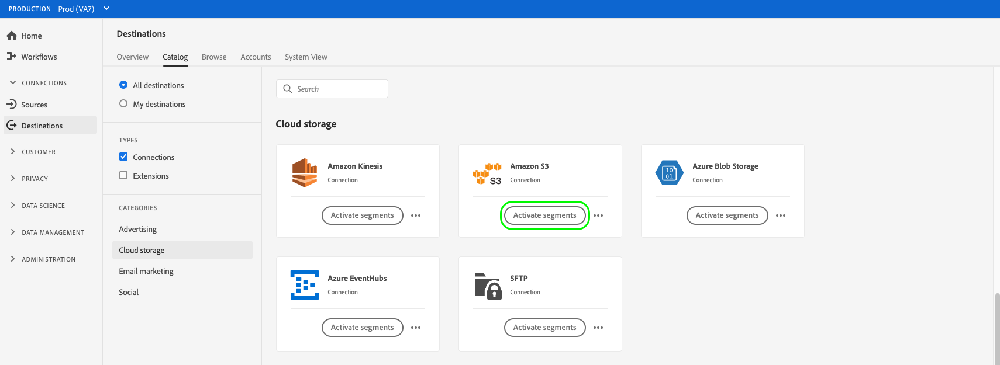

1. Select the destination connection that you want to use to activate your segments, then select **[!UICONTROL Next]**.

    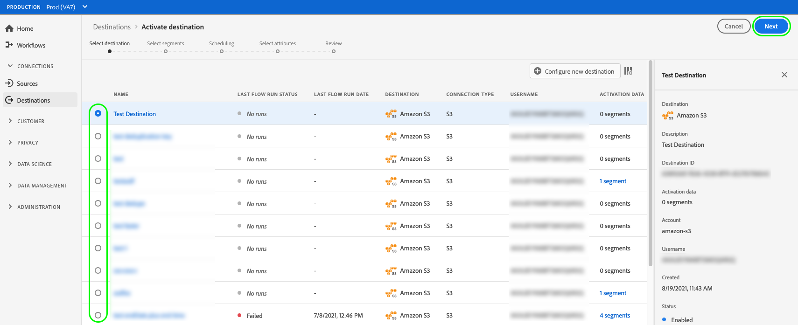

1. Move to the next section to [select your segments](#select-segments).

## Select your segments {#select-segments}

Use the check boxes to the left of the segment names to select the segments that you want to activate to the destination, then select **[!UICONTROL Next]**.

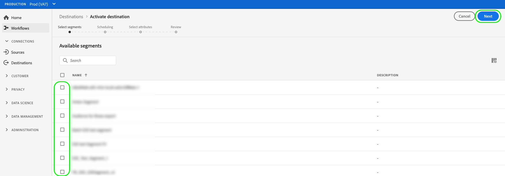


## Schedule segment export {#scheduling}

>[!CONTEXTUALHELP]
>id="platform_destinations_activate_schedule"
>title="Schedule"
>abstract="Use the pencil icon to set the file export type (full files or incremental files) and the export frequency."

[!DNL Adobe Experience Platform] exports data for email marketing and cloud storage destinations in the form of [!DNL CSV] files. In the **[!UICONTROL Scheduling]** page, you can configure the schedule and the file names for each segment you are exporting. Configuring the schedule is mandatory, but configuring the file name is optional.

>[!IMPORTANT]
> 
>[!DNL Adobe Experience Platform] automatically splits the export files at 5 million records (rows) per file. Each row represents one profile.
>
>Split file names are appended with a number that indicates the file is part of a larger export, as such: `filename.csv`, `filename_2.csv`, `filename_3.csv`.

Select the **[!UICONTROL Create schedule]** button corresponding to the segment that you want to send to your destination.

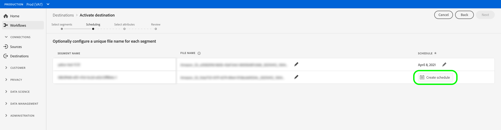

### Export full files {#export-full-files}

>[!CONTEXTUALHELP]
>id="platform_destinations_activate_exportoptions"
>title="File export options"
>abstract="Select **Export full files** to export a complete snapshot of all the profiles that qualify for the segment. Select **Export incremental files** to export only the profiles which qualified for the segment since the last export. <br> The first incremental file export includes all profiles that qualify for the segment, acting as a backfill. Future incremental files include only the profiles which qualified for the segment since the first incremental file export."
>additional-url="https://experienceleague.adobe.com/docs/experience-platform/destinations/ui/activate/activate-batch-profile-destinations.html#export-incremental-files" text="Export incremental files"

>[!CONTEXTUALHELP]
>id="platform_destinations_activationchaining_aftersegmentevaluation"
>title="Activate after segment evaluation"
>abstract="Activation runs immediately after the daily segmentation job completes. This ensures that the most up-to-date profiles are exported."

>[!CONTEXTUALHELP]
>id="platform_destinations_activationchaining_scheduled"
>title="Scheduled activation"
>abstract="Activation runs at a fixed time of the day."

Select **[!UICONTROL Export full files]** to trigger the export of a file containing a full snapshot of all profile qualifications for the selected segment.

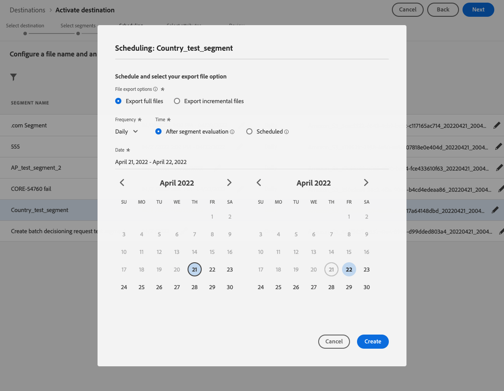

1. Use the **[!UICONTROL Frequency]** selector to select the export frequency:
    
    * **[!UICONTROL Once]**: schedule a one time on-demand full file export.
    * **[!UICONTROL Daily]**: schedule full file exports once a day, every day, at the time you specify.

1. Use the **[!UICONTROL Time]** toggle to select whether the export should happen immediately after segment evaluation or on a scheduled basis, at a specified time. When selecting the **[!UICONTROL Scheduled]** option, you can use the selector to choose the time of day, in [!DNL UTC] format, when the export should take place.

      >[!NOTE]
      >
      >The **[!UICONTROL After segment evaluation]** option described below is currently available only to select Beta customers.

    Use the **[!UICONTROL After segment evaluation]** option to have the activation job run immediately after the daily Platform batch segmentation job completes. This ensures that when the activation job runs, the most up-to-date profiles are exported to your destination.
    
    <!-- Batch segmentation currently runs at {{insert time of day}} and lasts for an average {{x hours}}. Adobe reserves the right to modify this schedule. -->

    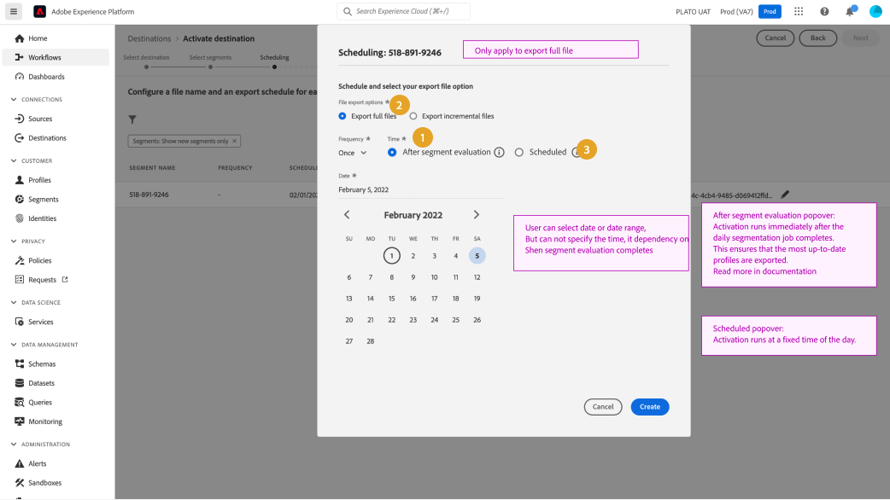
    Use the **[!UICONTROL Scheduled]** option to have the activation job run at a fixed time. This ensures that Experience Platform profile data is exported at the same time each day, but the profiles you export may not be the most up-to-date, depending on whether the batch segmentation job has completed before the activation job kicks off.

    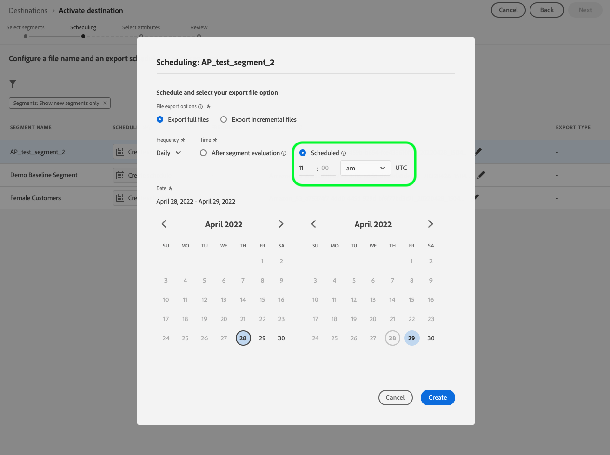

      >[!IMPORTANT]
      >
      >Because of the way internal Experience Platform processes are configured, the first incremental or full file export may not contain all the backfill data. <br> <br> To ensure a complete and most up-to-date backfill data export for both full and incremental files, Adobe recommends setting the first file export time after 12 PM GMT of the following day. This limitation will be addressed in future releases.

1. Use the **[!UICONTROL Date]** selector to choose the day or interval when the export should take place. For daily exports, best practice is to set your start and end date to line up with the duration of your campaigns in your downstream platforms.

      >[!IMPORTANT]
      >
      > When selecting an export interval, the last day of the interval is not included in the exports. For example, if you select an interval of January 4 - 11, the last file export will take place on January 10th.

1. Select **[!UICONTROL Create]** to save the schedule.

### Export incremental files {#export-incremental-files}

Select **[!UICONTROL Export incremental files]** to trigger an export where the first file is a full snapshot of all profile qualifications for the selected segment, and subsequent files are incremental profile qualifications since the previous export.

>[!IMPORTANT]
>
>The first exported incremental file includes all profiles that qualify for a segment, functioning as a backfill.

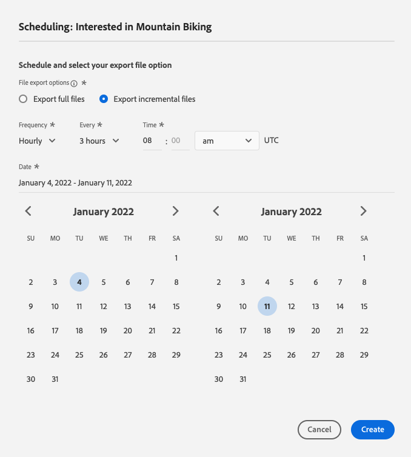

1. Use the **[!UICONTROL Frequency]** selector to select the export frequency:
    
    * **[!UICONTROL Daily]**: schedule incremental file exports once a day, every day, at the time you specify.
    * **[!UICONTROL Hourly]**: schedule incremental file exports every 3, 6, 8, or 12 hours.

1. Use the **[!UICONTROL Time]** selector to choose the time of day, in [!DNL UTC] format, when the export should take place.
   
     >[!IMPORTANT]
     >
     >Because of the way internal Experience Platform processes are configured, the first incremental or full file export may not contain all the backfill data. <br> <br> To ensure a complete and most up-to-date backfill data export for both full and incremental files, Adobe recommends setting the first file export time after 12 PM GMT of the following day. This limitation will be addressed in future releases.

1. Use the **[!UICONTROL Date]** selector to choose the interval when the export should take place. Best practice is to set your start and end date to line up with the duration of your campaigns in your downstream platforms.

      >[!IMPORTANT]
      >
      >The last day of the interval is not included in the exports. For example, if you select an interval of January 4 - 11, the last file export will take place on January 10th.

1. Select **[!UICONTROL Create]** to save the schedule.

### Configure file names {#file-names}

>[!CONTEXTUALHELP]
>id="platform_destinations_activate_filename"
>title="Configure file name"
>abstract="For file-based destinations, a unique file name is generated per segment. Use the file name editor to create and edit a unique file name or keep the default name."

For most destinations, the default file names consist of destination name, segment ID, and a date and time indicator. For example, you can edit your exported file names to distinguish between different campaigns or to have the data export time appended to the files. Note that some destination developers might select to have different default file name append options shown for their destinations.

Select the pencil icon to open a modal window and edit the file names. File names are limited to 255 characters.

>[!NOTE]
>
>The image below shows how file names can be edited for [!DNL Amazon S3] destinations but the process is identical for all batch destinations (for example SFTP, [!DNL Azure Blob Storage], or [!DNL Google Cloud Storage]).

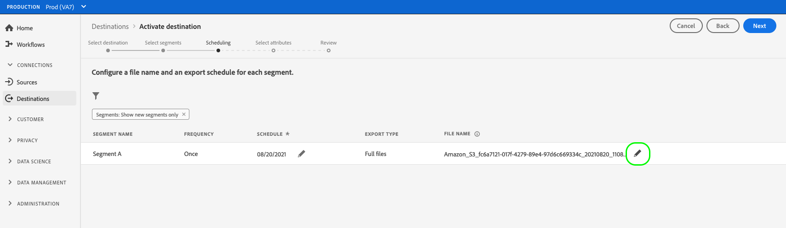

In the file name editor, you can select different components to add to the file name. 

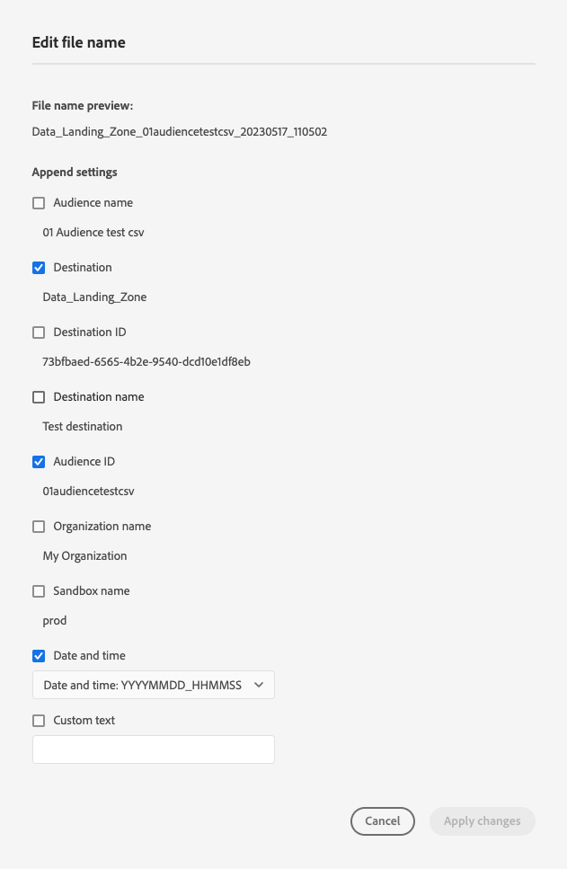

The destination name and segment ID cannot be removed from file names. In addition to these, you can add the following:

|File name option | Description |
|---------|----------|
| **[!UICONTROL Segment name]** | The name of the exported segment. |
| **[!UICONTROL Date and time]** | Select between adding a `MMDDYYYY_HHMMSS` format or a Unix 10-digit timestamp of the time when the files are generated. Choose one of these options if you would like your files to have a dynamic file name generated with each incremental export. |
| **[!UICONTROL Custom text]** | Any custom text that you want to add to the file names. |
| **[!UICONTROL Destination ID]** | The ID of the destination dataflow you use to export the segment. <br> **Note**: This file name append option is available only to beta customers participating in the improved file export functionality beta program. Contact your Adobe representative or Customer Care if you'd like access to the beta program. |
| **[!UICONTROL Destination name]** | The name of the destination dataflow you use to export the segment. <br> **Note**: This file name append option is available only to beta customers participating in the improved file export functionality beta program. Contact your Adobe representative or Customer Care if you'd like access to the beta program. |
| **[!UICONTROL Organization name]** | Your organization name within Experience Platform. <br> **Note**: This file name append option is available only to beta customers participating in the improved file export functionality beta program. Contact your Adobe representative or Customer Care if you'd like access to the beta program. |
| **[!UICONTROL Sandbox name]** | The ID of the sandbox you use to export the segment. <br> **Note**: This file name append option is available only to beta customers participating in the improved file export functionality beta program. Contact your Adobe representative or Customer Care if you'd like access to the beta program. |

{style="table-layout:auto"}

Select **[!UICONTROL Apply changes]** to confirm your selection.

>[!IMPORTANT] 
> 
>If you don't select the **[!UICONTROL Date and Time]** component, the file names will be static and the new exported file will overwrite the previous file in your storage location with each export. When running a recurring import job from a storage location into an email marketing platform, this is the recommended option.

Once you have finished configuring all your segments, select **[!UICONTROL Next]** to continue.

## Select profile attributes {#select-attributes}

For profile-based destinations, you must select the profile attributes that you want to send to the target destination.

1. In the **[!UICONTROL Select attributes]** page, select **[!UICONTROL Add new field]**.
    
    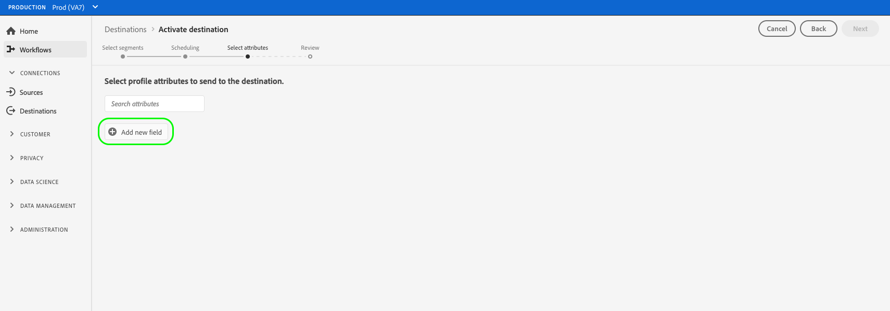

1. Select the arrow to the right of the **[!UICONTROL Schema field]** entry.

    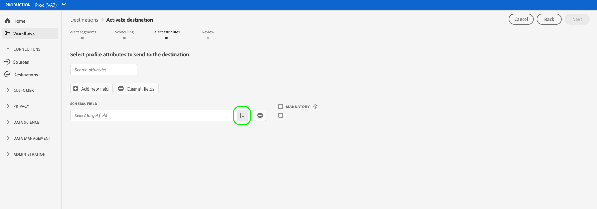

1. In the **[!UICONTROL Select field]** page, select the XDM attributes or identity namespaces that you want to send to the destination, then choose **[!UICONTROL Select]**.

    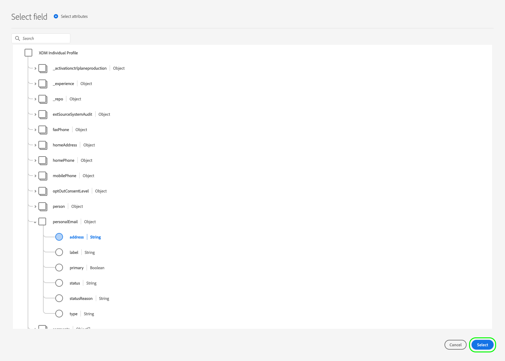

1. To add more mappings, repeat steps one to three.

>[!NOTE] 
>
> Adobe Experience Platform prefills your selection with four recommended, commonly used attributes from your schema: `person.name.firstName`, `person.name.lastName`, `personalEmail.address`, `segmentMembership.status`.

>[!IMPORTANT] 
>
>Due to a known limitation, you cannot currently use the **[!UICONTROL Select field]** window to add `segmentMembership.status` to your file exports. Instead, you need to manually paste the value `xdm: segmentMembership.status` into the schema field, as shown below.
>
>

File exports will vary in the following ways, depending on whether `segmentMembership.status` is selected:
* If the `segmentMembership.status` field is selected, exported files include **[!UICONTROL Active]** members in the initial full snapshot and **[!UICONTROL Active]** and **[!UICONTROL Expired]** members in subsequent incremental exports.
* If the `segmentMembership.status` field is not selected, exported files include only **[!UICONTROL Active]** members in the initial full snapshot and in subsequent incremental exports.

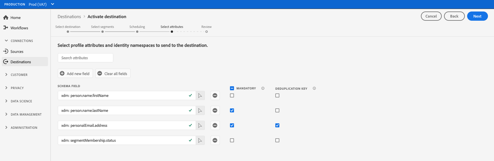 

### Mandatory attributes {#mandatory-attributes}

>[!CONTEXTUALHELP]
>id="platform_destinations_activate_mandatorykey"
>title="About mandatory attributes"
>abstract="Select the XDM schema attributes that all exported profiles should include. Profiles without the mandatory key are not exported to the destination. Not selecting a mandatory key exports all qualified profiles regardless of their attributes."

A mandatory attribute is a user-enabled checkbox which ensures all profile records contain the selected attribute. For example: all exported profiles contain an email address.​

You can mark attributes as mandatory to ensure that [!DNL Platform] exports only the profiles that include the specific attribute. As a result, it can be used as an additional form of filtering. Marking an attribute as mandatory is **not** required.

Not selecting a mandatory attribute exports all qualified profiles regardless of their attributes.

It is recommended that one of the attributes is a [unique identifier](../../destinations/catalog/email-marketing/overview.md#identity) from your schema. For more information about mandatory attributes, see the identity section in the [Email marketing destinations](../../destinations/catalog/email-marketing/overview.md#identity) documentation. 

### Deduplication keys {#deduplication-keys}

>[!CONTEXTUALHELP]
>id="platform_destinations_activate_deduplicationkey"
>title="About deduplication keys"
>abstract="Eliminate multiple records of the same profile in the export files by selecting a deduplication key. Select a single namespace or up to two XDM schema attributes as a deduplication key. Not selecting a deduplication key may lead to duplicate profile entries in the export files."

A deduplication key is a user-defined primary key which determines the identity by which users want their profiles to be deduplicated.​

Deduplication keys eliminate the possibility of having multiple records of the same profile in one export file.

There are three ways you can use deduplication keys in [!DNL Platform]:

* Using a single identity namespace as a [!UICONTROL deduplication key]
* Using a single profile attribute from an [!DNL XDM] profile as a [!UICONTROL deduplication key]
* Using a combination of two profile attributes from an [!DNL XDM] profile as a composite key

>[!IMPORTANT]
>
> You can export a single identity namespace to a destination, and the namespace is automatically set as deduplication key. Sending multiple namespaces to a destination is not supported.
> 
> You cannot use a combination of identity namespaces and profile attributes as deduplication keys.

### Deduplication example {#deduplication-example}

This example illustrates how deduplication works, depending on the selected deduplication keys.

Let's consider the following two profiles.

**Profile A**

```json
{
  "identityMap": {
    "Email": [
      {
        "id": "johndoe_1@example.com"
      },
      {
        "id": "johndoe_2@example.com"
      }
    ]
  },
  "segmentMembership": {
    "ups": {
      "fa5c4622-6847-4199-8dd4-8b7c7c7ed1d6": {
        "status": "existing",
        "lastQualificationTime": "2021-03-10 10:03:08"
      }
    }
  },
  "person": {
    "name": {
      "lastName": "Doe",
      "firstName": "John"
    }
  },
  "personalEmail": {
    "address": "johndoe@example.com"
  }
}
```

**Profile B**

```json
{
  "identityMap": {
    "Email": [
      {
        "id": "johndoe_1@example.com"
      },
      {
        "id": "johndoe_2@example.com"
      }
    ]
  },
  "segmentMembership": {
    "ups": {
      "fa5c4622-6847-4199-8dd4-8b7c7c7ed1d6": {
        "status": "existing",
        "lastQualificationTime": "2021-04-10 11:33:28"
      }
    }
  },
  "person": {
    "name": {
      "lastName": "D",
      "firstName": "John"
    }
  },
  "personalEmail": {
    "address": "johndoe@example.com"
  }
}
```

### Deduplication use case 1: no deduplication {#deduplication-use-case-1}

Using no deduplication, the export file would contain the following entries.

|personalEmail|firstName|lastName|
|---|---|---|
|johndoe@example.com|John|Doe|
|johndoe@example.com|John|D|


### Deduplication use case 2: deduplication based on identity namespace {#deduplication-use-case-2}

Assuming deduplication by the [!DNL Email] namespace, the export file would contain the following entries. Profile B is the latest one that qualified for the segment, so it is the only one getting exported.

|Email*|personalEmail|firstName|lastName|
|---|---|---|---|
|johndoe_1@example.com|johndoe@example.com|John|D|
|johndoe_2@example.com|johndoe@example.com|John|D|

### Deduplication use case 3: deduplication based on a single profile attribute {#deduplication-use-case-3}

Assuming deduplication by the `personal Email` attribute, the export file would contain the following entry. Profile B is the latest one that qualified for the segment, so it is the only one getting exported.

|personalEmail*|firstName|lastName|
|---|---|---|
|johndoe@example.com|John|D|


### Deduplication use case 4: deduplication based on two profile attributes {#deduplication-use-case-4}

Assuming deduplication by the composite key `personalEmail + lastName`, the export file would contain the following entries.

|personalEmail*|lastName*|firstName|
|---|---|---|
|johndoe@example.com|D|John|
|johndoe@example.com|Doe|John|


Adobe recommends selecting an identity namespace such as a [!DNL CRM ID] or email address as a deduplication key, to ensure all profile records are uniquely identified.
   
>[!NOTE] 
> 
>If any data usage labels have been applied to certain fields within a dataset (rather than the entire dataset), enforcement of those field-level labels on activation occurs under the following conditions:
>
>* The fields are used in the segment definition.
>* The fields are configured as projected attributes for the target destination.
>
> For example, if the field `person.name.firstName` has certain data usage labels that conflict with the destination's marketing action, you would be shown a data usage policy violation in the review step. For more information, see [Data Governance in Adobe Experience Platform](../../rtcdp/privacy/data-governance-overview.md#destinations).

## (Beta) Mapping {#mapping}

>[!IMPORTANT] 
> 
>Select beta customers can view an improved **[!UICONTROL Mapping]** step which replaces the [Select profile attributes](#select-attributes) step described further above. This new **[!UICONTROL Mapping]** step allows you to edit the headers of exported files to any custom names that you desire.
> 
> The functionality and documentation are subject to change. Contact your Adobe representative or Customer Care if you would like access to this beta program.

In this step, you must select the profile attributes that you want to add to the files exported to the target destination. To select profile attributes and identities for export: 

1. In the **[!UICONTROL Mapping]** page, select **[!UICONTROL Add new field]**.
    
    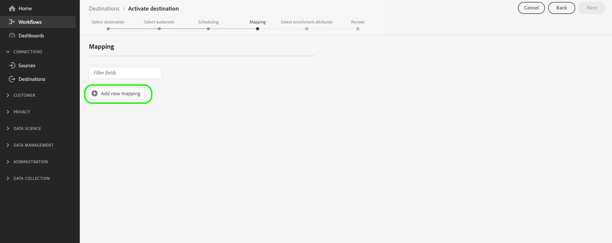

1. Select the arrow to the right of the **[!UICONTROL Source field]** entry.

    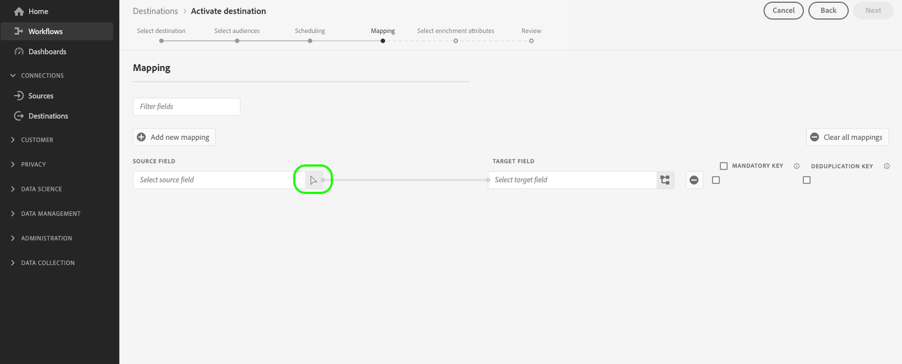

1. In the **[!UICONTROL Select source field]** page, select the profile attributes and identities that you want to include in the exported files to the destination, then choose **[!UICONTROL Select]**.

    >[!TIP] 
    > 
    >You can use the search field to narrow down your selection, as shown in the image below.

    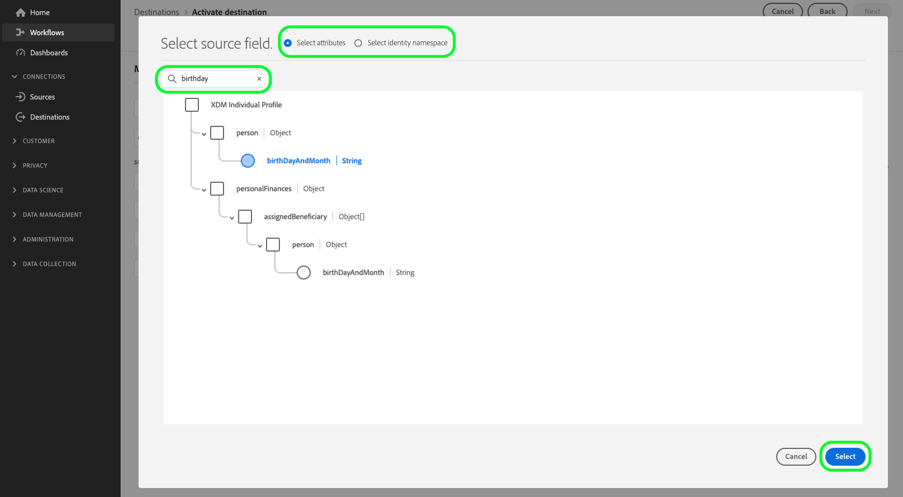


1. The field you selected for export now appears in the mapping view. If you wish, you can edit the name of the header in the exported file. To do this, select the icon on the target field.

    

1. In the **[!UICONTROL Select target field]** page, type in the desired name of the header in your exported file, then choose **[!UICONTROL Select]**.

    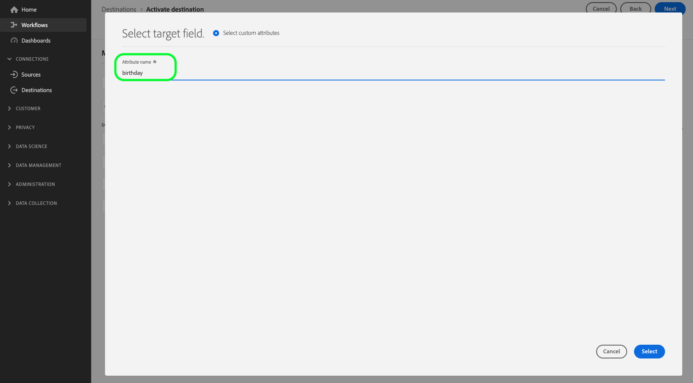

1. The field you selected for export now appears in the mapping view and shows the edited header in the exported file.

    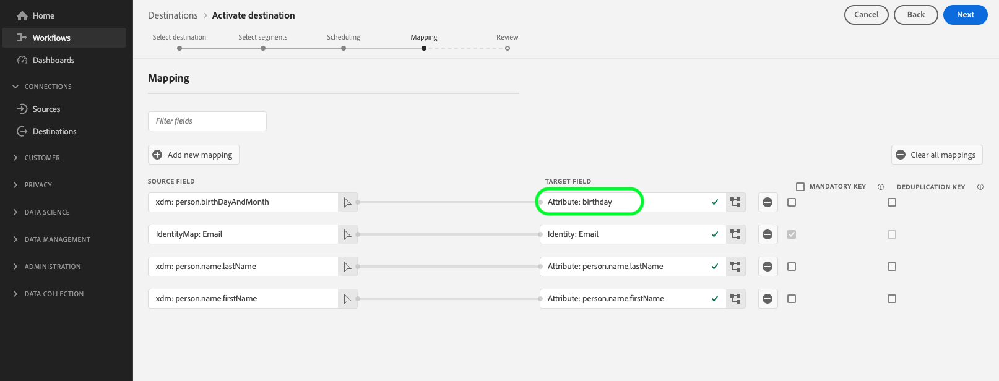

1. (Optional) You can select your exported field to be a [mandatory key](#mandatory-keys) or a [deduplication key](#deduplication-keys).

    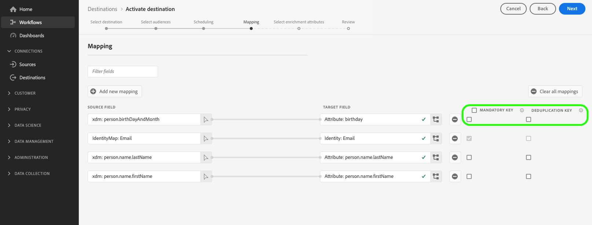

1. To add more fields for exporting, repeat the steps above.

### Known limitations {#known-limitations}

The new **[!UICONTROL Mapping]** page has the following known limitations:

#### Segment membership attribute cannot be selected through the mapping workflow

Due to a known limitation, you cannot currently use the **[!UICONTROL Select field]** window to add `segmentMembership.status` to your file exports. Instead, you need to manually paste the value `xdm: segmentMembership.status` into the schema field, as shown below.


File exports will vary in the following ways, depending on whether `segmentMembership.status` is selected:
* If the `segmentMembership.status` field is selected, exported files include **[!UICONTROL Active]** members in the initial full snapshot and **[!UICONTROL Active]** and **[!UICONTROL Expired]** members in subsequent incremental exports.
* If the `segmentMembership.status` field is not selected, exported files include only **[!UICONTROL Active]** members in the initial full snapshot and in subsequent incremental exports.

#### Identity namespaces cannot currently be selected for exports

Selecting identity namespaces for export, as shown in the image below, is currently not supported. Selecting any identity namespaces for export will result in an error in the **[!UICONTROL Review]** step.


As a temporary workaround if you need to add identity namespaces to your exported files during the beta, you can either:
* Use the legacy cloud storage destinations for the dataflows where you want to include identity namespaces in the exports
* Upload identities as attributes into Experience Platform, to then export them to your cloud storage destinations.

## Review {#review}

On the **[!UICONTROL Review]** page, you can see a summary of your selection. Select **[!UICONTROL Cancel]** to break up the flow, **[!UICONTROL Back]** to modify your settings, or **[!UICONTROL Finish]** to confirm your selection and start sending data to the destination.


### Consent policy evaluation {#consent-policy-evaluation}

>[!CONTEXTUALHELP]
>id="platform_governance_policies_viewApplicableConsentPolicies"
>title="View applicable consent policies"
>abstract="If your organization purchased **Adobe Healthcare Shield** or **Adobe Privacy & Security Shield**, select **[!UICONTROL View applicable consent policies]** to see which consent policies are applied and how many profiles are included in the activation as a result of them. This control is disabled if your company does not have access to the SKUs mentioned above."

If your organization purchased **Adobe Healthcare Shield** or **Adobe Privacy & Security Shield**, select **[!UICONTROL View applicable consent policies]** to see which consent policies are applied and how many profiles are included in the activation as a result of them. Read about [consent policy evaluation](/help/data-governance/enforcement/auto-enforcement.md#consent-policy-evaluation) for more information.

### Data usage policy checks {#data-usage-policy-checks}

In the **[!UICONTROL Review]** step, Experience Platform also checks for any data usage policy violations. Shown below is an example where a policy is violated. You cannot complete the segment activation workflow until you have resolved the violation. For information on how to resolve policy violations, read about [data usage policy violations](/help/data-governance/enforcement/auto-enforcement.md#data-usage-violation) in the data governance documentation section.
 


### Filter segments {#filter-segments}

Also in this step you can use the available filters on the page to display only the segments whose schedule or mapping has been updated as part of this workflow. You can also toggle which table columns you want to see. 


If you are satisfied with your selection and no policy violations have been detected, select **[!UICONTROL Finish]** to confirm your selection and start sending data to the destination. 

## Verify segment activation {#verify}

For email marketing destinations and cloud storage destinations, Adobe Experience Platform creates a `.csv` file in the storage location that you provided. Expect a new file to be created in your storage location according to the schedule you set in the workflow. The default file format is shown below, but you can [edit the components of the file name](#file-names):
`<destinationName>_segment<segmentID>_<timestamp-yyyymmddhhmmss>.csv`

For example, if you selected a daily export frequency, the files you would receive on three consecutive days could look like this:

```console
Salesforce_Marketing_Cloud_segment12341e18-abcd-49c2-836d-123c88e76c39_20200408061804.csv
Salesforce_Marketing_Cloud_segment12341e18-abcd-49c2-836d-123c88e76c39_20200409052200.csv
Salesforce_Marketing_Cloud_segment12341e18-abcd-49c2-836d-123c88e76c39_20200410061130.csv
```

The presence of these files in your storage location is confirmation of successful activation. To understand how the exported files are structured, you can [download a sample .csv file](../assets/common/sample_export_file_segment12341e18-abcd-49c2-836d-123c88e76c39_20200408061804.csv). This sample file includes the profile attributes `person.firstname`, `person.lastname`, `person.gender`, `person.birthyear`, and `personalEmail.address`.
