# Activate audiences to batch profile export destinations

>[!IMPORTANT]
>
>* To activate audiences and enable the [mapping step](#mapping) of the workflow, you need the **[!UICONTROL View Destinations]**, **[!UICONTROL Activate Destinations]**, **[!UICONTROL View Profiles]**, and **[!UICONTROL View Segments]** [access control permissions](/help/access-control/home.md#permissions).
>* To activate audiences without going through the [mapping step](#mapping) of the workflow, you need the **[!UICONTROL View Destinations]**, **[!UICONTROL Activate Segment without Mapping]**, **[!UICONTROL View Profiles]**, and **[!UICONTROL View Segments]** [access control permissions](/help/access-control/home.md#permissions).
>* To export *identities*, you need the **[!UICONTROL View Identity Graph]** [access control permission](/help/access-control/home.md#permissions). <br> {width="100" zoomable="yes"}
>
> Read the [access control overview](/help/access-control/ui/overview.md) or contact your product administrator to obtain the required permissions.

## Overview {#overview}

This article explains the workflow required to activate audiences in [!DNL Adobe Experience Platform] to batch profile file-based destinations, such as cloud storage and email marketing destinations.

## Prerequisites {#prerequisites}

To activate audiences to destinations, you must have successfully [connected to a destination](./connect-destination.md). If you haven't done so already, go to the [destinations catalog](../catalog/overview.md), browse the supported destinations, and configure the destination that you want to use.

## Supported file formats for export {#supported-file-formats-export}

The following file formats are supported when exporting audiences:

* CSV
* JSON
* Parquet

Note that exporting CSV files gives you greater flexibility in terms of how you want to structure your exported files. Read more about [file formatting configuration for CSV files](/help/destinations/ui/batch-destinations-file-formatting-options.md#file-configuration).

Select your desired file format for export when [creating a connection to the file-based destination](/help/destinations/ui/connect-destination.md).

## Select your destination {#select-destination}

1. Select **[!UICONTROL Destinations]** in the left navigation, select the **[!UICONTROL Catalog]** tab, then select **[!UICONTROL Activate audiences]** on the card corresponding to the destination where you want to activate your audiences.

    (Optional) Search for your destination by name instead of browsing the full catalog.

    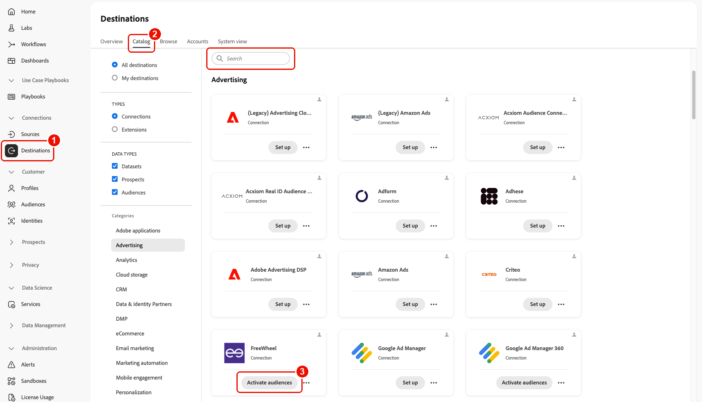{zoomable="yes"}

1. Select the checkbox next to the destination connection that you want to use to activate your audiences, then select **[!UICONTROL Next]**.

    (Optional) Use the search box to find a destination connection by name, or select the filter icon to show the filters panel and narrow down the results based on your preferred criteria.

    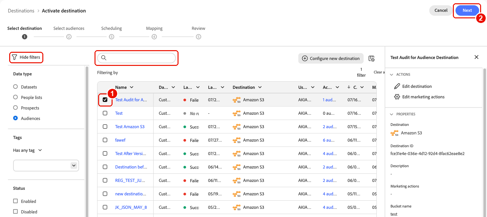{zoomable="yes"}

1. Move to the next section to [select your audiences](#select-audiences).

## Select your audiences {#select-audiences}

1. Select the checkbox next to the audiences that you want to activate to the destination, then select **[!UICONTROL Next]**.

    (Optional) Use the search box to find an audience by name, or select the filter icon to narrow down the results by evaluation type (edge, streaming, or batch), namespace origin, or tags.

    >[!TIP]
    >
    >You can filter by the same tags you use on the audience browse screen. Any tags you added to an audience there carry over to this screen.

    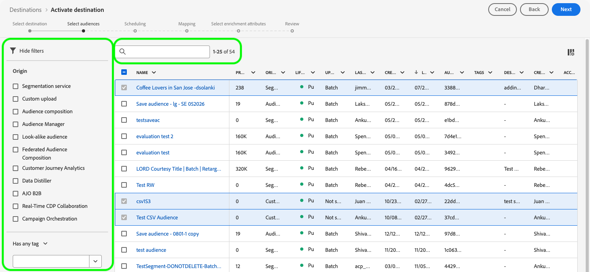{zoomable="yes"}

You can select from multiple types of audiences, depending on their origin:

* **[!UICONTROL Segmentation Service]**: Audiences generated within Experience Platform by the Segmentation Service. See the [segmentation documentation](../../segmentation/ui/overview.md) for more details.
* **[!UICONTROL Custom upload]**: Audiences generated outside of Experience Platform, and uploaded into Experience Platform as CSV files. To learn more about external audiences, see the documentation on [importing an audience](../../segmentation/ui/audience-portal.md#import-audience). Selecting audiences originating from **[!UICONTROL Custom uploads]** automatically enables the [Select enrichment attributes](#select-enrichment-attributes) step.
* Other types of audiences, originating from other Adobe solutions, such as [!DNL Audience Manager].

>[!IMPORTANT]
>
>When activating custom upload audiences to batch file-based destinations, there is a limit of 10 such audiences that you can activate in a dataflow.

>[!TIP]
>
>To remove audiences from existing activation flows, use the **[!UICONTROL Activation data]** page. Read the section on how to [remove multiple audiences from activation flows](../ui/destination-details-page.md#bulk-remove) for details.

## Schedule audience export {#scheduling}

>[!CONTEXTUALHELP]
>id="platform_destinations_activate_schedule"
>title="Schedule"
>abstract="Use the pencil icon to set the file export type (full files or incremental files) and the export frequency."

>[!CONTEXTUALHELP]
>id="platform_destinations_activate_schedule_weekly_messaging"
>title="Weekly exports"
>abstract="<sup>*</sup> Select the start date and subsequent exports will occur on that day of the week until the selected end date."

>[!CONTEXTUALHELP]
>id="platform_destinations_activate_schedule_monthly_messaging"
>title="Monthly exports"
>abstract="<sup>*</sup> Select the start date and subsequent exports will occur on that date of the month until the selected end date. For months with fewer than 30 or 31 days, the export occurs on the last day of the month."

[!DNL Adobe Experience Platform] exports data for email marketing and cloud storage destinations as [different file types](#supported-file-formats-export). In the **[!UICONTROL Scheduling]** page, you can configure the schedule and the file names for each audience you are exporting.

Use the **[!UICONTROL New audiences]** and **[!UICONTROL Activated audiences]** options to switch between two views of this page:

* **[!UICONTROL New audiences]**: Shows only the audiences that you added to the destination in the current activation flow.
* **[!UICONTROL Activated audiences]**: Shows the audiences that you activated to the destination in previous activation flows.

Experience Platform automatically sets a default schedule for each file export. You can modify the default schedule according to your needs, by selecting the pencil icon next to each schedule, and defining a custom schedule.

For each audience, choose one of two export types: [Export full files](#export-full-files) or [Export incremental files](#export-incremental-files).

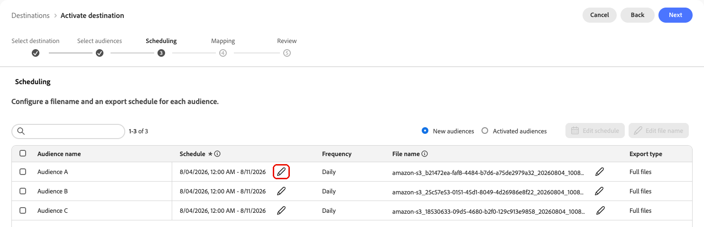{zoomable="yes"}

To edit multiple schedules at the same time, select the audiences by using the checkboxes on the left side of the screen, then select **[!UICONTROL Edit schedule]**. The schedule you configure will then be applied to all the exported files for the selected audiences.

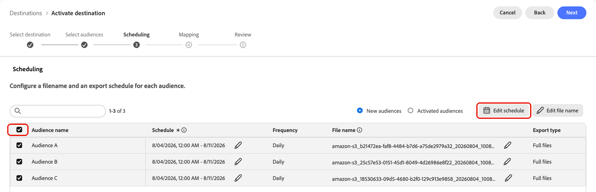{zoomable="yes"}

>[!TIP]
>
>You can edit audience activation schedules for existing activation flows from the **[!UICONTROL Activation data]** page. See the documentation on [bulk editing activation schedules](../ui/destination-details-page.md#bulk-edit-schedule) for details.

>[!IMPORTANT]
>
>[!DNL Adobe Experience Platform] automatically splits the export files at 5 million records (rows) per file. Each row represents one profile.
>
>Split file names are appended with a number that indicates the file is part of a larger export, as such: `filename.csv`, `filename_2.csv`, `filename_3.csv`.

### Export full files {#export-full-files}

>[!CONTEXTUALHELP]
>id="platform_destinations_activate_exportoptions"
>title="File export options"
>abstract="Select **Export full files** to export a complete snapshot of all the profiles that qualify for the audience. Select **Export incremental files** to export only the profiles which qualified for the audience since the last export. <br> The first incremental file export includes all profiles that qualify for the audience, acting as a backfill. Future incremental files include only the profiles which qualified for the audience since the first incremental file export."
>additional-url="https://experienceleague.adobe.com/docs/experience-platform/destinations/ui/activate/activate-batch-profile-destinations.html#export-incremental-files" text="Export incremental files"

>[!CONTEXTUALHELP]
>id="platform_destinations_activationchaining_aftersegmentevaluation"
>title="Activate after audience evaluation"
>abstract="<p>Activation runs immediately after the daily segmentation job completes. This ensures that the most up-to-date profiles are exported.</p><p>The option to export profiles after audience evaluation is <i>not</i> available for the weekly and monthly export frequency.</p>"

>[!CONTEXTUALHELP]
>id="platform_destinations_activationchaining_scheduled"
>title="Scheduled activation"
>abstract="Activation runs at a fixed time of the day."

Select **[!UICONTROL Export full files]** to trigger the export of a file containing a full snapshot of all profile qualifications for the selected audience.

{zoomable="yes"}

1. Use the **[!UICONTROL Frequency]** selector to select the export frequency:
    
    * **[!UICONTROL Once]**: schedule a one time on-demand full file export.
    * **[!UICONTROL Daily]**: schedule full file exports once a day, every day, at the time you specify.
    * **[!UICONTROL Weekly]**: select the start date and subsequent exports will occur on that day of the week until the selected end date.
    * **[!UICONTROL Monthly]**: select the start date and subsequent exports will occur on that date of the month until the selected end date. For months with fewer than 30 or 31 days, the export occurs on the last day of the month.

    >[!NOTE]
    >
    > Weekly and monthly scheduling options are currently supported only for the following file-based cloud storage destinations, and only when activating [people audiences](../../segmentation/types/overview.md#people-audience) and [prospect audiences](../../segmentation/types/overview.md#prospect-audience).
    > 
    > * [Amazon S3](../catalog/cloud-storage/amazon-s3.md)
    > * [Azure Blob Storage](../catalog/cloud-storage/azure-blob.md)
    > * [Data Landing Zone](../catalog/cloud-storage/data-landing-zone.md)
    > * [Google Cloud Storage](../catalog/cloud-storage/google-cloud-storage.md)
    > * [SFTP](../catalog/cloud-storage/sftp.md)
    > 
    > Weekly and monthly scheduling options are not available for other destination types.

2. Use the **[!UICONTROL Time]** toggle to select whether the export should happen immediately after audience evaluation or on a scheduled basis, at a specified time. When selecting the **[!UICONTROL Scheduled]** option, you can use the selector to choose the time of day, in [!DNL UTC] format, when the export should take place.

    Use the **[!UICONTROL After segment evaluation]** option to have the activation job run immediately after the daily Experience Platform batch segmentation job completes. This option ensures that when the activation job runs, the most up-to-date profiles are exported to your destination. This might result in an audience being exported multiple times a day, based on your actions.
    
    >[!IMPORTANT]
    >
    >If you run [flexible audience evaluation](../../segmentation/ui/audience-portal.md#flexible-audience-evaluation) on audiences which are already set to be activated after segment evaluation, the audiences will be activated as soon as the flexible audience evaluation job finishes, regardless of any previous daily activation jobs. This might result in audiences being exported multiple times a day, based on your actions.

    
    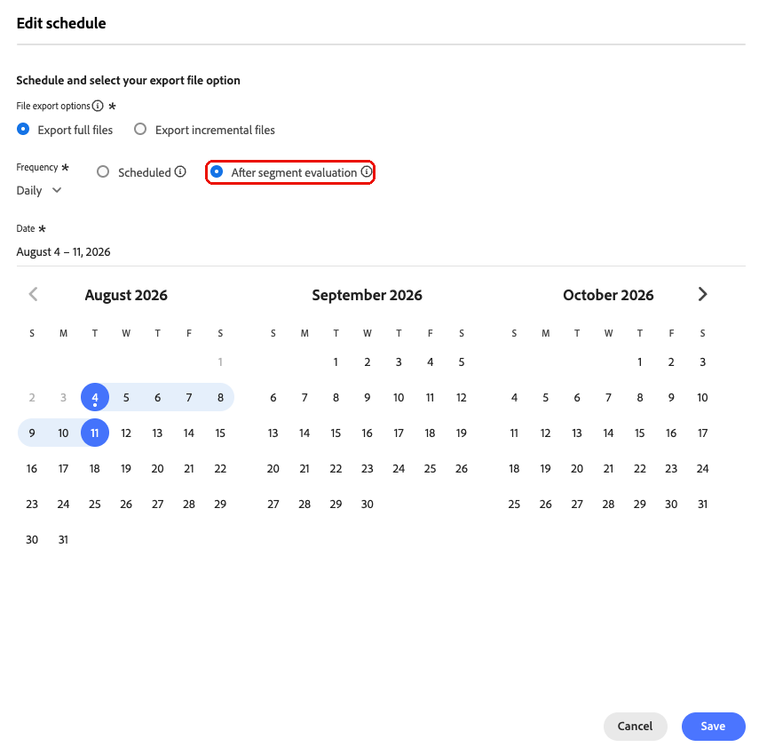{zoomable="yes"}
    
    Use the **[!UICONTROL Scheduled]** option to have the activation job run at a fixed time. This option ensures that Experience Platform profile data is exported at the same time each day. However, the profiles you export may not be the most up to date, depending on whether the batch segmentation job has completed before the activation job kicks off.

    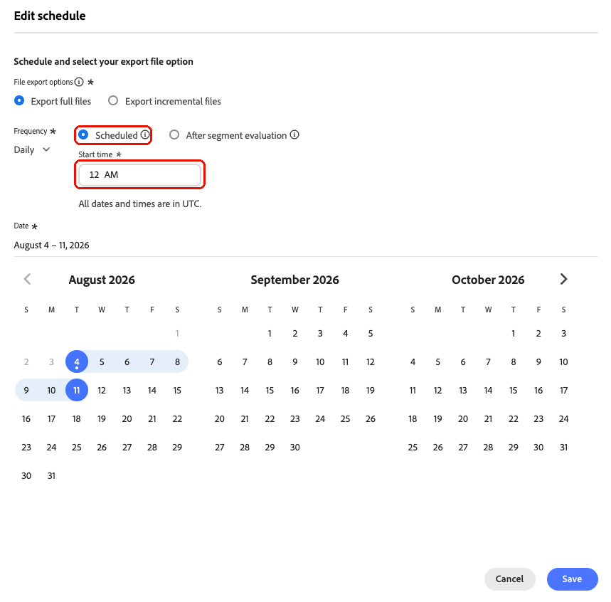{zoomable="yes"}

     When mapping an audience which was created within the last 24 hours and evaluated through [batch segmentation](../../segmentation/methods/batch-segmentation.md), set your daily export schedule to start the following day at the earliest. This assures that the daily batch evaluation job runs first and you are exporting complete audience data.

     When configuring export schedules, set the start time at least **1 hour** after completing the activation flow. Audience activations can take up to 1 hour to propagate through the system. If you schedule an export to run sooner than 1 hour after activation, the scheduled export may be missed.

3. Use the **[!UICONTROL Date]** selector to choose the day or interval when the export should take place. For daily exports, best practice is to set your start and end date to line up with the duration of your campaigns in your downstream platforms.

      >[!IMPORTANT]
      >
      > When selecting an export interval, the last day of the interval is not included in the exports. For example, if you select an interval of January 4 - 11, the last file export will take place on January 10.

4. Select **[!UICONTROL Create]** to save the schedule.

### Understanding scheduled export behavior {#export-behavior}

Scheduled exports include audience snapshot data plus any incremental profile or identity changes that occur between snapshot creation and export time. This differs from [on-demand exports](export-file-now.md), which use snapshot data only.

The following table highlights how scheduled exports differ from on-demand exports, particularly in terms of data freshness and intended use:

|  | Scheduled exports | Export file now |
|--------|-------------------|-----------------|
| **Data source** | Snapshot + incremental changes | Snapshot only |
| **Profile attributes** | Current values at export time | Values at snapshot time |

If profiles get updated after audience evaluation, scheduled exports will include the updated attribute values even though audience membership was determined at evaluation time.

**Example**: An audience for "profiles where retailID is null" may export profiles with retailID populated if that field was updated *after* evaluation but *before* the scheduled export.

**Recommendations**

* Configure a [deduplication key](/help/destinations/ui/batch-destinations-mapping-reference.md#deduplication-keys) to prevent duplicate records
* Use on-demand exports for exact snapshot-based data
* Align batch ingestion with evaluation schedules to minimize discrepancies

For on-demand exports, see the documentation on [exporting files on-demand](/help/destinations/ui/export-file-now.md#scheduled-vs-ondemand).

### Export incremental files {#export-incremental-files}

>[!CONTEXTUALHELP]
>id="platform_destinations_activate_something"
>title="Configure file name"
>abstract="For file-based destinations, a unique file name is generated per audience. Use the file name editor to create and edit a unique file name or keep the default name."

Select **[!UICONTROL Export incremental files]** to trigger an export where the first file is a full snapshot of all profile qualifications for the selected audience, and subsequent files are incremental profile qualifications since the previous export.

>[!IMPORTANT]
>
>The first exported incremental file includes all profiles that qualify for an audience, functioning as a backfill.

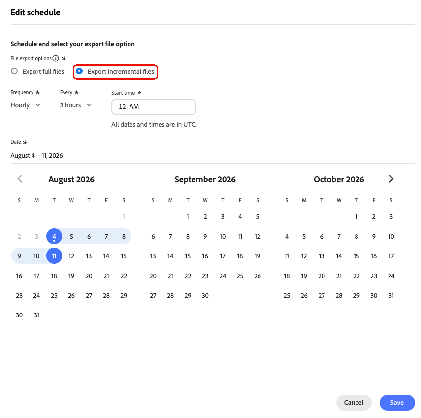{zoomable="yes"}

1. Use the **[!UICONTROL Frequency]** selector to select the export frequency:
    
    * **[!UICONTROL Daily]**: schedule incremental file exports once a day, every day, at the time you specify.
    * **[!UICONTROL Hourly]**: schedule incremental file exports every 3, 6, 8, or 12 hours.
    

2. Use the **[!UICONTROL Time]** selector to choose the time of day, in [!DNL UTC] format, when the export should take place.

3. Use the **[!UICONTROL Date]** selector to choose the interval when the export should take place. Best practice is to set your start and end date to line up with the duration of your campaigns in your downstream platforms.

      >[!IMPORTANT]
      >
      >The last day of the interval is not included in the exports. For example, if you select an interval of January 4 - 11, the last file export will take place on January 10.

4. Select **[!UICONTROL Create]** to save the schedule.

### Configure file names {#configure-file-names}

>[!CONTEXTUALHELP]
>id="platform_destinations_activate_filename"
>title="Configure file name"
>abstract="For file-based destinations, a unique file name is generated per audience. Use the file name editor to create and edit a unique file name or keep the default name."

For most destinations, the default file names consist of destination name, audience ID, and a date and time indicator. For example, you can edit your exported file names to distinguish between different campaigns or to have the data export time appended to the files. Note that some destination developers might select to have different default file name append options shown for their destinations.

To open a modal window and edit the file names, select the pencil icon. File names are limited to 255 characters.

>[!NOTE]
>
>The image below shows how file names can be edited for [!DNL Amazon S3] destinations but the process is identical for all batch destinations (for example SFTP, [!DNL Azure Blob Storage], or [!DNL Google Cloud Storage]).

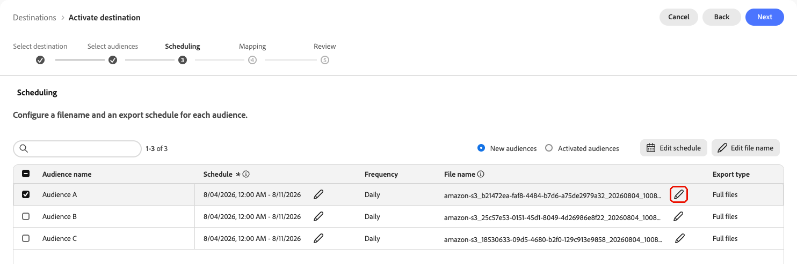{zoomable="yes"}

In the file name editor, you can select different components to add to the file name. 

{zoomable="yes"}

The destination name and audience ID cannot be removed from file names. In addition to these options, you can add the following options:

|File name option | Description |
|---------|----------|
| **[!UICONTROL Audience name]** | The name of the exported audience. |
| **[!UICONTROL Date and time]** | Select between adding a `MMDDYYYY_HHMMSS` format or a UNIX 10-digit timestamp of the time when the files are generated. Choose one of these options if you would like your files to have a dynamic file name generated with each incremental export. |
| **[!UICONTROL Custom text]** | Any custom text that you want to add to the file names. |
| **[!UICONTROL Destination ID]** | The ID of the destination dataflow you use to export the audience.  |
| **[!UICONTROL Destination name]** | The name of the destination dataflow you use to export the audience.  |
| **[!UICONTROL Organization name]** | Your organization name within Experience Platform. |
| **[!UICONTROL Sandbox name]** | The ID of the sandbox you use to export the audience. |

{style="table-layout:auto"}

To edit multiple file names at the same time, select the audiences by using the checkboxes on the left side of the screen, then select **[!UICONTROL Edit file name]**. The file name options you configure will then be applied to all the exported files for the selected audiences.

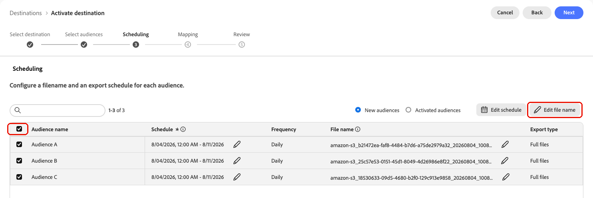{zoomable="yes"}

Select **[!UICONTROL Apply changes]** to confirm your selection.

>[!IMPORTANT]
>
>If you don't select the **[!UICONTROL Date and Time]** component, the file names will be static and the new exported file will overwrite the previous file in your storage location with each export. When running a recurring import job from a storage location into an email marketing platform, this is the recommended option.

Once you have finished configuring all your audiences, select **[!UICONTROL Next]** to continue.

## Mapping {#mapping}

>[!IMPORTANT]
>
>The **[!UICONTROL Mapping]** step described below applies to all cloud storage destinations. If you are activating audiences to [!DNL Adobe Campaign], Oracle Responsys, Oracle Eloqua, or Salesforce Marketing Cloud, see [Select profile attributes (legacy)](/help/destinations/ui/select-profile-attributes-legacy.md) instead.

In this step, you must select the profile attributes that you want to add to the files exported to the target destination. To select profile attributes and identities for export: 

1. In the **[!UICONTROL Mapping]** page, select **[!UICONTROL Add new mapping]**, then select the arrow to the right of the **[!UICONTROL Source field]** entry.

    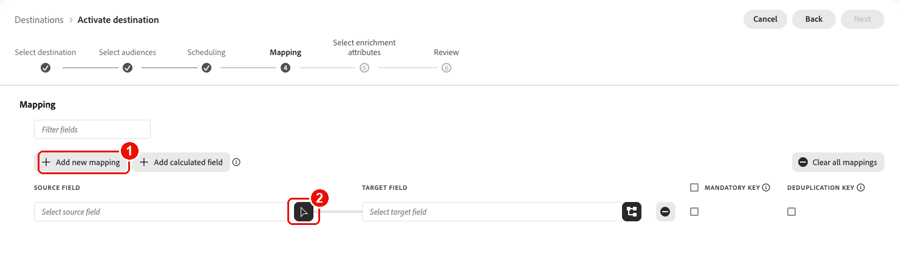{zoomable="yes"}

1. In the **[!UICONTROL Select source field]** page, use the **[!UICONTROL Select attributes]** or **[!UICONTROL Select identity namespace]** toggle to switch between the two categories of source fields, then select the profile attributes or identities that you want to include in the exported files to the destination. Choose **[!UICONTROL Save]** when you are done.

    >[!TIP]
    >
    >Use the search box to filter the source fields, as shown in the image below. Search matches partial, case-insensitive text, and works for profile attributes as well as standard [!DNL Adobe] and custom identity namespaces.

    Use the **[!UICONTROL Show only fields with data]** toggle to only display schema fields populated with values. By default, only populated schema fields are shown.

    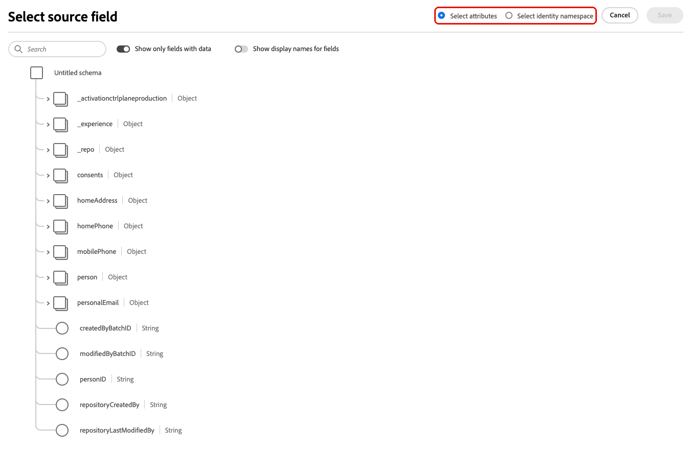{zoomable="yes"}

    Use the **[!UICONTROL Show display names for fields]** toggle to display the friendly names for fields, instead of the schema field names.

    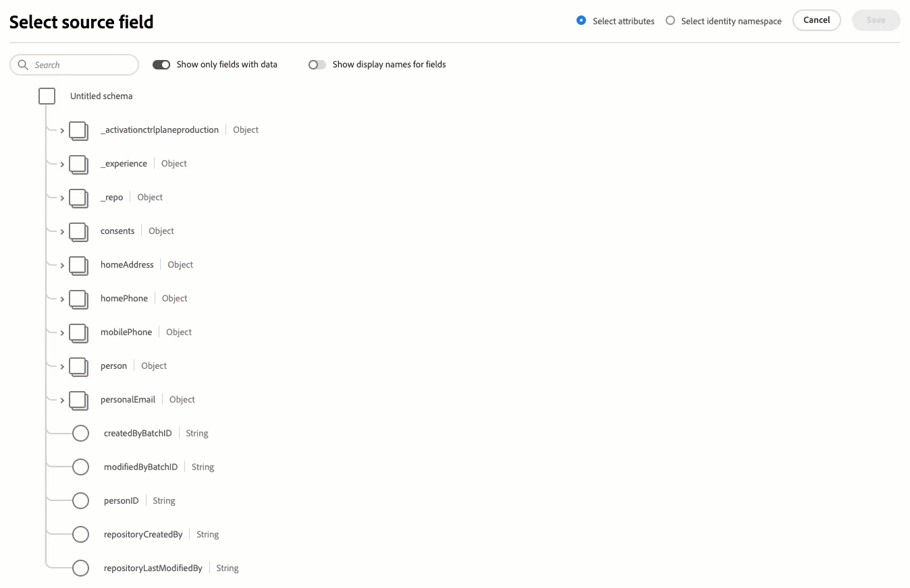{zoomable="yes"}

1. The field you selected for export now appears in the mapping view. If you wish, you can edit the name of the header in the exported file. To do this, select the icon on the target field.

    >[!NOTE]
    >
    >Dots (`.`) are not supported in field names in exported files. If a field name includes dots (such as `person.name.firstName`), each dot will be replaced with an underscore (`_`) in the exported column name. For example, `person.name.firstName` will become `person_name_firstName` in your exported file.

    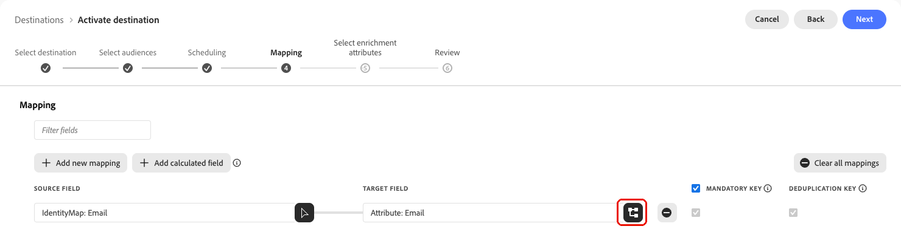{zoomable="yes"}

1. In the **[!UICONTROL Select target field]** page, type in the desired name of the header in your exported file, then choose **[!UICONTROL Save]**.

    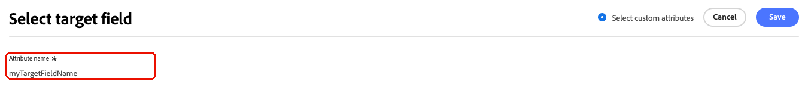{zoomable="yes"}

1. The field you selected for export now appears in the mapping view and shows the edited header in the exported file.

    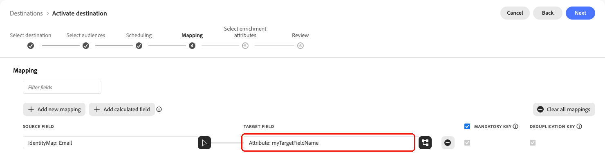{zoomable="yes"}

1. (Optional) The order of the mapped fields in the UI reflects in the order of the columns in the exported CSV file, from top to bottom, with the top row being the leftmost column in the CSV file. You can reorder the mapped fields in any way you want, by dragging and dropping the mapping rows, as shown below. 
    
    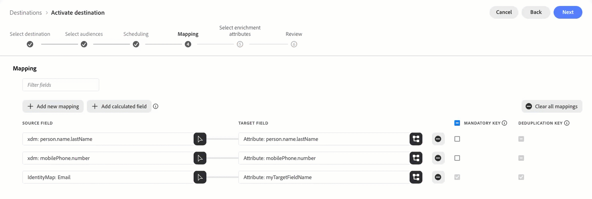{zoomable="yes"}

1. (Optional) You can select your exported field to be a [mandatory key](/help/destinations/ui/batch-destinations-mapping-reference.md#mandatory-attributes) or a [deduplication key](/help/destinations/ui/batch-destinations-mapping-reference.md#deduplication-keys).

    When you map an identity, Experience Platform automatically marks it as a mandatory key and a deduplication key. You cannot clear these selections for identity mappings.

    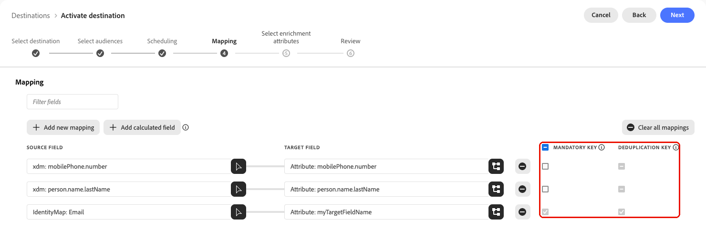{zoomable="yes"}

1. To add more fields for exporting, repeat the steps above.

For details on mandatory attributes, deduplication keys, calculated fields, and known limitations of the Mapping step, see the [batch destinations mapping reference](/help/destinations/ui/batch-destinations-mapping-reference.md).

## Select enrichment attributes {#select-enrichment-attributes}

>[!CONTEXTUALHELP]
>id="platform_destinations_activate_exclude_enrichment_attributes"
>title="Exclude enrichment attributes"
>abstract="Enable this option to export the profiles from the selected custom uploaded audiences to your destination, while excluding all of their attributes."

>[!IMPORTANT]
>
>This step is displayed only if you selected **[!UICONTROL Custom upload]** audiences during the [audience selection](#select-audiences) step.

Enrichment attributes correspond to custom uploaded audiences ingested in Experience Platform as **[!UICONTROL Custom uploads]**. In this step, you can select which attributes you would like to export to your destination, for each selected external audience.

>[!TIP]
>
>If you want to activate external audiences to your destinations without exporting any attribute, enable the **[!UICONTROL Exclude enrichment attributes]** toggle. This option exports the profiles from the external audiences, but none of their corresponding attributes are sent to your destination.
>
>{zoomable="yes"}

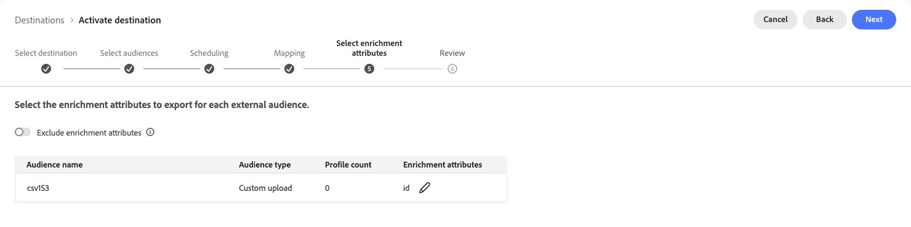{zoomable="yes"}

Follow the steps below to select enrichment attributes for each external audience:

1. In the **[!UICONTROL Enrichment attributes]** column, select the  (Edit) button.
1. Select **[!UICONTROL Add enrichment attribute]**. A new empty schema field is shown.
  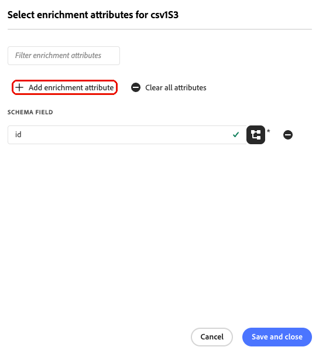{zoomable="yes"}
1. Select the button to the right of the empty field to open the field selection screen.
1. Select the attributes that you want to export for the audience.
  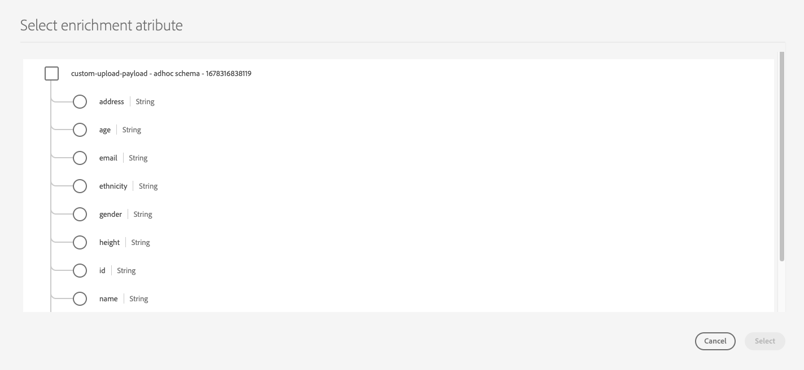{zoomable="yes"}
1. After you have added all the attributes that you want to export, select **[!UICONTROL Save and close]**.
1. Repeat these steps for each external audience.

Select **[!UICONTROL Next]** to move to the [Review](#review) step.

### [!BADGE Beta]{type=Informative} Export arrays and objects from enrichment attributes {#export-arrays-enrichment-attributes}

>[!AVAILABILITY]
>
>The ability to export arrays and objects from enrichment attributes is in beta and available to select customers. To request access, contact your Adobe representative.

>[!CONTEXTUALHELP]
>id="platform_destinations_enrichment_attributes_info_alert"
>title="Export arrays and complex objects enabled"
>abstract="This destination supports exporting arrays and complex objects because the Export arrays, maps, and objects toggle is on. You can export top-level arrays, array elements, or multiple fields from the same array in one mapping. See the documentation for details."

>[!CONTEXTUALHELP]
>id="platform_destinations_enrichment_attributes_source_field"
>title="Source field"
>abstract="Select an enrichment attribute to export. For fields inside an array, the source auto-populates with a transform expression. To export multiple fields in one mapping, add one field first, then edit the source expression. See the documentation for details."
>additional-url="https://experienceleague.adobe.com/docs/experience-platform/destinations/ui/activate/activate-batch-profile-destinations.html#export-multiple-array-fields" text="Export multiple fields from an array"

>[!CONTEXTUALHELP]
>id="platform_destinations_enrichment_attributes_target_field"
>title="Target field"
>abstract="The target field auto-populates with the source field name. Edit it to use a different alias if you want the field to have a different name in your exported files."

When exporting audiences to cloud storage destinations with JSON or [!DNL Parquet] output and the [**[!UICONTROL Export arrays, maps, and objects]** toggle enabled](/help/destinations/ui/export-arrays-maps-objects.md#export-arrays-maps-objects-toggle), you can export complex data structures, including entire arrays or selected fields from arrays of objects, as enrichment attributes.

{zoomable="yes"}

The enrichment attributes step shows a two-column mapping interface:

* **[!UICONTROL Source field]**: the full schema path, which may include a calculated `transformArray` expression when the selected field is inside an array. You can identify calculated expressions by the function icon on the right side of the source field, as opposed to the schema icon shown for regular attributes.
* **[!UICONTROL Target field]**: the alias used as the field name in the exported file. Edit this to use a different name in your exported files. The target field may only contain letters, numbers, and underscores. Dots, dashes, and other special characters are not permitted.

This functionality is available only when all of the following conditions are met:

* The destination is one of the following supported cloud storage destinations: [Amazon S3](/help/destinations/catalog/cloud-storage/amazon-s3.md), [SFTP](/help/destinations/catalog/cloud-storage/sftp.md), [Azure Blob Storage](/help/destinations/catalog/cloud-storage/azure-blob.md), [Azure Data Lake Storage Gen2](/help/destinations/catalog/cloud-storage/adls-gen2.md), [Data Landing Zone](/help/destinations/catalog/cloud-storage/data-landing-zone.md), or [Google Cloud Storage](/help/destinations/catalog/cloud-storage/google-cloud-storage.md).
* The destination connection has file type set to JSON or [!DNL Parquet].
* The destination connection has the [**[!UICONTROL Export arrays, maps, and objects]**](/help/destinations/ui/export-arrays-maps-objects.md#export-arrays-maps-objects-toggle) toggle set *on*.
* The audience you are activating originates from outside of the [!DNL Segmentation Service]. This includes audiences such as [Audience Composition](/help/segmentation/ui/audience-composition.md) audiences, look-alike audiences, federated audiences, audiences generated in other [!DNL Experience Platform] apps such as [!DNL Adobe Journey Optimizer], and more. Read about the [various audience origins](/help/segmentation/ui/audience-portal.md#customize).

#### Export an entire array {#export-entire-array}

Select the name of the array attribute from the source field selection screen. The source field populates with the array path and the target field auto-populates with the array name. The exported output preserves all objects in the array with all their properties.

{zoomable="yes"}

#### Export a single field from an array of objects {#export-single-array-field}

When you select a property nested inside an array of objects, the **[!UICONTROL Source field]** automatically populates with a `transformArray` calculated expression using `to_object` to extract that property from every object in the array.

For example, selecting `someArray[*].amount` populates the source field with:

```
transformArray(someArray, x -> to_object("amount", x.amount))
```

The target field auto-populates with the leaf node name (`amount`). You can change the name of the target field if you desire to do so.

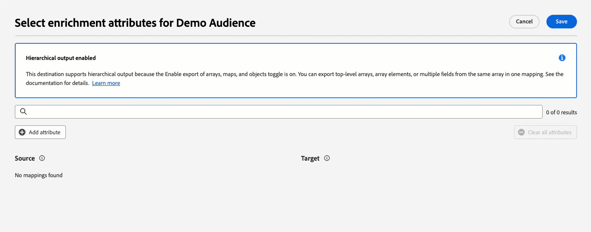{zoomable="yes"}

#### Export multiple fields from an array of objects {#export-multiple-array-fields}

To export more than one property from the same array of objects, follow this two step process:

1. Select one property from the array using the source field picker. The dialog auto-populates the calculated expression for that field.
2. Manually edit the generated `transformArray` expression in the **[!UICONTROL Source field]** to add the additional properties inside the `to_object` function.

For example, to export both `amount` and `date` from `someArray`, start by selecting `someArray[*].amount`, then edit the expression to:

```
transformArray(someArray, x -> to_object("amount", x.amount, "date", x.date))
```

Only the fields you specify are included in each object within the exported array. Additionally, you can change the name of the top-level array in your exported file if desired.

{zoomable="yes"}

>[!NOTE]
>
>The UI currently supports selecting one field at a time from an array. To export multiple fields from the same array in one mapping, select the first field and then edit the source expression manually as shown above.

## Review {#review}

>[!NOTE]
>
>If any data usage labels have been applied to certain fields within a dataset (rather than the entire dataset), enforcement of those field-level labels on activation occurs under the following conditions:
>
>* The fields are used in the audience definition.
>* The fields are configured as projected attributes for the target destination.
>
> For example, if the field `person.name.firstName` has certain data usage labels that conflict with the destination's marketing action, you would be shown a data usage policy violation in the review step. For more information, see [Data Governance in [!DNL Adobe Experience Platform]](../../rtcdp/privacy/data-governance-overview.md#destinations).

On the **[!UICONTROL Review]** page, you can see a summary of your selection. Select **[!UICONTROL Cancel]** to break up the flow, **[!UICONTROL Back]** to modify your settings, or **[!UICONTROL Finish]** to confirm your selection and start sending data to the destination.

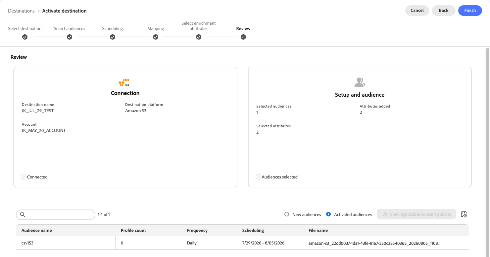{zoomable="yes"}

### Consent policy evaluation {#consent-policy-evaluation}

>[!CONTEXTUALHELP]
>id="platform_governance_policies_viewApplicableConsentPolicies"
>title="View applicable consent policies"
>abstract="If your organization purchased **Adobe Healthcare Shield** or **Adobe Privacy & Security Shield**, select **[!UICONTROL View applicable consent policies]** to see which consent policies are applied and how many profiles are included in the activation as a result of them. This control is disabled if your company does not have access to the SKUs mentioned above."

If your organization purchased **Adobe Healthcare Shield** or **Adobe Privacy & Security Shield**, select **[!UICONTROL View applicable consent policies]** to see which consent policies are applied and how many profiles are included in the activation as a result of them. Read about [consent policy evaluation](/help/data-governance/enforcement/auto-enforcement.md#consent-policy-evaluation) for more information.

### Data usage policy checks {#data-usage-policy-checks}

In the **[!UICONTROL Review]** step, Experience Platform also checks for any data usage policy violations. Shown below is an example where a policy is violated. You cannot complete the audience activation workflow until you have resolved the violation. For information on how to resolve policy violations, read about [data usage policy violations](/help/data-governance/enforcement/auto-enforcement.md#data-usage-violation) in the data governance documentation section.
 
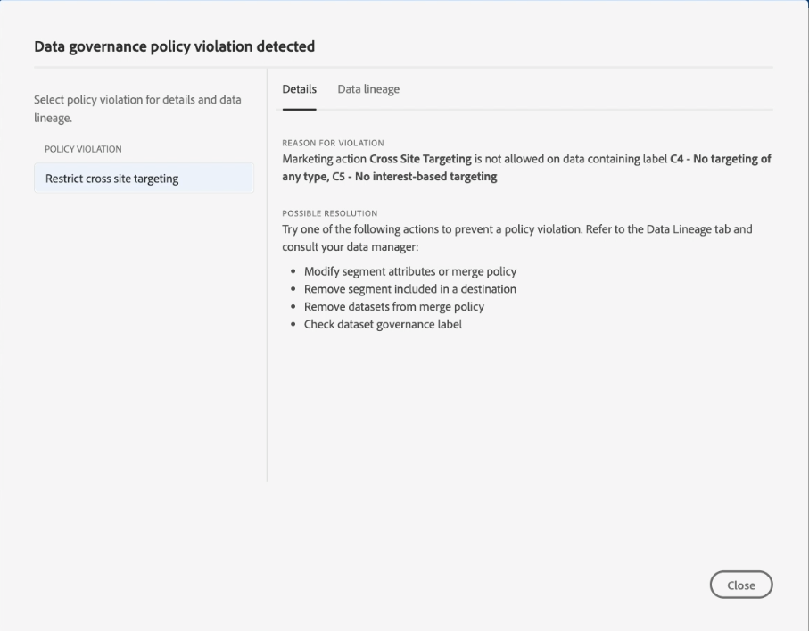{zoomable="yes"}

### Filter audiences {#filter-audiences}

Use the **[!UICONTROL New audiences]** and **[!UICONTROL Activated audiences]** toggle to switch between the audiences that you added in this activation flow and the audiences that you already activated to the destination in previous flows.

To choose which columns appear in the table, select the customize table icon. In the **[!UICONTROL Customize table]** dialog, select or clear the columns that you want to show, then select **[!UICONTROL Apply]**.

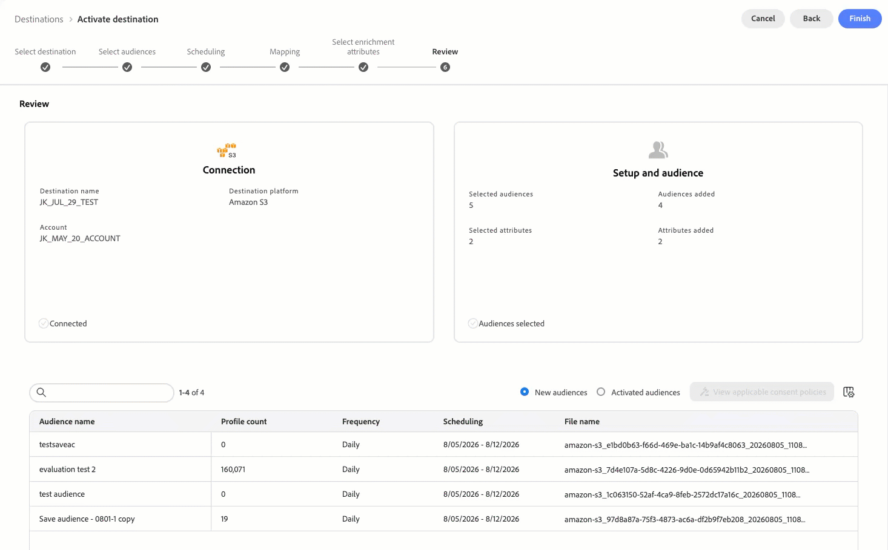{zoomable="yes"}

If you are satisfied with your selection and no policy violations have been detected, select **[!UICONTROL Finish]** to confirm your selection and start sending data to the destination. 

## Verify audience activation {#verify}

When exporting audiences to cloud storage destinations, [!DNL Adobe Experience Platform] creates a `.csv`, `.json`, or `.parquet` file in the storage location that you provided. Expect a new file to be created in your storage location according to the schedule you set in the workflow. The default file format is shown below, but you can [edit the components of the file name](#configure-file-names):
`<destinationName>_segment<segmentID>_<timestamp-yyyymmddhhmmss>.csv`

For example, if you selected a daily export frequency, the files you would receive on three consecutive days could look like this:

```console
Salesforce_Marketing_Cloud_segment12341e18-abcd-49c2-836d-123c88e76c39_20200408061804.csv
Salesforce_Marketing_Cloud_segment12341e18-abcd-49c2-836d-123c88e76c39_20200409052200.csv
Salesforce_Marketing_Cloud_segment12341e18-abcd-49c2-836d-123c88e76c39_20200410061130.csv
```

The presence of these files in your storage location is confirmation of successful activation. To understand how the exported files are structured, you can [download a sample .csv file](../assets/common/sample_export_file_segment12341e18-abcd-49c2-836d-123c88e76c39_20200408061804.csv). This sample file includes the profile attributes `person.firstname`, `person.lastname`, `person.gender`, `person.birthyear`, and `personalEmail.address`.
