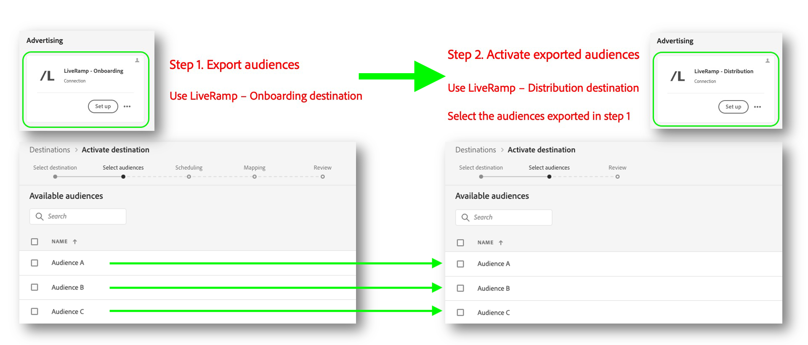

# Activate audiences to connected TV and audio destinations

This article explains the workflow required to activate audiences from Adobe Experience Platform to connected TV and audio destinations, through the use of [LiveRamp RampID](https://docs.liveramp.com/connect/en/interpreting-rampid,-liveramp-s-people-based-identifier.html).

Use Adobe's integration with LiveRamp to activate audiences directly from Experience Platform to the following destinations: 

* [[!DNL 4C Insights]](#insights)
* [[!DNL Acast]](#acast)
* [[!DNL Ampersand.tv]](#ampersand-tv)
* [[!DNL Captify]](#captify)
* [[!DNL Cardlytics]](#cardlytics)
* [[!DNL Disney (Hulu/ESPN/ABC)]](#disney)
* [[!DNL iHeartMedia]](#iheartmedia)
* [[!DNL Index Exchange]](#index-exchange)
* [[!DNL Magnite CTV Platform]](#magnite)
* [[!DNL Magnite DV+ (Rubicon Project)]](#magnite-dv)
* [[!DNL Nexxen]](#nexxen)
* [[!DNL One Fox]](#fox)
* [[!DNL Pandora]](#pandora)
* [[!DNL Reddit]](#reddit)
* [[!DNL Roku]](#roku)
* [[!DNL Spotify]](#spotify)
* [[!DNL Taboola]](#taboola)
* [[!DNL TargetSpot]](#targetspot)
* [[!DNL Teads]](#teads)
* [[!DNL WB Discovery]](#wb-discovery)

## Activation workflow {#workflow}

You activate audiences to connected TV and audio destinations by going through a two step process.

### Step 1: Send your audiences from Experience Platform to LiveRamp, through the [!DNL LiveRamp - Onboarding] destination {#onboarding}

The first thing you must do in order to activate your audiences to connected TV destinations is to **export your audiences from Experience Platform to [!DNL LiveRamp]**.

You do this by using the **[!DNL LiveRamp - Onboarding]** destination.

To learn how to configure the [!DNL LiveRamp - Onboarding] destination and export your audiences from Experience Platform, read the [[!DNL LiveRamp - Onboarding]](../catalog/advertising/liveramp-onboarding.md) destination documentation.

After you have successfully exported your audiences to LiveRamp, continue to [step 2](#distribution).

>[!TIP]
>
>Before moving to [step 2](#distribution), [validate](../catalog/advertising/liveramp-onboarding.md#exported-data) that your audiences have been succesfully exported to LiveRamp.

### Step 2: Activate the onboarded audiences to connected TV and audio destinations, through the [!DNL LiveRamp - Distribution] destination {#distribution} 

After you have [validated](../catalog/advertising/liveramp-onboarding.md#exported-data) that your audiences have been succesfully exported to LiveRamp, it's time to activate the audiences to your preferred destinations, such as [[!DNL Roku]](../catalog/advertising/liveramp-distribution.md#roku), [[!DNL Disney]](../catalog/advertising/liveramp-distribution.md#disney), and more.

You activate the audiences (exported in [step 1](#onboarding)) by using the **[!DNL LiveRamp - Distribution]** destination.

To learn how to configure the **[!DNL LiveRamp - Distribution]** destination and activate the audiences which you exported in [step 1](#onboarding), read the [[!DNL LiveRamp - Distribution]](../catalog/advertising/liveramp-distribution.md) destination documentation.

>[!IMPORTANT]
>
>In the **audience selection** step of the **[!DNL LiveRamp - Distribution]** destination, you must select the *exact same audiences* which you have exported to the [LiveRamp - Onboarding](liveramp-onboarding.md) destination in [step 1](#onboarding).

Click the image below to view a full sized overview diagram of the workflow.

 {width="500" align="center" zoomable="yes"}

