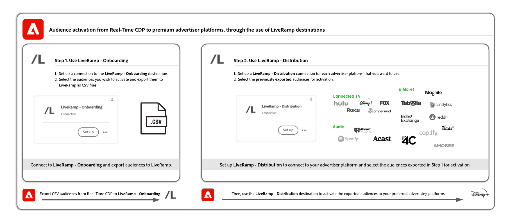
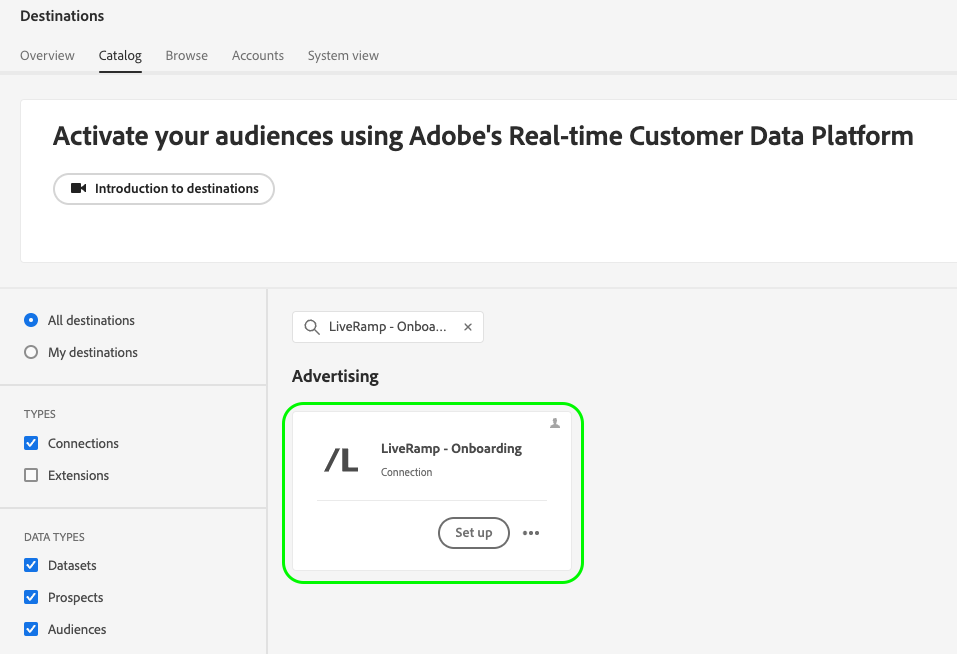
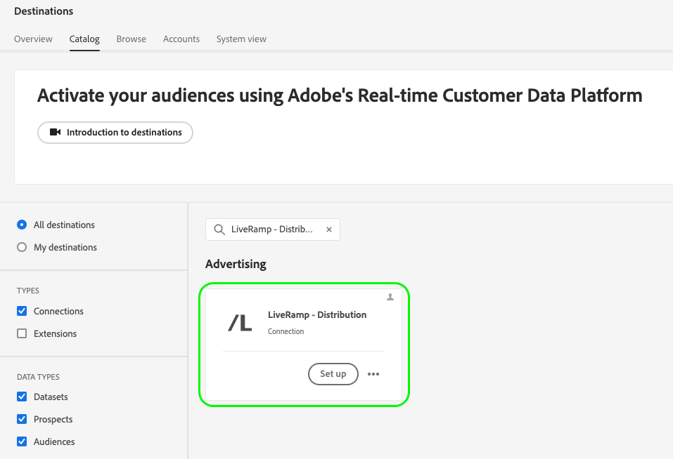
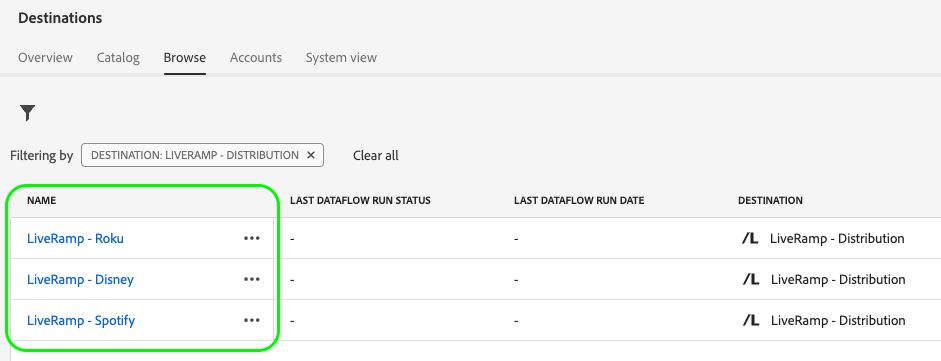

# Activate audiences to curated destinations based on LiveRamp identifiers

Use the Adobe Real-Time CDP integration with [!DNL LiveRamp] to activate audiences to a curated list of destinations which use [!DNL [LiveRamp RampID]](https://docs.liveramp.com/connect/en/interpreting-rampid,-liveramp-s-people-based-identifier.html) for activation, including connected TV and audio destinations, such as the ones listed below.

>[!IMPORTANT]
>
>You do not need to ingest or in any way work with LiveRamp RampIDs in the Experience Platform interface.
>
> You can export identities from Real-Time CDP, such as PII-based identifiers, known identifiers, and custom IDs, as described in the official [LiveRamp documentation](https://docs.liveramp.com/connect/en/identity-and-identifier-terms-and-concepts.html#known-identifiers). These identities are then matched with [!DNL LiveRamp RampIDs] further downstream in the activation process.

* [[!DNL 4C Insights]](#insights)
* [[!DNL Acast]](#acast)
* [[!DNL Ampersand.tv]](#ampersand-tv)
* [[!DNL Captify]](#captify)
* [[!DNL Cardlytics]](#cardlytics)
* [[!DNL Disney (Hulu/ESPN/ABC)]](#disney)
* [[!DNL iHeartMedia]](#iheartmedia)
* [[!DNL Index Exchange]](#index-exchange)
* [[!DNL Magnite CTV Platform]](#magnite)
* [[!DNL Magnite DV+ (Rubicon Project)]](#magnite-dv)
* [[!DNL Nexxen]](#nexxen)
* [[!DNL One Fox]](#fox)
* [[!DNL Pandora]](#pandora)
* [[!DNL Reddit]](#reddit)
* [[!DNL Roku]](#roku)
* [[!DNL Spotify]](#spotify)
* [[!DNL Taboola]](#taboola)
* [[!DNL TargetSpot]](#targetspot)
* [[!DNL Teads]](#teads)
* [[!DNL WB Discovery]](#wb-discovery)

This article explains the workflow required to activate audiences from Real-Time CDP to the destinations listed above, directly from the Real-Time CDP UI.

## Activation workflow {#workflow}

You activate audiences to connected TV and audio destinations by going through a two-step process, and by using the [LiveRamp - Onboarding](../catalog/advertising/liveramp-onboarding.md) and the [LiveRamp - Distribution](../catalog/advertising/liveramp-distribution.md) destinations, as shown in the image below.

{width="1920" zoomable="yes"}

First, you export your audiences from Real-Time CDP to the [[!DNL LiveRamp - Onboarding]](../catalog/advertising/liveramp-onboarding.md) destination, as CSV files.

After you've exported your audiences, you activate them by using the [[!DNL LiveRamp - Distribution]](../catalog/advertising/liveramp-distribution.md) destination.

>[!TIP]
>
>This process enables you to activate your audiences to destinations such as [[!DNL Roku]](../catalog/advertising/liveramp-distribution.md#roku), [[!DNL Disney]](../catalog/advertising/liveramp-distribution.md#disney), and more, directly from the Real-Time CDP UI, without the need to log in to your [!DNL LiveRamp] account for activation.

### Step 1: Send your audiences from Experience Platform to LiveRamp, through the [!DNL LiveRamp - Onboarding] destination {#onboarding}

The first thing that you must do in order to activate your audiences to curated destinations based on LiveRamp RampIDs is to **export your audiences from Experience Platform to [!DNL LiveRamp]**.

You do this by using the **[!DNL LiveRamp - Onboarding]** destination.

To learn how to configure the [!DNL LiveRamp - Onboarding] destination and export your audiences from Experience Platform, read the [[!DNL LiveRamp - Onboarding]](../catalog/advertising/liveramp-onboarding.md) destination documentation.

>[!IMPORTANT]
>
>When exporting files to the [!DNL LiveRamp - Onboarding] destination, Platform generates one CSV file for each [merge policy ID](../../profile/merge-policies/overview.md). See the [[!DNL LiveRamp - Onboarding]](../catalog/advertising/liveramp-onboarding.md) destination documentation for detailed information on how to validate your data export to LiveRamp.

After you have successfully exported your audiences to LiveRamp, continue to [step 2](#distribution).

>[!TIP]
>
>Before moving to [step 2](#distribution), [validate](../catalog/advertising/liveramp-onboarding.md#exported-data) that your audiences have been successfully exported to LiveRamp. See the documentation on [monitoring destination dataflows](../../dataflows/ui/monitor-destinations.md#dataflow-runs-for-batch-destinations) and read about the specific monitoring details for [[!DNL LiveRamp - Onboarding]](../catalog/advertising/liveramp-onboarding.md#exported-data).

### Step 2: Activate the onboarded audiences to connected TV and audio destinations, through the [!DNL LiveRamp - Distribution] destination {#distribution} 

After you have [validated](../catalog/advertising/liveramp-onboarding.md#exported-data) that your audiences have been successfully exported to LiveRamp, it's time to activate the audiences to your preferred destinations, such as [[!DNL Roku]](../catalog/advertising/liveramp-distribution.md#roku), [[!DNL Disney]](../catalog/advertising/liveramp-distribution.md#disney), and more.

You activate the audiences (exported in [step 1](#onboarding)) by using the **[!DNL LiveRamp - Distribution]** destination.

To learn how to configure the **[!DNL LiveRamp - Distribution]** destination and activate the audiences which you exported in [step 1](#onboarding), read the [[!DNL LiveRamp - Distribution]](../catalog/advertising/liveramp-distribution.md) destination documentation.

>[!IMPORTANT]
>
>In the **audience selection** step of the **[!DNL LiveRamp - Distribution]** destination, you must select the *exact same audiences* which you have exported to the [LiveRamp - Onboarding](../catalog/advertising/liveramp-onboarding.md) destination in [step 1](#onboarding).

When you configure the **[!DNL LiveRamp - Distribution]** destination, you must create a dedicated connection for each downstream destination that you want to use (Roku, Disney, and so on).

>[!TIP]
>
>When naming your destination, Adobe recommends following this format: `LiveRamp - Downstream Destination Name`. This naming pattern helps you quickly identify your destinations in the [Browse](../ui/destinations-workspace.md#browse) tab of the destinations workspace.
> 
>Example: `LiveRamp - Roku`.

## Exported data / Validate data export {#exported-data}

To validate the successful export of your audiences to the [[!DNL LiveRamp - Onboarding]](../catalog/advertising/liveramp-onboarding.md) destination, see the documentation on [monitoring destination dataflows](../../dataflows/ui/monitor-destinations.md#dataflow-runs-for-batch-destinations) and read about the specific monitoring details for [[!DNL LiveRamp - Onboarding]](../catalog/advertising/liveramp-onboarding.md#exported-data).

To validate the successful activation of your audiences to your advertising platform of choice (such as Roku, Disney, and others) log in to your destination platform account and check the activation metrics.
