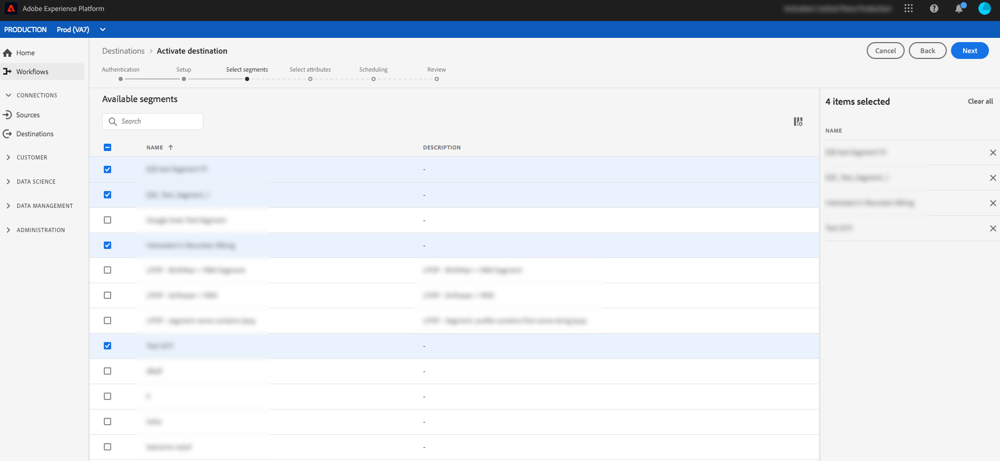
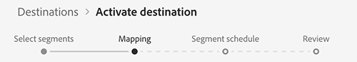
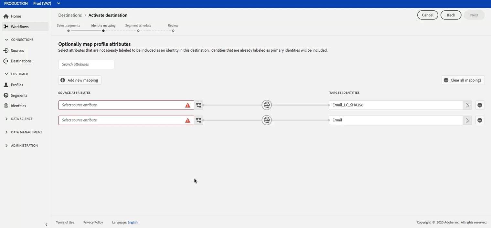
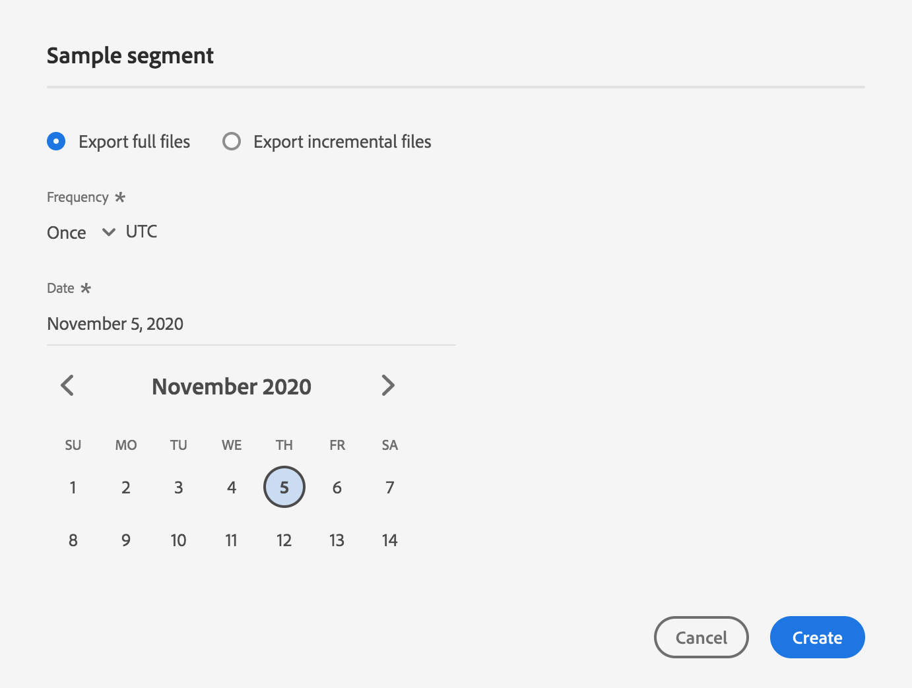
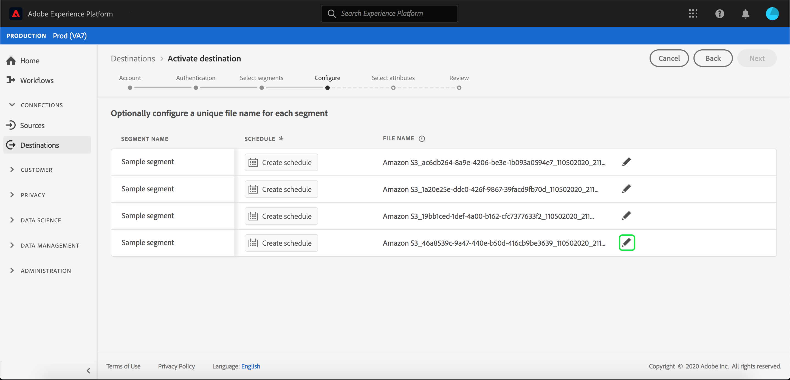
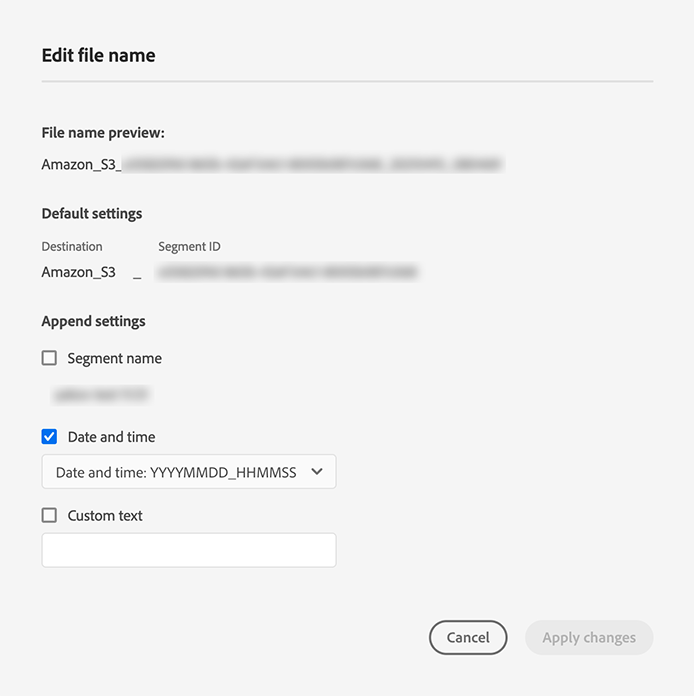
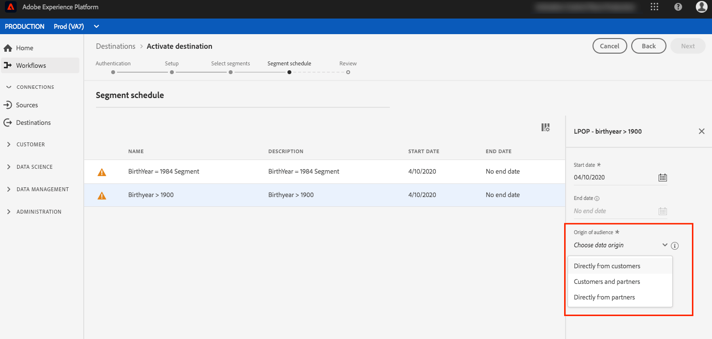
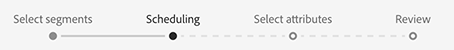
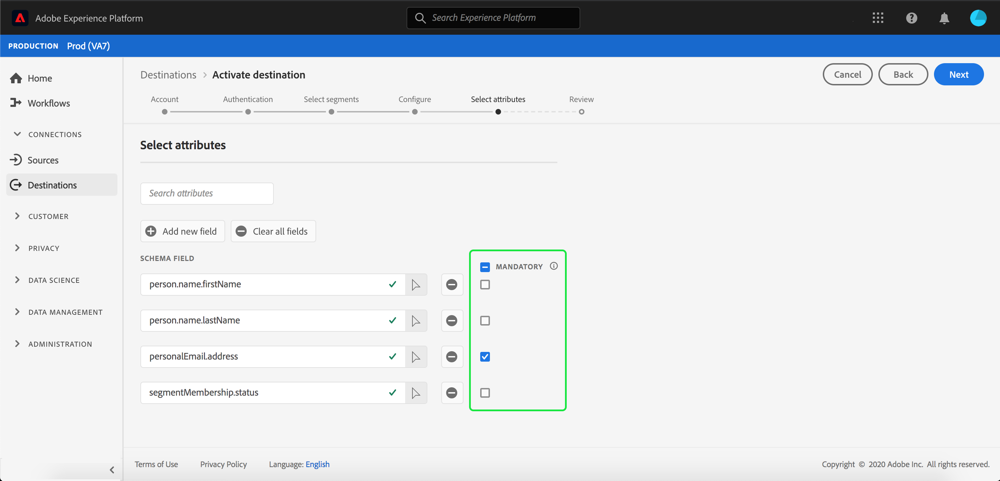
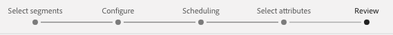

# Activate profiles and segments to a destination

Activate the data you have in Real-time Customer Data Platform by mapping segments to destinations. To accomplish this, follow the steps below.

## Prerequisites {#prerequisites}

To activate data to destinations, you must have successfully [connected a destination](./connect-destination.md). If you haven't done so already, go to the [destinations catalog](../catalog/overview.md), browse the supported destinations, and set up one or more destinations.

## Activate data {#activate-data}

The steps in the activation workflow vary slightly between destination types. The complete workflow for all destination types is outlined below. 

### Select which destination to activate data to {#select-destination}

Applies to: All destinations

In the Real-time CDP user interface, navigate to **[!UICONTROL Destinations]** > **[!UICONTROL Browse]**, and select the destination where you want to activate your segments.


Select the name of the destination to navigate to the activation workflow.


Note that if an activation workflow already exists for a destination, you can see the segments that are currently being activated to the destination. Select **[!UICONTROL Edit activation]** in the right rail and follow the steps below to modify the activation details.

Once you have selected a destination, select **[!UICONTROL Activate]**.

### [!UICONTROL Select Segments] step {#select-segments}

Applies to: All destinations


In the **[!UICONTROL Activate destination]** workflow, on the **[!UICONTROL Select Segments]** page, select one or more segments to activate to the destination. Select **[!UICONTROL Next]** to proceed to the next step.



### [!UICONTROL Identity mapping] step {#identity-mapping}

Applies to: social destinations and Google Customer Match advertising destination



For social destinations, you can select source attributes to map as target identities in the destination. This step is either optional or mandatory, depending on which primary identity you are using in the schema.

If you are using email address as primary identity in your schema, you can skip the Identity mapping step, as shown below:


If you are using another ID, such as "Rewards ID" or "Loyalty ID", as primary identity in your schema, you need to manually map the email address from your identity schema as a target identity in the social destination, as shown below:



Select `Email_LC_SHA256` as target identity if you hashed customer email addresses on data ingestion into Adobe Experience Platform, according to [!DNL Facebook] [email hashing requirements](/help/rtcdp/destinations/facebook-destination.md#email-hashing-requirements).

Select `Email` as target identity if the email addresses you are using are not hashed. Real-time CDP will hash the email addresses to comply with [!DNL Facebook] requirements.
   


### **[!UICONTROL Configure]** step {#configure}

Applies to: Email marketing destinations and cloud storage destinations


In the **[!UICONTROL Configure]** step, you can configure the schedule and the file names for each segment you are exporting. Configuring the schedule is mandatory, but configuring the file name is optional.

To add a schedule for the segment, select **[!UICONTROL Create schedule]**. 


A popover appears, showing options to create the segment schedule.  

- **File export**: You have the option to either export either full files or incremental files. Exporting a full file publishes a complete snapshot of all the profiles that qualify for that segment. Exporting an incremental file publishes the delta of profiles that qualify for that segment since the last export. 
- **Frequency**: If **[!UICONTROL Export full files]** is selected, you have the option to export **[!UICONTROL Once]** or **[!UICONTROL Daily]**. If **[!UICONTROL Export incremental files]** is selected, you only have the option to export **[!UICONTROL Daily]**. Exporting a file **[!UICONTROL Once]** exports the file one time. Exporting a file **[!UICONTROL Daily]** exports the file every day from the start date to the end date at 12:00 AM UTC (7:00 PM EST) if full files is selected and 12:00 PM UTC (7:00 AM EST) if incremental files is selected. 
- **Date**: If **[!UICONTROL Once]** is selected, you can select the date for the one time export. If **[!UICONTROL Daily]** is selected, you can select the start and end dates for the exports.



The default file names consist of destination name, segment ID, and a date and time indicator. For example, you can edit your exported file names to distinguish between different campaigns or to have the data export time appended to the files.

Select the pencil icon to open a modal window and edit the file names. Note that file names are limited to 255 characters.



In the file name editor, you can select different components to add to the file name. The destination name and segment ID cannot be removed from file names. In addition to these, you can add the following:

- **[!UICONTROL Segment name]**: You can append the segment name to the file name.
- **[!UICONTROL Date and time]**: Select between adding a `MMDDYYYY_HHMMSS` format or a Unix 10-digit timestamp of the time when the files are generated. Choose one of these options if you would like your files to have a dynamic file name generated with each incremental export.
- **[!UICONTROL Custom text]**: Add custom text to the file names.

Select **[!UICONTROL Apply changes]** to confirm your selection. 

>[!IMPORTANT] 
> 
>If you don't select the **[!UICONTROL Date and Time]** component, the file names will be static and the new exported file will overwrite the previous file in your storage location with each export. When running a recurring import job from a storage location into an email marketing platform, this is the recommended option.



Once you have finishing configuring all your segments, select **[!UICONTROL Next]** to continue.

### **[!UICONTROL Segment schedule]** step {#segment-schedule}

Applies to: advertising destinations, social destinations


On the **[!UICONTROL Segment schedule]** page, you can set the start date for sending data to the destination, as well as the frequency of sending data to the destination.

>[!IMPORTANT]
>
>For social destinations, you must select the origin of your audience in this step. You can proceed to the next step only after selecting one of the options in the image below.

 

### **[!UICONTROL Scheduling]** step {#scheduling}

Applies to: email marketing destinations and cloud storage destinations



On the **[!UICONTROL Scheduling]** page, you can see the start date for sending data to the destination as well as the frequency of sending data to the destination. These values cannot be edited.

### **[!UICONTROL Select attributes]** step {#select-attributes}

Applies to: email marketing destinations and cloud storage destinations


On the **[!UICONTROL Select attributes]** page, select **[!UICONTROL Add new field]** and choose the attributes that you want to send to the destination.

>[!NOTE] 
>
> Real-time CDP prefills your selection with four recommended, commonly used attributes from your schema: `person.name.firstName`, `person.name.lastName`, `personalEmail.address`, `segmentMembership.status`.

File exports will vary in the following ways, depending on whether `segmentMembership.status` is selected:
- If the `segmentMembership.status` field is selected, exported files include **[!UICONTROL Active]** members in the initial full snapshot and **[!UICONTROL Active]** and **[!UICONTROL Expired]** members in subsequent incremental exports.
- If the `segmentMembership.status` field is not selected, exported files include only **[!UICONTROL Active]** members in the initial full snapshot and in subsequent incremental exports.

 

Additionally, you can mark different attributes as mandatory. Marking an attribute as mandatory makes it so the exported segment must contain that attribute. As a result, it can be used as an additionally form of filtering. Marking an attribute as mandatory is **not** required.

It is recommended that one of the attributes is a [unique identifier](/help/rtcdp/destinations/email-marketing-destinations.md#identity) from your schema. For more information about mandatory attributes, see the identity section in the [Email marketing destinations](/help/rtcdp/destinations/email-marketing-destinations.md#identity) documentation. 
   
>[!NOTE] 
> 
>If any data usage labels have been applied to certain fields within a dataset (rather than the entire dataset), enforcement of those field-level labels on activation occurs under the following conditions:
>- The fields are used in the segment definition.
>- The fields are configured as projected attributes for the target destination.
>
> For example, if the field `person.name.firstName` has certain data usage labels that conflict with the destination's marketing use case, you would be shown a data usage policy violation in the review step. For more information, see [Data Governance in Real-time CDP](../../rtcdp/privacy/data-governance-overview.md#destinations).

### **[!UICONTROL Review]** step {#review}

Applies to: all destinations 



On the **[!UICONTROL Review]** page, you can see a summary of your selection. Select **[!UICONTROL Cancel]** to break up the flow, **[!UICONTROL Back]** to modify your settings, or **[!UICONTROL Finish]** to confirm your selection and start sending data to the destination.

>[!IMPORTANT]
>
>In this step, Real-time CDP checks for data usage policy violations. Shown below is an example where a policy is violated. You cannot complete the segment activation workflow until you have resolved the violation. For information on how to resolve policy violations, see [Policy enforcement](../../rtcdp/privacy/data-governance-overview.md#enforcement) in the data governance documentation section.
 


If no policy violations have been detected, select **[!UICONTROL Finish]** to confirm your selection and start sending data to the destination. 


## Edit activation {#edit-activation}

Follow the steps below to edit existing activation flows in Real-time CDP: 

1. Select **[!UICONTROL Destinations]** in the left navigation bar, then click the **[!UICONTROL Browse]** tab, and click the destination name.
2. Select **[!UICONTROL Edit activation]** in the right rail to change which segments to send to the destination.

## Verify that segment activation was successful {#verify-activation}

### Email marketing destinations and cloud storage destinations {#esp-and-cloud-storage}

For email marketing destinations and cloud storage destinations, Real-time CDP creates a tab-delimited `.csv` or `.txt` file in the storage location that you provided. Expect a new file to be created in your storage location every day. The default file format is:
`<destinationName>_segment<segmentID>_<timestamp-yyyymmddhhmmss>.csv|txt`

Note that you can edit the file format. For more information, go to the [Configure](#configure) step for cloud storage destinations and email marketing destinations. 

With the default file format, the files you would receive on three consecutive days could look like this:

```console
Salesforce_Marketing_Cloud_segment12341e18-abcd-49c2-836d-123c88e76c39_20200408061804.csv
Salesforce_Marketing_Cloud_segment12341e18-abcd-49c2-836d-123c88e76c39_20200409052200.csv
Salesforce_Marketing_Cloud_segment12341e18-abcd-49c2-836d-123c88e76c39_20200410061130.csv
```

The presence of these files in your storage location is confirmation of successful activation. To understand how the exported files are structured, you can [download a sample .csv file](../assets/common/sample_export_file_segment12341e18-abcd-49c2-836d-123c88e76c39_20200408061804.csv). This sample file includes the profile attributes `person.firstname`, `person.lastname`, `person.gender`, `person.birthyear`, and `personalEmail.address`.

### Advertising destinations

Check your account in the respective advertising destination that you are activating your data to. If activation was successful, audiences are populated in your advertising platform.

### Social network destinations

For [!DNL Facebook], a successful activation means that a [!DNL Facebook] custom audience would be created programmatically in [[!UICONTROL Facebook Ads Manager]](https://www.facebook.com/adsmanager/manage/). Segment membership in the audience would be added and removed as users are qualified or disqualified for the activated segments.

>[!TIP]
>
>The integration between Real-time CDP and [!DNL Facebook] supports historical audience backfills. All historical segment qualifications get sent to [!DNL Facebook] when you activate the segments to the destination.

## Disable activation {#disable-activation}

To disable an existing activation flow, follow the steps below:

1. Select **[!UICONTROL Destinations]** in the left navigation bar, then click the **[!UICONTROL Browse]** tab, and click the destination name.
2. Click the **[!UICONTROL Enabled]** control in the right rail to change the activation flow state.
3. In the **Update data flow state** window, select **Confirm** to disable the activation flow.
