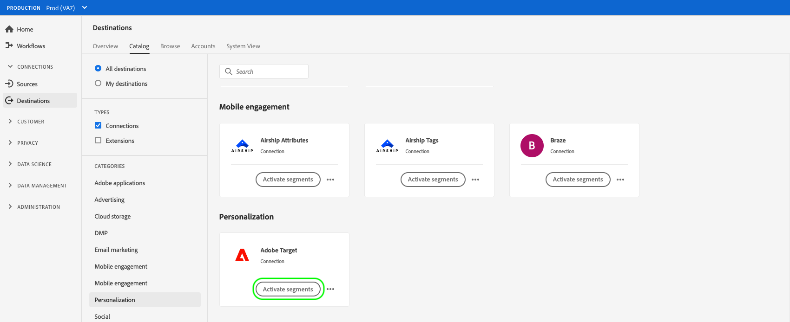
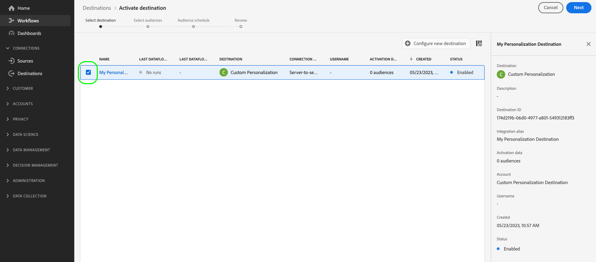
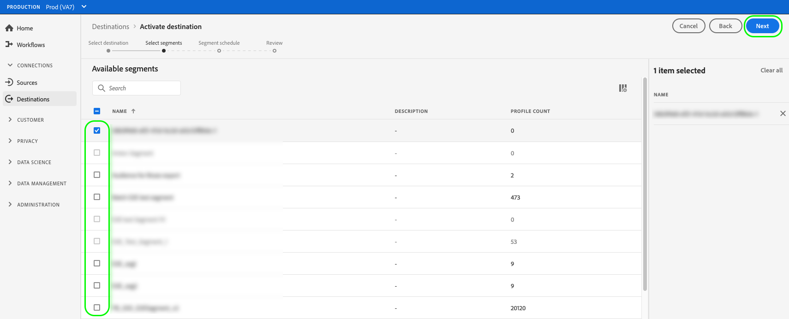
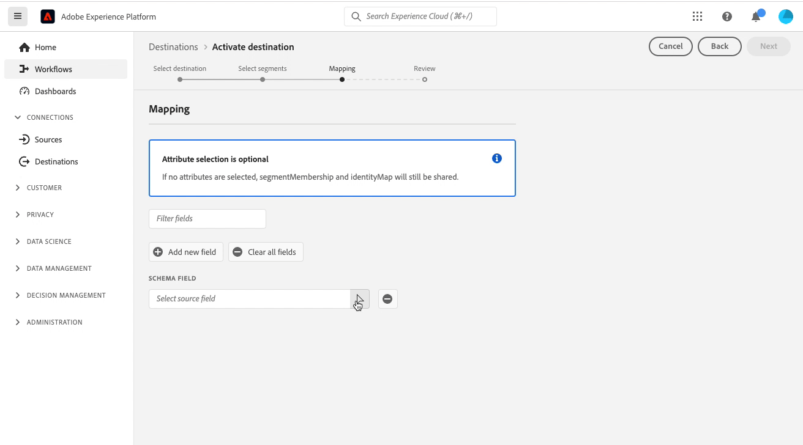
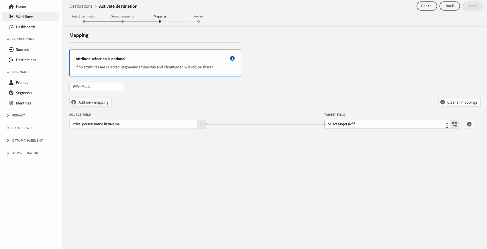
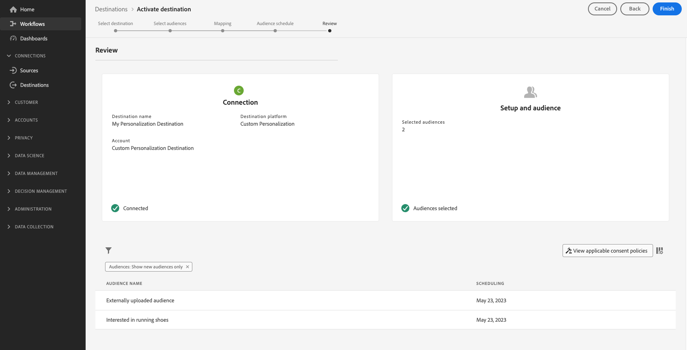
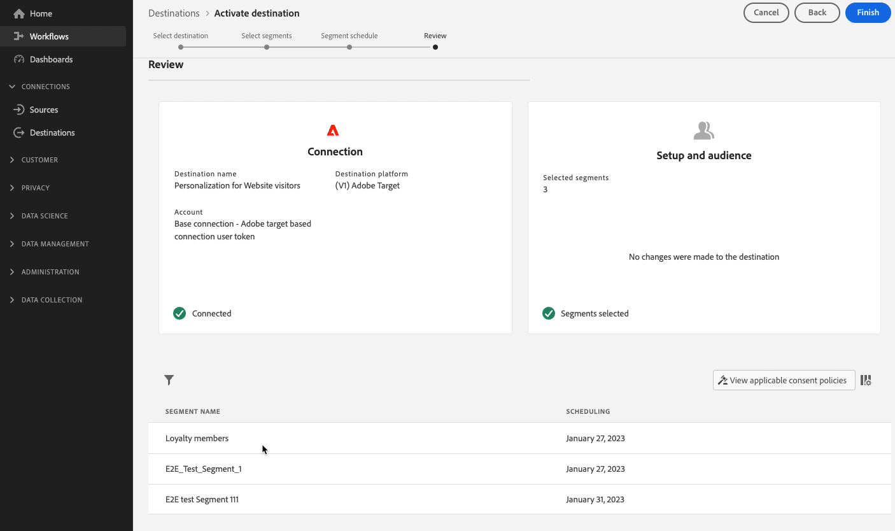

# Activate audience data to edge personalization destinations

## Overview {#overview}

Adobe Experience Platform uses [edge segmentation](../../segmentation/ui/edge-segmentation.md) together with edge destinations to enable customers to create and target audience segments at high scale, in real time. This capability helps you configure same-page and next-page personalization use cases.

Examples of edge destinations are the [Adobe Target](../../destinations/catalog/personalization/adobe-target-connection.md) and the [Custom personalization](../../destinations/catalog/personalization/custom-personalization.md) connections.

>[!NOTE]
>
>When [configuring the Adobe Target connection](../catalog/personalization/adobe-target-connection.md) without using a datastream ID, the use cases described in this article are not supported. Only next-session personalization use cases are supported in the absence of a datastream.

>[!IMPORTANT]
> 
> * To activate data and enable the [mapping step](#mapping) of the workflow, you need the **[!UICONTROL Manage Destinations]**, **[!UICONTROL Activate Destinations]**, **[!UICONTROL View Profiles]**, and **[!UICONTROL View Segments]** [access control permissions](/help/access-control/home.md#permissions).
> * To activate data without going through the [mapping step](#mapping) of the workflow, you need the **[!UICONTROL Manage Destinations]**, **[!UICONTROL Activate Segment without Mapping]**, **[!UICONTROL View Profiles]**, and **[!UICONTROL View Segments]** [access control permissions](/help/access-control/home.md#permissions).
> 
> Read the [access control overview](/help/access-control/ui/overview.md) or contact your product administrator to obtain the required permissions.

This article explains the workflow required to activate audience data in Adobe Experience Platform edge destinations. When used together with [edge segmentation](../../segmentation/ui/edge-segmentation.md), these destinations enable same-page and next-page personalization use cases on your web and mobile properties. 

For a brief overview on how to configure the Adobe Target connection for edge personalization, watch the video below.

>[!NOTE]
>
>The Experience Platform user interface is frequently updated and may have changed since the recording of this video. For the most up-to-date information, refer to the configuration steps described in the sections below.

>[!VIDEO](https://video.tv.adobe.com/v/3418799/?quality=12&learn=on)

For a brief overview of how to share segments and profile attributes to Adobe Target and custom personalization destinations, watch the video below.

>[!VIDEO](https://video.tv.adobe.com/v/3419036/?quality=12&learn=on)

## Use cases {#use-cases}

Edge personalization destinations enable you to use Adobe personalization solution, such as Adobe Target, or your own personalization partner platforms (for example, [!DNL Optimizely], [!DNL Pega]), as well as proprietary systems (for example, in-house CMS) to power a deeper customer personalization experience. All this while also leveraging Experience Platform Edge Network data collection & segmentation capabilities.

The use cases described below include both site personalization and targeted on-site advertising.

To enable these use cases, customers need a quick, streamlined way of retrieving segment information from Experience Platform and sending this information to their designated systems that they configured as custom personalization connections in the Experience Platform UI.

### Same-page personalization {#same-page}

A user visits a page of your website. The customer can use the current page visit information (for example, referring URL, browser language, embedded product info) to select the next action / decision (for example, personalization), using the [Custom personalization](../catalog/personalization/custom-personalization.md) connection for non-Adobe platforms (for example, [!DNL Pega], [!DNL Optimizely], etc.).

### Next-page personalization {#next-page}

A user visits Page A on your website. Based on this interaction, the user has qualified for a set of segments. The user then clicks on a link that takes them from Page A to Page B. The segments that the user had qualified for during the previous interaction on Page A, together with the profile updates determined by the current website visit, will be used to power the next action / decision (for example, which advertising banner to display to the visitor, or, in case of A/B testing, which version of the page to display).

### Next-session personalization {#next-session}

A user visits several pages on your website. Based on these interactions, the user has qualified for a set of segments. The user then terminates the current browsing session.

The following day, the user returns to the same customer website. The segments they had qualified for during the previous interaction with all the visited website pages, together with the profile updates determined by the current website visit, will be used to select the next action / decision (for example, which advertising banner to display to the visitor, or, in case of A/B testing, which version of the page to display).

### Personalizing a home page banner {#home-page-banner}

A home rental and sales company wants to personalize their home page with a banner, based on customer segment qualifications in Adobe Experience Platform. The company can select what audiences should get a personalized experience and send those to Adobe Target as targeting criteria for their Target offer.

## Prerequisites {#prerequisites}

### Configure a datastream in the Data Collection UI {#configure-datastream}

The first step in setting up your personalization destination is to configure a datastream for the Experience Platform Web SDK. This is done in the Data Collection UI. 

When configuring the datastream, under **[!UICONTROL Adobe Experience Platform]** make sure that both **[!UICONTROL Edge Segmentation]** and **[!UICONTROL Personalization Destinations]** are selected.

For more details on how to set up a datastream, follow the instructions described in the [Platform Web SDK documentation](../../edge/datastreams/configure.md#aep).

### Create an [!DNL Active-On-Edge] merge policy {#create-merge-policy}

After you have created your destination connection, you must create an [!DNL Active-On-Edge] merge policy. The [!DNL Active-On-Edge] merge policy ensures that segments are constantly evaluated [on the edge](../../segmentation/ui/edge-segmentation.md) and are available for real-time and next-page personalization use case.

>[!IMPORTANT]
>
>Currently, edge destinations only support the activation of segments that use the [Active-on-Edge Merge Policy](../../segmentation/ui/segment-builder.md#merge-policies) set as default. If you map segments which use a different merge policy to edge destinations, those segments will not be evaluated.

Follow the instructions on [creating a merge policy](../../profile/merge-policies/ui-guide.md#create-a-merge-policy), and make sure to enable the **[!UICONTROL Active-On-Edge Merge Policy]** toggle.

### Create a new segment in Platform {#create-segment}

After you have created the [!DNL Active-On-Edge] merge policy, you must create a new segment in Platform.

Follow the [segment builder](../../segmentation/ui/segment-builder.md) guide to create your new segment, and make sure to [assign it](../../segmentation/ui/segment-builder.md#merge-policies) the [!DNL Active-On-Edge] merge policy that you created in step 3.

### Create a destination connection {#connect-destination}

After you have configured your datastream, you can start configuring your personalization destination.

Follow the [destination connection creation tutorial](../ui/connect-destination.md) for detailed instructions on how to create a new destination connection.

Depending on the destination you are configuring, refer to the following articles for destination-specific prerequisites and related information:

* [Adobe Target connection](../catalog/personalization/adobe-target-connection.md#parameters)
* [Custom personalization connection](../catalog/personalization/custom-personalization.md##parameters)

## Select your destination {#select-destination}

After you completed the prerequisites, you can now select the edge personalization destination to use for same-page and next-page personalization.

1. Go to **[!UICONTROL Connections > Destinations]**, and select the **[!UICONTROL Catalog]** tab.
    
    

1. Select **[!UICONTROL Activate segments]** on the card corresponding to the personalization destination where you want to activate your segments, as shown in the image below.

    

1. Select the destination connection that you want to use to activate your segments, then select **[!UICONTROL Next]**.

    

1. Move to the next section to [select your segments](#select-segments).

## Select your segments {#select-segments}

Use the check boxes to the left of the segment names to select the segments that you want to activate to the destination, then select **[!UICONTROL Next]**.

## Map attributes {#map-attributes}

>[!IMPORTANT]
>
>Profile attributes may contain sensitive data. To protect this data, the **[!UICONTROL Custom Personalization]** destination requires you to use the [Edge Network Server API](/help/server-api/overview.md) when configuring the destination for attribute-based personalization. All the Server API calls must be made in an [authenticated context](../../../server-api/authentication.md).
>
> If you are already using Web SDK or Mobile SDK for your integration, you can retrieve attributes via the Server API by adding a server-side integration.
>
> If you do not follow the requirements above, personalization will be based on segment membership only.

Select the attributes based on which you want to enable personalization use cases for your users. This means that if the value of an attribute changes or if an attribute is added to a profile, that profile will become a member of the segment and will be activated to the personalization destination.

Adding attributes is optional and you can still proceed to the next step and enable same-page and next-page personalization without selecting attributes. If you do not add any attributes in this step, personalization will still occur based on the segment membership and identity map qualifications for profiles.

### Select source attributes {#select-source-attributes}

To add source attributes, select the **[!UICONTROL Add new field]** control on the **[!UICONTROL Source field]** column and search or navigate to your desired XDM attribute field, as shown below.

### Select target attributes {#select-target-attributes}

To add target attributes, select the **[!UICONTROL Add new field]** control on the **[!UICONTROL Target field]** column and type in the custom attribute name that you want to map the source attribute to.

## Schedule segment export {#scheduling}

By default, the [!UICONTROL Segment schedule] page shows only the newly selected segments that you chose in the current activation flow.

To see all the segments being activated to your destination, use the filtering option and disable the **[!UICONTROL Show new segments only]** filter.

On the **[!UICONTROL Segment schedule]** page, select each segment, then use the **[!UICONTROL Start date]** and **[!UICONTROL End date]** selectors to configure the time interval for sending data to your destination.

Select **[!UICONTROL Next]** to go to the [!UICONTROL Review] page.

## Review {#review}

On the **[!UICONTROL Review]** page, you can see a summary of your selection. Select **[!UICONTROL Cancel]** to break up the flow, **[!UICONTROL Back]** to modify your settings, or **[!UICONTROL Finish]** to confirm your selection and start sending data to the destination.

### Consent policy evaluation {#consent-policy-evaluation}

If your organization purchased **Adobe Healthcare Shield** or **Adobe Privacy & Security Shield**, select **[!UICONTROL View applicable consent policies]** to see which consent policies are applied and how many profiles are included in the activation as a result of them. Read about [consent policy evaluation](/help/data-governance/enforcement/auto-enforcement.md#consent-policy-evaluation) for more information.

### Data usage policy checks {#data-usage-policy-checks}

In the **[!UICONTROL Review]** step, Experience Platform also checks for any data usage policy violations. Shown below is an example where a policy is violated. You cannot complete the segment activation workflow until you have resolved the violation. For information on how to resolve policy violations, read about [data usage policy violations](/help/data-governance/enforcement/auto-enforcement.md#data-usage-violation) in the data governance documentation section.
 

### Filter segments {#filter-segments}

In this step you can use the available filters on the page to display only the segments whose schedule or mapping has been updated as part of this workflow. You can also toggle which table columns you want to see. 

If you are satisfied with your selection and no policy violations have been detected, select **[!UICONTROL Finish]** to confirm your selection and start sending data to the destination. 

<!--

Commenting out this part since destination monitoring is not available currently for the Adobe Target and Custom Personalization destinations.

## Verify segment activation {#verify}

Check the [destination monitoring documentation](../../dataflows/ui/monitor-destinations.md) for detailed information on how to monitor the flow of data to your destinations.

-->
