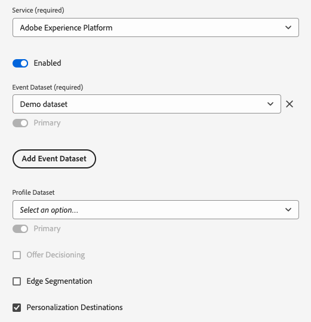
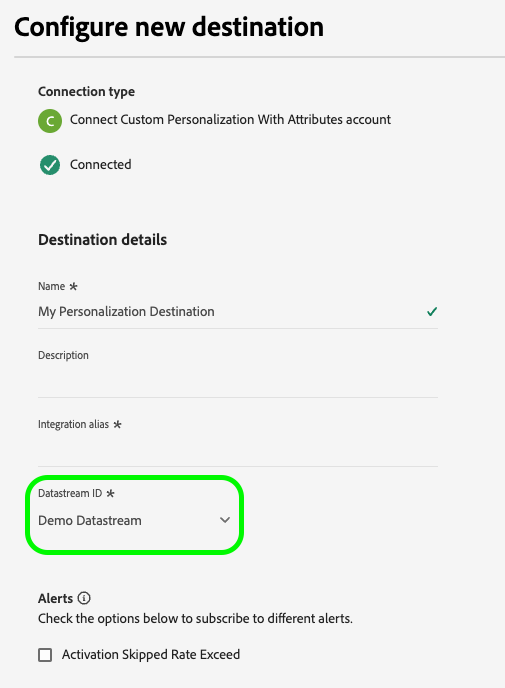
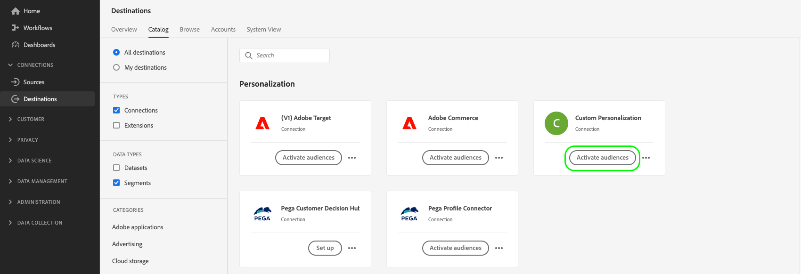
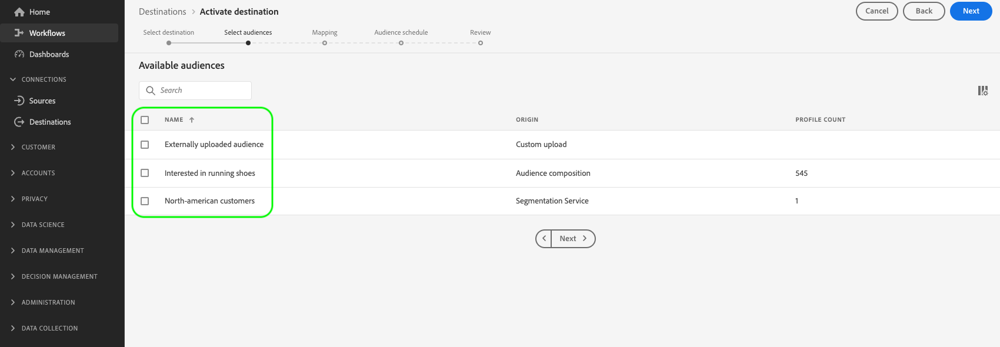
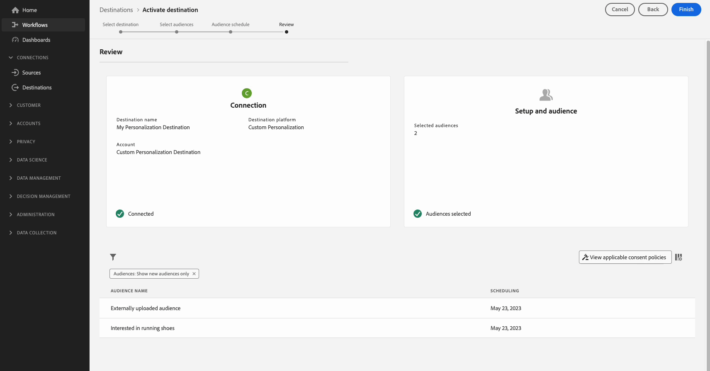

# Look up profile attributes on the edge in real-time

Adobe Experience Platform uses the [Real-Time Customer Profile](../../profile/home.md) as the single source of truth for all profile data. For quick, real-time data retrieval, it uses [edge profiles](../../profile/edge-profiles.md), which are lightweight profiles distributed throughout the [Edge Network](../../collection/home.md#edge). This allows for fast, real-time personalization use cases.

## Use Cases {#use-cases}

Below are two use cases where edge profile lookup can help.

* **Real-Time Personalization**: Quickly retrieve profile information from the edge profile to personalize a user's experience on your website.
* **Customer Support**: Retrieve profile information in real-time when a customer calls a support center agent.

This page describes the steps that you must follow to look up edge profile data in real-time, to deliver personalization experiences or inform decisioning rules through downstream applications.

## Terminology and prerequisites {#prerequisites}

When configuring the use case described in this page, you will use the following Experience Platform components:

* [Datastreams](../../datastreams/overview.md): A datastream receives incoming event data from Web SDK and responds with edge profile data.
* [Merge Policies](../../segmentation/ui/segment-builder.md#merge-policies): You will create an [!UICONTROL Active-On-Edge] merge policy to ensure that the edge profiles ßuse the correct profile data.
* [Custom Personalization connection](../catalog/personalization/custom-personalization.md): You will configure a new custom personalization connection which will send the profile attributes to the Edge Network.
* [Edge Network API](https://developer.adobe.com/data-collection-apis/docs/): You will use the Edge Network API [interactive data collection](https://developer.adobe.com/data-collection-apis/docs/endpoints/interact/) functionality to quickly retrieve profile attributes from the edge profiles.

## Performance guardrails {#guardrails}

Edge profile lookup use cases are subject to the specific performance guardrails described in the table below. For more details regarding the Edge Network API guardrails, see the guardrails [documentation page](https://developer.adobe.com/data-collection-apis/docs/getting-started/guardrails/).

|Edge Network Service | Edge Segmentation | Requests per second |
|---------|----------|---------|
| [Custom personalization destination](../catalog/personalization/custom-personalization.md) via [Edge Network API](https://developer.adobe.com/data-collection-apis/docs/api/) | Yes | 1500 |
| [Custom personalization destination](../catalog/personalization/custom-personalization.md) via [Edge Network API](https://developer.adobe.com/data-collection-apis/docs/api/) | No | 1500 |

## Step 1: Create and configure a datastream {#create-datastream}

Follow the steps in the [datastream configuration](../../datastreams/configure.md#create-a-datastream) documentation to create a new datastream with the following **[!UICONTROL Service]** settings:

* **[!UICONTROL Service]**: [!UICONTROL Adobe Experience Platform]
* **[!UICONTROL Personalization Destinations]**: Enabled
* **[!UICONTROL Edge Segmentation]**: If you require edge segmentation, enable this option. If you are only interested in looking up profile attributes on the edge, but do not want to perform any segmentation based on the edge profiles, then leave this option disabled.


<!-- >[!IMPORTANT]
>
>Enabling edge segmentation limits the maximum number of lookup requests to 1500 request per second. If you need a higher request throughput, disable edge segmentation for your datastream. See the [guardrails documentation](../guardrails.md#edge-destinations-activation) for detailed information. -->




## Step 2: Configure your audiences for edge evaluation {#audience-edge-evaluation}

Looking up profile attributes on the edge requires your audiences to be configured for edge evaluation.

Make sure the audiences that you plan to activate have the [Active-on-Edge Merge Policy](../../segmentation/ui/segment-builder.md#merge-policies) set as default. The [!DNL Active-On-Edge] merge policy ensures that audiences are constantly evaluated [on the edge](../../segmentation/methods/edge-segmentation.md) and are available for real-time personalization use cases.

Follow the instructions on [creating a merge policy](../../profile/merge-policies/ui-guide.md#create-a-merge-policy), and make sure to enable the **[!UICONTROL Active-On-Edge Merge Policy]** toggle.

>[!IMPORTANT]
>
>If your audiences use a different merge policy, you will not be able to retrieve profile attributes from the edge and you will be unable to perform edge profile lookup.

## Step 3: Send profile attribute data to the Edge Network{#configure-custom-personalization-connection}

In order to look up edge profiles, including attributes and audience membership data, in real-time, the data needs to be made available on the Edge Network. For this purpose, you must create a connection to a **[!UICONTROL Custom Personalization With Attributes]** destination and activate the audiences, including the attributes that you would like to look up on the edge profiles.

+++ Configure a Custom Personalization With Attributes connection

Follow the [destination connection creation tutorial](../ui/connect-destination.md) for detailed instructions on how to create a new destination connection.

When configuring the new destination, select the datastream which you created in [step 1](#create-datastream) in the **[!UICONTROL Datastream ID]** field. For **[!UICONTROL Integration alias]** you can use any value that helps you identify this destination connection in the future, like the destination name.



+++

+++Activate your audiences to the Custom Personalization With Attributes connection

After you have created a **[!UICONTROL Custom Personalization With Attributes]** connection, you are now ready to send profile data to the Edge Network.

>[!IMPORTANT]
> 
> * To activate data and enable the [mapping step](#mapping) of the workflow, you need the **[!UICONTROL View Destinations]**, **[!UICONTROL Activate Destinations]**, **[!UICONTROL View Profiles]**, and **[!UICONTROL View Segments]** [access control permissions](/help/access-control/home.md#permissions).
> 
> Read the [access control overview](/help/access-control/ui/overview.md) or contact your product administrator to obtain the required permissions.

1. Go to **[!UICONTROL Connections > Destinations]**, and select the **[!UICONTROL Catalog]** tab.
    
    

1. Find the **[!UICONTROL Custom Personalization With Attributes]**  destination card, then select **[!UICONTROL Activate audiences]**, as shown in the image below.

    

1. Select the destination connection that you previously configured, then select **[!UICONTROL Next]**.

    

1. Select your audiences. Use the checkboxes to the left of the audience names to select the audiences that you want to activate to the destination, then select **[!UICONTROL Next]**.

    You can select from multiple types of audiences, depending on their origin:
    
    * **[!UICONTROL Segmentation Service]**: Audiences generated within Experience Platform by the Segmentation Service. See the [segmentation documentation](../../segmentation/ui/overview.md) for more details.
    * **[!UICONTROL Custom upload]**: Audiences generated outside of Experience Platform, and uploaded into Experience Platform as CSV files. To learn more about external audiences, see the documentation on [importing an audience](../../segmentation/ui/overview.md#import-audience).
    * Other types of audiences, originating from other Adobe solutions, such as [!DNL Audience Manager].

      

1. Select the profile attributes that you want to be made available for the edge profiles.

    * **Select source attributes**. To add source attributes, select the **[!UICONTROL Add new field]** control on the **[!UICONTROL Source field]** column and search or navigate to your desired XDM attribute field, as shown below.
    
      

    * **Select target attributes**. To add target attributes, select the **[!UICONTROL Add new field]** control on the **[!UICONTROL Target field]** column and type in the custom attribute name that you want to map the source attribute to.
    
      

When you are finished mapping profile attributes, select **[!UICONTROL Next]**.

On the **[!UICONTROL Review]** page, you can see a summary of your selection. Select **[!UICONTROL Cancel]** to break up the flow, **[!UICONTROL Back]** to modify your settings, or **[!UICONTROL Finish]** to confirm your selection and start sending profile data to the Edge Network.


+++

+++Consent policy evaluation

If your organization purchased **Adobe Healthcare Shield** or **Adobe Privacy & Security Shield**, select **[!UICONTROL View applicable consent policies]** to see which consent policies are applied and how many profiles are included in the activation as a result of them. Read about [consent policy evaluation](/help/data-governance/enforcement/auto-enforcement.md#consent-policy-evaluation) for more information.

**Data usage policy checks**

In the **[!UICONTROL Review]** step, Experience Platform also checks for any data usage policy violations. Shown below is an example where a policy is violated. You cannot complete the audience activation workflow until you have resolved the violation. For information on how to resolve policy violations, read about [data usage policy violations](/help/data-governance/enforcement/auto-enforcement.md#data-usage-violation) in the data governance documentation section.
 


+++

+++Filter audiences

In the **[!UICONTROL Review]** step you can use the available filters on the page to display only the audiences whose schedule or mapping has been updated as part of this workflow. You can also toggle which table columns you want to see. 




If you are satisfied with your selection and no policy violations have been detected, select **[!UICONTROL Finish]** to confirm your selection.

+++

## Step 4: Look up the profile attributes on the edge {#configure-edge-profile-lookup}

By now you should have finished [configuring your datastream](#create-datastream), you have [created a new Custom Personalization With Attributes destination connection](#configure-destination), and you have used this connection to [send the profile attributes](#activate-audiences) that you will be able to look up to the Edge Network.

The next step is to configure your personalization solution to retrieve profile attributes from the edge profiles.

>[!IMPORTANT]
>
>Profile attributes may contain sensitive data. To protect this data, you must retrieve the profile attributes through the [Edge Network API](https://developer.adobe.com/data-collection-apis/docs/getting-started/). Furthermore, you must retrieve the profile attributes via the Edge Network API [interactive data collection endpoint](https://developer.adobe.com/data-collection-apis/docs/endpoints/interact/), in order for the API calls to be authenticated.
>
>If you do not follow the requirements above, personalization will be based on audience membership only, and profile attributes will not be available to you.

The datastream which you configured in [step 1](#create-datastream) is now ready to accept incoming event data and respond with edge profile information.

Configure your integration to retrieve edge profile information as shown in the examples below.

### Request {#request}

To retrieve edge profile data, send an empty `POST` call to the `/interact` endpoint, with the primary identity for which you are looking up profile attributes included in the event, as shown below.

```shell
curl -X POST "https://server.adobedc.net/ee/v2/interact?dataStreamId={DATASTREAM_ID}" 
-H "Authorization: Bearer {TOKEN}" 
-H "x-gw-ims-org-id: {ORG_ID}" 
-H "x-api-key: {API_KEY}" 
-H "Content-Type: application/json" 
-d '{
    "event":
    {
        "xdm": {
            "identityMap": {
                "Email": [
                    {  
                        "id":"test123@adobetest.com",
                        "primary":true
                    }
                ]
            }
        }
    }
    
}'
```

| Parameter | Type | Required | Description |
| --- | --- | --- | --- |
| `dataStreamId` | `String` | Yes. | The datastream ID of the datastream that you created in [step 1](#create-datastream). |

### Response {#response}

A successful response returns HTTP status `200 OK`, with a `Handle` object that includes information similar to the examples in the tabs below, depending on whether the profile is found on the edge or not.

>[!NOTE]
>
>The API responses are modular and the `handle` object can include multiple `payload` objects of various types. The information related to edge profile lookup is grouped under the `payload` object with `"type": "activation:pull"`,

>[!BEGINTABS]

>[!TAB Profile exists on the edge]

If the profile exists on the edge, depending on the profile attributes and audiences activated to the edge, you can expect a response with attributes and audience memberships similar to the one below.

```json
{
  "requestId": "3c600138-d785-42ca-a025-bb725f4b5da9",
  "handle": [
    {
      "payload": [
        {
          "type": "profileLookup",
          "destinationId": "9218b727-ec59-4a46-b8b9-05503f138c5d",
          "alias": "rk-demo-custom-personalization-XXXX",
          "attributes": {
            "zip": {
              "value": "19000"
            },
            "firstName": {
              "value": "Test"
            },
            "lastName": {
              "value": "User123"
            },
            "gender": {
              "value": "male"
            },
            "city": {
              "value": "Philadelphia"
            },
            "state": {
              "value": "PA"
            },
            "email": {
              "value": "test123@adobetest.com"
            }
          },
          "segments": [
            {
              "id": "85018bd8-7ad1-4e17-ae30-8389c04bd3c0",
              "namespace": "ups"
            },
            {
              "id": "d09a8159-8b30-4178-b2f2-7a8c5e3168d9",
              "namespace": "ups"
            }
          ]
        }
      ],
      "type": "activation:pull",
      "eventIndex": 0
    }
  ]
}
```

The `handle` object provides the information described in the table below.

| Parameter | Description |
|---------|----------|
| `payload` | The `payload` object which includes the edge lookup information. The response may contain multiple additional `payload` objects, unrelated to edge lookup. |
| `type` | Payloads are grouped in the response by their type. The payload type for the edge profile lookup is always set to `profileLookup`.|
| `destinationId` | The ID of the **[!UICONTROL Custom Personalization]** connection instance that you created in [step 3](#configure-custom-personalization-connection). |
| `alias` | The alias of the destination connection, configured by the user when they create the [Custom Personalization](../catalog/personalization/custom-personalization.md) destination connection. |
| `attributes` | This array includes the edge profile attributes of the audiences that you activated in [step 3](#configure-custom-personalization-connection). |
| `segments` | This array includes the audiences that you activated in [step 3](#configure-custom-personalization-connection). |
| `type` | `handle` objects are grouped by type. For edge profile lookup use cases, the type of the `handle` object is always `activation:pull`.|
| `eventIndex` | The Edge Network receives events frßom the client in the form of arrays. The order of the events in the array is preserved during their processing and reflected by this index. Event indexing starts with `0`. |

>[!TAB Profile does not exist on the edge]

If the profile does not exist on the edge, you can expect a response similar to the one below.

```json
{
  "requestId": "531b541a-4541-419e-ac99-fd7e452f0c0f",
  "handle": [
    {
      "payload": [],
      "type": "activation:pull",
      "eventIndex": 0
    }
  ]
}
```

The `handle` object provides the information described in the table below.

| Parameter | Description |
|---------|----------|
| `payload` | When the profile is not present on the edge, the `payload` object is empty. |
| `type` | `payload` objects are grouped by type. For edge profile lookup use cases, the type of the `payload` object is always `activation:pull`.|
| `eventIndex` | The Edge Network receives events from the client in the form of arrays. The order of the events in the array is preserved during their processing and reflected by this index. Event indexing starts with `0`. |

>[!ENDTABS]

>[!SUCCESS]
>
>If you have configured the integration correctly, you now have access to the edge profile data and you can use the attributes and audience membership of your edge profiles to trigger real-time personalization in your downstream personalization engine.

## Conclusion {#conclusion}

By following the steps above, you can efficiently look up edge profile attributes in real-time, enabling personalized experiences and informed decision-making through downstream applications.
