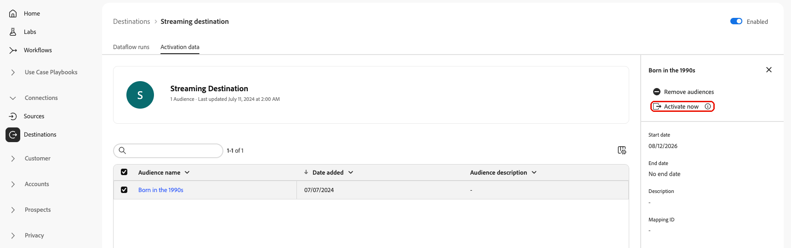

# Activate now for streaming destinations

>[!IMPORTANT]
>
>This feature is in private beta and available for a limited number of streaming destinations. Contact your Adobe representative to request access.

## [!UICONTROL Activate now] overview {#overview}

>[!CONTEXTUALHELP]
>id="platform_destinations_activate_now_streaming"
>title="Activate now"
>abstract="Select this control to trigger an immediate, on-demand refresh of an audience's full current membership to a streaming or API-based destination. Use this when a destination's time-to-live (TTL) has expired and previously qualified profiles need to be resent."

This article explains how to use the Experience Platform UI to trigger an on-demand refresh of an audience's full membership to streaming and API-based destinations.

## Use cases {#use-cases}

Many streaming and API-based destinations apply a time-to-live (TTL) to the audience membership they receive from [!DNL Adobe Experience Platform]. When that TTL expires on the destination side, previously qualified profiles are treated as inactive, even though they remain qualified in Experience Platform. This can cause your addressable audience to shrink mid-campaign.

Use the **[!UICONTROL Activate now]** control to resend every currently qualified profile for an audience through the existing streaming activation pipeline, without waiting for the next scheduled refresh or audience qualification event. This gives you a self-serve way to counteract destination-side TTL expiration instead of filing a support ticket for a manual backfill.

**[!UICONTROL Activate now]** is the streaming counterpart to [Export file now](/help/destinations/ui/export-file-now.md), which serves the same purpose for file-based destinations.

You can also use the Experience Platform APIs for this purpose. Read how to [activate audiences on-demand to streaming destinations via the ad-hoc activation API](/help/destinations/api/ad-hoc-activation-api.md#streaming-destinations).

## Known limitations {#known-limitations}

The **[!UICONTROL Activate now]** feature:

* Resends full audience membership regardless of qualification state, rather than a differential or changes-only refresh.
* Runs only on-demand.
* Is available at first for [!DNL The Trade Desk] and [!DNL Google Customer Match]. Adobe plans to add support for more streaming and API-based destinations.
* A guardrail rejects **[!UICONTROL Activate now]** for an audience that was mapped to the dataflow within the last 24 hours. This prevents the on-demand trigger from racing the automatic backfill dispatched when the audience was mapped, which can otherwise cause a silent double-delivery or drop. If you need to refresh an audience shortly after mapping it, wait 24 hours from the mapping time.
* There is no way to check job status from the UI. The API does have a status endpoint, but it always shows the job as `QUEUED`. There is no callback from delivery back to this status field, so `QUEUED` does not distinguish in-progress, succeeded, or failed.

## Guardrails {#guardrails}

**[!UICONTROL Activate now]** enforces the following limit:

* One on-demand run per dataflow, per audience, within a rolling 24-hour window (not a calendar-day reset).

If the same audience was already triggered for this dataflow within the last 24 hours, the trigger is rejected, and the UI shows a message indicating when you can try again.

## Prerequisites {#prerequisites}

To activate data, you need the **[!UICONTROL View Destinations]**, **[!UICONTROL Activate Destinations]**, **[!UICONTROL View Profiles]**, and **[!UICONTROL View Segments]** [access control permissions](/help/access-control/home.md#permissions). Read the [access control overview](/help/access-control/ui/overview.md) or contact your product administrator to obtain the required permissions.

To use **[!UICONTROL Activate now]**, you must have successfully [connected to a destination](./connect-destination.md) and configured an activation dataflow to a streaming or API-based destination. If you haven't done so already, go to the [destinations catalog](../catalog/overview.md), browse the supported destinations, and configure the destination that you want to use.

## How to activate an audience on-demand {#how-to-activate-audience-now}

Follow these steps to trigger an on-demand refresh of an audience to a streaming or API-based destination.

1. Go to **[!UICONTROL Connections > Destinations]**, select the **[!UICONTROL Browse]** tab, and select your streaming or API-based destination connection.

1. On the destination details page, select the **[!UICONTROL Activation data]** tab.

1. Select one or more audiences that you want to refresh, then select the **[!UICONTROL Activate now]** control. This control is available for both a single audience row and a bulk selection of audiences.

   

1. In the confirmation dialog, select **[!UICONTROL Yes]** to confirm and trigger the refresh.

1. A toast message appears, confirming that the refresh has been queued. Experience Platform creates one streaming job per selected audience.

>[!NOTE]
>
>There is currently no way to check the status of a triggered job from the UI. The toast confirms that the job was queued, but delivery isn't otherwise visible in Experience Platform. See [Known limitations](#known-limitations).

## Related information {#related-information}

* [Export files on-demand to batch destinations using the Experience Platform UI](/help/destinations/ui/export-file-now.md)
* [Trigger an ad-hoc activation run to streaming destinations via the API](/help/destinations/api/ad-hoc-activation-api.md#streaming-destinations)
* [Audience lifecycle in streaming destinations](/help/destinations/how-destinations-work/audience-lifecycle-streaming-destinations.md)
