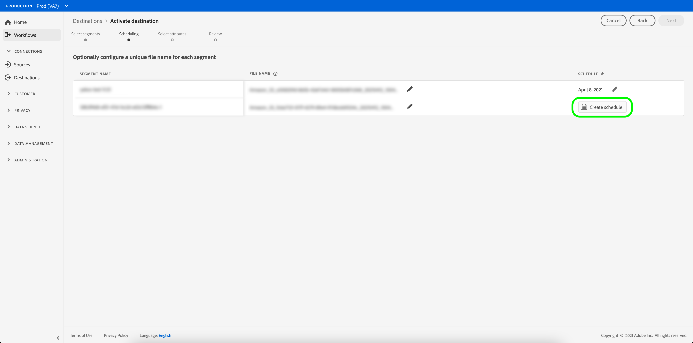
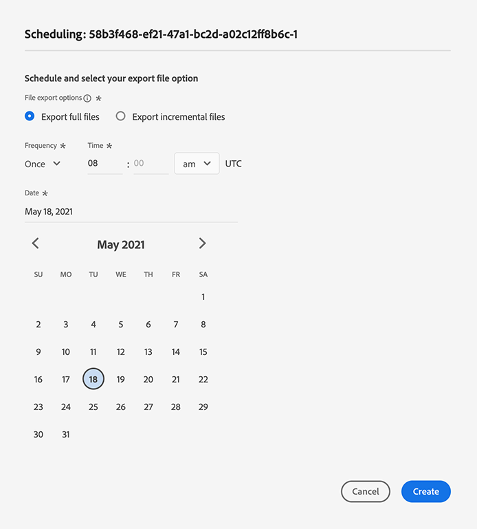
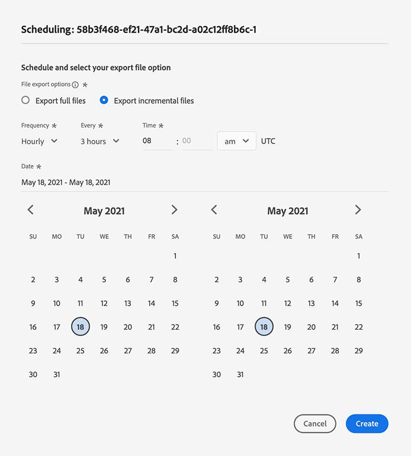

# Activate audience data to profile-based destinations

## Overview {#overview}

This article explains the workflow required to activate audience data in Adobe Experience Platform profile-based destinations, such as cloud storage and email marketing destinations.

## Prerequisites {#prerequisites}

To activate data to advertising destinations, you must have successfully [connected to a destination](./connect-destination.md). If you haven't done so already, go to the [destinations catalog](../catalog/overview.md), browse the supported destinations, and configure the destination that you want to use.

## Select your destination {#select-destination}

1. Go to **[!UICONTROL Connections > Destinations]**, and select the **[!UICONTROL Browse]** tab.
    
    

1. Select the **[!UICONTROL Add segments]** button corresponding to the destination where you want to activate your segments, as shown in the image below.

    

1. Move to the next section to [select your segments](#select-segments).

## Select your segments {#select-segments}

Use the check boxes to the left of the segment names to select the segments that you want to activate to the destination, then select **[!UICONTROL Next]**.


## Schedule segment export {#scheduling}

[!DNL Adobe Experience Platform] exports data for email marketing and cloud storage destinations in the form of [!DNL CSV] files. In the **[!UICONTROL Scheduling]** page, you can configure the schedule and the file names for each segment you are exporting. Configuring the schedule is mandatory, but configuring the file name is optional.

>[!IMPORTANT]
> 
>[!DNL Adobe Experience Platform] automatically splits the export files at 5 million records (rows) per file. Each row represents one profile.
>
>Split file names are appended with a number that indicates the file is part of a larger export, as such: `filename.csv`, `filename_2.csv`, `filename_3.csv`.

Select the **[!UICONTROL Create schedule]** button corresponding to the segment that you want to send to your destination.



### Export full files {#export-full-files}

Select **[!UICONTROL Export full files]** to have your exported files contain a complete snapshot of all the profiles that qualify for that segment.



1. Use the **[!UICONTROL Frequency]** selector to choose between one-time (**[!UICONTROL Once]**) or **[!UICONTROL Daily]** exports. Exporting a full file **[!UICONTROL Daily]** exports the file every day from the start date to the end date at 12:00 AM UTC (7:00 PM EST).
2. Use the **[!UICONTROL Time]** selector to choose the time of day, in [!DNL UTC] format, when the export should take place. Exporting a file **[!UICONTROL Daily]** exports the file every day from the start date to the end date at the time you select.
    
      >[!IMPORTANT]
      >
      >The option to export files at a certain time of day is currently in beta, and is only available to a select number of customers.<br> <br> Because of the way internal Experience Platform processes are configured, the first incremental or full file export may not contain all the backfill data. <br> <br> To ensure a complete and most up-to-date backfill data export for both full and incremental files, Adobe recommends setting the first file export time after 12 PM GMT of the following day. This is a limitation that will be addressed in future releases.

3. Use the **[!UICONTROL Date]** selector to choose the day or interval when the export should take place.
4. Select **[!UICONTROL Create]** to save the schedule.

 
### Export incremental files {#export-incremental-files}

Select **[!UICONTROL Export incremental files]** to have your exported files contain only the profiles which qualified for that segment since the last export.

>[!IMPORTANT]
>
>The first exported incremental file includes all profiles that qualify for a segment, functioning as a backfill.



1. Use the **[!UICONTROL Frequency]** selector to choose between **[!UICONTROL Daily]** or **[!UICONTROL Hourly]** exports. Exporting an incremental file **[!UICONTROL Daily]** exports the file every day from the start date to the end date at 12:00 PM UTC (7:00 AM EST).
   * When selecting **[!UICONTROL Hourly]**, use the **[!UICONTROL Every]** selector to choose between the **[!UICONTROL 3]**, **[!UICONTROL 6]**, **[!UICONTROL 8]**, and **[!UICONTROL 12]** hour options.
     
       >[!IMPORTANT]
       >
       >The option to export incremental files every 3, 6, 8, or 12 hours is currently in beta, and is only available to a select number of customers. Non-beta customers can export incremental files once a day. 

2. Use the **[!UICONTROL Time]** selector to choose the time of day, in [!DNL UTC] format, when the export should take place.
   
     >[!IMPORTANT]
     >
     >The option to select the time of day for the export is only available to a select number of customers. <br> <br> Because of the way internal Experience Platform processes are configured, the first incremental or full file export may not contain all the backfill data. <br> <br> To ensure a complete and most up-to-date backfill data export for both full and incremental files, Adobe recommends setting the first file export time after 12 PM GMT of the following day. This is a limitation that will be addressed in future releases.

3. Use the **[!UICONTROL Date]** selector to choose the day or interval when the export should take place.
4. Select **[!UICONTROL Create]** to save the schedule.

### Configure file names {#file-names}

The default file names consist of destination name, segment ID, and a date and time indicator. For example, you can edit your exported file names to distinguish between different campaigns or to have the data export time appended to the files.

Select the pencil icon to open a modal window and edit the file names. File names are limited to 255 characters.


In the file name editor, you can select different components to add to the file name. 


The destination name and segment ID cannot be removed from file names. In addition to these, you can add the following:

* **[!UICONTROL Segment name]**: You can append the segment name to the file name.
* **[!UICONTROL Date and time]**: Select between adding a `MMDDYYYY_HHMMSS` format or a Unix 10-digit timestamp of the time when the files are generated. Choose one of these options if you would like your files to have a dynamic file name generated with each incremental export.
* **[!UICONTROL Custom text]**: Add custom text to the file names.

Select **[!UICONTROL Apply changes]** to confirm your selection.

>[!IMPORTANT] 
> 
>If you don't select the **[!UICONTROL Date and Time]** component, the file names will be static and the new exported file will overwrite the previous file in your storage location with each export. When running a recurring import job from a storage location into an email marketing platform, this is the recommended option.

Once you have finished configuring all your segments, select **[!UICONTROL Next]** to continue.

## Select profile attributes {#select-attributes}

For profile-based destinations, you must select the profile attributes that you want to send to the target destination.


1. In the **[!UICONTROL Select attributes]** page, select **[!UICONTROL Add new field]**.
    
    

1. Select the arrow to the right of the **[!UICONTROL Schema field]** entry.

    

1. In the **[!UICONTROL Select field]** page, select the XDM attributes that you want to send to the destination, then choose **[!UICONTROL Select]**.

    


1. To add more mappings, repeat steps 1 to3.


>[!NOTE] 
>
> Adobe Experience Platform prefills your selection with four recommended, commonly used attributes from your schema: `person.name.firstName`, `person.name.lastName`, `personalEmail.address`, `segmentMembership.status`.

File exports will vary in the following ways, depending on whether `segmentMembership.status` is selected:
* If the `segmentMembership.status` field is selected, exported files include **[!UICONTROL Active]** members in the initial full snapshot and **[!UICONTROL Active]** and **[!UICONTROL Expired]** members in subsequent incremental exports.
* If the `segmentMembership.status` field is not selected, exported files include only **[!UICONTROL Active]** members in the initial full snapshot and in subsequent incremental exports.

 

### Mandatory attributes {#mandatory-attributes}

>[!CONTEXTUALHELP]
>id="platform_destinations_activate_mandatorykey"
>title="About mandatory attributes"
>abstract="Select the XDM schema attributes that all exported profiles should include. Profiles without the mandatory key are not exported to the destination. Not selecting a mandatory key exports all qualified profiles regardless of their attributes."
>additional-url="http://www.adobe.com/go/destinations-mandatory-attributes-en" text="Learn more in documentation"

You can mark attributes as mandatory to ensure that [!DNL Platform] exports only the profiles that include the specific attribute. As a result, it can be used as an additional form of filtering. Marking an attribute as mandatory is **not** required.

Not selecting a mandatory attribute exports all qualified profiles regardless of their attributes.

It is recommended that one of the attributes is a [unique identifier](../../destinations/catalog/email-marketing/overview.md#identity) from your schema. For more information about mandatory attributes, see the identity section in the [Email marketing destinations](../../destinations/catalog/email-marketing/overview.md#identity) documentation. 

### Deduplication keys {#deduplication-keys}

>[!CONTEXTUALHELP]
>id="platform_destinations_activate_deduplicationkey"
>title="About deduplication keys"
>abstract="Eliminate multiple records of the same profile in the export files by selecting a deduplication key. Select a single namespace or up to two XDM schema attributes as a deduplication key. Not selecting a deduplication key may lead to duplicate profile entries in the export files."
>additional-url="http://www.adobe.com/go/destinations-deduplication-keys-en" text="Learn more in documentation"

>[!IMPORTANT]
>
>The option to use deduplication keys is currently in beta, and is only available to a select number of customers.

Deduplication keys eliminate the possibility of having multiple records of the same profile in one export file.

There are three ways you can use deduplication keys in [!DNL Platform]:

* Using a single identity namespace as a [!UICONTROL deduplication key]
* Using a single profile attribute from an [!DNL XDM] profile as a [!UICONTROL deduplication key]
* Using a combination of two profile attributes from an [!DNL XDM] profile as a composite key

>[!IMPORTANT]
>
> You can export a single identity namespace to a destination, and the namespace is automatically set as deduplication key. Sending multiple namespaces to a destination is not supported.
> 
> You cannot use a combination of identity namespaces and profile attributes as deduplication keys.

### Deduplication example {#deduplication-example}

This example illustrates how deduplication works, depending on the selected deduplication keys.

Let's consider the following two profiles.

**Profile A**

```json
{
  "identityMap": {
    "Email": [
      {
        "id": "johndoe_1@example.com"
      },
      {
        "id": "johndoe_2@example.com"
      }
    ]
  },
  "segmentMembership": {
    "ups": {
      "fa5c4622-6847-4199-8dd4-8b7c7c7ed1d6": {
        "status": "existing",
        "lastQualificationTime": "2021-03-10 10:03:08"
      }
    }
  },
  "person": {
    "name": {
      "lastName": "Doe",
      "firstName": "John"
    }
  },
  "personalEmail": {
    "address": "johndoe@example.com"
  }
}
```

**Profile B**

```json
{
  "identityMap": {
    "Email": [
      {
        "id": "johndoe_1@example.com"
      },
      {
        "id": "johndoe_2@example.com"
      }
    ]
  },
  "segmentMembership": {
    "ups": {
      "fa5c4622-6847-4199-8dd4-8b7c7c7ed1d6": {
        "status": "existing",
        "lastQualificationTime": "2021-04-10 11:33:28"
      }
    }
  },
  "person": {
    "name": {
      "lastName": "D",
      "firstName": "John"
    }
  },
  "personalEmail": {
    "address": "johndoe@example.com"
  }
}
```

### Deduplication use case 1: no deduplication

Using no deduplication, the export file would contain the following entries.

|personalEmail|firstName|lastName|
|---|---|---|
|johndoe@example.com|John|Doe|
|johndoe@example.com|John|D|


### Deduplication use case 2: deduplication based on identity namespace

Assuming deduplication by the [!DNL Email] namespace, the export file would contain the following entries. Profile B is the latest one that qualified for the segment, so it is the only one getting exported.

|Email*|personalEmail|firstName|lastName|
|---|---|---|---|
|johndoe_1@example.com|johndoe@example.com|John|D|
|johndoe_2@example.com|johndoe@example.com|John|D|

### Deduplication use case 3: deduplication based on a single profile attribute

Assuming deduplication by the `personal Email` attribute, the export file would contain the following entry. Profile B is the latest one that qualified for the segment, so it is the only one getting exported.

|personalEmail*|firstName|lastName|
|---|---|---|
|johndoe@example.com|John|D|


### Deduplication use case 4: deduplication based on two profile attributes (composite deduplication key)

Assuming deduplication by the composite key `personalEmail + lastName`, the export file would contain the following entries.

|personalEmail*|lastName*|firstName|
|---|---|---|
|johndoe@example.com|D|John|
|johndoe@example.com|Doe|John|


Adobe recommends selecting an identity namespace such as a [!DNL CRM ID] or email address as a deduplication key, to ensure all profile records are uniquely identified.
   
>[!NOTE] 
> 
>If any data usage labels have been applied to certain fields within a dataset (rather than the entire dataset), enforcement of those field-level labels on activation occurs under the following conditions:
>
>* The fields are used in the segment definition.
>* The fields are configured as projected attributes for the target destination.
>
> For example, if the field `person.name.firstName` has certain data usage labels that conflict with the destination's marketing action, you would be shown a data usage policy violation in the review step. For more information, see [Data Governance in Adobe Experience Platform](../../rtcdp/privacy/data-governance-overview.md#destinations).

## Review {#review}

On the **[!UICONTROL Review]** page, you can see a summary of your selection. Select **[!UICONTROL Cancel]** to break up the flow, **[!UICONTROL Back]** to modify your settings, or **[!UICONTROL Finish]** to confirm your selection and start sending data to the destination.

>[!IMPORTANT]
>
>In this step, Adobe Experience Platform checks for data usage policy violations. Shown below is an example where a policy is violated. You cannot complete the segment activation workflow until you have resolved the violation. For information on how to resolve policy violations, see [Policy enforcement](../../rtcdp/privacy/data-governance-overview.md#enforcement) in the data governance documentation section.
 


If no policy violations have been detected, select **[!UICONTROL Finish]** to confirm your selection and start sending data to the destination. 


## Verify segment activation {#verify}


For email marketing destinations and cloud storage destinations, Adobe Experience Platform creates a tab-delimited `.csv` file in the storage location that you provided. Expect a new file to be created in your storage location every day. The default file format is:
`<destinationName>_segment<segmentID>_<timestamp-yyyymmddhhmmss>.csv`

The files you would receive on three consecutive days could look like this:

```console
Salesforce_Marketing_Cloud_segment12341e18-abcd-49c2-836d-123c88e76c39_20200408061804.csv
Salesforce_Marketing_Cloud_segment12341e18-abcd-49c2-836d-123c88e76c39_20200409052200.csv
Salesforce_Marketing_Cloud_segment12341e18-abcd-49c2-836d-123c88e76c39_20200410061130.csv
```

The presence of these files in your storage location is confirmation of successful activation. To understand how the exported files are structured, you can [download a sample .csv file](../assets/common/sample_export_file_segment12341e18-abcd-49c2-836d-123c88e76c39_20200408061804.csv). This sample file includes the profile attributes `person.firstname`, `person.lastname`, `person.gender`, `person.birthyear`, and `personalEmail.address`.
